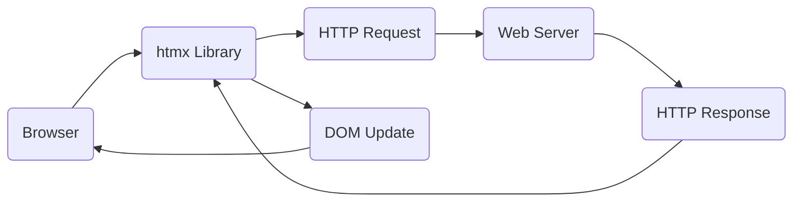
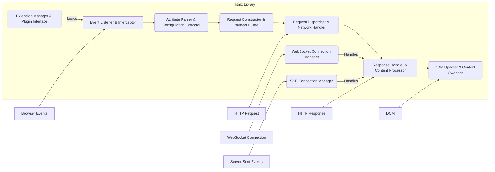
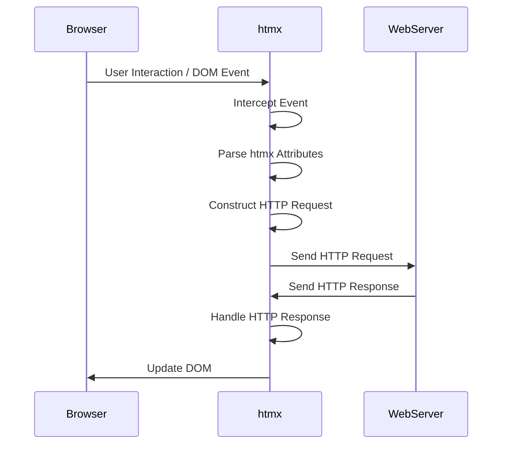

# Project Design Document: htmx

**Version:** 1.1
**Date:** October 26, 2023
**Author:** AI Software Architect

## 1. Introduction

This document provides an enhanced architectural design of the htmx library, a JavaScript library enabling access to AJAX, CSS Transitions, WebSockets, and Server Sent Events directly within HTML using attributes. This refined document aims to provide a more detailed and clearer understanding of htmx's architecture, specifically for use in subsequent threat modeling activities.

## 2. Goals and Non-Goals

### 2.1. Goals

*   Clearly and comprehensively define the architecture and individual components of the htmx library, detailing their responsibilities and interactions.
*   Accurately illustrate the data flow within the library, including its interaction points with the browser environment and the server.
*   Identify key areas, components, and data pathways that are particularly relevant for security considerations and potential threat vectors.
*   Provide a robust and detailed overview of htmx's functionality from an architectural perspective, suitable for security analysis.

### 2.2. Non-Goals

*   A line-by-line explanation of the htmx JavaScript codebase.
*   Micro-level analysis of JavaScript engine optimizations or browser-specific rendering behaviors.
*   Detailed performance metrics, benchmarking results, or specific optimization strategies for htmx.
*   Prescriptive guidance or specific code examples for server-side implementations interacting with htmx.

## 3. Architectural Overview

htmx functions primarily as a client-side library within a web browser. It augments standard HTML by introducing custom attributes (prefixed with `hx-`) that declaratively define dynamic behaviors. The core operation of htmx involves intercepting user interactions or DOM events on HTML elements, constructing HTTP requests based on the configuration in its attributes, dispatching these requests to the server, and subsequently processing the server's response to selectively update designated portions of the DOM.

*   **Browser:** The user's web browser environment where the HTML document containing the htmx library is loaded and rendered. This includes the JavaScript engine, DOM, and network stack.
*   **htmx Library:** The JavaScript code of htmx, responsible for event handling, attribute parsing, request construction, response processing, and DOM manipulation.
*   **HTTP Request:** The structured request generated by htmx, adhering to HTTP standards, and sent to the web server. This includes headers, method, and body.
*   **Web Server:** The server-side application responsible for receiving and processing HTTP requests from htmx and generating appropriate HTTP responses.
*   **HTTP Response:** The structured response sent back by the web server to htmx, containing status codes, headers, and the response body (typically HTML fragments).
*   **DOM Update:** The process by which htmx modifies the Document Object Model of the current page based on the content received in the HTTP response.

## 4. Component Design

htmx can be conceptually decomposed into the following interconnected components, each with specific responsibilities:

*   **Event Listener & Interceptor:**
    *   **Responsibility:** Attaches event listeners to HTML elements that possess htmx attributes. It intercepts browser events (e.g., `click`, `submit`, `mouseover`) that trigger htmx's functionality.
    *   **Details:**  Manages a registry of elements with htmx attributes and the associated event types. Determines if an event should initiate an htmx request.
*   **Attribute Parser & Configuration Extractor:**
    *   **Responsibility:** Examines the htmx attributes (`hx-*`) on an element to determine the intended behavior.
    *   **Details:** Extracts configuration parameters such as the target URL (`hx-get`, `hx-post`), HTTP method, triggering events (`hx-trigger`), target element for updates (`hx-target`), swap strategy (`hx-swap`), and any additional parameters.
*   **Request Constructor & Payload Builder:**
    *   **Responsibility:** Constructs the HTTP request object based on the parsed attributes.
    *   **Details:** Sets the request URL, HTTP method, headers (including `HX-Request` to identify htmx requests), and builds the request body for methods like POST or PUT, often serializing form data.
*   **Request Dispatcher & Network Handler:**
    *   **Responsibility:** Manages the actual transmission of the HTTP request to the web server.
    *   **Details:** Utilizes the browser's `fetch` API (or potentially `XMLHttpRequest` for compatibility) to send the request. Handles asynchronous communication with the server.
*   **Response Handler & Content Processor:**
    *   **Responsibility:** Receives and processes the HTTP response returned by the server.
    *   **Details:** Examines the HTTP status code, headers, and response body. Determines if the request was successful and extracts the relevant content for DOM updates.
*   **DOM Updater & Content Swapper:**
    *   **Responsibility:** Modifies the Document Object Model based on the server's response.
    *   **Details:** Uses the `hx-target` attribute to identify the element(s) to be updated and the `hx-swap` attribute to determine how the update should occur (e.g., `innerHTML`, `outerHTML`, `beforeend`, `afterbegin`). Handles different swap strategies and potential transitions.
*   **Extension Manager & Plugin Interface:**
    *   **Responsibility:** Manages the registration, initialization, and execution of htmx extensions.
    *   **Details:** Provides a mechanism to extend htmx's core functionality with custom behaviors, request modifiers, or response processors.
*   **WebSocket Connection Manager (Optional):**
    *   **Responsibility:** Handles the establishment and management of WebSocket connections when using htmx's WebSocket features.
    *   **Details:** Manages the WebSocket lifecycle, sending messages to the server, and receiving messages for DOM updates. Triggered by attributes like `hx-ws`.
*   **Server-Sent Events (SSE) Connection Manager (Optional):**
    *   **Responsibility:** Manages the connection and event handling for Server-Sent Events.
    *   **Details:** Establishes a persistent connection with the server, listens for server-sent events, and processes the event data for DOM updates. Triggered by attributes like `hx-sse`.

## 5. Data Flow

The typical sequence of operations within htmx for a standard HTTP request is as follows:

1. **Event Trigger:** A user action or DOM event occurs on an HTML element with htmx attributes (e.g., a button click on an element with `hx-post`).
2. **Event Interception:** The `Event Listener & Interceptor` component detects the event based on its attached listeners.
3. **Attribute Parsing:** The `Attribute Parser & Configuration Extractor` reads the relevant `hx-*` attributes on the triggering element to determine the desired action, target URL, and other parameters.
4. **Request Construction:** The `Request Constructor & Payload Builder` creates an HTTP request object. This includes setting the request method (GET, POST, etc.), the target URL, necessary headers (like `HX-Request`), and constructing the request body (e.g., serializing form data if it's a form submission).
5. **Request Dispatch:** The `Request Dispatcher & Network Handler` uses the browser's `fetch` API to send the constructed HTTP request to the specified web server.
6. **Server-Side Processing:** The web server receives the request, processes it according to its logic, and generates an HTTP response.
7. **Response Handling:** The `Response Handler & Content Processor` receives the HTTP response from the server. It checks the HTTP status code to determine success or failure and extracts the response body content.
8. **DOM Update:** The `DOM Updater & Content Swapper` uses the `hx-target` attribute to identify the HTML element(s) that need to be updated. It then applies the swap strategy defined by the `hx-swap` attribute to insert the received content into the target element(s).
9. **Browser Rendering:** The browser re-renders the affected parts of the DOM, reflecting the changes made by htmx.

For WebSocket interactions:

1. **Connection Initiation:** An element with the `hx-ws` attribute triggers the `WebSocket Connection Manager` to establish a WebSocket connection with the server.
2. **Message Sending (Optional):**  htmx can send messages to the server over the established WebSocket connection.
3. **Message Reception:** The server sends messages to the client via the WebSocket connection.
4. **Message Handling:** The `WebSocket Connection Manager` receives these messages.
5. **DOM Update:** The `DOM Updater & Content Swapper` updates the DOM based on the content of the received WebSocket message, often targeting elements specified within the message or using default targets.

For Server-Sent Events:

1. **Connection Initiation:** An element with the `hx-sse` attribute triggers the `SSE Connection Manager` to establish an SSE connection with the server.
2. **Event Stream:** The server pushes events to the client over the SSE connection.
3. **Event Reception:** The `SSE Connection Manager` receives these server-sent events.
4. **DOM Update:** The `DOM Updater & Content Swapper` updates the DOM based on the data contained within the received SSE events, targeting specified elements.

## 6. Security Considerations (Detailed for Threat Modeling)

Based on the architectural design, the following security considerations are crucial for threat modeling:

*   **Client-Side Script Injection (Cross-Site Scripting - XSS):**
    *   **Threat:** If the server returns untrusted data that is directly inserted into the DOM by htmx, particularly using swap strategies like `innerHTML`, it can lead to XSS vulnerabilities. Attackers can inject malicious scripts that execute in the user's browser.
    *   **Examples:** A server returning user-generated content without proper sanitization, which is then inserted into the DOM via `hx-swap="innerHTML"`.
    *   **Mitigation:** Implement robust server-side input validation and output encoding. Consider using safer swap strategies like `outerHTML` with careful content security policies.
*   **HTML Injection:**
    *   **Threat:** Similar to XSS, but focuses on injecting arbitrary HTML structures. While not always leading to script execution, it can disrupt the page layout, inject phishing forms, or trick users.
    *   **Examples:** A server returning unsanitized HTML that, when swapped into the DOM, overlays legitimate content with malicious elements.
    *   **Mitigation:**  Sanitize server-side outputs. Use appropriate swap strategies and Content Security Policy (CSP).
*   **Server-Side Vulnerabilities Exploitation:**
    *   **Threat:** htmx relies on server-side endpoints. Vulnerabilities in these endpoints (e.g., SQL injection, command injection, path traversal) can be exploited through requests initiated by htmx.
    *   **Examples:** An htmx request targeting an endpoint vulnerable to SQL injection due to unsanitized user input passed through htmx attributes or form data.
    *   **Mitigation:** Implement standard server-side security best practices, including input validation, parameterized queries, and principle of least privilege.
*   **Cross-Site Request Forgery (CSRF):**
    *   **Threat:** Since htmx makes standard HTTP requests, it is susceptible to CSRF attacks if proper anti-CSRF measures are not implemented on the server-side. An attacker can trick a user into making unintended requests to the server.
    *   **Examples:** An attacker crafting a malicious website that triggers htmx requests to a legitimate application while the user is authenticated.
    *   **Mitigation:** Implement CSRF protection mechanisms like synchronizer tokens (CSRF tokens) or the SameSite cookie attribute.
*   **htmx-Specific Attribute Manipulation:**
    *   **Threat:** If an attacker can manipulate the HTML or htmx attributes (e.g., through a stored XSS vulnerability), they could redirect requests to malicious URLs, trigger unintended actions, or modify the target of DOM updates.
    *   **Examples:** An attacker injecting JavaScript that modifies the `hx-get` attribute of a button to point to a malicious server.
    *   **Mitigation:**  Strict input validation and output encoding to prevent XSS vulnerabilities that could lead to attribute manipulation.
*   **htmx Extension Vulnerabilities:**
    *   **Threat:** If htmx extensions are not properly vetted or are developed with security flaws, they could introduce vulnerabilities that compromise the application.
    *   **Examples:** A malicious extension that intercepts requests and sends sensitive data to a third-party server.
    *   **Mitigation:**  Carefully review and vet any htmx extensions used. Follow secure development practices when creating custom extensions.
*   **WebSocket and Server-Sent Events Security:**
    *   **Threat:** Insecure WebSocket (WS) or SSE connections (using `ws://` or `http://` instead of `wss://` or `https://`) can lead to eavesdropping and man-in-the-middle attacks. Lack of proper authentication and authorization for these channels can allow unauthorized access to data streams.
    *   **Examples:** Sensitive data being transmitted over an unencrypted WebSocket connection.
    *   **Mitigation:** Always use secure protocols (WSS and HTTPS). Implement authentication and authorization mechanisms for WebSocket and SSE connections.
*   **Denial of Service (DoS):**
    *   **Threat:** Maliciously crafted htmx requests, especially those triggering expensive server-side operations or returning large responses, could potentially overload the server. Excessive DOM updates triggered by htmx could also impact client-side performance, leading to a client-side DoS.
    *   **Examples:** An attacker repeatedly triggering an htmx request that causes a complex database query, overwhelming the server.
    *   **Mitigation:** Implement rate limiting, request size limits, and efficient server-side processing. Be mindful of the size and frequency of DOM updates.
*   **Information Disclosure:**
    *   **Threat:** Server responses might inadvertently expose sensitive information if not carefully handled. Error messages returned by the server could reveal internal details about the application or infrastructure.
    *   **Examples:** A server returning detailed error stack traces in response to an htmx request.
    *   **Mitigation:** Implement proper error handling and logging on the server-side. Avoid returning sensitive information in responses unless absolutely necessary.

## 7. Deployment Considerations

Deploying applications using htmx involves:

*   **Including the htmx Library:**
    *   **Direct Inclusion:** Downloading the `htmx.org` JavaScript file and including it in the HTML using a `<script>` tag, hosted either locally or from a private CDN.
    *   **Content Delivery Network (CDN):** Referencing the htmx library from a public CDN like `cdnjs.com` or `jsdelivr.net`. This can improve loading times due to browser caching.
    *   **Package Managers:** Installing htmx via npm or yarn (`npm install htmx.org` or `yarn add htmx.org`) and bundling it with the application's JavaScript using tools like Webpack or Parcel.
*   **Integrating htmx Attributes:** Adding the appropriate `hx-*` attributes to HTML elements to define the desired dynamic behavior. This is typically done directly within the HTML templates.
*   **Server-Side Configuration:** Ensuring the server-side application is configured to handle the requests made by htmx. This involves:
    *   **Route Handling:** Defining routes that correspond to the URLs specified in the `hx-*` attributes.
    *   **Request Processing:** Implementing logic to process the incoming requests, including handling headers like `HX-Request`.
    *   **Response Generation:** Returning appropriate HTML fragments or JSON data in the HTTP response, suitable for updating the DOM.
    *   **Security Measures:** Implementing necessary security measures like CSRF protection, input validation, and output encoding.

## 8. Future Considerations

*   **Advanced Extension Capabilities:** Exploring more sophisticated mechanisms for htmx extensions, potentially including lifecycle hooks or more granular control over request and response processing.
*   **Improved State Management Integration:** Investigating tighter integration with client-side state management libraries or patterns to manage application state more effectively in conjunction with htmx.
*   **Enhanced Error Handling and Feedback Mechanisms:** Developing more robust and customizable error handling within htmx, providing better feedback to the user in case of request failures.
*   **Accessibility Enhancements:**  Further improvements to ensure htmx interactions are fully accessible, considering ARIA attributes and keyboard navigation.
*   **Tooling and Development Support:**  Exploring the development of more specialized tooling or browser extensions to aid in debugging and developing htmx-based applications.

This enhanced design document provides a more detailed and comprehensive understanding of the htmx library's architecture, specifically tailored for effective threat modeling. The refined component descriptions, data flow diagrams, and expanded security considerations offer a solid foundation for identifying and mitigating potential vulnerabilities.