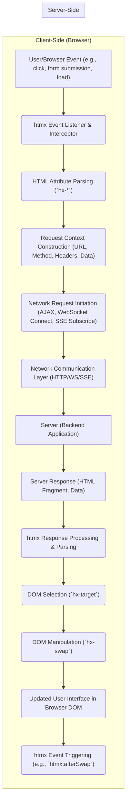
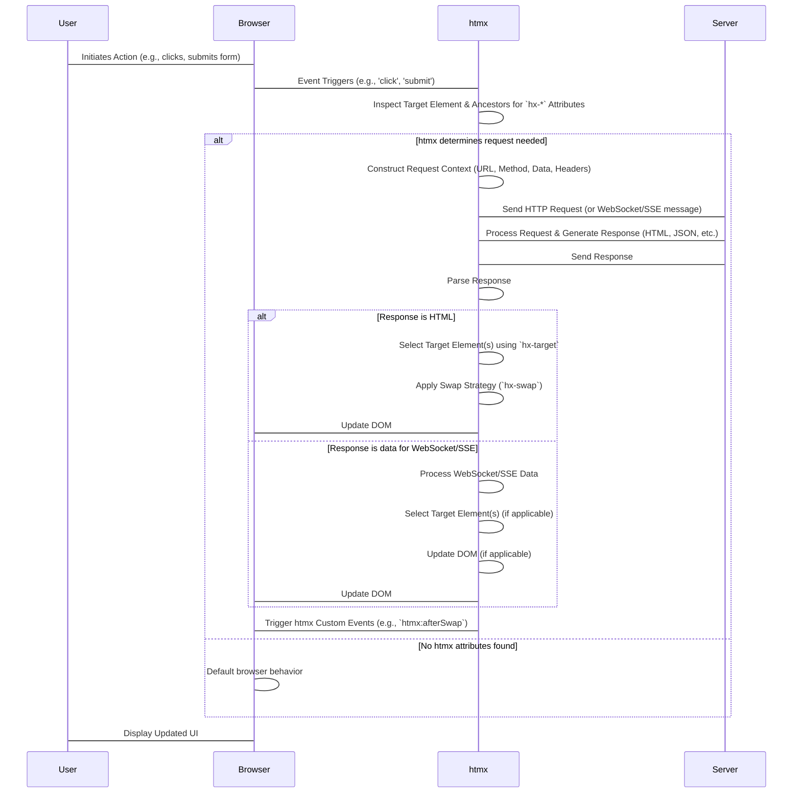

## Project Design Document: htmx (Improved)

**Version:** 1.1
**Date:** October 26, 2023
**Author:** Gemini (AI Language Model)

### 1. Project Overview

htmx is a lightweight JavaScript library enabling access to AJAX, CSS Transitions, WebSockets, and Server-Sent Events directly within HTML using attributes. This approach facilitates the creation of rich, dynamic web interfaces with the simplicity and declarative nature of HTML. This document provides a detailed architectural overview of htmx, specifically tailored for subsequent threat modeling activities.

### 2. Goals and Objectives

* **Primary Goal:** Empower developers to construct interactive web applications with minimal JavaScript coding.
* **Key Objectives:**
    * Augment standard HTML elements with attributes that trigger various types of HTTP requests and other interactions.
    * Facilitate selective and seamless updates of specific DOM regions without full page reloads.
    * Streamline the development process for dynamic web experiences, reducing reliance on complex JavaScript frameworks for common interactions.
    * Offer compatibility and integration points for diverse backend technologies and architectures.
    * Maintain a small library footprint and avoid external dependencies to minimize overhead.

### 3. Target Audience

* Web developers who favor HTML-centric development and server-side rendering patterns.
* Developers seeking a less complex alternative to large JavaScript frameworks for adding interactivity to their web applications.
* Development teams looking to enhance existing HTML-driven applications with dynamic features in an incremental and manageable way.
* Security engineers and architects who need to understand the architecture for threat assessment.

### 4. System Architecture

htmx operates primarily within the client-side environment of a web browser. It intercepts user interactions and DOM events, subsequently leveraging configured HTML attributes to initiate HTTP requests to the server or establish WebSocket/SSE connections. The server responds with HTML fragments or data, which htmx then uses to manipulate the DOM based on specified target selectors and swapping strategies.

**Detailed Explanation of Flow:**

* **User/Browser Event:** A user action (e.g., clicking a button, submitting a form) or a browser event (e.g., page load) occurs.
* **htmx Event Listener & Interceptor:** htmx attaches global event listeners to the document to intercept these events.
* **HTML Attribute Parsing (`hx-*`):** When a relevant event is intercepted, htmx examines the target HTML element and its ancestors for `hx-*` attributes. These attributes declaratively define the dynamic behavior.
* **Request Context Construction:** Based on the parsed attributes (e.g., `hx-get`, `hx-post`, `hx-vals`, `hx-headers`), htmx constructs the necessary context for the network request, including the target URL, HTTP method, headers, and data to be sent.
* **Network Request Initiation:** htmx initiates the appropriate network communication based on the configured attributes. This could be a standard AJAX request using `XMLHttpRequest` or `fetch`, establishing a WebSocket connection, or subscribing to a Server-Sent Events stream.
* **Network Communication Layer:** The browser's built-in network APIs handle the underlying communication using HTTP, WebSocket, or SSE protocols.
* **Server:** The server-side application receives and processes the request. This is entirely dependent on the backend technology and logic and is outside the direct control of htmx.
* **Server Response:** The server generates and sends back a response, which is typically an HTML fragment but can also be other data formats depending on the application's needs.
* **htmx Response Processing & Parsing:** htmx receives the server's response and parses it. If it's HTML, it's prepared for DOM manipulation.
* **DOM Selection (`hx-target`):** htmx uses the CSS selector specified in the `hx-target` attribute to identify the DOM element(s) that need to be updated. If no target is specified, the triggering element might be used as the target depending on the swap strategy.
* **DOM Manipulation (`hx-swap`):** Based on the `hx-swap` attribute, htmx manipulates the content of the targeted DOM element(s) using the received HTML fragment.
* **Updated User Interface:** The browser renders the updated DOM, reflecting the changes made by htmx.
* **htmx Event Triggering:** htmx triggers various custom events (e.g., `htmx:afterSwap`, `htmx:beforeRequest`) during its lifecycle, allowing developers to hook into these events for custom logic.

### 5. Key Components

* **HTML Attributes (`hx-*`):** These attributes are the declarative API of htmx, defining the dynamic behavior of HTML elements. Key examples include:
    * **Request Methods:** `hx-get`, `hx-post`, `hx-put`, `hx-delete`, `hx-patch`: Specify the HTTP method for the request.
    * **Targeting:** `hx-target`: A CSS selector specifying which element(s) in the DOM to update with the response.
    * **Swapping:** `hx-swap`: Defines how the content of the target element(s) should be updated (e.g., `innerHTML`, `outerHTML`, `beforeend`, `afterbegin`, `beforebegin`, `afterend`, `delete`, `none`).
    * **Triggering:** `hx-trigger`: Specifies the event(s) that should trigger the htmx request (e.g., `click`, `change`, `revealed`, `every 5s`).
    * **Value Passing:** `hx-vals`: Allows sending additional data with the request, often used to supplement form data.
    * **Header Manipulation:** `hx-headers`: Allows setting custom HTTP headers for the request.
    * **Confirmation:** `hx-confirm`: Displays a confirmation dialog before initiating the request.
    * **URL Manipulation:** `hx-push-url`: Updates the browser's URL history, enabling better navigation. `hx-replace-url`: Replaces the current URL in the history.
    * **Boosting:** `hx-boost`: Enables smoother transitions for standard links and form submissions by intercepting them and using htmx.
    * **WebSockets:** `hx-ws`: Establishes and manages WebSocket connections.
    * **Server-Sent Events:** `hx-sse`: Subscribes to and handles Server-Sent Events streams.
    * **JavaScript Interoperability:** `hx-on`: Allows executing JavaScript code in response to specific htmx events.
    * **Request Throttling/Debouncing:** `hx-throttle`, `hx-debounce`: Control the frequency of requests.
    * **Request Indicators:** `hx-indicator`: Specifies an element to show a loading indicator during the request.

* **JavaScript Engine (`htmx.org`):** The core JavaScript file is responsible for:
    * Global event listener management and event delegation.
    * Parsing and interpreting `hx-*` attributes on HTML elements.
    * Constructing and sending asynchronous network requests (AJAX, WebSocket messages, SSE subscriptions).
    * Handling server responses and extracting relevant data or HTML fragments.
    * Performing DOM manipulations based on `hx-target` and `hx-swap` attributes.
    * Managing WebSocket and SSE connections and message handling.
    * Triggering custom htmx events during the request lifecycle.
    * Providing an API for extensions and custom JavaScript interactions.

* **Request Handling Modules:** Internal modules within the JavaScript engine handle different types of requests:
    * **AJAX Handler:** Manages standard HTTP requests using `XMLHttpRequest` or the `fetch` API, handling various HTTP methods, headers, and data formats.
    * **WebSocket Handler:** Manages the lifecycle of WebSocket connections, sending and receiving messages, and handling connection state changes.
    * **Server-Sent Events Handler:** Manages subscriptions to SSE streams and processes incoming events.

* **DOM Manipulation Engine:** This component is responsible for:
    * Selecting target elements based on CSS selectors.
    * Implementing the different swap strategies defined by the `hx-swap` attribute.
    * Updating the DOM efficiently and correctly.

* **Extension Mechanism:** htmx provides a mechanism for extending its functionality through JavaScript extensions. These extensions can add new features, modify existing behavior, or integrate with other libraries.

### 6. Data Flow (Detailed)

The data flow within an htmx interaction can be broken down into the following stages:

**Detailed Explanation of Data Flow:**

* **User Initiates Action:** The user interacts with the web page, triggering an event.
* **Event Triggers:** The browser dispatches the event.
* **htmx Attribute Inspection:** htmx's event listeners intercept the event and inspect the target element and its ancestors for `hx-*` attributes.
* **Request Determination:** htmx evaluates the presence and values of `hx-*` attributes to determine if a network request or other action is required.
* **Request Context Construction:** If a request is needed, htmx constructs the request context, including:
    * **URL:** Determined by `hx-get`, `hx-post`, etc., or the `href` of an `<a>` or `form` `action`.
    * **Method:** Specified by `hx-get`, `hx-post`, etc.
    * **Data:**  Extracted from forms or specified via `hx-vals`.
    * **Headers:** Potentially customized with `hx-headers`.
* **Send Request:** htmx sends the request to the server using the appropriate network API.
* **Server Processing:** The server receives the request, processes it, and generates a response.
* **Send Response:** The server sends the response back to the client.
* **Response Parsing:** htmx receives the response and parses it based on the `Content-Type` header.
* **HTML Response Handling:** If the response is HTML:
    * **Target Selection:** htmx uses the `hx-target` selector to find the element(s) to update.
    * **Swap Application:** htmx applies the specified `hx-swap` strategy to modify the target element's content.
    * **DOM Update:** The browser re-renders the affected parts of the DOM.
* **WebSocket/SSE Data Handling:** If the response is data from a WebSocket or SSE stream:
    * **Data Processing:** htmx processes the received data.
    * **DOM Update (Optional):**  Based on application logic, htmx might update specific parts of the DOM with the received data.
* **Custom Event Triggering:** htmx triggers custom events that developers can listen for to perform additional actions.
* **Display Updated UI:** The user sees the updated interface in the browser.

### 7. Deployment Model

htmx is a client-side library and is typically deployed by including the `htmx.org` JavaScript file within the HTML document. Common deployment methods include:

* **Direct Inclusion:** Downloading the `htmx.org` file and including it via a `<script>` tag referencing the local file.
* **Content Delivery Network (CDN):** Linking to htmx hosted on a public CDN (e.g., jsDelivr, cdnjs).
* **Package Managers:** Installing htmx as a dependency using npm or yarn and including it in a bundled JavaScript file.

The server-side component is independent of htmx and can be implemented using any backend technology capable of handling HTTP requests and generating appropriate responses (typically HTML fragments).

### 8. Security Considerations (Detailed for Threat Modeling)

This section expands on potential security considerations, providing more specific examples relevant to htmx's functionality.

* **Cross-Site Scripting (XSS):**
    * **Server-Side Rendering Vulnerabilities:** If the server-side application doesn't properly sanitize user-provided data before embedding it in HTML fragments sent back to htmx, malicious scripts can be injected and executed in the user's browser. This is a primary concern when htmx dynamically inserts content.
    * **`hx-include` and User Input:** If `hx-include` is used to fetch potentially untrusted content and directly insert it into the DOM, it can lead to XSS.
    * **Abuse of `hx-on`:** While powerful, `hx-on` can be a vector for XSS if the JavaScript code executed is derived from untrusted sources or user input.

* **Cross-Site Request Forgery (CSRF):**
    * **State-Changing Requests:** Any htmx request that modifies data on the server (e.g., using `hx-post`, `hx-put`, `hx-delete`) is susceptible to CSRF if proper anti-CSRF tokens are not implemented and validated on the server-side.
    * **Absence of SameSite Cookies:** If cookies used for session management don't have the `SameSite` attribute set appropriately, CSRF attacks are easier to execute.

* **Injection Attacks (HTML/CSS Injection):**
    * **Unsanitized Server Responses:** Similar to XSS, failing to sanitize server responses can lead to HTML injection, allowing attackers to manipulate the structure and content of the page. CSS injection can also occur if unsanitized data is used in style attributes or tags.

* **Denial of Service (DoS):**
    * **Unprotected Endpoints:** If htmx is used to interact with server endpoints that are computationally expensive or resource-intensive without proper rate limiting or protection mechanisms, attackers can flood the server with requests, causing a DoS.
    * **WebSocket/SSE Abuse:**  Malicious clients could establish a large number of WebSocket or SSE connections, potentially overwhelming server resources.

* **Open Redirects:**
    * **Unvalidated Redirect URLs:** If htmx is used to handle redirects based on user input or unsanitized server responses, attackers can craft malicious URLs that redirect users to attacker-controlled sites.

* **Data Exposure:**
    * **Over-fetching Data:** Ensure that server endpoints return only the necessary data for the UI update to prevent accidental exposure of sensitive information.
    * **Caching Sensitive Data:** Be mindful of browser caching of htmx responses, especially if they contain sensitive data. Use appropriate cache-control headers.

* **WebSocket/SSE Security:**
    * **Lack of Authentication/Authorization:** Ensure proper authentication and authorization mechanisms are in place for WebSocket and SSE connections to prevent unauthorized access to data streams.
    * **Message Validation:** Validate data received over WebSockets and SSE to prevent injection attacks or unexpected behavior.

* **htmx Extension Security:**
    * **Untrusted Extensions:** Only use htmx extensions from trusted sources, as malicious extensions could introduce vulnerabilities.

* **Client-Side Logic and Security:**
    * **Security by Obscurity:** Relying solely on client-side logic to enforce security is generally ineffective. Server-side validation and enforcement are crucial.
    * **Manipulation of `hx-*` Attributes:**  While htmx provides the mechanism, the security of the application relies on how these attributes are used and how the server handles the resulting requests. Malicious actors could potentially manipulate these attributes if they have control over parts of the DOM.

### 9. Out of Scope

The following aspects are outside the direct scope of htmx and this design document:

* **Server-side business logic and data processing.**
* **Database interactions and data storage mechanisms.**
* **Comprehensive application state management beyond what's directly managed by the DOM and server responses.**
* **Detailed user authentication and authorization implementations (htmx facilitates the communication, but the logic resides server-side).**
* **Specific CSS styling and visual presentation details.**
* **JavaScript code outside of the core `htmx.org` library and its extensions.**

This improved design document provides a more detailed and security-focused overview of htmx's architecture, intended to facilitate thorough threat modeling and the development of secure web applications using htmx.