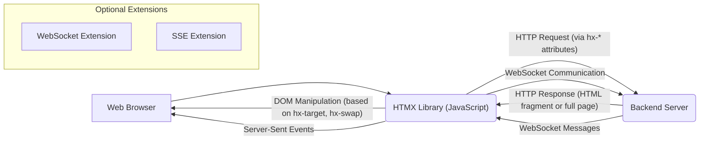
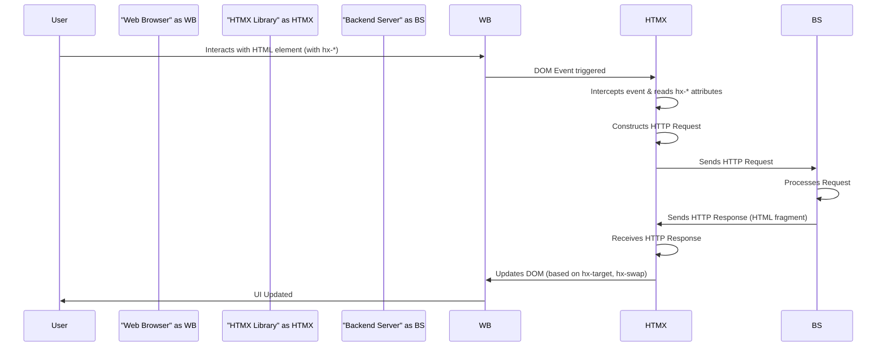

# Project Design Document: HTMX

**Version:** 1.1
**Date:** October 26, 2023
**Author:** AI Software Architect

## 1. Introduction

This document provides an enhanced design overview of HTMX, a library that empowers developers to access AJAX, CSS Transitions, WebSockets, and Server Sent Events directly within HTML using attributes. This document aims to provide a clear and detailed articulation of HTMX's architecture, components, and data flow, specifically tailored to facilitate comprehensive threat modeling activities.

## 2. Goals and Objectives

*   **Primary Goal:** To enable developers to build modern, dynamic user interfaces with the simplicity and declarative nature of HTML.
*   **Key Objectives:**
    *   To extend standard HTML to support dynamic content updates without requiring full page reloads, enhancing user experience.
    *   To simplify the development process for interactive web applications by reducing the need for complex JavaScript code for common UI interactions.
    *   To provide a declarative and intuitive approach to handling asynchronous requests and updating the user interface.
    *   To minimize the amount of custom JavaScript developers need to write for typical AJAX interactions.

## 3. System Architecture

HTMX operates primarily within the client-side web browser, acting as an intermediary layer that enhances the behavior of standard HTML elements. It achieves this by intercepting user interactions and programmatically triggering HTTP requests based on custom HTML attributes.

### 3.1. Components

*   **Web Browser:** The runtime environment where HTMX executes. It is responsible for interpreting HTML, CSS, and JavaScript, and for rendering the user interface.
*   **HTMX Library (JavaScript):** The core JavaScript file (`htmx.org` or a similar distribution) that must be included in the HTML page. This library performs the following key functions:
    *   **Event Listener:**  Attaches listeners to the DOM to monitor for events on elements that have HTMX attributes defined.
    *   **Request Orchestrator:**  Constructs and manages the sending of HTTP requests based on the values of the HTMX attributes.
    *   **Response Handler:**  Receives HTTP responses from the server and parses the content.
    *   **DOM Manipulator:**  Updates the Document Object Model (DOM) based on the received response and the instructions specified in the HTMX attributes (e.g., `hx-target`, `hx-swap`).
    *   **Extension Manager:**  Loads and manages optional extensions that provide additional functionalities beyond the core HTMX features.
*   **Backend Server:** Any server-side technology capable of receiving and processing HTTP requests and returning HTML fragments or full HTML pages as responses. HTMX is designed to be backend-agnostic.
*   **HTML Elements with HTMX Attributes:** Standard HTML elements that are augmented with custom attributes prefixed with `hx-`. These attributes declaratively define HTMX's behavior for that specific element. Examples include:
    *   `hx-get`: Specifies the URL for a GET request.
    *   `hx-post`: Specifies the URL for a POST request.
    *   `hx-trigger`: Defines the DOM event(s) that will trigger the HTTP request.
    *   `hx-target`: Specifies the CSS selector of the HTML element(s) that will be updated with the server's response.
    *   `hx-swap`: Defines how the received content will be swapped into the target element(s).
    *   `hx-include`: Specifies other form elements whose values should be included in the request.
*   **HTMX Extensions (Optional):**  Modular JavaScript components that extend the core functionality of HTMX. These extensions are typically included as separate JavaScript files. Examples include:
    *   Support for debouncing requests to prevent excessive server load.
    *   Client-side form validation before sending requests.
    *   Implementation of infinite scrolling patterns.
    *   Integration with WebSockets for real-time communication.
    *   Integration with Server-Sent Events for server-push functionality.

### 3.2. Architectural Diagram

## 4. Data Flow

The fundamental data flow in HTMX involves user interactions triggering HTTP requests, and the server responding with HTML content to dynamically update specific parts of the web page.

### 4.1. Standard HTTP Request/Response Cycle (Core Functionality)

1. **User Interaction:** A user interacts with an HTML element that has one or more HTMX attributes defined (e.g., clicking a button with `hx-post`, changing the value of an input field with `hx-get` and `hx-trigger="change"`).
2. **Event Trigger:** The web browser detects the DOM event specified in the `hx-trigger` attribute (or the default event for the element if `hx-trigger` is not specified).
3. **HTMX Interception and Processing:** The HTMX library intercepts the triggered event. It then reads the relevant HTMX attributes on the element to determine the necessary actions.
4. **Request Construction:** HTMX constructs an HTTP request object. This includes:
    *   **Method:** Determined by attributes like `hx-get`, `hx-post`, `hx-put`, `hx-delete`.
    *   **URL:** Specified in the corresponding `hx-*` attribute.
    *   **Headers:** Includes standard HTTP headers and HTMX-specific headers like `HX-Request: true` to identify requests initiated by HTMX.
    *   **Request Body:**  If applicable (e.g., for POST requests), the body may contain form data from the element's parent form or data specified using `hx-include` or other attributes.
5. **Request Sending:** The HTMX library sends the constructed HTTP request to the backend server using the browser's built-in XMLHttpRequest or Fetch API.
6. **Server-Side Processing:** The backend server receives the HTTP request, processes it according to its logic, and generates an HTTP response. The response typically contains an HTML fragment or a full HTML page.
7. **Response Reception:** The HTMX library receives the HTTP response from the server.
8. **DOM Update:** HTMX updates the DOM based on the `hx-target` and `hx-swap` attributes:
    *   **`hx-target`:**  Specifies the CSS selector(s) of the HTML element(s) that will be the target of the update.
    *   **`hx-swap`:** Defines how the received content will be integrated into the target element(s). Common values include `innerHTML`, `outerHTML`, `beforeend`, `afterbegin`, `delete`, and `none`.
9. **Event Dispatch:** HTMX dispatches custom events on the triggering element and the target element(s) to allow for further client-side scripting or integration with other JavaScript libraries (e.g., `htmx:beforeRequest`, `htmx:afterSwap`, `htmx:responseError`).

### 4.2. WebSocket Communication Flow (with WebSocket Extension)

1. **Connection Initiation:** An HTML element with the `hx-ws` attribute triggers the establishment of a WebSocket connection to the specified URL.
2. **Connection Establishment:** The HTMX WebSocket extension manages the WebSocket handshake and establishes a persistent connection with the server.
3. **Message Sending (Client to Server):** Client-side JavaScript or HTMX attributes can trigger the sending of messages over the established WebSocket connection.
4. **Message Reception (Server to Client):** The browser receives messages pushed from the server over the WebSocket connection.
5. **DOM Update:** The HTMX WebSocket extension intercepts incoming messages and updates the DOM based on the message content and target selectors defined within the HTML or through JavaScript event listeners.

### 4.3. Server-Sent Events Flow (with SSE Extension)

1. **Connection Initiation:** An HTML element with the `hx-sse` attribute triggers the establishment of a connection to a Server-Sent Events endpoint on the server.
2. **Connection Establishment:** The HTMX SSE extension establishes a persistent, unidirectional connection with the server.
3. **Event Streaming (Server to Client):** The server pushes events to the client over the established SSE connection.
4. **Event Reception:** The browser receives these server-sent events.
5. **DOM Update:** The HTMX SSE extension intercepts the received events and updates the DOM based on the event data and target selectors defined within the HTML or through JavaScript event listeners.

### 4.4. Data Flow Diagram (Standard HTTP)

## 5. Security Considerations (Detailed)

This section provides a more detailed overview of potential security considerations relevant to HTMX. This information will be crucial for developing a comprehensive threat model.

*   **Cross-Site Scripting (XSS):**
    *   **Server-Side Rendering Vulnerabilities:** If the backend server does not properly sanitize user-generated content before sending it in HTMX responses, malicious scripts can be injected into the DOM, potentially leading to XSS attacks.
    *   **Client-Side Manipulation:** While HTMX itself doesn't introduce new client-side scripting vulnerabilities, developers must be cautious when using JavaScript to further manipulate content loaded via HTMX, ensuring proper sanitization.
*   **Cross-Site Request Forgery (CSRF):**
    *   **State-Changing Requests:**  POST, PUT, and DELETE requests initiated by HTMX are susceptible to CSRF attacks if proper anti-CSRF tokens are not implemented and validated on the server-side.
    *   **Mitigation:** Employ standard CSRF mitigation techniques, such as synchronizer tokens or the SameSite cookie attribute.
*   **Injection Attacks:**
    *   **SQL Injection:** If data received from HTMX requests is directly incorporated into database queries without proper sanitization or parameterized queries, it can lead to SQL injection vulnerabilities.
    *   **Command Injection:** Similarly, if user input from HTMX requests is used to construct system commands, it can lead to command injection vulnerabilities.
*   **Man-in-the-Middle (MITM) Attacks:**
    *   **Data Interception:** If HTMX requests and responses are transmitted over unencrypted HTTP connections, sensitive data can be intercepted by attackers.
    *   **Mitigation:** Enforce HTTPS (TLS/SSL) for all communication between the client and the server.
*   **Denial of Service (DoS):**
    *   **Resource Exhaustion:** Malicious actors could trigger a large number of HTMX requests to overwhelm the server's resources, leading to a denial of service.
    *   **Rate Limiting:** Implement rate limiting on the server-side to mitigate this risk.
*   **Open Redirects:**
    *   **Malicious Redirection:** If HTMX is used to handle redirects based on user-controlled input without proper validation, attackers could redirect users to malicious websites for phishing or other attacks.
    *   **Input Validation:**  Thoroughly validate and sanitize any user input used in redirect URLs.
*   **WebSockets and SSE Security:**
    *   **Authentication and Authorization:** Ensure proper authentication and authorization mechanisms are in place for WebSocket and SSE connections to prevent unauthorized access and data manipulation.
    *   **Data Validation:** Validate data received over WebSocket and SSE connections to prevent injection attacks or other malicious activities.
*   **Data Integrity:**
    *   **Tampering:** Ensure the integrity of data transmitted between the client and server, especially for sensitive information. Consider using techniques like message authentication codes (MACs).

## 6. Deployment Considerations

HTMX is a client-side library that integrates seamlessly with standard web application deployment workflows.

*   **Inclusion in HTML:** The `htmx.org` JavaScript file (or a minified version) is included in the `<head>` or `<body>` section of the HTML page using a `<script>` tag.
*   **Content Delivery Network (CDN):**  Serving the HTMX library from a CDN is a common practice to improve performance through caching and reduced latency.
*   **Backend Agnostic:** HTMX does not impose specific requirements on the backend technology stack, making it compatible with a wide range of server-side languages and frameworks.
*   **Static Asset Serving:** The HTMX JavaScript file is typically served as a static asset by the web server.
*   **Extension Management:**  Optional HTMX extensions are included as separate JavaScript files, similar to the core library.

## 7. Technologies Used

*   **Core Technologies:**
    *   HTML (HyperText Markup Language)
    *   JavaScript (Client-side scripting language)
    *   HTTP (Hypertext Transfer Protocol)
*   **Optional Technologies (for Extensions):**
    *   WebSockets (for bidirectional communication)
    *   Server-Sent Events (for unidirectional server-to-client communication)

## 8. Future Considerations

*   **Expansion of Extension Ecosystem:** Continued development of new extensions to support a wider range of functionalities and integrations.
*   **Enhanced Error Handling and User Feedback:** Improvements to how HTMX handles errors and provides feedback to the user during asynchronous operations.
*   **Accessibility Enhancements:** Ongoing efforts to ensure HTMX interactions are fully accessible to users with disabilities, adhering to accessibility standards.
*   **Performance Optimization:**  Further optimization of the HTMX library for improved performance and reduced overhead.

This improved design document provides a more detailed and comprehensive overview of HTMX, offering a solid foundation for conducting thorough threat modeling activities. The enhanced descriptions of the architecture, data flow, and security considerations will be invaluable in identifying and mitigating potential vulnerabilities.