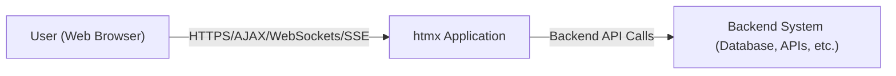
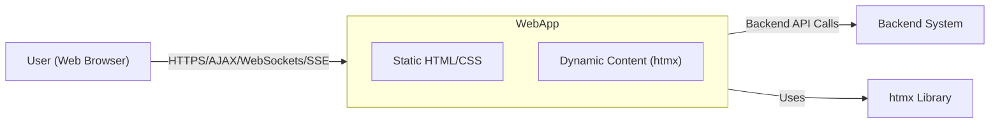
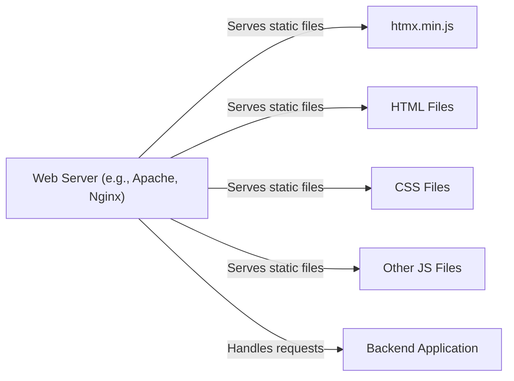
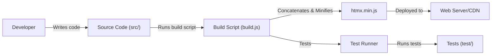

Okay, let's create a design document for the htmx project, keeping in mind its purpose and potential security considerations.

# BUSINESS POSTURE

htmx is a JavaScript library designed to simplify the creation of dynamic web applications using AJAX, CSS Transitions, WebSockets, and Server Sent Events (SSE) directly within HTML attributes.  It aims to reduce the complexity of modern web development by minimizing the need for extensive JavaScript coding.

Priorities:

*   Ease of Use:  Make it simple for developers to add dynamic behavior to their websites.
*   Performance:  Minimize the amount of JavaScript that needs to be written and executed, leading to faster page loads and interactions.
*   Compatibility:  Work with a wide range of browsers and backend technologies.
*   Maintainability:  Keep the codebase clean, well-documented, and easy to extend.
*   Security: Prevent common web vulnerabilities when using htmx.

Goals:

*   Provide a lightweight alternative to heavier JavaScript frameworks.
*   Enable developers to build modern web applications with a more traditional, HTML-centric approach.
*   Reduce the barrier to entry for creating interactive web experiences.

Business Risks:

*   Adoption Risk:  If htmx doesn't gain sufficient traction, its long-term maintenance and support could be jeopardized.
*   Compatibility Risk:  Changes in browser standards or backend technologies could break existing htmx implementations.
*   Security Risk:  Improper use of htmx, especially with user-supplied data, could lead to XSS or other vulnerabilities.  This is a *major* risk, as htmx's core functionality involves manipulating the DOM based on server responses.
*   Competition Risk:  Other libraries or frameworks could emerge that offer similar functionality with better performance or features.

# SECURITY POSTURE

Existing Security Controls:

*   security control: Input Sanitization Guidance: The htmx documentation (https://htmx.org/docs/#security) explicitly warns about the dangers of XSS and provides guidance on sanitizing user input on the server-side before including it in htmx responses.
*   security control: Content Security Policy (CSP) Compatibility: htmx is designed to be compatible with CSP, a crucial browser security mechanism that helps prevent XSS attacks. The documentation provides guidance on configuring CSP.
*   security control: `hx-swap` Options: htmx provides different `hx-swap` options that control how content is inserted into the DOM, allowing developers to choose safer methods (e.g., `outerHTML` vs. `innerHTML`) depending on the context.
*   security control: `hx-disable` attribute: htmx provides `hx-disable` attribute that disables processing of htmx attributes on an element and its children.
*   security control: `htmx:configRequest` event: htmx provides `htmx:configRequest` event that allows to modify the request before it is sent. This can be used to add CSRF tokens or other security headers.
*   security control: `htmx:beforeSwap` event: htmx provides `htmx:beforeSwap` event that allows to validate or modify the response before it is swapped into the DOM.

Accepted Risks:

*   accepted risk: Server-Side Responsibility: htmx explicitly places the responsibility for preventing XSS and other injection vulnerabilities on the server-side.  It assumes that the server will properly sanitize any data before including it in HTML responses. This is a significant accepted risk, as many developers may not fully understand the implications.
*   accepted risk: Limited Client-Side Validation: htmx does not perform extensive client-side validation of server responses. While `hx-swap` offers some control, it's still possible to introduce vulnerabilities if the server sends malicious content.
*   accepted risk: Third-Party Library Risk: While htmx itself may be secure, it relies on the underlying browser's implementation of AJAX, WebSockets, and SSE.  Vulnerabilities in these browser features could potentially impact htmx applications.

Recommended Security Controls:

*   security control: Comprehensive Security Examples: Provide more detailed, real-world examples in the documentation demonstrating secure usage patterns, including specific server-side sanitization techniques for various backend frameworks.
*   security control: Integration with Security Linters: Explore integrating with existing security linters or creating a custom linter to detect potentially unsafe htmx usage patterns (e.g., using `innerHTML` with unsanitized data).
*   security control: Security-Focused Tutorials: Create tutorials specifically focused on building secure htmx applications, covering topics like input validation, output encoding, CSRF protection, and CSP configuration.

Security Requirements:

*   Authentication: htmx itself does not handle authentication. Authentication is the responsibility of the backend server.
*   Authorization: htmx itself does not handle authorization. Authorization is the responsibility of the backend server.
*   Input Validation:
    *   All data received from the client *must* be validated on the server-side before being used in any htmx response.
    *   Validation should be strict and whitelist-based, allowing only known-good characters and patterns.
    *   Consider using a dedicated input validation library on the server-side.
*   Cryptography:
    *   Sensitive data transmitted between the client and server *must* be protected using HTTPS.
    *   If using WebSockets, ensure they are secured using WSS (WebSocket Secure).
    *   Any cryptographic operations (e.g., hashing passwords) *must* be performed on the server-side.
*   Output Encoding:
    *   All data included in htmx responses *must* be properly encoded to prevent XSS.
    *   The specific encoding method should be chosen based on the context where the data will be used (e.g., HTML entity encoding for data within HTML tags, JavaScript string escaping for data within script tags).
*   CSRF Protection:
    *   Implement CSRF protection mechanisms (e.g., CSRF tokens) for all state-changing requests initiated by htmx.
    *   htmx provides mechanisms to include CSRF tokens in requests.

# DESIGN

## C4 CONTEXT

Element Description:

*   Element:
    *   Name: User (Web Browser)
    *   Type: Person
    *   Description: A person interacting with the htmx application through a web browser.
    *   Responsibilities: Initiates requests, views responses, interacts with the UI.
    *   Security controls: Browser security features (CSP, same-origin policy, etc.), HTTPS.
*   Element:
    *   Name: htmx Application
    *   Type: Software System
    *   Description: The web application built using htmx.  This represents the combination of HTML, htmx attributes, and server-side logic.
    *   Responsibilities: Handles user interactions, sends requests to the backend, updates the DOM based on server responses.
    *   Security controls:  Relies on server-side security controls, CSP compatibility, `hx-swap` options.
*   Element:
    *   Name: Backend System (Database, APIs, etc.)
    *   Type: Software System
    *   Description: The server-side components that the htmx application interacts with. This could include databases, APIs, and other services.
    *   Responsibilities: Processes requests from the htmx application, retrieves and updates data, performs business logic.
    *   Security controls: Input validation, output encoding, authentication, authorization, access controls, database security, API security.

## C4 CONTAINER

Since htmx is a front-end library, the container diagram is very similar to the context diagram. The main difference is that we can now distinguish between the static HTML/CSS and the dynamic parts handled by htmx.

Element Description:

*   Element:
    *   Name: User (Web Browser)
    *   Type: Person
    *   Description: A person interacting with the web application.
    *   Responsibilities: Initiates requests, views responses, interacts with the UI.
    *   Security controls: Browser security features (CSP, same-origin policy), HTTPS.
*   Element:
    *   Name: Web Application
    *   Type: Container
    *   Description: The overall web application, including static and dynamic content.
    *   Responsibilities: Serves web pages, handles user interactions.
    *   Security controls: Relies on server-side security and browser security features.
*   Element:
    *   Name: Static HTML/CSS
    *   Type: Component
    *   Description: The static parts of the web application.
    *   Responsibilities: Provides the basic structure and styling of the web pages.
    *   Security controls: None specific, relies on overall web application security.
*   Element:
    *   Name: Dynamic Content (htmx)
    *   Type: Component
    *   Description: The parts of the web application that use htmx for dynamic behavior.
    *   Responsibilities: Handles user interactions, sends requests to the backend, updates the DOM.
    *   Security controls: Relies on server-side security, CSP compatibility, `hx-swap` options.
*   Element:
    *   Name: htmx Library
    *   Type: Component
    *   Description: The htmx JavaScript library.
    *   Responsibilities: Provides the functionality for handling htmx attributes and interacting with the server.
    *   Security controls: Internal security considerations, adherence to web standards.
*   Element:
    *   Name: Backend System
    *   Type: Container
    *   Description: The server-side components (databases, APIs, etc.).
    *   Responsibilities: Processes requests, manages data, performs business logic.
    *   Security controls: Input validation, output encoding, authentication, authorization, access controls.

## DEPLOYMENT

htmx, being a JavaScript library, is deployed as part of the web application's static assets.  There are several possible deployment scenarios:

1.  **Traditional Web Server:**  The htmx library (htmx.min.js) is placed in a directory accessible to the web server (e.g., Apache, Nginx) along with the HTML, CSS, and other JavaScript files.
2.  **Content Delivery Network (CDN):**  htmx can be loaded directly from a CDN (e.g., unpkg, jsDelivr), reducing load on the origin server and improving performance.
3.  **Bundler/Packager:**  htmx can be included as a dependency in a JavaScript project and bundled using tools like Webpack, Parcel, or Rollup.
4.  **Serverless Functions:** If the backend is implemented using serverless functions (e.g., AWS Lambda, Azure Functions), the htmx library would still be served as a static asset, likely from a storage service (e.g., S3, Azure Blob Storage) or CDN.

We'll describe the **Traditional Web Server** scenario in detail:

Element Description:

*   Element:
    *   Name: Web Server (e.g., Apache, Nginx)
    *   Type: Infrastructure Node
    *   Description: The web server that hosts the web application.
    *   Responsibilities: Serves static files, handles HTTP requests, potentially proxies requests to the backend.
    *   Security controls: Web server security configuration (e.g., disabling directory listing, configuring TLS), firewall.
*   Element:
    *   Name: htmx.min.js
    *   Type: File
    *   Description: The minified htmx library file.
    *   Responsibilities: Provides the htmx functionality.
    *   Security controls: File permissions, integrity checks (if using a CDN with subresource integrity).
*   Element:
    *   Name: HTML Files
    *   Type: File
    *   Description: The HTML files of the web application.
    *   Responsibilities: Provide the structure and content of the web pages.
    *   Security controls: File permissions.
*   Element:
    *   Name: CSS Files
    *   Type: File
    *   Description: The CSS files of the web application.
    *   Responsibilities: Provide the styling of the web pages.
    *   Security controls: File permissions.
*   Element:
    *   Name: Other JS Files
    *   Type: File
    *   Description: Other JavaScript files used by the web application.
    *   Responsibilities: Provide additional client-side functionality.
    *   Security controls: File permissions, integrity checks.
*   Element:
    *   Name: Backend Application
    *   Type: Software System
    *   Description: The server-side application logic.
    *   Responsibilities: Processes requests, interacts with databases and other services.
    *   Security controls: Input validation, output encoding, authentication, authorization, etc.

## BUILD

htmx itself has a build process, as described in its `CONTRIBUTING.md` file.  This process is relevant to contributors to the htmx library, not to developers *using* htmx in their applications. However, understanding the build process can provide insights into the library's quality and security practices.

For developers *using* htmx, the build process typically involves simply including the `htmx.min.js` file in their project, either by downloading it directly, linking to a CDN, or installing it via a package manager (npm, yarn).

htmx Build Process (for contributors):

Security Controls in the htmx Build Process:

*   security control: Testing: The build process includes running tests, which helps ensure the quality and correctness of the code. This can indirectly improve security by catching potential bugs that could lead to vulnerabilities.
*   security control: Minification: The build process minifies the code, reducing its size and making it slightly more difficult to reverse engineer. However, minification is not a strong security measure.
*   security control: Dependency Management: htmx has very few external dependencies, which reduces the risk of supply chain attacks.
*   security control: Code Review: Contributions to htmx are likely subject to code review, which can help identify and prevent security vulnerabilities.

# RISK ASSESSMENT

Critical Business Processes:

*   Serving dynamic web content efficiently and reliably.
*   Maintaining a positive user experience with fast page loads and interactions.
*   Protecting user data and preventing security breaches.

Data to Protect:

*   Sensitivity depends entirely on the *application* using htmx, not htmx itself. htmx is a transport mechanism. The backend application using htmx is responsible for defining and protecting sensitive data. Examples include:
    *   Personally Identifiable Information (PII):  Names, addresses, email addresses, phone numbers, etc. (High sensitivity)
    *   Financial Data:  Credit card numbers, bank account details, transaction history. (High sensitivity)
    *   Authentication Credentials:  Usernames, passwords, session tokens. (High sensitivity)
    *   User-Generated Content:  Comments, posts, messages, etc. (Variable sensitivity, depending on the content)
    *   Application Data:  Any data specific to the application's functionality. (Variable sensitivity)

# QUESTIONS & ASSUMPTIONS

Questions:

*   What specific backend technologies will be used with htmx? (This is crucial for providing tailored security recommendations.)
*   What types of user data will be handled by applications built with htmx? (This determines the sensitivity level and required security controls.)
*   What is the expected user base and traffic volume? (This impacts scalability and performance considerations.)
*   Are there any existing security policies or compliance requirements that need to be considered?

Assumptions:

*   BUSINESS POSTURE: The primary goal is to create dynamic web applications with improved performance and developer experience compared to traditional JavaScript frameworks.
*   SECURITY POSTURE: Developers using htmx are aware of basic web security principles, but may not have deep expertise in preventing XSS and other vulnerabilities. The server-side is responsible for all security-sensitive operations.
*   DESIGN: The application will follow a typical web application architecture, with a clear separation between the frontend (htmx) and the backend (server-side logic and data storage). The deployment will involve serving the htmx library as a static asset.