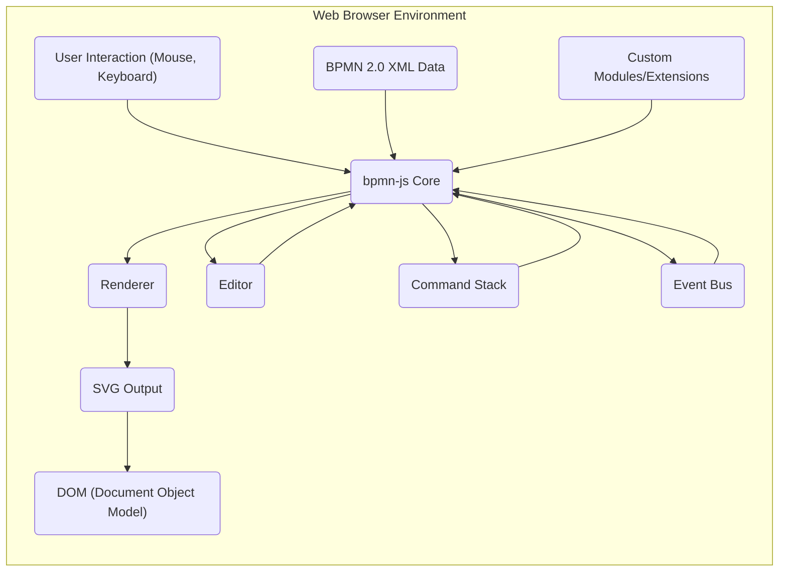
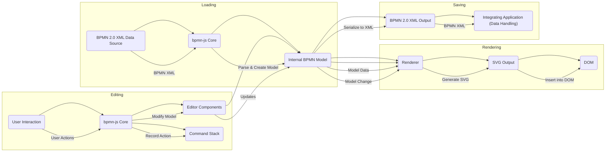

## Project Design Document: bpmn-js

**Version:** 1.1
**Date:** October 26, 2023
**Author:** AI Software Architect

### 1. Introduction

This document provides an enhanced design overview of the `bpmn-js` project, a client-side JavaScript library dedicated to rendering and editing BPMN 2.0 diagrams within web browsers. This detailed design serves as a crucial artifact for subsequent threat modeling exercises, offering a comprehensive understanding of the system's architecture, components, and data flow.

### 2. Goals

The core objectives of `bpmn-js` are:

* **Accurate BPMN 2.0 Rendering:** To faithfully render BPMN 2.0 diagrams according to the specification within a web browser environment.
* **Intuitive Diagram Editing:** To offer a user-friendly and efficient interface for creating, modifying, and manipulating BPMN 2.0 diagrams.
* **Modular Extensibility:** To enable developers to extend and customize the library's functionalities through a well-defined module system.
* **Seamless Web Application Integration:** To facilitate straightforward integration into diverse web applications and frontend frameworks.

### 3. Target Audience

This document is primarily intended for:

* Security engineers and architects tasked with performing threat modeling and security assessments.
* Software developers integrating `bpmn-js` into their web applications.
* Technical stakeholders requiring a deep understanding of the `bpmn-js` architectural design.

### 4. System Architecture

`bpmn-js` operates entirely within the client-side environment of a web browser. It is a self-contained JavaScript library and does not inherently possess a server-side component. Its integration within a larger application often involves interaction with backend services, but these interactions are managed by the host application.

**Detailed Component Breakdown:**

* **`bpmn-js Core`:** The central orchestrator of the library. It manages the BPMN model's lifecycle, coordinates interactions between other components, and exposes the primary API for developers.
* **`Renderer`:**  This component is responsible for the visual representation of the BPMN model. It takes the internal model representation and translates it into SVG elements for display in the browser.
* **`Editor`:**  Provides the interactive editing capabilities for manipulating the BPMN diagram. It encompasses several sub-modules:
    * **Palette:** A visual toolbar or panel presenting available BPMN elements for users to add to the diagram.
    * **Context Pad:** A context-sensitive menu that appears upon element selection, offering relevant actions for that specific element.
    * **Direct Editing:** Enables in-place modification of element labels and certain properties directly within the diagram.
    * **Modeling API:** A programmatic interface allowing developers to manipulate the BPMN model through code.
* **`SVG Output`:** The generated Scalable Vector Graphics code that constitutes the visual rendering of the BPMN diagram within the browser.
* **`DOM (Document Object Model)`:** The browser's internal representation of the web page structure. The `bpmn-js` library manipulates the DOM to insert and update the rendered SVG diagram.
* **`BPMN 2.0 XML Data`:** The standard XML-based format for representing BPMN diagrams. `bpmn-js` is capable of importing and exporting diagrams in this format.
* **`User Interaction (Mouse, Keyboard)`:** User input events that drive the editing process and interaction with the displayed diagram.
* **`Custom Modules/Extensions`:**  Optional, developer-created modules that can extend the core functionality of `bpmn-js`. These can introduce new features, modify existing behavior, or facilitate integration with external systems.
* **`Command Stack`:**  Manages the history of editing actions, enabling undo and redo functionality.
* **`Event Bus`:** A central mechanism for components within `bpmn-js` to communicate with each other by publishing and subscribing to events.

### 5. Data Flow

The primary data flow within `bpmn-js` centers around the transformation of BPMN 2.0 XML data into an interactive visual representation and the subsequent modifications made by the user:

1. **Diagram Loading:**
    * BPMN 2.0 XML data is ingested by `bpmn-js Core`. This process is typically initiated by the embedding web application, which might:
        * Fetch the XML from a remote server.
        * Load the XML from a local file.
        * Programmatically generate a new, empty diagram.
    * `bpmn-js Core` parses the XML data and constructs an in-memory representation of the BPMN model.
2. **Diagram Rendering:**
    * The `Renderer` component receives the internal BPMN model from `bpmn-js Core`.
    * The `Renderer` iterates through the model and generates corresponding SVG elements to visually represent each BPMN element and its connections.
    * The generated SVG is then injected into the DOM, making the diagram visible to the user within the browser.
3. **Diagram Editing:**
    * User interactions (e.g., clicking on the palette, dragging elements, typing labels) are captured by the browser.
    * These interactions are interpreted by `bpmn-js Core`.
    * The `Editor` components are invoked to modify the internal BPMN model based on the user's actions.
    * The `Command Stack` records these modifications, enabling undo/redo functionality.
    * The `Event Bus` broadcasts events related to the model changes.
    * The `Renderer` listens for these events and updates the SVG output to reflect the modifications in real-time.
4. **Diagram Saving:**
    * When the user (or the application) initiates a save action, `bpmn-js Core` serializes the current internal BPMN model back into BPMN 2.0 XML format.
    * The resulting XML data is then typically handled by the embedding web application, which is responsible for:
        * Sending the XML to a backend server for storage.
        * Saving the XML to a local file.

### 6. Security Considerations (Detailed for Threat Modeling)

Given its client-side nature, security considerations for `bpmn-js` primarily focus on potential vulnerabilities within the library itself and how it handles potentially untrusted external data, particularly BPMN XML.

* **Cross-Site Scripting (XSS):**
    * **BPMN XML Payload Injection:** If `bpmn-js` does not properly sanitize or escape data embedded within the BPMN XML (e.g., in element names, documentation, or custom properties), malicious JavaScript code could be injected and executed within the user's browser when the diagram is rendered. This is a high-risk vulnerability.
    * **Custom Module Vulnerabilities:**  Third-party or custom-developed modules extending `bpmn-js` might contain XSS vulnerabilities if they improperly handle user-provided data or manipulate the DOM without proper sanitization.
* **Denial of Service (DoS):**
    * **Maliciously Crafted BPMN Diagrams:**   специально crafted BPMN diagrams with an excessive number of elements, complex structures, or deeply nested elements could potentially overwhelm the browser's rendering engine or the `bpmn-js` library itself, leading to performance degradation or crashes.
* **Client-Side Logic Tampering:**
    * As `bpmn-js` code executes within the user's browser, malicious actors could potentially tamper with the library's code or the application's logic to alter the behavior of the diagram editor or gain unauthorized access to data. While this is a general client-side risk, it's important to consider in the context of sensitive BPMN data.
* **Dependency Vulnerabilities:**
    * `bpmn-js` relies on various third-party JavaScript libraries. Vulnerabilities discovered in these dependencies could potentially be exploited if not properly managed and updated. Regular dependency scanning and updates are crucial.
* **Information Disclosure:**
    * While `bpmn-js` primarily deals with visual representation, if sensitive information is stored within BPMN diagram properties and not handled securely by the integrating application, vulnerabilities in how `bpmn-js` exposes or handles this data could lead to unintended information disclosure.
* **Supply Chain Security:**
    * Ensuring the integrity and authenticity of the `bpmn-js` library and its dependencies is paramount. Using official sources and verifying checksums can mitigate the risk of using compromised versions of the library.

### 7. Deployment

`bpmn-js` is deployed as a collection of JavaScript files that are integrated into a web application. The typical deployment process involves:

* **Including `bpmn-js` Files:**  Adding the necessary JavaScript and CSS files from the `bpmn-js` distribution to the web application's project. This can be done via direct inclusion, package managers (like npm or yarn), or CDNs.
* **Creating a Container Element:** Defining an HTML element (usually a `
`) within the web page where the BPMN diagram will be rendered.
* **Initializing `bpmn-js`:** Using the `bpmn-js` API within the application's JavaScript code to instantiate either a `BpmnViewer` (for read-only display) or a `BpmnModeler` (for editing capabilities), targeting the designated container element.
* **Loading BPMN Data:** Providing the BPMN 2.0 XML data to the `bpmn-js` instance for rendering.
* **Handling User Interactions:** Implementing application-specific logic to handle user interactions with the diagram (e.g., saving changes, integrating with other application features).

Common deployment scenarios include:

* **Embedded Diagram Viewers:** Displaying BPMN diagrams within dashboards or process monitoring tools.
* **Process Modeling Tools:** Building full-fledged BPMN modeling and editing applications.
* **Workflow Engines Integration:** Providing a visual interface for designing and managing workflows within a larger workflow engine.

### 8. Assumptions and Constraints

* **Modern Web Browser Compatibility:** `bpmn-js` assumes execution within modern web browsers that support the necessary JavaScript features, DOM APIs, and SVG rendering capabilities.
* **BPMN 2.0 Standard Adherence:** The library aims for strict adherence to the BPMN 2.0 specification.
* **Client-Side Operation:**  The core functionality of `bpmn-js` is confined to the client-side. Server-side interactions and data persistence are the responsibility of the integrating application.
* **No Built-in Security Mechanisms:** `bpmn-js` itself does not provide built-in authentication, authorization, or data encryption mechanisms. These security aspects must be implemented by the integrating application.

### 9. Future Considerations

* **Enhanced Accessibility Features:**  Further improvements to make the diagram editor more accessible to users with disabilities.
* **Performance Optimizations:** Continuous efforts to optimize rendering and editing performance, especially for large and complex diagrams.
* **Improved Extensibility and Plugin Architecture:**  Providing more robust and well-documented extension points for developers to customize and extend the library's functionality.

This enhanced design document provides a more detailed and comprehensive understanding of the `bpmn-js` project. The information presented here is intended to be a valuable resource for conducting thorough threat modeling activities and for developers integrating `bpmn-js` into their applications.