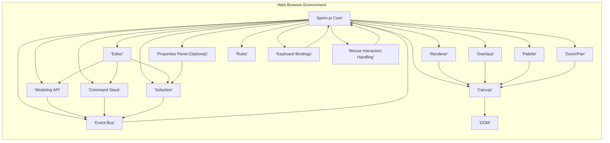
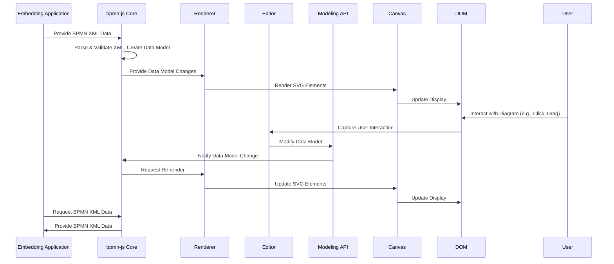

# Project Design Document: bpmn-js

**Version:** 1.1
**Date:** October 26, 2023
**Author:** AI Software Architect

## 1. Introduction

This document provides an enhanced and detailed design overview of the `bpmn-js` project, a client-side JavaScript library for rendering and editing BPMN 2.0 diagrams within web browsers. This revised document aims to provide a more robust foundation for subsequent threat modeling activities. It elaborates on the system's architecture, components, data flow, and critical security considerations.

## 2. Goals and Objectives

* Provide a comprehensive and more detailed architectural overview of `bpmn-js`.
* Clearly identify key components, their specific responsibilities, and interactions.
* Describe the data flow within the system with greater granularity.
* Highlight potential security considerations relevant for threat modeling, providing more specific examples and context.

## 3. System Overview

`bpmn-js` is a self-contained, client-side JavaScript library enabling the visualization and manipulation of Business Process Model and Notation (BPMN) 2.0 diagrams directly within a user's web browser. It is crucial to understand that `bpmn-js` itself does not include any backend functionality for data persistence, authentication, or authorization. These responsibilities are entirely delegated to the embedding web application.

## 4. Architectural Design

The `bpmn-js` architecture is fundamentally client-side, operating entirely within the user's web browser. It leverages the Document Object Model (DOM) to dynamically render and manage the BPMN diagram's visual representation. The library is designed with a modular approach, promoting maintainability and extensibility.

### 4.1. Component Description

* **bpmn-js Core:** The central orchestrator of the library. It initializes and manages other components, holds the overall state of the diagram, and provides the main API for interacting with `bpmn-js`.
* **Renderer:**  This component is responsible for the visual representation of the BPMN diagram. It takes the internal BPMN data model and translates it into Scalable Vector Graphics (SVG) elements within the DOM. It handles the rendering of shapes, connections, labels, and markers according to the BPMN 2.0 specification.
* **Editor:** Provides the interactive editing capabilities for the BPMN diagram. It handles user input events (mouse clicks, drags, keyboard input) and translates them into actions that modify the underlying data model. This includes creating, moving, resizing, and deleting BPMN elements.
* **Modeling API:** A programmatic interface for interacting with the BPMN data model. It offers methods for creating, reading, updating, and deleting elements and their properties. This API allows developers to programmatically manipulate the diagram's structure and data.
* **Overlays:** A mechanism to display additional information or interactive elements directly on top of BPMN diagram elements. This can be used to show status indicators, annotations, tooltips, or custom interactive controls associated with specific elements.
* **Palette:** A user interface component that presents a set of tools or stencils for creating new BPMN elements. Users can drag and drop elements from the palette onto the diagram canvas.
* **Properties Panel (Optional):** An optional UI component, often implemented as an extension, that allows users to view and edit the specific properties of selected BPMN elements. This provides a detailed interface for configuring the attributes of individual elements.
* **Event Bus:** A central publish/subscribe mechanism within `bpmn-js`. Components can publish events when significant actions occur (e.g., element created, property changed), and other components can subscribe to these events to react accordingly. This promotes loose coupling between components.
* **Command Stack:** Manages a history of actions performed by the user. This enables undo/redo functionality, allowing users to revert or reapply changes made to the diagram.
* **Canvas:**  The main drawing area where the BPMN diagram is rendered. It manages the viewport, handles zooming and panning, and provides the surface for rendering the SVG elements.
* **Selection:** Manages the currently selected BPMN elements. It provides methods for selecting, deselecting, and querying the selection state.
* **Zoom/Pan:** Handles the zooming and panning functionality of the diagram canvas, allowing users to navigate large diagrams.
* **Rules:** Defines the constraints and validation rules for manipulating BPMN elements. It determines which actions are allowed based on the BPMN 2.0 specification and any custom rules.
* **Keyboard Bindings:**  Provides keyboard shortcuts for common actions, enhancing user efficiency.
* **Mouse Interaction Handling:** Manages how the library responds to various mouse events (clicks, drags, mouse movements) on the diagram canvas.
* **DOM (Document Object Model):** The fundamental structure of the web page. `bpmn-js` interacts with the DOM to render the SVG diagram and handle user interactions.

## 5. Data Flow

The data flow within `bpmn-js` involves a lifecycle of loading, rendering, manipulating, and potentially exporting BPMN diagram data. Understanding this flow is crucial for identifying potential points of vulnerability.

* **Loading BPMN Diagram:**
    * The embedding application is responsible for fetching or providing the BPMN XML data.
    * This XML data is passed to the `bpmn-js Core` through its API (e.g., the `importXML` method).
    * The `bpmn-js Core` parses the XML, validating it against the BPMN 2.0 schema.
    * Upon successful parsing, an internal, in-memory data model representing the diagram is created. This model is a graph structure representing the BPMN elements and their relationships.
* **Rendering BPMN Diagram:**
    * The `Renderer` component subscribes to events from the `Event Bus` indicating changes in the data model.
    * When the data model is loaded or modified, the `Renderer` traverses the model.
    * For each element in the model, the `Renderer` creates corresponding SVG elements (shapes, paths, text) based on the element's type and properties.
    * These SVG elements are then added to the `Canvas`, making the diagram visually available in the DOM.
* **User Interaction and Editing:**
    * User interactions with the rendered diagram (e.g., clicking on an element, dragging a connection) are captured by the browser and handled by the `Mouse Interaction Handling` component.
    * These interactions are interpreted, and the `Editor` component determines the intended action.
    * The `Editor` uses the `Modeling API` to modify the internal data model. For example, dragging an element triggers updates to its position in the model.
    * Each modification is typically executed as a command that is pushed onto the `Command Stack`, enabling undo/redo functionality.
    * Changes to the data model trigger events that are published on the `Event Bus`.
    * The `Renderer` listens for these events and updates the SVG representation on the `Canvas` to reflect the changes. The `Selection` component also updates to reflect any changes in selected elements.
* **Exporting BPMN Diagram:**
    * When the embedding application needs to save or export the diagram, it requests the current BPMN data from the `bpmn-js Core` (e.g., using the `saveXML` method).
    * The `bpmn-js Core` serializes the internal data model back into BPMN XML format, adhering to the BPMN 2.0 specification.
    * This XML data is then returned to the embedding application, which is responsible for persisting it (e.g., sending it to a backend server).

## 6. Security Considerations

As a purely client-side library, the inherent security risks associated with `bpmn-js` are primarily centered around how it interacts with the embedding application and the data it processes. The following points elaborate on the previously mentioned security considerations, providing more context and examples:

* **Cross-Site Scripting (XSS):**
    * **Vulnerability:** If the embedding application loads BPMN XML from untrusted sources or user input without proper sanitization, malicious scripts embedded within BPMN elements (e.g., in element names, documentation, or custom properties) can be executed within the user's browser context when `bpmn-js` renders the diagram. This could lead to session hijacking, cookie theft, or other malicious activities.
    * **Mitigation:** The embedding application **must** implement robust server-side and client-side sanitization of all BPMN XML data before it is passed to `bpmn-js`. Libraries specifically designed for sanitizing XML content should be used. Content Security Policy (CSP) headers can also help mitigate XSS attacks by restricting the sources from which the browser can load resources.
* **Dependency Vulnerabilities:**
    * **Vulnerability:** `bpmn-js` relies on a number of third-party JavaScript libraries. Known vulnerabilities in these dependencies can be exploited if not addressed. Attackers could potentially leverage these vulnerabilities to inject malicious code or gain unauthorized access.
    * **Mitigation:** Regularly update `bpmn-js` and all its dependencies to the latest stable versions. Utilize automated dependency scanning tools (e.g., npm audit, Snyk) as part of the development and deployment pipeline to identify and address known vulnerabilities. Implement a process for promptly patching vulnerabilities.
* **Data Integrity:**
    * **Vulnerability:** While `bpmn-js` itself doesn't persist data, the embedding application is responsible for storing and retrieving BPMN diagrams. If the embedding application's storage mechanisms are insecure, the integrity of the BPMN data could be compromised (e.g., through unauthorized modification).
    * **Mitigation:** Implement robust data validation and integrity checks within the embedding application both before saving and after loading BPMN diagrams. Use secure storage mechanisms and access controls to protect the integrity of the stored data. Consider using checksums or digital signatures to verify the integrity of BPMN data.
* **Denial of Service (DoS):**
    * **Vulnerability:**  Maliciously crafted or excessively large and complex BPMN diagrams could potentially overwhelm the client's browser resources, leading to performance degradation, unresponsiveness, or even browser crashes, effectively causing a client-side Denial of Service.
    * **Mitigation:** Implement client-side checks to limit the size and complexity of loaded BPMN diagrams. Consider server-side validation of diagram size and complexity before allowing them to be loaded into `bpmn-js`. Implement mechanisms to gracefully handle large diagrams, such as lazy loading or virtualization techniques if applicable.
* **Information Disclosure:**
    * **Vulnerability:** If the embedding application lacks proper authentication and authorization mechanisms, unauthorized users could potentially view or access sensitive business processes represented in the BPMN diagrams.
    * **Mitigation:** Implement strong authentication and authorization mechanisms within the embedding application to control access to BPMN diagrams based on user roles and permissions. Ensure that only authorized users can view and edit specific diagrams.
* **Supply Chain Security:**
    * **Vulnerability:**  If the `bpmn-js` library or its dependencies are compromised at their source (e.g., through a malicious commit or a compromised package repository), malicious code could be introduced into the embedding application.
    * **Mitigation:** Obtain `bpmn-js` and its dependencies from trusted and reputable sources. Verify the integrity of downloaded packages using checksums or signatures. Implement Software Composition Analysis (SCA) tools to continuously monitor the integrity and security of the library and its dependencies throughout the development lifecycle.
* **Client-Side Storage:**
    * **Vulnerability:** If the embedding application uses client-side storage (e.g., local storage, session storage, cookies) to temporarily store BPMN diagram data, this data could be vulnerable to access or manipulation by other scripts running on the same domain (through XSS) or by malicious browser extensions.
    * **Mitigation:** Avoid storing sensitive BPMN data in client-side storage if possible. If temporary client-side storage is necessary, encrypt the data before storing it. Use appropriate HTTP flags for cookies (e.g., `HttpOnly`, `Secure`) to mitigate certain risks.

## 7. Dependencies

`bpmn-js` relies on a set of well-defined JavaScript libraries to provide its functionality. Key dependencies include:

* **diagram-js:** A foundational library for building web-based diagram editors, providing core functionalities for rendering, interaction, and modeling.
* **min-dom:** A lightweight library for manipulating the Document Object Model (DOM).
* **tiny-svg:** A small utility library for creating and manipulating SVG elements.

A comprehensive and up-to-date list of all dependencies can be found in the `package.json` file within the `bpmn-js` project repository. It is important to regularly review these dependencies for potential security vulnerabilities.

## 8. Deployment Considerations

`bpmn-js`, being a client-side library, is typically deployed as part of the front-end assets of a web application. The deployment process involves including the necessary JavaScript (`.js`) and CSS (`.css`) files provided by `bpmn-js` within the web application's static assets. These files are then served to the user's browser along with the rest of the web application. No specific server-side deployment for `bpmn-js` itself is required.

## 9. Future Considerations

* **Extension Security:** `bpmn-js` supports extensions that can add or modify its functionality. The security of these extensions is a critical concern. Malicious or poorly written extensions could introduce vulnerabilities into the `bpmn-js` environment. Implement mechanisms to validate and control the use of extensions.
* **Integration with Backend Services:** The security of communication between the client-side `bpmn-js` instance and any backend services used by the embedding application (e.g., for saving diagrams, retrieving data) is paramount. Ensure that all communication is secured using HTTPS and that appropriate authentication and authorization mechanisms are in place for API calls. Consider using secure API design principles and input validation on the backend.

This enhanced document provides a more detailed and comprehensive overview of the `bpmn-js` project's architecture, data flow, and security considerations. This information serves as a more robust foundation for identifying potential threats and developing targeted mitigation strategies within the context of the embedding application. A thorough understanding of these aspects is crucial for building secure and reliable applications that utilize `bpmn-js`.