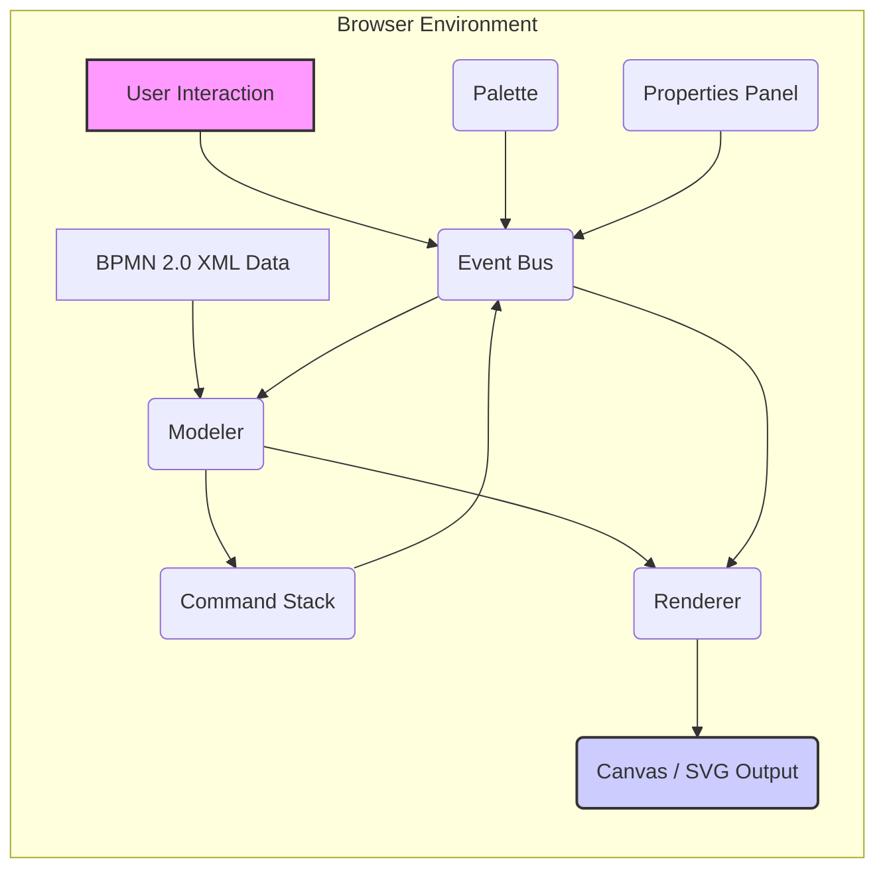
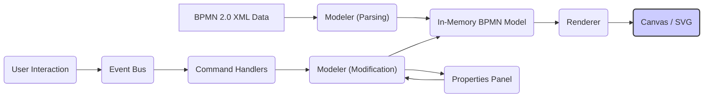

# Project Design Document: bpmn-js

**Version:** 1.1
**Date:** October 26, 2023
**Author:** AI Software Architect

## 1. Introduction

This document provides a detailed design overview of the `bpmn-js` project, an open-source, client-side JavaScript library for rendering and interactively editing BPMN 2.0 diagrams within web browsers. This document aims to clearly articulate the system's architecture, key components, and data flow, serving as a foundational resource for subsequent threat modeling activities. Understanding these aspects is crucial for identifying potential vulnerabilities and security risks.

## 2. Goals and Objectives

The primary goals of `bpmn-js` are:

*   **Accurate BPMN Rendering:** To faithfully display BPMN 2.0 diagrams within a web browser environment, adhering to the BPMN specification.
*   **Interactive Diagram Editing:** To enable users to intuitively create, modify, and manipulate BPMN diagrams directly within the browser, providing a rich editing experience.
*   **Modular Extensibility:** To offer a well-defined architecture that allows developers to extend and customize the core functionality through plugins and extensions.
*   **Seamless Integration:** To facilitate easy integration into diverse web applications and frameworks, minimizing integration complexities.
*   **Optimized Performance:** To deliver a responsive and performant user experience for both rendering and editing, even with complex diagrams.

## 3. Architectural Overview

`bpmn-js` is a client-side JavaScript library that operates entirely within the context of a web browser. It leverages standard browser APIs, primarily utilizing SVG for rendering graphical elements and DOM manipulation for user interaction. The core architecture can be visualized as follows:

Key architectural components include:

*   **Modeler:** The central orchestrator, responsible for managing the in-memory representation of the BPMN model. It handles parsing BPMN 2.0 XML, creating and manipulating model elements, and managing the history of changes via the `Command Stack`.
*   **Renderer:**  The component responsible for translating the abstract BPMN model into a concrete visual representation using SVG. It determines the visual appearance and layout of BPMN elements based on the model and registered renderers.
*   **Canvas:** An abstraction layer over the underlying SVG rendering surface. It provides a programmatic interface for drawing shapes, connections, and overlays, and manages zooming and panning.
*   **Event Bus:** A central, decoupled communication mechanism. Components publish events to the bus, and other components subscribe to specific events to react to changes or user interactions.
*   **Command Stack:** Manages a chronological history of user actions (commands) that modify the BPMN model. This enables undo and redo functionality, allowing users to revert or reapply changes.
*   **Palette:** A user interface component providing tools (typically draggable icons) for creating new BPMN elements on the diagram.
*   **Properties Panel:** A user interface component that displays the attributes and properties of the currently selected BPMN element, allowing users to view and edit them.
*   **Overlays:** A mechanism for adding interactive or informative visual elements on top of BPMN diagram elements, such as status indicators or annotations.
*   **Rules:** Defines constraints and validation logic governing how BPMN elements can be created, connected, and modified, ensuring adherence to BPMN standards and custom application requirements.
*   **Modeling API:** Provides a programmatic interface for interacting with the `Modeler` and other core components, enabling developers to manipulate the diagram and its elements through code.

## 4. Component Details

This section provides a more detailed breakdown of the key components and their responsibilities:

*   **Modeler:**
    *   **BPMN Parser:** Responsible for taking BPMN 2.0 XML as input and converting it into an internal JavaScript object representation of the BPMN model.
    *   **Element Factory:** Provides methods for creating new BPMN model elements programmatically.
    *   **Model Access API:** Offers methods for retrieving and manipulating elements within the BPMN model.
    *   **Command Integration:** Interacts closely with the `Command Stack` to record and apply changes to the model.
*   **Renderer:**
    *   **Registry:** Maintains a mapping of BPMN element types to their corresponding rendering implementations.
    *   **Renderer Providers:** Implement the logic for rendering specific types of BPMN elements (e.g., tasks, gateways, sequence flows) as SVG.
    *   **Visual Factory:** Creates the actual SVG elements (shapes, paths, text) that represent the BPMN elements on the canvas.
    *   **Style Handling:** Applies styling rules to the rendered SVG elements based on the BPMN model and potentially custom styles.
*   **Canvas:**
    *   **SVG Management:** Handles the creation, manipulation, and removal of SVG elements within the diagram.
    *   **Viewport Control:** Manages zooming and panning of the diagram view.
    *   **Layer Management:** Organizes different types of visual elements (e.g., shapes, connections, overlays) into separate layers for better control and performance.
    *   **Event Delegation:** Handles browser events (e.g., clicks, mouse movements) on the canvas and dispatches them to relevant components.
*   **Event Bus:**
    *   **Publish/Subscribe Implementation:** Allows components to publish events and other components to subscribe to and receive those events.
    *   **Event Types:** Defines a set of standard event types used throughout the `bpmn-js` ecosystem (e.g., `element.click`, `shape.added`, `commandStack.changed`).
    *   **Asynchronous Communication:** Enables decoupled communication between components without direct dependencies.
*   **Command Stack:**
    *   **Command Recording:** Stores executed commands, including information about the changes they made to the model.
    *   **Undo/Redo Logic:** Implements the core logic for reverting and reapplying commands.
    *   **Command Interceptors:** Allows components to intercept and potentially modify commands before they are executed.
    *   **Batching:** Supports grouping multiple related changes into a single atomic command for undo/redo purposes.
*   **Palette:**
    *   **Tool Configuration:** Defines the set of available tools for creating BPMN elements.
    *   **Drag and Drop Handling:** Manages the drag-and-drop interaction for creating new elements on the diagram.
    *   **Customization API:** Allows developers to customize the palette's appearance and available tools.
*   **Properties Panel:**
    *   **Property Provider Interface:** Defines how different components can contribute properties for specific BPMN element types.
    *   **Form Rendering:** Dynamically generates the user interface for editing element properties.
    *   **Data Binding:** Connects the UI elements in the properties panel to the underlying BPMN model data.
    *   **Change Handling:** Updates the BPMN model when users modify properties in the panel.
*   **Overlays:**
    *   **Overlay Registration:** Allows components to register overlays for specific BPMN elements.
    *   **Positioning Logic:** Determines the position of overlays relative to their associated elements.
    *   **Content Rendering:** Renders the content of the overlays (e.g., text, icons, custom HTML).
*   **Rules:**
    *   **Rule Definition:** Provides a mechanism for defining rules that govern allowed interactions and modifications of BPMN elements.
    *   **Rule Evaluation:** Evaluates rules before allowing certain actions to proceed (e.g., connecting two elements).
    *   **Extensibility:** Allows developers to add custom rules to enforce application-specific constraints.
*   **Modeling API:**
    *   **Element Manipulation:** Provides methods for creating, updating, and deleting BPMN elements programmatically.
    *   **Diagram Navigation:** Offers methods for navigating the diagram structure.
    *   **Utility Functions:** Includes helper functions for common tasks related to BPMN modeling.

## 5. Data Flow

The typical data flow within `bpmn-js` can be broken down into several key scenarios:

*   **Loading and Rendering a Diagram:**
    1. **BPMN Data Input:** BPMN 2.0 XML data is provided to `bpmn-js`, typically as a string.
    2. **Parsing:** The `Modeler`'s BPMN Parser processes the XML data.
    3. **Model Creation:** An in-memory representation of the BPMN model is created.
    4. **Rendering Trigger:** The `Modeler` or an external component triggers the rendering process.
    5. **SVG Generation:** The `Renderer` iterates through the model and generates corresponding SVG elements.
    6. **Canvas Update:** The `Canvas` adds the generated SVG elements to the DOM, visually displaying the diagram.

*   **User Interaction (e.g., Moving an Element):**
    1. **User Action:** The user clicks and drags a BPMN element.
    2. **Event Dispatch:** The browser dispatches mouse events, which are handled by the `Canvas`.
    3. **Event Bus Notification:** The `Canvas` publishes relevant events (e.g., `element.drag.start`, `element.drag.move`, `element.drag.end`) on the `Event Bus`.
    4. **Command Creation:** A command handler (listening to the drag events) creates a command to move the element.
    5. **Command Execution:** The command is executed by the `Modeler`, updating the element's position in the model.
    6. **Rendering Update:** The `Renderer` detects the model change and updates the visual representation of the element on the `Canvas`.

*   **Modifying Element Properties:**
    1. **Element Selection:** The user selects a BPMN element.
    2. **Properties Panel Update:** The `Properties Panel` listens for selection events and displays the properties of the selected element.
    3. **User Input:** The user modifies a property in the `Properties Panel`.
    4. **Command Creation:** The `Properties Panel` creates a command to update the corresponding property in the BPMN model.
    5. **Command Execution:** The command is executed by the `Modeler`.
    6. **Rendering Update:** The `Renderer` updates the visual representation if the property change affects the element's appearance.

## 6. Security Considerations (Pre-Threat Modeling)

This section outlines potential security considerations that will be further analyzed during the threat modeling process:

*   **Cross-Site Scripting (XSS) via User-Provided Data:**  If user-supplied data, such as element labels, documentation, or custom attributes within the BPMN XML, is not properly sanitized before being rendered as SVG, it could introduce XSS vulnerabilities. Malicious scripts could be injected and executed within the user's browser.
*   **Dependency Vulnerabilities:** `bpmn-js` relies on a number of third-party JavaScript libraries. Security vulnerabilities discovered in these dependencies could potentially be exploited within applications using `bpmn-js`. Regular dependency updates and security audits are crucial.
*   **Denial of Service (DoS) through Malicious Diagrams:**  A carefully crafted BPMN diagram with an extremely large number of elements, deeply nested structures, or computationally expensive rendering logic could potentially cause performance degradation or even crash the user's browser, leading to a client-side DoS.
*   **Data Integrity and Tampering:** While `bpmn-js` operates on the client-side, ensuring the integrity of the BPMN model data during editing and before saving is important. Mechanisms to detect or prevent unauthorized modification of the model within the client could be considered.
*   **Access Control and Authorization (Embedding Application Responsibility):** `bpmn-js` itself does not handle user authentication or authorization. The web applications embedding `bpmn-js` are responsible for implementing appropriate access controls to protect sensitive BPMN diagrams and ensure that only authorized users can view or modify them.
*   **BPMN XML Injection Vulnerabilities:** If the application generates BPMN XML based on user input without proper sanitization or encoding, it could be susceptible to XML injection attacks. Malicious XML structures could be injected, potentially leading to unexpected behavior or information disclosure when the XML is processed elsewhere.
*   **Prototype Pollution:**  Care should be taken to avoid scenarios where user-controlled input could manipulate the prototypes of built-in JavaScript objects, potentially leading to unexpected behavior or security vulnerabilities.

## 7. Deployment

`bpmn-js` is primarily deployed as a client-side JavaScript library integrated within web applications. Developers typically include the library's JavaScript and CSS files in their web project and use its API to embed a BPMN diagram editor or viewer into their application's user interface. The library executes entirely within the user's web browser.

Deployment typically involves:

*   **Including Library Files:** Adding the necessary `bpmn-js` JavaScript and CSS files to the web application's assets.
*   **Initializing the Modeler:** Using the `bpmn-js` API to create an instance of the `Modeler` or `Viewer` in the application's JavaScript code.
*   **Providing a Container:** Specifying an HTML element where the BPMN diagram will be rendered.
*   **Loading BPMN Data:** Loading existing BPMN XML data or creating a new empty diagram.
*   **Handling User Interactions:** Implementing event listeners and logic to handle user interactions with the diagram.

## 8. Dependencies

`bpmn-js` relies on a set of well-defined open-source JavaScript libraries for its functionality. Key dependencies include:

*   **diagram-js:** A foundational library providing the core diagramming framework upon which `bpmn-js` is built. It handles core concepts like shapes, connections, layout, and event handling.
*   **min-dom:** A minimal and efficient library for DOM manipulation tasks.
*   **tiny-svg:** A lightweight library for creating and manipulating SVG elements.

A comprehensive and up-to-date list of all dependencies can be found in the `package.json` file within the `bpmn-js` project repository.

## 9. Future Considerations

Potential future enhancements and areas of development for `bpmn-js` that could influence its architecture and security profile include:

*   **Real-time Collaborative Editing:** Implementing features to allow multiple users to concurrently edit the same BPMN diagram in real-time. This would introduce new challenges related to data synchronization, conflict resolution, and access control.
*   **Server-Side Rendering (SSR):** Exploring options for rendering BPMN diagrams on the server-side for potential benefits in performance, SEO, or generating static diagram images. This would require careful consideration of the server-side environment and potential security implications.
*   **Enhanced Validation and Constraint Enforcement:** Adding more sophisticated validation rules and mechanisms to enforce BPMN specification compliance and custom business rules more rigorously.
*   **Improved Accessibility Features:** Enhancing the accessibility of the editor for users with disabilities, adhering to accessibility standards and guidelines.
*   **Customizable UI Components:** Providing more flexibility for developers to customize the look and feel of UI components like the Palette and Properties Panel.

This revised design document provides a more detailed and structured overview of the `bpmn-js` project. It aims to offer a clear understanding of the system's architecture, components, and data flow, serving as a solid foundation for conducting thorough threat modeling and identifying potential security vulnerabilities.