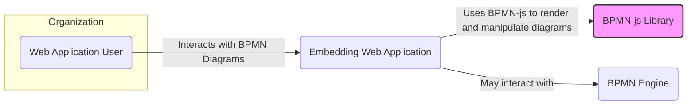
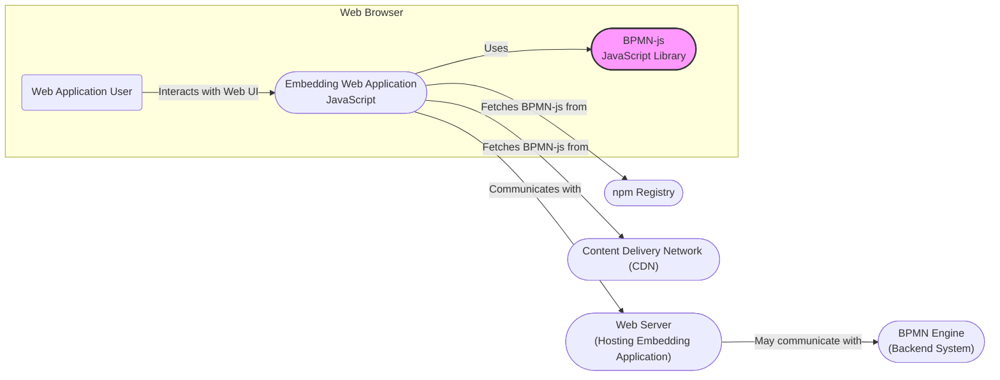
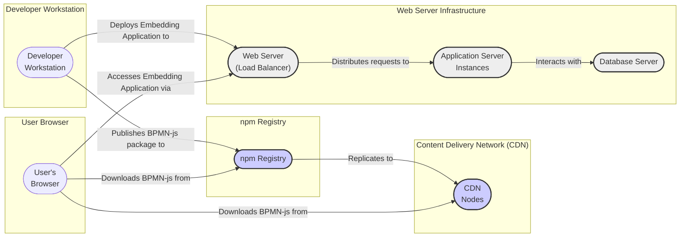
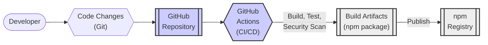

# BUSINESS POSTURE

The bpmn-js project provides a JavaScript library for rendering and modeling BPMN 2.0 diagrams in web browsers.

- Business Priorities and Goals:
  - Enable developers to easily integrate BPMN diagram visualization and editing capabilities into web applications.
  - Provide a robust and standards-compliant BPMN 2.0 toolkit.
  - Offer a customizable and extensible platform for BPMN diagram manipulation.
  - Support various use cases, including process modeling, workflow visualization, and business process management.

- Business Risks:
  - Data integrity risk: Incorrect rendering or manipulation of BPMN diagrams could lead to misrepresentation of business processes and flawed decision-making.
  - Availability risk: Bugs or vulnerabilities in bpmn-js could cause application crashes or malfunctions, disrupting business operations that rely on BPMN diagrams.
  - Confidentiality risk: Although bpmn-js is a client-side library and doesn't directly handle sensitive data, vulnerabilities could be exploited to access or modify BPMN diagrams containing confidential business process information within the context of a larger application.
  - Supply chain risk: Vulnerabilities in dependencies of bpmn-js could introduce security risks into applications that use the library.

# SECURITY POSTURE

- Existing Security Controls:
  - security control: Regular dependency updates to address known vulnerabilities in third-party libraries. (Implemented via npm and developer practices)
  - security control: Code reviews and testing during development. (Implemented via project development process)
  - security control: Use of npm for package management and distribution. (Implemented via npm infrastructure)
  - accepted risk: Client-side nature of the library means security is heavily reliant on the security of the embedding application and the user's browser environment.
  - accepted risk: Limited control over how the library is used and integrated into different applications.

- Recommended Security Controls:
  - security control: Implement automated security scanning (SAST and dependency scanning) in the CI/CD pipeline.
  - security control: Establish a process for reporting and handling security vulnerabilities.
  - security control: Provide security guidelines and best practices for developers embedding bpmn-js in their applications.

- Security Requirements:
  - Authentication: Not directly applicable to bpmn-js as a client-side library. Authentication is the responsibility of the embedding application.
  - Authorization: Not directly applicable to bpmn-js. Authorization for accessing and modifying BPMN diagrams is the responsibility of the embedding application.
  - Input Validation:
    - Requirement: bpmn-js must properly parse and validate BPMN 2.0 XML input to prevent injection attacks or denial-of-service vulnerabilities due to malformed diagrams.
    - Requirement: Implement validation to handle potentially malicious or unexpected elements and attributes within BPMN XML.
  - Cryptography: Not directly applicable to bpmn-js in terms of encrypting BPMN diagrams. Cryptographic requirements would be relevant for the embedding application if it needs to secure BPMN data in transit or at rest.

# DESIGN

## C4 CONTEXT

- Context Diagram Elements:
  - Element:
    - Name: Web Application User
    - Type: Person
    - Description: End-user who interacts with web applications that embed bpmn-js to view or edit BPMN diagrams.
    - Responsibilities: View and potentially edit BPMN diagrams within the web application.
    - Security controls: User authentication and authorization are handled by the Embedding Web Application. Browser security controls.
  - Element:
    - Name: BPMN-js Library
    - Type: Software System
    - Description: JavaScript library responsible for rendering and manipulating BPMN 2.0 diagrams in web browsers.
    - Responsibilities: Parse BPMN 2.0 XML, render diagrams visually, provide APIs for diagram manipulation, and ensure BPMN 2.0 standard compliance.
    - Security controls: Input validation of BPMN XML, protection against XSS vulnerabilities, dependency management.
  - Element:
    - Name: Embedding Web Application
    - Type: Software System
    - Description: Web application that integrates the bpmn-js library to provide BPMN diagram functionality to users. This application handles user authentication, authorization, data storage, and potentially interaction with a BPMN engine.
    - Responsibilities: Integrate bpmn-js, manage user authentication and authorization, store BPMN diagrams, handle data persistence, and potentially interact with backend systems like BPMN engines.
    - Security controls: Server-side security controls, input validation, output encoding, authentication, authorization, session management, secure data storage, and secure communication.
  - Element:
    - Name: BPMN Engine
    - Type: Software System
    - Description: Backend system that executes and manages BPMN processes. The Embedding Web Application might interact with a BPMN engine to deploy, run, and monitor business processes defined by BPMN diagrams.
    - Responsibilities: Execute BPMN processes, manage process instances, provide APIs for process deployment and monitoring, and handle process state and data.
    - Security controls: Authentication, authorization, access control, secure API endpoints, data encryption, and audit logging.

## C4 CONTAINER

- Container Diagram Elements:
  - Element:
    - Name: BPMN-js JavaScript Library
    - Type: Container - JavaScript Library
    - Description: Client-side JavaScript library for rendering and manipulating BPMN diagrams. Delivered as an npm package or via CDN.
    - Responsibilities: BPMN diagram rendering, diagram manipulation API, BPMN XML parsing and validation.
    - Security controls: Input validation of BPMN XML, protection against client-side vulnerabilities (XSS), dependency scanning, and secure packaging and distribution via npm.
  - Element:
    - Name: Embedding Web Application JavaScript
    - Type: Container - JavaScript Application
    - Description: Client-side JavaScript code of the web application that integrates and utilizes the bpmn-js library.
    - Responsibilities: Application logic, user interface, integration with bpmn-js, communication with backend services, and handling user interactions.
    - Security controls: Client-side input validation, output encoding, secure communication with backend, and protection against client-side vulnerabilities.
  - Element:
    - Name: npm Registry
    - Type: Container - Package Registry
    - Description: Public registry for npm packages, used to distribute and download the bpmn-js library.
    - Responsibilities: Hosting and distributing npm packages, managing package versions, and providing package download services.
    - Security controls: Package integrity checks, malware scanning, and access control for package publishing.
  - Element:
    - Name: Content Delivery Network (CDN)
    - Type: Container - CDN
    - Description: Optional CDN for hosting and delivering the bpmn-js library to improve performance and availability.
    - Responsibilities: Caching and delivering static assets (bpmn-js library files) to users globally.
    - Security controls: DDoS protection, secure content delivery, and access control.
  - Element:
    - Name: Web Server (Hosting Embedding Application)
    - Type: Container - Web Server
    - Description: Server hosting the backend and static files of the Embedding Web Application.
    - Responsibilities: Serving the web application, handling API requests from the client-side application, and potentially interacting with backend systems.
    - Security controls: Server hardening, access control, secure configuration, and protection against web server vulnerabilities.
  - Element:
    - Name: BPMN Engine (Backend System)
    - Type: Container - Backend System
    - Description: Optional backend system responsible for executing and managing BPMN processes.
    - Responsibilities: BPMN process execution, process instance management, and providing APIs for process interaction.
    - Security controls: Authentication, authorization, access control, secure API endpoints, data encryption, and audit logging.

## DEPLOYMENT

Deployment Scenario: Using npm and CDN for bpmn-js distribution, and a standard web server for hosting the embedding application.

- Deployment Diagram Elements:
  - Element:
    - Name: Developer Workstation
    - Type: Infrastructure - Workstation
    - Description: Developer's local machine used for developing, building, and publishing the bpmn-js library.
    - Responsibilities: Code development, testing, building npm packages, and publishing to npm registry.
    - Security controls: Developer workstation security practices, code signing (if applicable), and secure access to npm registry.
  - Element:
    - Name: npm Registry
    - Type: Infrastructure - Package Registry
    - Description: Public npm registry hosting the bpmn-js package.
    - Responsibilities: Storing and distributing npm packages, ensuring package integrity and availability.
    - Security controls: Access control, package integrity checks, malware scanning, and infrastructure security.
  - Element:
    - Name: Content Delivery Network (CDN) Nodes
    - Type: Infrastructure - CDN
    - Description: Network of CDN servers caching and delivering bpmn-js library files globally.
    - Responsibilities: Caching and delivering static assets, improving download speed and availability for users.
    - Security controls: DDoS protection, secure content delivery, access control, and CDN infrastructure security.
  - Element:
    - Name: Web Server (Load Balancer)
    - Type: Infrastructure - Load Balancer
    - Description: Load balancer distributing incoming traffic to application server instances.
    - Responsibilities: Load balancing, traffic routing, SSL termination, and potentially basic security filtering.
    - Security controls: DDoS protection, SSL/TLS configuration, and security rules.
  - Element:
    - Name: Application Server Instances
    - Type: Infrastructure - Application Server
    - Description: Instances of the application server hosting the Embedding Web Application.
    - Responsibilities: Running the application code, handling user requests, interacting with the database, and serving static content.
    - Security controls: Server hardening, application security controls, access control, and monitoring.
  - Element:
    - Name: Database Server
    - Type: Infrastructure - Database Server
    - Description: Database server storing application data, including BPMN diagrams (if persisted).
    - Responsibilities: Data storage, data retrieval, data integrity, and data persistence.
    - Security controls: Database access control, data encryption at rest and in transit, database hardening, and regular backups.
  - Element:
    - Name: User's Browser
    - Type: Infrastructure - Client Browser
    - Description: User's web browser accessing the Embedding Web Application and running the bpmn-js library.
    - Responsibilities: Rendering web application UI, executing JavaScript code (including bpmn-js), and interacting with the web server.
    - Security controls: Browser security features, user awareness of phishing and malware, and browser extensions.

## BUILD

- Build Process Elements:
  - Element:
    - Name: Developer
    - Type: Person
    - Description: Software developer contributing code changes to the bpmn-js project.
    - Responsibilities: Writing code, running local tests, and committing changes to the Git repository.
    - Security controls: Secure coding practices, code reviews, and workstation security.
  - Element:
    - Name: Code Changes (Git)
    - Type: Process - Version Control
    - Description: Code modifications tracked and managed using Git version control.
    - Responsibilities: Version control, change tracking, collaboration, and code history.
    - Security controls: Access control to the Git repository, branch protection, and commit signing (optional).
  - Element:
    - Name: GitHub Repository
    - Type: System - Code Repository
    - Description: GitHub repository hosting the bpmn-js source code.
    - Responsibilities: Storing source code, managing branches, and triggering CI/CD pipelines.
    - Security controls: Access control, branch protection, audit logging, and GitHub platform security.
  - Element:
    - Name: GitHub Actions (CI/CD)
    - Type: System - CI/CD Pipeline
    - Description: GitHub Actions workflows automating the build, test, and release process for bpmn-js.
    - Responsibilities: Automated build, testing, linting, security scanning (dependency check, SAST), and publishing npm packages.
    - Security controls: Secure pipeline configuration, secret management, vulnerability scanning, and build artifact integrity checks.
  - Element:
    - Name: Build Artifacts (npm package)
    - Type: Artifact - Software Package
    - Description: npm package containing the compiled and packaged bpmn-js library.
    - Responsibilities: Distributable software package ready for consumption by developers.
    - Security controls: Package integrity (checksums), vulnerability scanning results (included in release notes), and secure storage.
  - Element:
    - Name: npm Registry
    - Type: System - Package Registry
    - Description: Public npm registry where the bpmn-js package is published and made available for download.
    - Responsibilities: Hosting and distributing npm packages, managing package versions, and providing package download services.
    - Security controls: Package integrity checks, malware scanning, access control for package publishing, and npm platform security.

# RISK ASSESSMENT

- Critical Business Processes:
  - For bpmn-js itself, the critical process is maintaining the integrity and availability of the library for developers who rely on it.
  - For applications embedding bpmn-js, the critical business processes are those modeled and visualized using BPMN diagrams. These could range from simple workflows to complex business operations. The sensitivity depends on the specific business context.

- Data to Protect and Sensitivity:
  - Source code of bpmn-js: Confidentiality and integrity are important to prevent unauthorized modifications or exposure of intellectual property.
  - BPMN diagrams: Sensitivity depends on the business processes they represent. Diagrams might contain sensitive information about business logic, workflows, and data flows. Confidentiality, integrity, and availability of BPMN diagrams are important in the context of embedding applications.
  - User data within embedding applications: bpmn-js itself does not directly handle user data, but embedding applications will. The sensitivity of this data depends on the application's purpose.

# QUESTIONS & ASSUMPTIONS

- Questions:
  - What are the typical use cases for bpmn-js in terms of business criticality and data sensitivity? (Assumption: Use cases vary widely, from low-risk visualization to mission-critical process management.)
  - What security measures are typically implemented by applications embedding bpmn-js? (Assumption: Security practices vary greatly depending on the development team and application context.)
  - Are there specific regulatory compliance requirements relevant to bpmn-js or its typical use cases? (Assumption: Compliance requirements are likely driven by the embedding applications and their specific domains, not bpmn-js directly.)

- Assumptions:
  - BUSINESS POSTURE: The primary business goal is to provide a useful and reliable BPMN visualization and modeling library for developers. Business risks are related to library quality, availability, and potential security vulnerabilities that could impact embedding applications.
  - SECURITY POSTURE: Existing security controls include standard software development practices and dependency management. Recommended controls focus on automating security checks in the CI/CD pipeline and providing security guidance to users. Security requirements are primarily focused on input validation to protect against vulnerabilities when processing BPMN XML.
  - DESIGN: The design is centered around a client-side JavaScript library distributed via npm and CDN. Deployment involves embedding the library in web applications. The build process is automated using GitHub Actions and includes standard CI/CD practices.