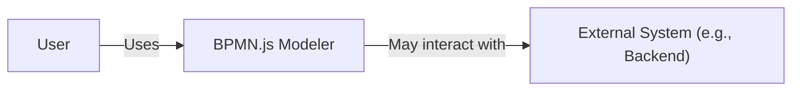
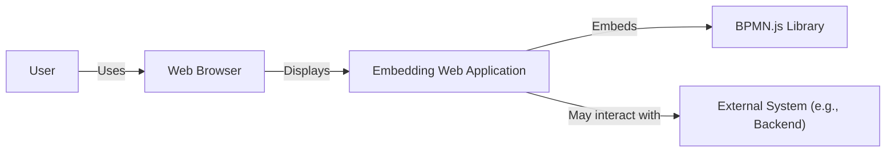
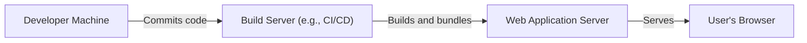
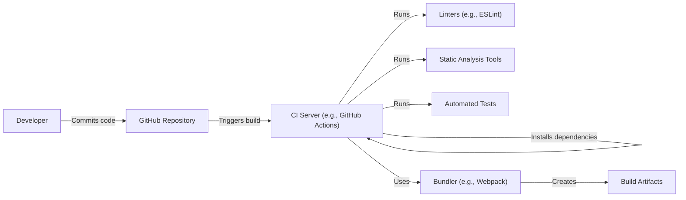

# BUSINESS POSTURE

Business Priorities and Goals:

*   Provide a web-based BPMN modeler for viewing, creating, and editing BPMN 2.0 diagrams.
*   Offer a lightweight and embeddable solution for integrating BPMN modeling capabilities into other web applications.
*   Maintain an active open-source project with a strong community and regular updates.
*   Ensure the modeler is easy to use and customize, catering to both developers and business users.
*   Support the latest BPMN 2.0 standard and its various features.

Most Important Business Risks:

*   Loss of user trust due to security vulnerabilities in the modeler, potentially leading to data breaches or manipulation of business processes.
*   Reputational damage caused by security incidents or lack of proper security controls.
*   Inability to meet compliance requirements related to data protection and privacy, especially if the modeler is used in regulated industries.
*   Disruption of service or functionality due to vulnerabilities that could be exploited by attackers.
*   Compromise of intellectual property if the modeler's source code or user-created diagrams are accessed or modified without authorization.

# SECURITY POSTURE

Existing Security Controls:

*   security control: The project is open-source, allowing for community review and contributions to security. (GitHub repository)
*   security control: Regular updates and releases address bug fixes and potential security vulnerabilities. (GitHub releases)
*   security control: The library is primarily client-side JavaScript, reducing the attack surface on the server-side. (Project architecture)
*   security control: Uses well-established libraries and frameworks, reducing the risk of introducing custom, potentially vulnerable code. (package.json)
*   security control: The project has a `SECURITY.md` file, providing guidance on reporting security vulnerabilities. (SECURITY.md)

Accepted Risks:

*   accepted risk: The library's primary function is client-side rendering and manipulation of BPMN diagrams. Server-side interactions and data storage are outside the scope of the core library, shifting responsibility to the integrating application.
*   accepted risk: The library does not handle user authentication or authorization; these are the responsibility of the embedding application.
*   accepted risk: The library does not provide built-in encryption for diagram data; it relies on the embedding application to implement appropriate data protection measures.

Recommended Security Controls:

*   security control: Implement Content Security Policy (CSP) to mitigate XSS vulnerabilities.
*   security control: Implement Subresource Integrity (SRI) to ensure that fetched resources haven't been tampered with.
*   security control: Conduct regular security audits and penetration testing, focusing on common web vulnerabilities.
*   security control: Provide clear documentation and guidelines on secure usage and integration of the library.
*   security control: Establish a clear process for handling and disclosing security vulnerabilities.
*   security control: Consider adding linting and static analysis tools to the development workflow to catch potential security issues early.

Security Requirements:

*   Authentication:
    *   The library itself does not handle authentication. The embedding application is responsible for authenticating users.

*   Authorization:
    *   The library itself does not handle authorization. The embedding application is responsible for controlling access to diagrams and features.

*   Input Validation:
    *   The library should validate BPMN XML input to prevent injection attacks and ensure data integrity.
    *   The library should sanitize user input in properties and labels to prevent Cross-Site Scripting (XSS) vulnerabilities.

*   Cryptography:
    *   The library does not directly handle cryptographic operations. The embedding application is responsible for any encryption needs, such as securing communication channels (HTTPS) or encrypting data at rest.

# DESIGN

## C4 CONTEXT

Element Description:

*   Element:
    *   Name: User
    *   Type: Person
    *   Description: A person interacting with the BPMN.js modeler through a web browser.
    *   Responsibilities: Viewing, creating, editing, and saving BPMN diagrams.
    *   Security controls: Relies on the embedding application for authentication and authorization.

*   Element:
    *   Name: BPMN.js Modeler
    *   Type: Software System
    *   Description: The BPMN.js library embedded in a web application, providing BPMN modeling capabilities.
    *   Responsibilities: Rendering BPMN diagrams, handling user interactions, validating BPMN XML, providing an API for programmatic access.
    *   Security controls: Input validation, sanitization of user input, potential CSP and SRI implementation.

*   Element:
    *   Name: External System (e.g., Backend)
    *   Type: Software System
    *   Description: An external system that the BPMN.js modeler might interact with, such as a backend server for storing and retrieving diagrams.
    *   Responsibilities: Storing and retrieving BPMN diagrams, potentially handling user authentication and authorization, providing other backend services.
    *   Security controls: Authentication, authorization, data encryption, access controls, secure communication protocols (HTTPS).

## C4 CONTAINER

Element Description:

*   Element:
    *   Name: User
    *   Type: Person
    *   Description: A person interacting with the BPMN.js modeler.
    *   Responsibilities: Viewing, creating, editing, and saving BPMN diagrams.
    *   Security controls: Relies on the embedding application for authentication and authorization.

*   Element:
    *   Name: Web Browser
    *   Type: Software System
    *   Description: The user's web browser, used to access the embedding web application.
    *   Responsibilities: Rendering HTML, executing JavaScript, handling network communication.
    *   Security controls: Browser security features, such as sandboxing and same-origin policy.

*   Element:
    *   Name: Embedding Web Application
    *   Type: Software System
    *   Description: The web application that embeds the BPMN.js library.
    *   Responsibilities: Providing the user interface, handling user authentication and authorization, integrating the BPMN.js library, potentially communicating with a backend system.
    *   Security controls: Authentication, authorization, input validation, output encoding, secure communication protocols (HTTPS).

*   Element:
    *   Name: BPMN.js Library
    *   Type: Software System
    *   Description: The BPMN.js library, providing BPMN modeling capabilities.
    *   Responsibilities: Rendering BPMN diagrams, handling user interactions, validating BPMN XML, providing an API for programmatic access.
    *   Security controls: Input validation, sanitization of user input, potential CSP and SRI implementation.

*   Element:
    *   Name: External System (e.g., Backend)
    *   Type: Software System
    *   Description: An external system that the embedding web application might interact with.
    *   Responsibilities: Storing and retrieving BPMN diagrams, potentially handling user authentication and authorization, providing other backend services.
    *   Security controls: Authentication, authorization, data encryption, access controls, secure communication protocols (HTTPS).

## DEPLOYMENT

Possible Deployment Solutions:

1.  **Embedded in a Web Application (CDN):** The BPMN.js library is included directly in a web application using a CDN (Content Delivery Network) link. This is the simplest deployment method.
2.  **Embedded in a Web Application (npm):** The BPMN.js library is installed as an npm package and bundled with the web application's code. This allows for better control over the library version and build process.
3.  **Self-Hosted:** The BPMN.js library files are hosted on the same server as the embedding web application.

Chosen Deployment Solution (npm):

Element Description:

*   Element:
    *   Name: Developer Machine
    *   Type: Infrastructure
    *   Description: The developer's local machine used for writing and testing code.
    *   Responsibilities: Code development, local testing, committing code to a version control system.
    *   Security controls: Local security measures, such as antivirus and firewall.

*   Element:
    *   Name: Build Server (e.g., CI/CD)
    *   Type: Infrastructure
    *   Description: A server that automates the build, testing, and deployment process.
    *   Responsibilities: Building the web application, running tests, bundling the BPMN.js library, deploying the application to the web server.
    *   Security controls: Access controls, secure build environment, vulnerability scanning.

*   Element:
    *   Name: Web Application Server
    *   Type: Infrastructure
    *   Description: The server that hosts the web application and the BPMN.js library.
    *   Responsibilities: Serving the web application to users, handling HTTP requests.
    *   Security controls: Firewall, intrusion detection system, regular security updates.

*   Element:
    *   Name: User's Browser
    *   Type: Software System
    *   Description: The user's web browser, used to access the web application.
    *   Responsibilities: Rendering HTML, executing JavaScript, handling network communication.
    *   Security controls: Browser security features, such as sandboxing and same-origin policy.

## BUILD

The build process for BPMN.js, when used as an npm package, typically involves the following steps:

1.  **Development:** Developers write code on their local machines, making changes to the BPMN.js library or the embedding application.
2.  **Commit:** Developers commit their changes to a version control system (e.g., Git) and push them to a remote repository (e.g., GitHub).
3.  **Continuous Integration (CI):** A CI server (e.g., GitHub Actions, Travis CI, Jenkins) automatically triggers a build process whenever changes are pushed to the repository.
4.  **Dependency Installation:** The CI server installs the project's dependencies, including BPMN.js and other required libraries, using a package manager (e.g., npm or yarn).
5.  **Linting and Static Analysis:** The CI server runs linters (e.g., ESLint) and static analysis tools to check for code quality and potential security vulnerabilities.
6.  **Testing:** The CI server runs automated tests (e.g., unit tests, integration tests) to ensure that the code works as expected.
7.  **Bundling:** The CI server uses a bundler (e.g., Webpack, Rollup) to combine the BPMN.js library and the embedding application's code into a single, optimized file.
8.  **Artifact Creation:** The CI server creates build artifacts, such as JavaScript bundles and CSS files.
9.  **Deployment:** The CI server deploys the build artifacts to a web server or a content delivery network (CDN).

Security Controls in the Build Process:

*   security control: Use of a CI/CD system (e.g., GitHub Actions) to automate the build process and ensure consistency.
*   security control: Dependency management using npm, which allows for tracking and auditing of dependencies.
*   security control: Linting and static analysis tools to identify potential code quality and security issues.
*   security control: Automated testing to ensure that the code works as expected and to catch regressions.
*   security control: Code reviews to ensure that changes are reviewed by other developers before being merged.

# RISK ASSESSMENT

Critical Business Processes:

*   Modeling business processes using BPMN diagrams.
*   Integrating BPMN modeling capabilities into other applications.
*   Collaborating on BPMN diagrams.

Data to Protect and Sensitivity:

*   BPMN diagram data (XML): This data can contain sensitive information about business processes, including workflows, decision logic, and data flows. Sensitivity: Medium to High, depending on the specific business processes being modeled.
*   User input (e.g., labels, descriptions): User-provided text within the diagrams could potentially contain sensitive information. Sensitivity: Low to Medium, depending on the context.
*   No user credentials or PII are stored or handled by the library itself.

# QUESTIONS & ASSUMPTIONS

Questions:

*   What specific backend systems will the BPMN.js modeler interact with?
*   What are the security requirements of the embedding application?
*   What level of user input is expected within the BPMN diagrams?
*   Are there any specific compliance requirements (e.g., GDPR, HIPAA) that need to be considered?

Assumptions:

*   BUSINESS POSTURE: The primary goal is to provide a functional and user-friendly BPMN modeler, with security being a significant consideration but not the absolute top priority.
*   SECURITY POSTURE: The embedding application will handle authentication, authorization, and data storage securely. The BPMN.js library itself will focus on client-side security and input validation.
*   DESIGN: The BPMN.js modeler will be primarily used in a web browser environment, embedded within other web applications. The interaction with external systems will be limited and well-defined.