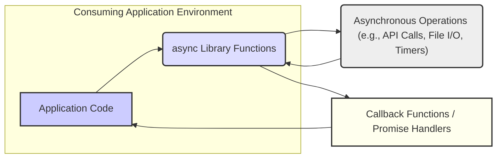
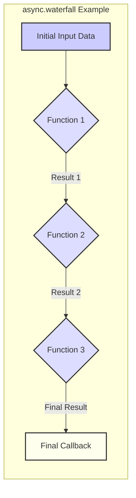
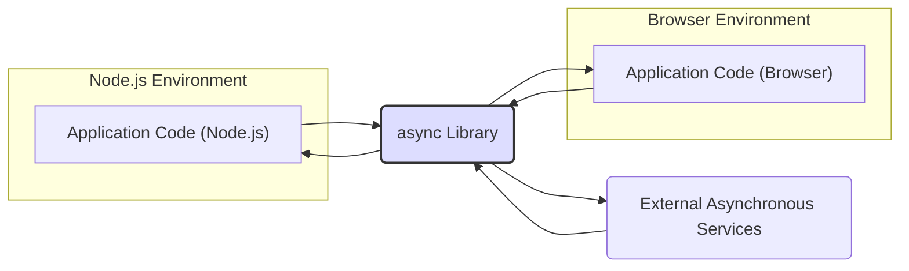
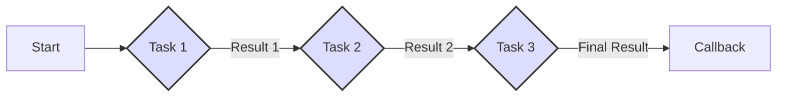

# Project Design Document: Async JavaScript Utility Library

**Version:** 1.1
**Date:** October 26, 2023
**Author:** AI Software Architect

## 1. Introduction

This document provides an enhanced and detailed design overview of the `async` JavaScript utility library (https://github.com/caolan/async). This document is specifically intended to be used as a foundation for subsequent threat modeling activities. It meticulously outlines the library's purpose, architecture, key components, data flow, and potential security considerations, providing a comprehensive understanding of its inner workings.

## 2. Project Overview

The `async` library stands as a robust and widely adopted utility module for both Node.js and browser-based JavaScript environments. Its primary function is to offer intuitive and powerful tools for managing asynchronous operations. It provides a rich collection of functions designed to streamline common asynchronous patterns, including parallel and sequential execution, sophisticated control flow management, and efficient manipulation of asynchronous collections. By abstracting away the complexities of asynchronous JavaScript, the library significantly enhances code readability, maintainability, and overall development efficiency.

## 3. Goals and Objectives

* **Abstraction of Asynchronous Complexity:** To provide high-level abstractions that simplify the management of intricate asynchronous workflows, freeing developers from low-level implementation details.
* **Improved Code Clarity and Expressiveness:** To offer a set of clear, well-defined, and semantically meaningful functions that make asynchronous code easier to understand and reason about.
* **Enhanced Code Maintainability and Reduced Errors:** To structure asynchronous code in a more organized, predictable, and less error-prone manner, leading to more maintainable applications.
* **Seamless Cross-Environment Compatibility:** To ensure consistent and reliable operation across both server-side (Node.js) and client-side (browser) JavaScript environments without requiring platform-specific adaptations.
* **Comprehensive Asynchronous Utility Set:** To provide a broad and versatile set of utilities covering a wide spectrum of asynchronous control flow requirements, addressing diverse development needs.

## 4. Target Audience

* JavaScript developers at all skill levels who need to work with asynchronous operations effectively.
* Node.js developers building scalable and performant server-side applications that rely heavily on asynchronous tasks.
* Front-end developers interacting with asynchronous APIs and managing complex UI interactions in web browsers.
* Development teams seeking to adopt best practices for structuring and simplifying asynchronous logic in their JavaScript projects.
* Security engineers and architects performing threat modeling and security assessments of applications utilizing the `async` library.

## 5. System Architecture

The `async` library is fundamentally a collection of JavaScript utility functions designed to be embedded within and utilized by other JavaScript applications. It does not operate as an independent service or application. Its architectural essence lies in providing a structured way to manage the execution and data flow of asynchronous JavaScript functions, primarily those utilizing callbacks or Promises.

* **Consuming Application Environment:** This represents the broader context in which the `async` library is used. It includes the application code and the JavaScript runtime environment (Node.js or browser).
* **Application Code:** The specific JavaScript code within the consuming application that directly invokes functions from the `async` library.
* **async Library Functions:** The core set of exported functions provided by the `async` library, such as `series`, `parallel`, `waterfall`, `map`, etc. These functions act as orchestrators for asynchronous tasks.
* **Asynchronous Operations:** These are the actual asynchronous tasks being managed by the `async` library. They can include a wide range of operations like making API calls, reading or writing files, setting timers, or performing any other non-blocking operation.
* **Callback Functions / Promise Handlers:** These are functions provided by the consuming application that are designed to be executed upon the completion (or failure) of the asynchronous operations managed by `async`. They handle the results or errors generated by these operations.

## 6. Key Components

The `async` library's functionality is logically grouped into categories based on the asynchronous patterns they address:

* **Control Flow Functions:** These functions dictate the order and conditions under which asynchronous tasks are executed.
    * `async.series(tasks, [callback])`: Executes an array of asynchronous functions sequentially, with each function starting only after the previous one has completed.
    * `async.parallel(tasks, [callback])`: Executes an array of asynchronous functions concurrently.
    * `async.waterfall(tasks, [callback])`: Executes an array of asynchronous functions sequentially, passing the result(s) of each function as arguments to the next.
    * `async.whilst(condition, fn, callback)`: Repeatedly executes an asynchronous function (`fn`) as long as a test condition (`condition`) is true.
    * `async.until(condition, fn, callback)`: Repeatedly executes an asynchronous function (`fn`) until a test condition (`condition`) becomes true.
    * `async.doWhilst(fn, condition, callback)`: Similar to `whilst`, but executes the function at least once before checking the condition.
    * `async.doUntil(fn, condition, callback)`: Similar to `until`, but executes the function at least once before checking the condition.
    * `async.forever(fn, [callback])`: Executes an asynchronous function repeatedly, indefinitely.
* **Collection Processing Functions:** These functions provide ways to iterate over and manipulate collections of data using asynchronous operations.
    * `async.each(coll, iteratee, [callback])`: Applies an asynchronous function (`iteratee`) to each item in a collection (`coll`) in parallel.
    * `async.eachSeries(coll, iteratee, [callback])`: Applies an asynchronous function (`iteratee`) to each item in a collection (`coll`) sequentially.
    * `async.eachLimit(coll, limit, iteratee, [callback])`: Applies an asynchronous function (`iteratee`) to each item in a collection (`coll`), limiting the number of concurrent operations.
    * `async.map(coll, iteratee, [callback])`: Applies an asynchronous function (`iteratee`) to each item in a collection (`coll`) and returns an array of the results.
    * `async.mapSeries(coll, iteratee, [callback])`: Applies an asynchronous function (`iteratee`) to each item in a collection (`coll`) sequentially and returns an array of the results.
    * `async.mapLimit(coll, limit, iteratee, [callback])`: Applies an asynchronous function (`iteratee`) to each item in a collection (`coll`), limiting the number of concurrent operations, and returns an array of the results.
    * `async.filter(coll, predicate, [callback])`: Filters a collection (`coll`) based on the results of an asynchronous test function (`predicate`).
    * `async.filterSeries(coll, predicate, [callback])`: Filters a collection (`coll`) sequentially based on the results of an asynchronous test function (`predicate`).
    * `async.reduce(coll, memo, iteratee, [callback])`: Reduces a collection (`coll`) to a single value by iteratively applying an asynchronous function (`iteratee`).
    * `async.reduceRight(coll, memo, iteratee, [callback])`: Similar to `reduce`, but processes the collection from right to left.
    * `async.sortBy(coll, iteratee, [callback])`: Sorts a collection (`coll`) based on the results of an asynchronous function (`iteratee`) applied to each item.
* **Utility Functions:** These provide supplementary functionalities for working with asynchronous operations.
    * `async.apply(fn, args...)`: Creates a partially applied version of an asynchronous function.
    * `async.nextTick(callback)`: Defers the execution of a function until the next tick of the event loop.
    * `async.memoize(fn, [hasher])`: Memoizes the result of an asynchronous function to avoid redundant computations.
    * `async.retry([times], task, [callback])`: Retries an asynchronous task until it succeeds or the maximum number of retries is reached.
    * `async.timeout(fn, milliseconds, [errorCallback])`: Adds a timeout to an asynchronous function.
    * `async.constant(values...)`: Returns a function that always returns the provided constant value(s).
    * `async.asyncify(fn)`: Converts a synchronous function to an asynchronous function that accepts a Node-style callback.
* **Promise Integration:** While primarily callback-based, `async` functions often return Promises or can seamlessly work with asynchronous functions that return Promises, enhancing interoperability with modern JavaScript asynchronous patterns.

## 7. Data Flow

The core data flow within the `async` library revolves around the manipulation and passing of data between asynchronous functions, guided by the specific control flow mechanism employed.

* **Initial Input Data:**  The data initially provided to the `async` function or passed as arguments to the first asynchronous task in a sequence.
* **Function N:** Represents an individual asynchronous function provided by the consuming application. These functions perform the actual asynchronous operations.
* **Result N:** The output or result produced by the execution of an asynchronous function. In control flow functions like `waterfall`, these results are passed as input to the subsequent function.
* **Final Result:** The ultimate output of the `async` operation, which can be a single value, an array of values, or an error.
* **Final Callback:** The callback function provided by the consuming application, which receives the final result (or an error) of the `async` operation.

## 8. External Dependencies

The `async` library is designed to be lightweight and has very few external dependencies, primarily relying on the fundamental features of the JavaScript environment.

* **JavaScript Engine:** The underlying JavaScript runtime environment, which can be either Node.js or a web browser's JavaScript engine.

## 9. Deployment Model

The `async` library is typically integrated into JavaScript projects as a dependency.

* **Node.js Environments:** Installed as a package using npm (or yarn, pnpm) and listed as a dependency in the project's `package.json` file. It is then imported into modules using `require()`.
* **Browser Environments:** Included directly in HTML files using `<script>` tags, often from a CDN (Content Delivery Network), or bundled into the application's JavaScript using module bundlers like Webpack, Rollup, or Parcel.

## 10. Security Considerations (For Threat Modeling)

This section expands on potential security considerations relevant to threat modeling the `async` library.

* **Improper Callback Handling:** While `async` aims to simplify asynchronous code, mishandling callbacks provided to `async` functions can still introduce vulnerabilities. For instance, not properly handling errors in callbacks can lead to unhandled exceptions and unexpected application behavior.
* **Error Propagation and Handling:** The way errors are propagated and handled within asynchronous flows managed by `async` is critical. Insufficient error handling can mask underlying issues, leading to unexpected states or denial of service. Ensure error callbacks are always defined and handle potential errors gracefully.
* **Security of Wrapped Functions:** `async` primarily orchestrates functions provided by the user. The security of these wrapped functions is paramount. `async` does not inherently sanitize inputs or outputs of these functions. Vulnerabilities within these user-provided functions (e.g., injection flaws, insecure API calls) can be indirectly exposed.
* **Resource Management in Parallel Operations:** When using functions like `async.parallel` or `async.eachLimit`, be mindful of potential resource exhaustion. Executing too many asynchronous operations concurrently (e.g., making a large number of uncontrolled API calls) can overwhelm the system or external services, leading to denial of service. Implement appropriate rate limiting or throttling mechanisms where necessary.
* **Timing Side-Channel Attacks:** While less likely in a utility library, in specific scenarios where the timing of asynchronous operations is observable and dependent on sensitive data, there's a theoretical risk of timing side-channel attacks. This would require careful analysis of the specific asynchronous tasks being orchestrated.
* **Denial of Service through Malicious Tasks:** If an attacker can influence the tasks passed to `async` functions (e.g., through user input or compromised configuration), they could inject malicious tasks that consume excessive resources or cause the application to crash.
* **Dependency Chain Vulnerabilities:** Although `async` has minimal direct dependencies, vulnerabilities in the underlying JavaScript engine or in other libraries used by the consuming application could potentially impact the security of code using `async`. Keep all dependencies updated and perform regular security audits.
* **Prototype Pollution via User-Provided Functions:** If user-provided functions passed to `async` manipulate object prototypes, it could lead to prototype pollution vulnerabilities, potentially affecting the behavior of other parts of the application.
* **Unhandled Promise Rejections:** When using `async` with Promise-returning functions, ensure that Promise rejections are properly handled. Unhandled rejections can lead to unexpected program termination or undefined behavior.
* **Reentrancy Issues:** In complex asynchronous flows, particularly those involving shared state, be aware of potential reentrancy issues where asynchronous operations might unexpectedly interact with shared resources in an unsafe manner.

## 11. Diagrams

### 11.1 High-Level Architecture with Environments

### 11.2 Detailed Data Flow Example (async.series with Multiple Tasks)

## 12. Conclusion

This enhanced design document provides a more in-depth understanding of the `async` JavaScript utility library, specifically tailored for threat modeling purposes. It details the library's architecture, key components, and data flow with greater clarity and precision. The expanded security considerations section highlights potential areas of concern that should be thoroughly investigated during a threat modeling exercise. By leveraging this document, security professionals can more effectively assess and mitigate potential risks associated with the use of the `async` library in their applications.
