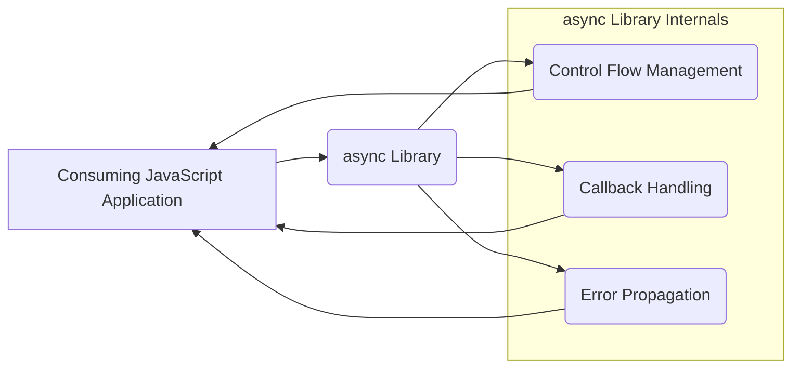
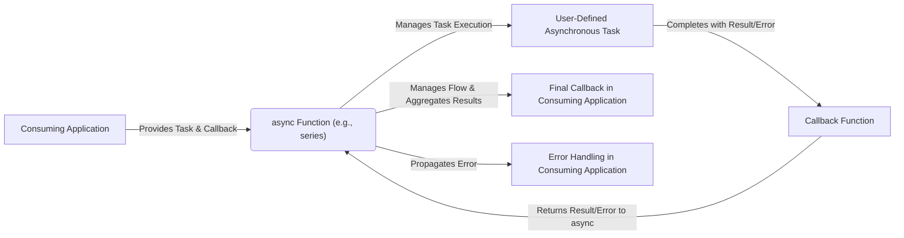
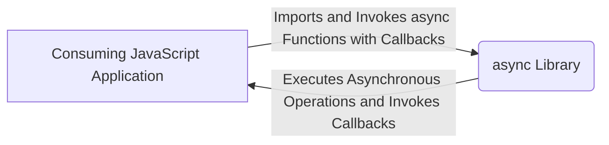

# Project Design Document: Async JavaScript Library

**Version:** 1.1
**Date:** October 26, 2023
**Author:** AI Software Architect

## 1. Introduction

This document provides an enhanced design overview of the `async` JavaScript library (available at [https://github.com/caolan/async](https://github.com/caolan/async)). This revised document aims to provide a more detailed and nuanced understanding of the library's architecture, components, and data flow, specifically tailored for subsequent threat modeling activities. A thorough understanding of the design is paramount for identifying potential security vulnerabilities and implementing appropriate mitigation strategies.

## 2. Goals and Objectives

The core goal of the `async` library is to abstract and simplify common asynchronous patterns in JavaScript, leading to more maintainable and readable code. Its key objectives include:

*   **Abstraction of Asynchronous Complexity:** To provide higher-level functions that encapsulate complex asynchronous control flow logic.
*   **Improved Code Readability:** To enable developers to express asynchronous operations in a more declarative and understandable manner.
*   **Consistent Error Handling:** To offer standardized mechanisms for managing errors that occur during asynchronous operations.
*   **Variety of Control Flow Mechanisms:** To support diverse asynchronous patterns, including sequential execution, parallel execution, and dependent task execution.
*   **Enhanced Developer Productivity:** To reduce the boilerplate code required for managing asynchronous operations, thereby increasing developer efficiency.

## 3. System Architecture

The `async` library is designed as a lightweight, client-side JavaScript utility library. It is intended to be integrated directly into other JavaScript applications, running within their execution context (e.g., a web browser or a Node.js environment). It does not operate as a standalone service or application with its own distinct process or network interface.

### 3.1. High-Level Architecture

At a high level, the `async` library acts as an intermediary between the consuming JavaScript application and the underlying asynchronous operations. The application invokes functions provided by `async` to manage the execution of its asynchronous tasks.



### 3.2. Component-Level Architecture

The `async` library's functionality can be categorized into the following key component groups:

*   **Control Flow Functions:** These components are responsible for orchestrating the execution order of asynchronous tasks.
    *   `series()`: Executes an array of asynchronous tasks sequentially, with each task starting after the previous one has completed.
    *   `parallel()`: Executes an array of asynchronous tasks concurrently. An optional callback is executed when all tasks have completed or when an error occurs.
    *   `waterfall()`: Executes an array of asynchronous tasks sequentially, passing the result(s) of each task to the next.
    *   `queue()`: Creates a queue with a specified concurrency, allowing tasks to be added and processed asynchronously while respecting the concurrency limit.
    *   `auto()`: Executes tasks based on their dependencies. Tasks are executed as soon as their dependencies have completed.
    *   `retry()`: Attempts to execute an asynchronous function multiple times until it succeeds or a maximum number of retries is reached.
*   **Collection Functions:** These components provide utilities for iterating over and manipulating collections (arrays or objects) using asynchronous operations.
    *   `each()` (aliases: `forEach`): Iterates over a collection, executing an asynchronous function for each item.
    *   `map()`: Transforms a collection by applying an asynchronous function to each item and collecting the results.
    *   `filter()` (aliases: `select`): Filters a collection based on the results of an asynchronous test function.
    *   `reduce()` (aliases: `inject`, `foldl`): Reduces a collection to a single value by iteratively applying an asynchronous function.
    *   `sort()`: Sorts a collection using an asynchronous comparison function.
*   **Utility Functions:** These components offer general-purpose asynchronous utilities.
    *   `applyEach()`: Applies an array of asynchronous functions to a single argument.
    *   `constant()`: Creates a function that always returns a specific value.
    *   `nextTick()`: Defers the execution of a function until the next event loop tick.
    *   `memoize()`: Memoizes the result of an asynchronous function, caching the result for subsequent calls with the same arguments.
    *   `timeout()`: Adds a timeout to an asynchronous function, invoking a callback with an error if the function does not complete within the specified time.

```mermaid
graph LR
    subgraph "async Library"
        direction TB
        "Control Flow Functions" --- "Callback Handling Mechanism"
        "Collection Functions" --- "Callback Handling Mechanism"
        "Utility Functions" --- "Callback Handling Mechanism"
        "Error Handling & Propagation" --o "Callback Handling Mechanism"
    end
```

### 3.3. Detailed Data Flow

The data flow within the `async` library revolves around the execution of user-provided asynchronous tasks and the management of their results and errors through callbacks.

*   **Task Submission:** The consuming application provides asynchronous functions (tasks) to `async`'s control flow or collection functions. These tasks typically accept a `callback` function as their final argument.
*   **Callback Invocation:**  `async`'s internal mechanisms manage the invocation of these callbacks upon the completion (success or failure) of the asynchronous operations within the tasks.
*   **Result Passing:** Successful results from tasks are passed as arguments to the corresponding callbacks. In functions like `waterfall`, results are passed from one task to the next.
*   **Error Propagation:** Errors encountered during task execution are typically passed as the first argument to the callback function. `async` provides mechanisms to propagate these errors to final callbacks or error handlers.
*   **Intermediate State Management:** Some `async` functions, like `queue`, maintain internal state to manage the execution of tasks (e.g., the number of currently running tasks).



## 4. Data Flow Diagram (Context Diagram)

This diagram illustrates the interaction of the `async` library within the context of a consuming JavaScript application.



## 5. Security Considerations (Detailed)

While `async` is a utility library and does not inherently introduce many security vulnerabilities on its own, its usage within an application can have security implications.

*   **Dependency Chain Vulnerabilities:** Although `async` currently has no direct dependencies, future versions or forks might introduce them. Vulnerabilities in these dependencies could indirectly impact applications using `async`. Regular dependency checks are crucial.
*   **Callback Hell and Error Handling Mismanagement:** While `async` aims to mitigate "callback hell," improper use or complex nesting of `async` functions can still lead to difficulties in managing errors effectively. Unhandled errors can expose sensitive information or lead to unexpected application states.
*   **Uncontrolled Concurrency:** Using functions like `parallel` without proper safeguards can lead to excessive resource consumption, potentially causing denial-of-service conditions, especially if the tasks involve network requests or heavy computation. Rate limiting or concurrency control mechanisms within the consuming application are essential.
*   **Exposure of Sensitive Data in Callbacks:** If callbacks passed to `async` functions inadvertently log or expose sensitive data (e.g., API keys, user credentials) in error messages or successful responses, it can create security vulnerabilities. Careful review of callback implementations is necessary.
*   **Timing Side-Channel Attacks (Theoretical):** In highly specific and sensitive scenarios, the execution time differences between different `async` control flow functions might theoretically be exploited for timing attacks. However, this is generally a low-risk concern for typical use cases.
*   **Prototype Pollution via User-Provided Functions:** If user-provided functions passed as tasks to `async` manipulate object prototypes, it could lead to prototype pollution vulnerabilities within the consuming application's environment. Input validation and sanitization within the consuming application are crucial.
*   **Reentrancy Issues:**  Care must be taken when using `async` functions within reentrant code. If a task modifies shared state, and the `async` function allows for concurrent execution or immediate re-entry, race conditions and unexpected behavior can occur, potentially leading to security flaws.
*   **Third-Party Task Vulnerabilities:** The security of the overall system heavily relies on the security of the asynchronous tasks provided to `async`. If these tasks contain vulnerabilities (e.g., insecure API calls, SQL injection), `async` will simply orchestrate their execution.

## 6. Technologies Used

*   **Core Language:** JavaScript (ECMAScript)

## 7. Deployment Considerations

The `async` library is typically deployed as a dependency within a JavaScript project. Common deployment strategies include:

*   **npm (Node Package Manager):** Installation via `npm install async`.
*   **yarn:** Installation via `yarn add async`.
*   **Bundlers (e.g., Webpack, Rollup):** Integrated into application bundles for browser-based applications.
*   **CDN (Content Delivery Network):**  Referenced directly in HTML for simpler browser-based projects.

## 8. Future Considerations

Potential future enhancements or considerations for the `async` library include:

*   **Official TypeScript Definitions:** Providing built-in TypeScript definitions for improved type safety and developer experience.
*   **Enhanced Async/Await Interoperability:**  Further integration with native `async/await` syntax to provide more seamless transitions and potentially simplify certain asynchronous patterns.
*   **Performance Benchmarking and Optimization:** Continuous efforts to identify and address performance bottlenecks within the library.
*   **Extensibility and Middleware Support:** Exploring mechanisms to allow developers to extend or customize the behavior of `async` functions (e.g., through middleware).
*   **Improved Error Handling Patterns:**  Potentially introducing more sophisticated error handling mechanisms or patterns.

This revised document provides a more in-depth design overview of the `async` JavaScript library, specifically focusing on aspects relevant to threat modeling. This enhanced understanding will enable security professionals to conduct more thorough analyses and recommend appropriate security controls.