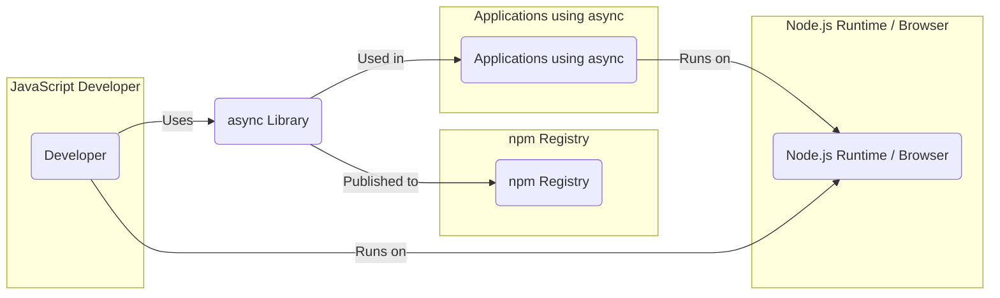
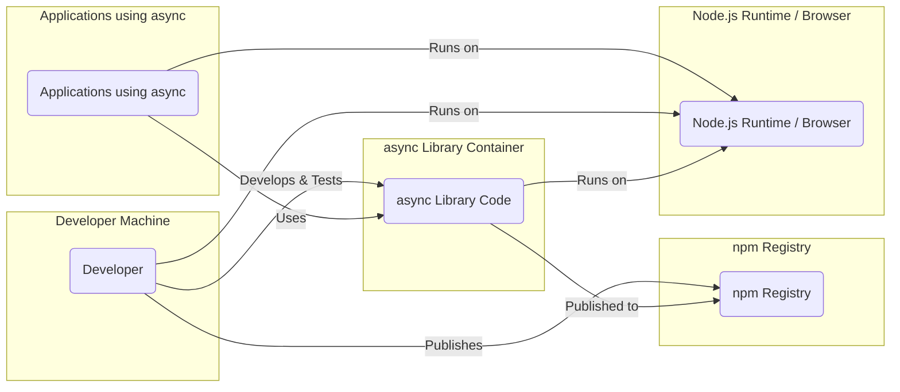
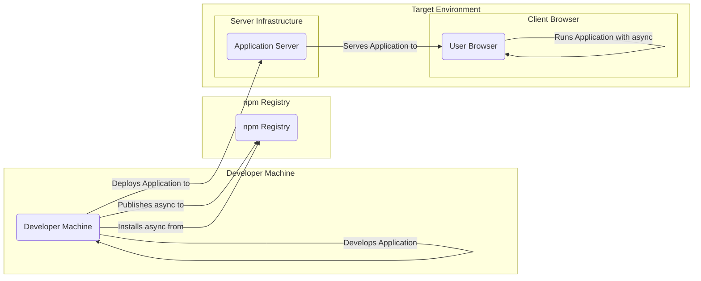
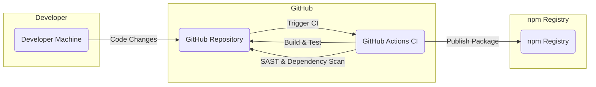

# BUSINESS POSTURE

The primary business goal of the async project is to provide a robust, efficient, and easy-to-use asynchronous control flow utility library for JavaScript developers. This library aims to simplify the development of applications that rely heavily on asynchronous operations, improving developer productivity and code maintainability. The project's success is measured by its adoption rate within the JavaScript developer community, positive feedback, and contributions from users.

Key business priorities include:

*   Stability: Ensuring the library is reliable and free of bugs that could disrupt applications using it.
*   Performance: Maintaining efficient execution and minimal overhead to avoid performance bottlenecks in applications.
*   Usability: Providing a clear and intuitive API that is easy for developers to understand and use.
*   Community Support: Fostering an active community to contribute to the library's development, provide feedback, and offer support to other users.

The most important business risks associated with the async project are:

*   Security Vulnerabilities: Undiscovered security flaws in the library could be exploited by malicious actors, potentially impacting applications that depend on it. This is a critical risk as vulnerabilities in widely used libraries can have broad consequences.
*   Performance Degradation: Introduction of performance regressions in new versions could negatively impact applications relying on the library, leading to user dissatisfaction and potential migration to alternative solutions.
*   Breaking Changes: API changes that are not backward compatible can cause significant disruption for existing users, requiring them to rewrite code and potentially delaying project timelines.
*   Lack of Maintenance: If the project becomes unmaintained, bugs and security vulnerabilities may not be addressed, and the library could become outdated and less reliable over time.

# SECURITY POSTURE

Existing security controls for the async project are primarily those inherent in the GitHub and npm ecosystems, and standard open-source development practices.

*   security control: Code hosted on GitHub, leveraging GitHub's infrastructure security. (Implemented by: GitHub)
*   security control: Publicly accessible repository, allowing for community review and scrutiny of the code. (Implemented by: GitHub)
*   security control: Use of npm for package distribution, relying on npm's security measures for package integrity. (Implemented by: npm)
*   security control: Standard open-source licensing (MIT), promoting transparency and community contribution. (Implemented by: LICENSE file in repository)
*   accepted risk: Reliance on community contributions, which may introduce vulnerabilities if not properly vetted.
*   accepted risk: Dependency on npm registry, which could be subject to supply chain attacks.
*   accepted risk: Vulnerabilities in underlying JavaScript runtime environments (Node.js, browsers).

Recommended security controls to enhance the security posture of the async project:

*   security control: Implement automated Static Application Security Testing (SAST) in the CI/CD pipeline to detect potential code vulnerabilities.
*   security control: Implement automated Dependency Scanning to identify known vulnerabilities in project dependencies.
*   security control: Establish a process for reporting and handling security vulnerabilities, including a security policy and contact information.
*   security control: Regularly update dependencies to incorporate security patches.
*   security control: Consider code signing releases to enhance package integrity and verify origin.

Security requirements for the async project:

*   Authentication: Not directly applicable to the library itself, as it does not handle user authentication. Applications using async will need to implement their own authentication mechanisms.
*   Authorization: Not directly applicable to the library itself. Authorization is the responsibility of applications using async.
*   Input Validation: While async is a utility library and doesn't directly handle user input, the functions within the library should be designed to handle unexpected or invalid inputs gracefully to prevent unexpected behavior or crashes in applications using it. Input validation should be considered for any parameters passed to async functions, especially if those parameters originate from external sources in the consuming application.
*   Cryptography: Not directly applicable to the core functionality of the async library. If cryptographic operations are needed within applications using async, they should be implemented by the application itself, potentially using dedicated cryptography libraries. Async could be used to manage the asynchronous flow of cryptographic operations if needed.

# DESIGN

The async project is a JavaScript library designed to simplify asynchronous programming. Its design is focused on providing a set of utility functions that developers can use within their JavaScript applications to manage and control asynchronous operations.

## C4 CONTEXT

Elements of the context diagram:

*   Element:
    *   Name: Developer
    *   Type: Person
    *   Description: JavaScript developers who use the async library in their projects.
    *   Responsibilities:  Utilize the async library to simplify asynchronous logic in their applications. Report issues and contribute to the library.
    *   Security controls:  Responsible for securely integrating the library into their applications and following secure coding practices.

*   Element:
    *   Name: async Library
    *   Type: Software System
    *   Description:  A JavaScript utility library providing functions for asynchronous control flow.
    *   Responsibilities: Provide reliable and efficient asynchronous utility functions. Maintain code quality and security. Publish releases to npm.
    *   Security controls:  SAST and dependency scanning in CI/CD. Vulnerability reporting process. Regular dependency updates.

*   Element:
    *   Name: npm Registry
    *   Type: Software System
    *   Description:  The public npm package registry where the async library is published and distributed.
    *   Responsibilities: Host and distribute the async package. Provide security measures for package integrity.
    *   Security controls: Package signing, malware scanning, vulnerability database.

*   Element:
    *   Name: Applications using async
    *   Type: Software System
    *   Description:  JavaScript applications developed by developers that incorporate the async library to manage asynchronous operations.
    *   Responsibilities:  Utilize async library functions to implement application logic. Handle application-specific security concerns.
    *   Security controls: Application-level authentication, authorization, input validation, and other security measures.

*   Element:
    *   Name: Node.js Runtime / Browser
    *   Type: Technology
    *   Description:  The JavaScript runtime environments where applications using async and developers' tools execute.
    *   Responsibilities: Provide the execution environment for JavaScript code. Implement security features for the runtime environment.
    *   Security controls: Runtime environment security patches, browser security features, operating system security controls.

## C4 CONTAINER

Elements of the container diagram:

*   Element:
    *   Name: Developer
    *   Type: Person
    *   Description: JavaScript developers who develop, test, and publish the async library.
    *   Responsibilities: Write, test, and maintain the async library code. Publish new versions to npm.
    *   Security controls: Secure development practices, code review, local development environment security.

*   Element:
    *   Name: async Library Code
    *   Type: Container - JavaScript Library
    *   Description: The source code of the async library, including JavaScript files, tests, and documentation.
    *   Responsibilities: Implement asynchronous utility functions. Provide a well-defined API. Ensure code quality and security.
    *   Security controls: SAST, dependency scanning, code review, unit and integration testing.

*   Element:
    *   Name: npm Registry
    *   Type: Container - Package Registry
    *   Description: The npm registry that stores and distributes JavaScript packages, including async.
    *   Responsibilities: Host and distribute the async package. Manage package versions and metadata. Provide download access to developers and build systems.
    *   Security controls: Package signing, malware scanning, access control, vulnerability database.

*   Element:
    *   Name: Applications using async
    *   Type: Container - JavaScript Application
    *   Description: Applications that include and utilize the async library.
    *   Responsibilities: Implement application-specific logic using async functions. Handle application security.
    *   Security controls: Application-level security controls (authentication, authorization, input validation, etc.).

*   Element:
    *   Name: Node.js Runtime / Browser
    *   Type: Container - Runtime Environment
    *   Description: The JavaScript runtime environment (Node.js or web browser) where both the async library and applications using it are executed.
    *   Responsibilities: Execute JavaScript code. Provide APIs and functionalities for JavaScript applications.
    *   Security controls: Runtime environment security features, operating system security controls, browser security features.

## DEPLOYMENT

The async library itself is not "deployed" in the traditional sense of a running application. Instead, it is published to the npm registry and then "deployed" as a dependency within other JavaScript applications when developers install it using package managers like npm or yarn.

Deployment Diagram for Applications Using Async:

Elements of the deployment diagram:

*   Element:
    *   Name: Developer Machine
    *   Type: Deployment Environment
    *   Description: The local machine used by developers to develop applications and potentially test them locally.
    *   Responsibilities: Development, local testing, and packaging of applications.
    *   Security controls: Developer machine security practices, local firewalls, endpoint protection.

*   Element:
    *   Name: npm Registry
    *   Type: Deployment Environment
    *   Description: The npm registry server infrastructure that hosts and distributes packages.
    *   Responsibilities: Storage and distribution of npm packages, including async.
    *   Security controls: npm infrastructure security, access controls, package integrity checks.

*   Element:
    *   Name: Application Server
    *   Type: Deployment Environment - Server
    *   Description: Server infrastructure where applications using async are deployed and executed in a server-side environment (e.g., Node.js server).
    *   Responsibilities: Hosting and running server-side applications. Serving application code and data to clients.
    *   Security controls: Server hardening, firewalls, intrusion detection systems, access controls, security monitoring.

*   Element:
    *   Name: User Browser
    *   Type: Deployment Environment - Client
    *   Description: User's web browser where client-side JavaScript applications using async are executed.
    *   Responsibilities: Running client-side JavaScript code. Rendering user interfaces. Interacting with users.
    *   Security controls: Browser security features, sandboxing, content security policies, user awareness of phishing and malware.

## BUILD

The build process for the async library typically involves the following steps, focusing on security considerations:

Elements of the build diagram:

*   Element:
    *   Name: Developer Machine
    *   Type: Build Component
    *   Description: Developer's local machine where code is written and initially tested.
    *   Responsibilities: Code development, local testing, committing changes to the repository.
    *   Security controls: Developer machine security practices, code editor linters, local testing.

*   Element:
    *   Name: GitHub Repository
    *   Type: Build Component - Version Control
    *   Description: GitHub repository hosting the async library's source code.
    *   Responsibilities: Version control, code storage, collaboration, triggering CI/CD pipelines.
    *   Security controls: Access controls, branch protection, audit logs, vulnerability scanning by GitHub.

*   Element:
    *   Name: GitHub Actions CI
    *   Type: Build Component - CI/CD System
    *   Description: GitHub Actions workflows used for automated building, testing, security scanning, and publishing of the library.
    *   Responsibilities: Automated build process, running tests, performing SAST and dependency scanning, publishing packages to npm.
    *   Security controls: Secure workflow configuration, secret management, SAST and dependency scanning tools, build artifact integrity checks.

*   Element:
    *   Name: npm Registry
    *   Type: Build Component - Package Registry
    *   Description: npm registry where the built async package is published.
    *   Responsibilities: Hosting and distributing the async package.
    *   Security controls: Package signing (if implemented), malware scanning, access control.

The build process includes security checks such as:

*   SAST Scanning: Automated Static Application Security Testing to identify potential vulnerabilities in the code. (Implemented by: GitHub Actions using SAST tools)
*   Dependency Scanning: Automated scanning of project dependencies to identify known vulnerabilities. (Implemented by: GitHub Actions using dependency scanning tools)
*   Automated Testing: Running unit and integration tests to ensure code quality and prevent regressions. (Implemented by: GitHub Actions running test suites)
*   Build Automation: Using GitHub Actions to automate the entire build, test, and publish process, reducing manual steps and potential human errors. (Implemented by: GitHub Actions workflows)
*   Supply Chain Security: Publishing to npm, which has its own security measures, and potentially considering code signing for releases to further enhance supply chain security. (Implemented by: npm and potentially GPG signing in GitHub Actions)

# RISK ASSESSMENT

Critical business processes protected by the security of the async library include:

*   Development of JavaScript Applications: Developers rely on async to build robust and efficient applications. Security vulnerabilities in async could directly impact the security and reliability of these applications.
*   Reputation and Trust: The async library's reputation and the trust developers place in it are critical assets. Security incidents could damage this reputation and lead to decreased adoption.
*   Community Health: A secure and well-maintained library fosters a healthy and active community. Security issues can erode community trust and participation.

Data being protected and its sensitivity:

*   Source Code: The source code of the async library itself is public on GitHub. While publicly accessible, maintaining its integrity and preventing unauthorized modifications is important. Sensitivity: Public but integrity is important.
*   Package Releases: The published npm packages are distributed publicly. Ensuring the integrity and authenticity of these packages is crucial to prevent supply chain attacks. Sensitivity: Public but integrity and authenticity are critical.
*   Developer Contributions: Contributions from the community are valuable. Protecting the integrity of contributions and preventing malicious code injection is important. Sensitivity: Public contributions, integrity is important.

# QUESTIONS & ASSUMPTIONS

Questions:

*   What is the intended audience for this design document? Is it primarily for security review, development planning, or general project documentation?
*   Are there any specific security compliance requirements or industry standards that the async project needs to adhere to?
*   Are there any known or suspected security vulnerabilities in the current version of the async library that need to be addressed?
*   What is the process for reporting and handling security vulnerabilities in the async project? Is there a security contact or security policy in place?

Assumptions:

*   BUSINESS POSTURE: The primary goal is to provide a general-purpose, widely usable asynchronous utility library for the JavaScript community. The project aims for stability, performance, and ease of use.
*   SECURITY POSTURE: The project currently relies on standard open-source security practices and the security features of GitHub and npm. There is an understanding of the need for ongoing security considerations and potential improvements.
*   DESIGN: The library is designed as a standalone JavaScript utility library, intended to be integrated into other JavaScript applications. The deployment model is primarily through npm package distribution. The build process utilizes standard JavaScript build tools and potentially CI/CD pipelines.