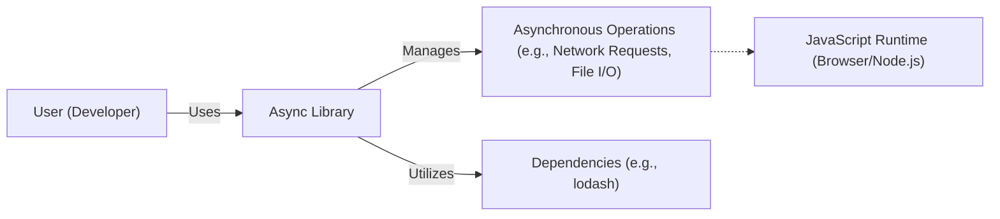
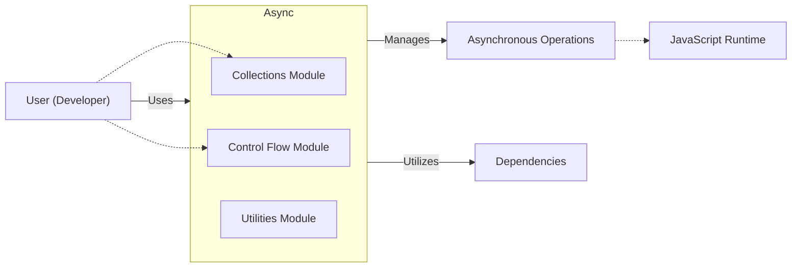
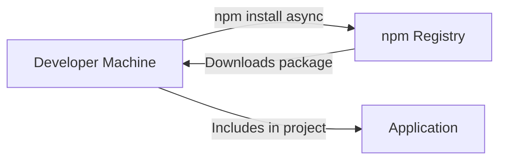
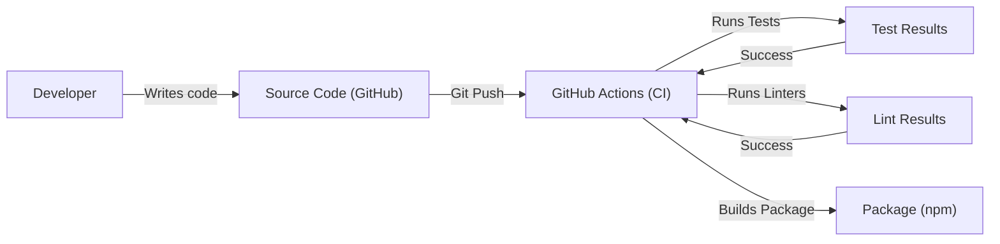

Okay, let's create a design document for the `async` library, focusing on aspects relevant to threat modeling.

# BUSINESS POSTURE

Business Priorities and Goals:

*   Provide a simple, yet powerful utility library for managing asynchronous operations in JavaScript.
*   Improve developer productivity by offering higher-level abstractions for common asynchronous patterns (e.g., collections, control flow).
*   Maintain broad compatibility across various JavaScript environments (browsers, Node.js).
*   Ensure the library is lightweight and has minimal dependencies to avoid bloating projects that use it.
*   Maintain high code quality and test coverage to ensure reliability.

Most Important Business Risks:

*   Introduction of vulnerabilities through dependencies: Since `async` is a widely used library, any security flaws could have a cascading impact on numerous applications.  The primary risk is a supply chain attack, where a compromised dependency introduces malicious code.
*   Incorrect handling of asynchronous operations: Bugs in `async` could lead to unexpected application behavior, potentially including race conditions, deadlocks, or data corruption, which could be exploited.
*   Denial of Service (DoS):  While less likely in a utility library, inefficient algorithms or improper resource management could make applications using `async` vulnerable to DoS attacks.
*   Compatibility issues: Changes to the library could break existing implementations, causing operational disruptions.

# SECURITY POSTURE

Existing Security Controls:

*   security control: Dependency Management: The project uses `package-lock.json` (or `yarn.lock` in some branches) to pin dependency versions, reducing the risk of unexpected changes from upstream updates. (Described in `package-lock.json`)
*   security control: Code Reviews: The project's contribution guidelines and open-source nature imply that code reviews are performed before merging changes. (Implicit in the GitHub workflow)
*   security control: Testing: The project has an extensive test suite, which helps to identify functional bugs and regressions that could lead to security vulnerabilities. (Described in the `test` directory)
*   security control: Static Analysis: The project uses linters (like ESLint, indicated by configuration files) to enforce code style and identify potential issues. (Described in configuration files like `.eslintrc.js`)
*   security control: Issue Tracking: Security vulnerabilities can be reported and tracked via GitHub Issues. (Implicit in the GitHub workflow)

Accepted Risks:

*   accepted risk: Limited Input Validation: As a utility library, `async` itself performs minimal input validation. It relies on the calling code to provide valid inputs. This is acceptable because `async` is a low-level building block, and excessive validation within the library would be inefficient and redundant. The responsibility for input validation lies with the application using `async`.
*   accepted risk: No Built-in Cryptography: `async` does not directly handle cryptographic operations. This is acceptable as it's outside the scope of the library's purpose.
*   accepted risk: Reliance on JavaScript's built-in security model: `async` operates within the standard JavaScript security sandbox, inheriting its limitations and protections.

Recommended Security Controls:

*   security control: Regular Dependency Audits: Implement automated dependency scanning (e.g., using tools like `npm audit`, Dependabot, or Snyk) to proactively identify known vulnerabilities in dependencies.
*   security control: Fuzz Testing: Introduce fuzz testing to the test suite to explore edge cases and uncover unexpected behavior that might be exploitable.
*   security control: Security Policy: Create a `SECURITY.md` file to clearly outline the process for reporting security vulnerabilities.

Security Requirements:

*   Authentication: Not applicable, as `async` is a utility library and does not handle authentication.
*   Authorization: Not applicable, as `async` does not manage authorization.
*   Input Validation: The library should include basic type checking to prevent obvious misuse (e.g., ensuring callbacks are functions). However, comprehensive input validation is the responsibility of the application using `async`.
*   Cryptography: Not applicable, as `async` does not handle cryptographic operations.

# DESIGN

## C4 CONTEXT

Element Descriptions:

*   Element:
    *   Name: User (Developer)
    *   Type: Person
    *   Description: A software developer who integrates the `async` library into their JavaScript application.
    *   Responsibilities: Uses `async` functions to manage asynchronous operations in their application.  Provides valid inputs to `async` functions.  Handles errors returned by `async` functions.
    *   Security controls: Implements input validation and error handling in their application code.

*   Element:
    *   Name: Async Library
    *   Type: Software System
    *   Description: The `async` library itself, providing utility functions for managing asynchronous operations.
    *   Responsibilities: Provides a clean and consistent API for asynchronous programming.  Manages the execution of asynchronous tasks.  Handles errors and callbacks.
    *   Security controls: Uses `package-lock.json` for dependency management.  Includes a comprehensive test suite.  Uses linters for code quality.

*   Element:
    *   Name: Asynchronous Operations
    *   Type: External System
    *   Description: Represents the underlying asynchronous operations that `async` helps to manage (e.g., network requests, file I/O, timers).
    *   Responsibilities: Performs the actual asynchronous work.
    *   Security controls: Relies on the security mechanisms of the JavaScript runtime and the underlying operating system.

*   Element:
    *   Name: JavaScript Runtime
    *   Type: External System
    *   Description: The environment in which the JavaScript code runs (e.g., a web browser or Node.js).
    *   Responsibilities: Provides the core JavaScript engine and APIs for interacting with the system.
    *   Security controls: Implements the JavaScript security sandbox. Provides security mechanisms for network requests, file access, etc.

*   Element:
    *   Name: Dependencies
    *   Type: External System
    *   Description: External libraries that `async` depends on.
    *   Responsibilities: Provide functionality used by `async`.
    *   Security controls: Managed through `package-lock.json`. Should be regularly audited for vulnerabilities.

## C4 CONTAINER

In this case, the `async` library is simple enough that the Container diagram is essentially the same as the Context diagram, with the addition of internal modules. We'll represent the major modules as "containers" within the library.

Element Descriptions:

*   Elements: User, Asynchronous Operations, JavaScript Runtime, and Dependencies are the same as in the Context Diagram.

*   Element:
    *   Name: Async Library
    *   Type: Software System
    *   Description: The `async` library itself.
    *   Responsibilities: Provides a clean and consistent API for asynchronous programming. Manages the execution of asynchronous tasks. Handles errors and callbacks.
    *   Security controls: Uses `package-lock.json` for dependency management. Includes a comprehensive test suite. Uses linters for code quality.

*   Element:
    *   Name: Collections Module
    *   Type: Container (Module)
    *   Description: Contains functions for working with asynchronous operations on collections (e.g., `each`, `map`, `filter`).
    *   Responsibilities: Provides higher-level abstractions for iterating and manipulating collections asynchronously.
    *   Security controls: Inherits security controls from the `async` library.

*   Element:
    *   Name: Control Flow Module
    *   Type: Container (Module)
    *   Description: Contains functions for managing the flow of asynchronous operations (e.g., `series`, `parallel`, `waterfall`).
    *   Responsibilities: Provides mechanisms for controlling the order and concurrency of asynchronous tasks.
    *   Security controls: Inherits security controls from the `async` library.

*   Element:
    *   Name: Utilities Module
    *   Type: Container (Module)
    *   Description: Contains internal utility functions used by other modules.
    *   Responsibilities: Provides helper functions for common tasks.
    *   Security controls: Inherits security controls from the `async` library.

## DEPLOYMENT

Deployment Solutions:

1.  **npm/yarn (Package Manager):**  Developers typically install `async` via npm or yarn. This is the primary deployment method.
2.  **CDN (Content Delivery Network):**  `async` can be included directly in web pages via a CDN link.
3.  **Bundled with Application Code:** `async` can be bundled with the application code using tools like Webpack or Browserify.

Chosen Solution (npm/yarn):

Element Descriptions:

*   Element:
    *   Name: Developer Machine
    *   Type: Infrastructure Node
    *   Description: The developer's local machine where they write and build their application.
    *   Responsibilities: Runs the package manager (npm or yarn). Downloads and installs `async`.
    *   Security controls: Relies on the security of the developer's machine and the package manager.

*   Element:
    *   Name: npm Registry
    *   Type: Infrastructure Node
    *   Description: The central repository for npm packages.
    *   Responsibilities: Stores and serves `async` and its dependencies.
    *   Security controls: Implements security measures to protect against unauthorized access and malicious packages.

*   Element:
    *   Name: Application
    *   Type: Software System
    *   Description: The application that uses the `async` library.
    *   Responsibilities: Uses `async` to manage asynchronous operations.
    *   Security controls: Implements input validation and error handling.

## BUILD

Build Process Description:

1.  **Developer Writes Code:** A developer writes code and commits it to the `async` repository on GitHub.
2.  **Git Push:** The developer pushes their changes to the remote repository.
3.  **GitHub Actions (CI):**  GitHub Actions, the CI/CD system used by the project, is triggered by the push.
4.  **Runs Tests:** The CI workflow runs the test suite to ensure that the code changes haven't introduced any regressions.
5.  **Runs Linters:** The CI workflow runs linters (e.g., ESLint) to check for code style and potential errors.
6.  **Builds Package:** If the tests and linters pass, the CI workflow builds the package, preparing it for publication to npm.  This typically involves transpilation (if necessary) and creating a distributable package.
7.  **Package Published:** The built package is then published to the npm registry (this step is likely manual, triggered by a maintainer).

Security Controls in Build Process:

*   security control: CI/CD (GitHub Actions): Automates the build, test, and linting process, ensuring consistency and reducing the risk of human error.
*   security control: Automated Testing: The test suite helps to identify functional bugs and regressions.
*   security control: Static Analysis (Linters): Linters enforce code style and identify potential issues.
*   security control: Code Review (GitHub): All changes are reviewed before being merged into the main branch.

# RISK ASSESSMENT

Critical Business Processes:

*   Providing reliable asynchronous operation management for JavaScript applications.
*   Maintaining developer trust and the library's reputation.

Data to Protect:

*   Source Code: The `async` library's source code itself is the primary data to protect.  While it's publicly available, ensuring its integrity is crucial to prevent the introduction of malicious code.  Sensitivity: Medium (publicly available, but integrity is critical).
*   No user data or sensitive configuration is directly handled by the library.

# QUESTIONS & ASSUMPTIONS

Questions:

*   Are there any specific performance requirements or limitations for the `async` library?
*   Are there any plans to add new features or significantly change the API in the future?
*   What is the process for handling security vulnerability reports? (This should ideally be documented in a `SECURITY.md` file).
*   What is the exact version of lodash that is used?

Assumptions:

*   BUSINESS POSTURE: The primary goal is to provide a stable and reliable utility library.  The project prioritizes correctness and maintainability over adding new features rapidly.
*   SECURITY POSTURE: The project relies on community contributions and code reviews for security.  There is an implicit assumption that contributors are acting in good faith.
*   DESIGN: The library is designed to be modular and extensible. The core functionality is well-defined and unlikely to change drastically. The deployment process via npm is standard and well-understood. The build process is automated using GitHub Actions.