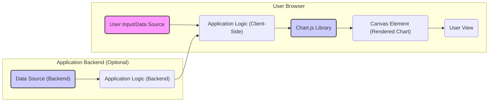

* **Threat:** Configuration Injection Leading to Client-Side Manipulation
    * **Description:** An attacker injects malicious configuration options into the Chart.js configuration object. This could involve manipulating settings like colors, labels, tooltips, or, more dangerously, injecting JavaScript code through configuration options that allow for custom callbacks or formatters. The attacker might achieve this by exploiting vulnerabilities in how the application handles user input or by compromising the application's client-side code.
    * **Impact:**  Visual defacement of the chart, displaying misleading information, or, in the case of JavaScript injection, execution of arbitrary code within the user's browser (client-side XSS). This can lead to session hijacking, data theft, or further malicious actions.
    * **Affected Chart.js Component:** `Chart` constructor's `options` property, particularly callbacks within `tooltips`, `scales`, or custom plugins.
    * **Risk Severity:** Critical (if JavaScript injection is possible), High (for visual manipulation)
    * **Mitigation Strategies:**
        * Avoid directly using user input to configure Chart.js options.
        * Define a strict and limited set of allowed configuration options.
        * Sanitize any user-provided input that influences chart configuration.
        * Be extremely cautious when using configuration options that allow for custom functions or formatters. If necessary, ensure these functions are securely implemented and do not execute arbitrary code.
        * Implement a strong Content Security Policy (CSP) to mitigate the impact of potential XSS vulnerabilities.

* **Threat:** Client-Side Cross-Site Scripting (XSS) via Vulnerable Plugins
    * **Description:** If the application uses Chart.js plugins, a vulnerability in a plugin could allow an attacker to inject malicious scripts into the rendered chart or the surrounding page. This could happen if the plugin doesn't properly sanitize user-provided data or has other security flaws.
    * **Impact:** Full compromise of the user's session, including stealing cookies, redirecting to malicious websites, or performing actions on behalf of the user.
    * **Affected Chart.js Component:**  Specific Chart.js plugins used by the application.
    * **Risk Severity:** Critical
    * **Mitigation Strategies:**
        * Carefully vet and select Chart.js plugins from trusted sources.
        * Regularly update all Chart.js plugins to the latest versions to patch known vulnerabilities.
        * Conduct security reviews of any custom plugins developed.
        * Implement a strong Content Security Policy (CSP) to restrict the sources from which scripts can be loaded.

* **Threat:** Vulnerabilities in Chart.js Library Itself
    * **Description:** Like any software, Chart.js might contain undiscovered security vulnerabilities. An attacker could exploit these vulnerabilities to perform actions such as remote code execution, denial of service, or information disclosure.
    * **Impact:**  The impact depends on the specific vulnerability. It could range from a minor denial of service to a complete compromise of the user's browser or even the server if server-side rendering is used with a vulnerable version.
    * **Affected Chart.js Component:** Any part of the Chart.js library code.
    * **Risk Severity:** Varies depending on the vulnerability (can be Critical or High)
    * **Mitigation Strategies:**
        * Regularly update Chart.js to the latest version to benefit from bug fixes and security patches.
        * Subscribe to security advisories and vulnerability databases related to JavaScript libraries.
        * Consider using static analysis tools or software composition analysis (SCA) tools to identify known vulnerabilities in the Chart.js library.
