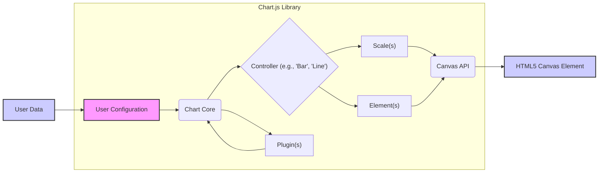
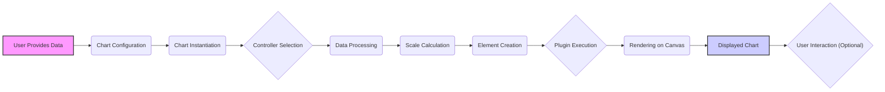
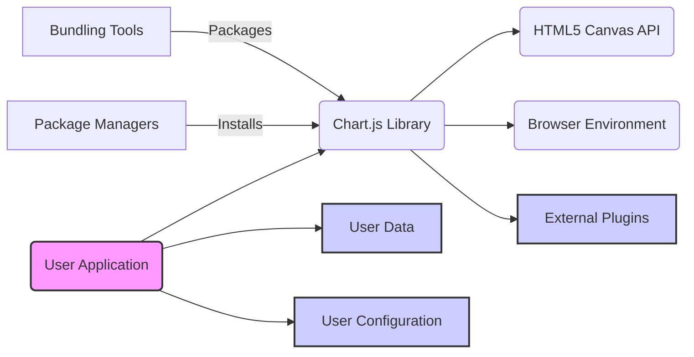

# Project Design Document: Chart.js Library

**Version:** 1.1
**Date:** October 26, 2023
**Author:** AI Software Architect

## 1. Introduction

This document provides an enhanced and detailed design overview of the Chart.js library, an open-source JavaScript library used for creating a wide variety of interactive charts. This document is specifically designed to serve as a solid foundation for subsequent threat modeling activities by offering a comprehensive understanding of the library's architecture, internal components, and the flow of data within the system.

## 2. Project Overview

Chart.js is a widely adopted library that empowers developers to seamlessly integrate dynamic and customizable charts into their web applications. It leverages the capabilities of the HTML5 Canvas API for rendering visual representations of data and offers a diverse selection of chart types, extensive customization options, and a flexible plugin architecture.

### 2.1. Project Goals

*   To offer a straightforward and adaptable API for generating various chart visualizations.
*   To provide rich customization capabilities for tailoring chart aesthetics and interactive behaviors.
*   To maintain a minimal footprint to ensure optimal performance and loading times.
*   To inherently support responsive design principles and accessibility standards.
*   To facilitate extensibility and the addition of custom features through a robust plugin system.

### 2.2. Target Audience

*   Web developers who need to incorporate charting functionalities into their web-based applications.
*   User interface and user experience (UI/UX) designers responsible for customizing the visual presentation of charts.
*   Cybersecurity engineers tasked with performing threat modeling, security assessments, and penetration testing.

## 3. System Architecture

Chart.js employs a modular design, promoting flexibility, maintainability, and ease of extension. The interconnected core components work in concert to process input data and render visually appealing charts on the HTML5 canvas.

### 3.1. Core Components

*   **Core:** This fundamental module houses the base `Chart` class, which serves as the central point of interaction, and provides essential utility functions used throughout the library.
*   **Controllers:** These components are specialized modules responsible for managing the logic and rendering of specific chart types. Examples include `BarController`, `LineController`, `PieController`, etc. They interpret the provided data and configure the visual elements necessary for their respective chart types.
*   **Scales:** This module handles the representation and calculation of chart axes. It supports various scale types, such as linear, logarithmic, time-based, and category scales. The scales determine the tick marks, gridlines, and positioning of data points along the axes.
*   **Elements:** These represent the fundamental visual building blocks that constitute a chart. Examples include `PointElement`, `LineElement`, `BarElement`, `ArcElement`, etc. Controllers utilize these elements to visually represent the data on the canvas.
*   **Plugins:** This system provides a powerful mechanism to extend and customize the functionality of Chart.js. Plugins can modify chart behavior, introduce new features (e.g., annotations, custom interactions), or facilitate integration with external libraries or services.
*   **Configuration:** This central JavaScript object defines the entire structure and appearance of a chart. It includes the chart's data, various options for customization (e.g., colors, labels, titles, tooltips), and the registration of any desired plugins. This is the primary way users interact with and configure the library.
*   **API:** This encompasses the set of JavaScript methods and properties exposed by the `Chart` class. Developers use this API to create new chart instances, update existing charts with new data or options, and programmatically manipulate chart elements and behavior.

### 3.2. High-Level Architecture Diagram

## 4. Data Flow

The process of creating and rendering a chart using Chart.js involves a well-defined sequence of steps:

1. **Data Input:** The user provides the data to be visualized. This is typically structured as an array of numerical values or objects, and it's passed to the library through the chart's configuration object.
2. **Configuration:** The user defines the characteristics of the chart through a configuration object. This includes specifying the `type` of chart (e.g., 'bar', 'line', 'pie'), the `data` to be displayed, various `options` for customization (e.g., colors, labels, titles, legend settings), and any `plugins` to be utilized.
3. **Chart Instantiation:** A new instance of the `Chart` object is created. This process involves passing a reference to the HTML5 `<canvas>` element where the chart will be rendered and the user-provided configuration object.
4. **Controller Selection:** Based on the `type` property specified in the configuration, the appropriate controller module (e.g., `BarController` for a bar chart) is selected and initialized.
5. **Data Processing:** The selected controller takes the raw input data and processes it. This may involve transformations, aggregations, or calculations necessary for the specific chart type. For instance, it might calculate the position and size of bars in a bar chart.
6. **Scale Calculation:** The scale module(s) associated with the chart (e.g., x-axis, y-axis) analyze the processed data to determine the appropriate ranges, tick marks, and gridlines for the axes. This ensures the data is displayed within a meaningful context.
7. **Element Creation:** The controller then utilizes the element modules to create the visual components that make up the chart. For a line chart, this would involve creating `PointElement` instances for each data point and `LineElement` instances to connect them.
8. **Plugin Execution:** Registered plugins are executed at various stages of the chart lifecycle. They can modify the chart's data, options, or rendering behavior. Plugins provide a hook system to interact with the core library's functionalities.
9. **Rendering:** The element instances are then drawn onto the HTML5 canvas using the Canvas API. This involves drawing shapes, lines, text, and applying styles according to the configuration and processed data.
10. **User Interaction (Optional):** Once the chart is rendered, users can interact with it (e.g., hover over data points, click on elements). These interactions can trigger events that can be handled by the application or by registered plugins to provide interactive features like tooltips or drill-down capabilities.

### 4.1. Data Flow Diagram

## 5. External Interactions

Chart.js interacts with several external components and systems to function correctly:

*   **HTML5 Canvas API:** This is the fundamental browser API that Chart.js relies on for all its rendering operations. It provides the drawing context and methods to draw shapes, text, and images on the `<canvas>` element.
*   **Browser Environment:** Chart.js operates within the user's web browser and depends on the browser's JavaScript engine for execution and its Document Object Model (DOM) for accessing and manipulating the `<canvas>` element.
*   **User-Provided Data:** The core input for Chart.js is the data provided by the developer, which dictates what information the chart will visualize. The structure and format of this data are crucial for correct chart rendering.
*   **User-Provided Configuration:** The configuration object, also provided by the developer, dictates the chart's appearance, behavior, and type. This configuration drives how Chart.js processes and renders the data.
*   **External Plugins:** Developers can extend Chart.js's functionality by incorporating third-party or custom-built plugins. These plugins can interact with the core library, potentially introducing external dependencies or interactions.
*   **Bundling Tools (e.g., Webpack, Rollup, Parcel):** During the development process, bundling tools are often used to package Chart.js and its dependencies into optimized bundles for deployment.
*   **Package Managers (e.g., npm, yarn, pnpm):** Developers typically install and manage Chart.js and its dependencies using package managers. These tools handle the retrieval and installation of the library.

### 5.1. External Interaction Diagram

## 6. Deployment Considerations

Chart.js is primarily a client-side library and is typically deployed as a static JavaScript file that is included in a web page. Common deployment scenarios include:

*   **Direct Inclusion via `<script>` Tag:** The simplest method involves downloading the Chart.js library and including it directly in an HTML file using a `<script>` tag.
*   **Client-Side Rendering (CSR) with Bundlers:** In more complex web applications, Chart.js is often integrated using module bundlers like Webpack or Rollup. This allows for better dependency management and optimized builds.
*   **Server-Side Rendering (SSR) or Pre-rendering:** While primarily client-side, Chart.js can be used in server-side rendering scenarios using Node.js and a headless browser environment (like Puppeteer or JSDOM). This allows for pre-rendering charts on the server to improve initial load times or for SEO purposes.
*   **Integration within Front-End Frameworks:** Chart.js is frequently used within popular front-end frameworks like React, Angular, and Vue.js, often with the help of wrapper components that simplify integration.

## 7. Security Considerations (Pre-Threat Modeling)

This section outlines potential security considerations relevant to Chart.js that should be further explored during a dedicated threat modeling exercise. These points serve as initial areas of focus for identifying potential vulnerabilities:

*   **Cross-Site Scripting (XSS) via User-Provided Data:** If the data provided by the user to be charted is not properly sanitized or encoded, malicious scripts could be injected and executed within the context of the user's browser when the chart is rendered. This is a significant risk, especially if the data source is untrusted.
*   **Cross-Site Scripting (XSS) via User-Provided Configuration:** Similar to data, if the chart's configuration options (e.g., labels, tooltips) allow for arbitrary HTML or JavaScript and are not properly handled, XSS vulnerabilities could arise.
*   **Dependency Vulnerabilities:** Chart.js has minimal dependencies, but vulnerabilities in those dependencies could indirectly affect the security of applications using Chart.js. Regularly updating dependencies is crucial.
*   **Security of External Plugins:** The plugin system offers great extensibility but also introduces potential risks. Malicious or poorly written third-party plugins could introduce vulnerabilities or compromise the security of the application. Careful vetting and auditing of plugins are necessary.
*   **Data Handling and Validation:** Improper handling or lack of validation of user-provided data could lead to unexpected behavior, errors, or even denial-of-service conditions in the browser if maliciously crafted data is provided.
*   **Denial of Service (DoS) via Complex Configurations:** While less likely, overly complex or deeply nested configurations could potentially consume excessive browser resources, leading to performance issues or even a denial of service for the client.
*   **Information Disclosure through Chart Elements:** Care should be taken to avoid inadvertently displaying sensitive information in chart labels, tooltips, or other visual elements if the chart is accessible to unauthorized users.
*   **Content Security Policy (CSP) Considerations:** When integrating Chart.js, developers should ensure that their Content Security Policy is configured appropriately to allow the necessary resources (e.g., script execution for Chart.js, potentially inline styles for canvas rendering) while mitigating XSS risks.

## 8. Conclusion

This enhanced design document provides a detailed and structured overview of the Chart.js library, encompassing its architecture, data flow mechanisms, and interactions with external components. This comprehensive understanding is essential for conducting effective threat modeling activities aimed at identifying and mitigating potential security vulnerabilities. By thoroughly examining the internal workings and external interfaces of Chart.js, security engineers can better evaluate the library's attack surface and develop appropriate security strategies to protect applications that utilize it.
