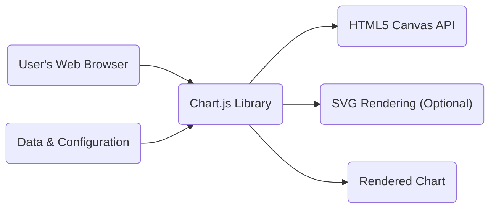
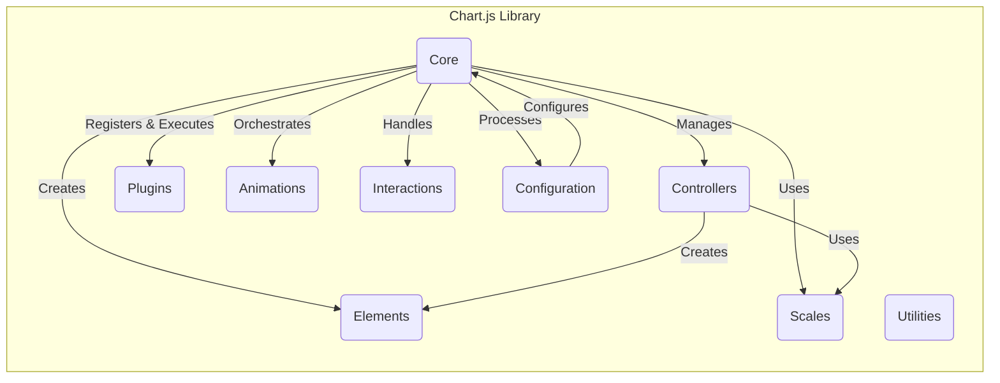
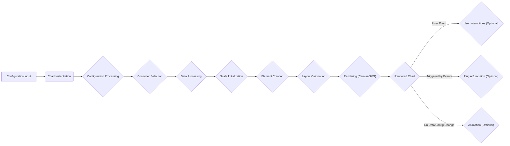

# Project Design Document: Chart.js

**Version:** 1.1
**Date:** October 26, 2023
**Author:** Gemini (AI Language Model)

## 1. Introduction

This document provides an enhanced design overview of the Chart.js project, an open-source JavaScript library for creating various types of charts. This document is specifically tailored to serve as a robust foundation for subsequent threat modeling activities. It meticulously outlines the key components, architecture, and data flow within the Chart.js library and its typical usage scenarios, with a focus on potential security implications.

## 2. Goals and Non-Goals

### 2.1. Goals

*   Provide a clear, comprehensive, and security-focused description of the Chart.js library's architecture and functionality.
*   Clearly identify the key components and their interactions, emphasizing potential security boundaries and trust zones.
*   Describe the data flow within the library in detail, from initial input to final rendered output, highlighting potential data manipulation and injection points.
*   Outline the typical deployment and usage scenarios of Chart.js, considering different integration methods and environments.
*   Serve as a solid and detailed basis for identifying potential security vulnerabilities and attack vectors during the threat modeling process.

### 2.2. Non-Goals

*   Provide an exhaustive, line-by-line code-level explanation of every function and module within Chart.js.
*   Offer specific security recommendations or immediate mitigation strategies (these will be the direct output of the subsequent threat modeling process).
*   Document the historical evolution of the project or the detailed rationale behind every specific design decision.
*   Cover every conceivable edge case, obscure configuration option, or highly atypical usage pattern.

## 3. Architectural Overview

Chart.js is a client-side JavaScript library primarily designed to operate within a user's web browser. It leverages the HTML5 `<canvas>` element as its primary rendering context, with optional support for SVG rendering. Its execution is entirely within the client's environment.

### 3.1. High-Level Architecture

*   **User's Web Browser:** The execution environment for Chart.js, representing the client-side trust boundary.
*   **Chart.js Library:** The core JavaScript code, the primary subject of our threat model. It processes data and configuration to generate charts.
*   **HTML5 Canvas API:** The browser-provided API used for drawing graphics. Security vulnerabilities in the Canvas API itself could indirectly impact Chart.js.
*   **SVG Rendering (Optional):** An alternative browser-provided rendering method. While offering benefits like scalability, it also has its own set of potential security considerations.
*   **Data & Configuration:** The input provided by the developer, a critical area for potential injection attacks. This includes chart data, labels, and styling options.
*   **Rendered Chart:** The visual output displayed within the browser. While the output itself is visual, how it's generated and the data it represents are key security concerns.

### 3.2. Component-Level Architecture

Chart.js is internally organized into several interconnected components, each with specific responsibilities:

*   **Core:**
    *   `"Chart"`: The central class responsible for managing the lifecycle of a chart instance, including initialization, updates, and destruction. It orchestrates the interactions between other components.
    *   `"Platform"`: An abstraction layer that isolates Chart.js from the specifics of the underlying rendering context (Canvas or SVG). This helps in maintaining portability but also introduces a point of interaction with browser-specific APIs.
    *   `"Layout"`:  Manages the spatial arrangement of chart elements. Incorrect layout calculations, while not directly a security vulnerability, could be exploited for visual misrepresentation.
    *   `"Registry"`: A central repository for managing and accessing different types of controllers, elements, scales, and plugins. This component is crucial for the extensibility of Chart.js but also a potential area for malicious component registration.
*   **Controllers:**
    *   These components (`"LineController"`, `"BarController"`, `"PieController"`, etc.) define the specific logic for different chart types. They interpret the provided data and determine how the corresponding visual elements should be rendered. Vulnerabilities here could lead to incorrect or malicious rendering.
*   **Elements:**
    *   Represent the fundamental visual building blocks of a chart (`"PointElement"`, `"LineElement"`, `"BarElement"`, etc.). These are the objects that are ultimately drawn on the canvas or as SVG elements. Security issues could arise if element properties are not properly sanitized or if rendering logic is flawed.
*   **Scales:**
    *   Manage the chart axes, including calculating the tick marks, labels, and ranges (`"LinearScale"`, `"CategoryScale"`, `"TimeScale"`, etc.). Incorrect scale calculations could lead to misrepresentation of data.
*   **Plugins:**
    *   Provide a powerful mechanism to extend and customize Chart.js functionality. Plugins can modify data, add new chart types, or alter rendering behavior. This is a significant area for potential security risks, as plugins have broad access to the Chart.js internals and the browser environment.
*   **Animations:**
    *   Handles the animation of chart elements during updates. While primarily a visual feature, vulnerabilities in the animation logic could potentially be exploited.
*   **Interactions:**
    *   Manages user interactions with the chart, such as hover and click events, and triggers corresponding actions like displaying tooltips. Improper handling of interaction events could lead to XSS if tooltip content is not sanitized.
*   **Configuration:**
    *   Responsible for parsing, validating, and applying user-provided configuration options. This is a critical entry point for user-supplied data and a prime target for injection attacks.
*   **Utilities:**
    *   Provides helper functions for various tasks, such as color manipulation and mathematical calculations. While seemingly benign, vulnerabilities in utility functions could have wider implications.

## 4. Data Flow

The creation and rendering of a chart in Chart.js involves a well-defined data flow, starting from the initial configuration and culminating in the visual representation. Understanding this flow is crucial for identifying potential points of manipulation or attack.

1. **Configuration Input:** The developer provides a JavaScript object containing the chart's data, type, and various configuration options (e.g., colors, labels, axis settings). This input is the primary source of data for the chart and a key area for potential injection vulnerabilities.
2. **Chart Instantiation:** A new `"Chart"` object is created, associating it with a target HTML element (Canvas or a container for SVG) and the provided configuration object.
3. **Configuration Processing:** The `"Configuration"` component parses and validates the input configuration. This stage is critical for sanitizing and validating user-provided data to prevent malicious input from being processed.
4. **Controller Selection:** Based on the specified chart type in the configuration, the appropriate `"Controller"` (e.g., `"LineController"`) is selected from the `"Registry"`.
5. **Data Processing:** The selected `"Controller"` processes the raw data, potentially transforming it into a format suitable for rendering. This might involve calculations, aggregations, or reformatting. Improper data processing could lead to unexpected behavior or vulnerabilities.
6. **Scale Initialization:** The `"Scales"` (e.g., `"LinearScale"`) are initialized based on the processed data and configuration, determining the ranges, tick marks, and labels for the chart axes. Flaws in scale initialization could lead to data misrepresentation.
7. **Element Creation:** The `"Controller"` creates the necessary `"Elements"` (visual components like `"PointElement"`, `"BarElement"`) based on the processed data and scale information. Vulnerabilities in element creation could lead to the rendering of malicious content.
8. **Layout Calculation:** The `"Layout"` component determines the positioning and sizing of all chart elements, ensuring they fit within the available space. While not directly a security vulnerability, incorrect layout could be exploited for visual deception.
9. **Rendering:** The `"Platform"` component utilizes the browser's Canvas API (or SVG rendering engine) to draw the `"Elements"` onto the target HTML element. This is where the visual representation is generated. Security issues in the browser's rendering engine could indirectly affect Chart.js.
10. **User Interactions (Optional):** The `"Interactions"` component handles user events like mouse movements and clicks, triggering actions such as displaying tooltips or highlighting data points. If tooltip content is derived from unsanitized data, it could lead to XSS.
11. **Plugin Execution (Optional):** Registered `"Plugins"` can intercept and modify the data flow or rendering process at various stages. This provides significant extensibility but also introduces potential security risks if plugins are malicious or poorly written.
12. **Animation (Optional):** The `"Animations"` component animates changes to the chart when data or configuration is updated, providing a smoother user experience.

## 5. Deployment and Usage

Chart.js is primarily a client-side library and is typically deployed as a static JavaScript file that is included in a web page.

*   **Direct Inclusion via `<script>` Tag:** The most common method involves including the Chart.js library using a `<script>` tag within the HTML file. This can be a direct link to a locally hosted file or a link to a Content Delivery Network (CDN). Using a CDN introduces a dependency on a third-party resource.
*   **Integration with Module Bundlers:** For more complex web applications, Chart.js can be integrated using module bundlers like Webpack, Parcel, or Rollup. This allows for better dependency management and optimized builds.
*   **Server-Side Rendering (SSR):** While primarily a client-side library, Chart.js can be used in server-side rendering scenarios (e.g., with Node.js) using headless browser environments or specialized server-side canvas implementations. This introduces new security considerations related to the server environment.

**Typical Usage Steps:**

1. Include the Chart.js library in the HTML document.
2. Add a `<canvas>` element (or a suitable container for SVG rendering) to the HTML where the chart will be displayed.
3. Write JavaScript code to:
    *   Obtain a reference to the `<canvas>` element.
    *   Define the chart data and configuration options as a JavaScript object.
    *   Create a new `Chart` instance, passing in the canvas rendering context and the configuration object.

## 6. Security Considerations (Detailed for Threat Modeling)

This section expands on the initial security considerations, providing more specific examples and potential attack vectors relevant to threat modeling.

*   **Cross-Site Scripting (XSS):**
    *   **Data Injection in Labels/Tooltips:** If user-provided data or configuration (e.g., labels, tooltip content) is not properly sanitized before being rendered into the chart, it can lead to XSS vulnerabilities. An attacker could inject malicious JavaScript code that will be executed in the user's browser.
    *   **Plugin Vulnerabilities:** Malicious or poorly written plugins have access to the DOM and Chart.js internals, allowing them to inject arbitrary scripts or modify the page in harmful ways.
    *   **Configuration Options:** Certain configuration options that handle text or HTML content could be exploited if not properly sanitized.
*   **Data Injection and Manipulation:**
    *   **Malicious Data Payloads:** Attackers could provide maliciously crafted data that, when processed by Chart.js, leads to unexpected behavior, errors, or even denial-of-service. This could involve injecting special characters, excessively large numbers, or data in unexpected formats.
    *   **Configuration Manipulation:** Tampering with configuration options could lead to the chart displaying misleading or incorrect information.
*   **Client-Side Denial of Service (DoS):**
    *   **Large Datasets:** Providing extremely large or complex datasets can overwhelm the browser's rendering capabilities, causing the page to become unresponsive or crash.
    *   **Complex Configurations:** Similarly, overly complex or deeply nested configurations can strain the browser's resources.
    *   **Animation Abuse:**  Excessive or poorly implemented animations could also contribute to client-side DoS.
*   **Plugin Security Risks:**
    *   **Malicious Plugins:**  If users are allowed to load arbitrary Chart.js plugins, this presents a significant security risk. Malicious plugins could steal data, perform unauthorized actions, or inject malware.
    *   **Vulnerable Plugins:** Even well-intentioned plugins might contain security vulnerabilities that could be exploited.
*   **Dependency Chain Risks:**
    *   While Chart.js aims to be dependency-free, vulnerabilities in the browser's Canvas API or SVG rendering engine could indirectly impact Chart.js.
    *   If Chart.js were to introduce dependencies in the future, vulnerabilities in those dependencies would become a concern.
*   **Information Disclosure:**
    *   While less common, vulnerabilities could potentially lead to the disclosure of sensitive data if it's included in the chart data or configuration and not properly handled.
*   **Prototype Pollution:**
    *   Improper handling of configuration options could potentially lead to prototype pollution vulnerabilities, allowing attackers to inject properties into built-in JavaScript objects.
*   **Insecure CDN Usage:**
    *   If Chart.js is loaded from a compromised CDN, the delivered code could be malicious. Using Subresource Integrity (SRI) hashes can mitigate this risk.

## 7. Future Considerations

*   **Enhanced Input Sanitization:** Implementing more robust input sanitization and validation mechanisms to prevent XSS and data injection attacks.
*   **Content Security Policy (CSP) Support:**  Improving support for Content Security Policy to further restrict the execution of potentially malicious scripts.
*   **Subresource Integrity (SRI) Recommendations:**  Promoting the use of SRI hashes when including Chart.js from CDNs.
*   **Security Audits:**  Regular security audits and penetration testing to identify and address potential vulnerabilities.
*   **Plugin Security Model:**  Exploring ways to enhance the security of the plugin ecosystem, potentially through sandboxing or stricter validation.
*   **Accessibility and Security Integration:** Ensuring that accessibility features do not inadvertently introduce new security vulnerabilities.

This enhanced design document provides a more detailed and security-focused overview of the Chart.js library. It serves as a comprehensive foundation for conducting a thorough threat modeling exercise, enabling the identification of potential vulnerabilities and the development of appropriate mitigation strategies.