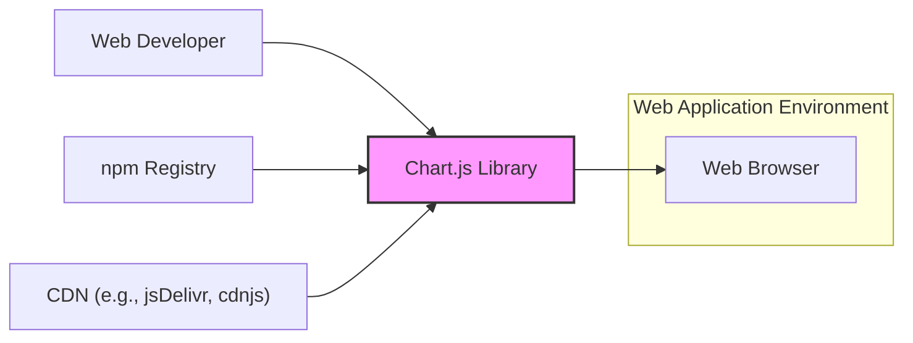
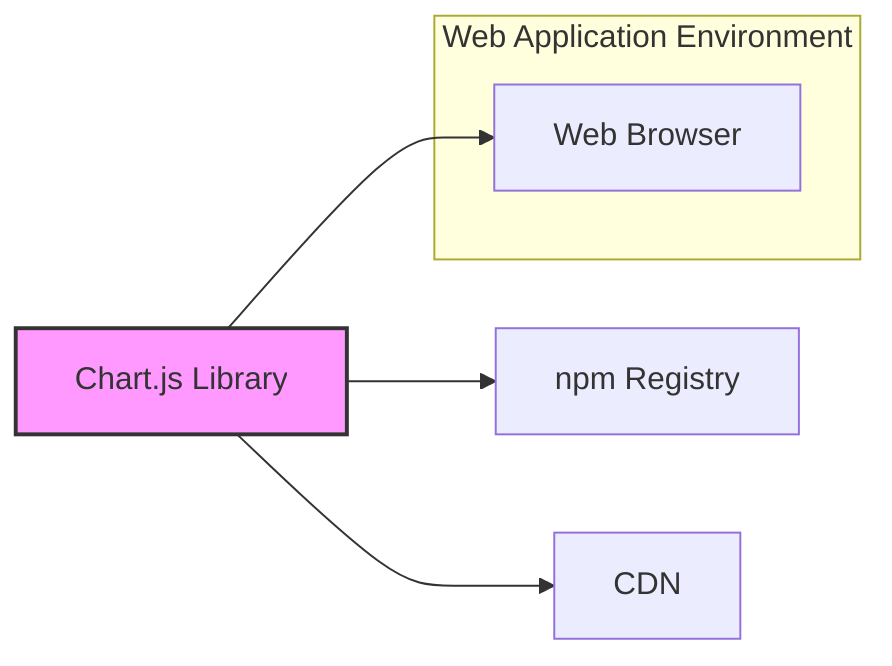
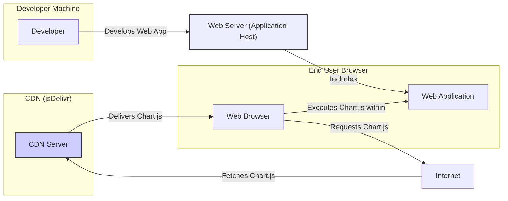
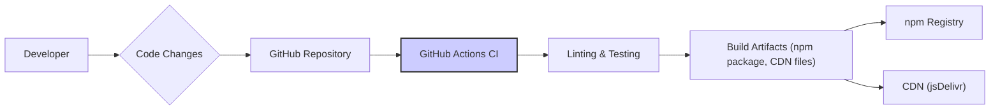

# BUSINESS POSTURE

- Business Priorities and Goals:
  - Provide a flexible and feature-rich JavaScript charting library for web developers.
  - Ensure ease of use and integration into various web projects.
  - Maintain broad browser compatibility and performance.
  - Foster a strong and active open-source community around the library.
  - Provide stable and reliable releases.
- Business Risks:
  - Security vulnerabilities in the library could be exploited in applications using it, leading to data breaches or other security incidents.
  - Poor performance or lack of browser compatibility could limit adoption and user satisfaction.
  - Lack of community support or maintainability could lead to stagnation and eventual obsolescence of the library.
  - Breaking changes in new releases could disrupt existing applications and developer workflows.
  - Dependency on external services (like CDNs) could introduce availability risks.

# SECURITY POSTURE

- Existing Security Controls:
  - security control: Code review process via GitHub pull requests (implemented in GitHub repository contribution workflow).
  - security control: Automated testing (unit and integration tests) (implemented in GitHub Actions workflows).
  - security control: Use of linters and code formatters (likely implemented in development and CI processes, details in repository configuration).
  - security control: Dependency management using npm (package-lock.json for dependency version pinning, described in repository documentation).
- Accepted Risks:
  - accepted risk: Potential for undiscovered vulnerabilities in the library code due to complexity and open-source nature.
  - accepted risk: Risk of vulnerabilities in third-party dependencies.
  - accepted risk: Reliance on community contributions, which may introduce security issues if not properly vetted.
- Recommended Security Controls:
  - security control: Implement automated Static Application Security Testing (SAST) in the CI/CD pipeline to detect potential vulnerabilities in the code.
  - security control: Implement Software Composition Analysis (SCA) in the CI/CD pipeline to identify vulnerabilities in third-party dependencies.
  - security control: Establish a clear vulnerability reporting and response process for security issues discovered by the community or security researchers.
  - security control: Regularly update dependencies to patch known vulnerabilities.
  - security control: Consider code signing releases to ensure integrity and authenticity of distributed packages.
- Security Requirements:
  - Authentication: Not directly applicable to a client-side JavaScript library. Authentication is the responsibility of the applications using the library.
  - Authorization: Not directly applicable to a client-side JavaScript library. Authorization is the responsibility of the applications using the library.
  - Input Validation: The library should handle potentially malicious or unexpected input data (chart data, configuration options) gracefully and prevent injection vulnerabilities (e.g., Cross-Site Scripting - XSS). Input validation should be implemented in the library's data processing and rendering logic (implementation details in the library's source code).
  - Cryptography: Not a primary requirement for a charting library itself. Cryptographic operations are the responsibility of the applications using the library if they need to handle sensitive data. However, the library should avoid introducing vulnerabilities that could be exploited by malicious scripts to access or manipulate cryptographic keys or operations performed by the application.

# DESIGN

## C4 CONTEXT

- Context Diagram Elements:
  - - Name: Web Browser
    - Type: System
    - Description: The end-user's web browser where web applications using Chart.js are executed.
    - Responsibilities: Rendering web pages, executing JavaScript code, displaying charts to users.
    - Security controls: Browser security features (e.g., Content Security Policy, Same-Origin Policy), user-configured browser security settings.
  - - Name: Chart.js Library
    - Type: Software System
    - Description: The Chart.js JavaScript library, providing charting functionalities for web applications.
    - Responsibilities: Processing chart data and configuration, rendering charts in web browsers, providing API for developers to customize charts.
    - Security controls: Input validation, secure coding practices, vulnerability scanning (recommended).
  - - Name: Web Developer
    - Type: Person
    - Description: Developers who use Chart.js to create charts in their web applications.
    - Responsibilities: Integrating Chart.js into web applications, configuring charts, providing chart data, ensuring secure usage of the library in their applications.
    - Security controls: Secure development practices, input validation in their applications, awareness of potential security risks when using third-party libraries.
  - - Name: npm Registry
    - Type: System
    - Description: The npm public registry, used for distributing and managing JavaScript packages, including Chart.js.
    - Responsibilities: Hosting and distributing Chart.js packages, providing package management tools for developers.
    - Security controls: Package integrity checks, malware scanning (npm registry security measures).
  - - Name: CDN (e.g., jsDelivr, cdnjs)
    - Type: System
    - Description: Content Delivery Networks used to host and distribute Chart.js library files for faster and more reliable access from web browsers.
    - Responsibilities: Hosting and delivering Chart.js files globally, providing caching and optimized delivery.
    - Security controls: CDN security measures (e.g., DDoS protection, access controls), HTTPS for secure delivery.

## C4 CONTAINER

- Container Diagram Elements:
  - - Name: Web Browser
    - Type: Container
    - Description:  The web browser environment where Chart.js executes.
    - Responsibilities:  Executing JavaScript, rendering the DOM, providing user interface.
    - Security controls: Browser security sandbox, JavaScript execution environment restrictions.
  - - Name: Chart.js Library
    - Type: Container
    - Description: The core Chart.js JavaScript library code.
    - Responsibilities: Chart rendering logic, data processing, API exposure.
    - Security controls: Input validation within the library, secure coding practices.
  - - Name: npm Registry
    - Type: Container
    - Description:  Package registry for distribution.
    - Responsibilities: Package hosting and distribution.
    - Security controls: Package signing, vulnerability scanning by npm.
  - - Name: CDN
    - Type: Container
    - Description: Content Delivery Network for hosting and distributing the library.
    - Responsibilities: Fast and reliable delivery of the library files.
    - Security controls: CDN provider security controls, HTTPS delivery.

## DEPLOYMENT

- Deployment Options:
  - Option 1: Direct inclusion in HTML via `<script>` tag, loading from CDN.
  - Option 2: Installation via npm and bundling with application code using tools like Webpack, Parcel, or Rollup.
  - Option 3: Self-hosting library files on a web server.

- Detailed Deployment (Option 1: CDN Deployment):

- Deployment Diagram Elements (Option 1: CDN Deployment):
  - - Name: Developer
    - Type: Person
    - Description: Software developer building a web application.
    - Responsibilities: Developing the web application, integrating Chart.js, deploying the application.
    - Security controls: Secure coding practices, secure development environment.
  - - Name: CDN Server (jsDelivr)
    - Type: Infrastructure
    - Description: Server infrastructure of jsDelivr CDN hosting Chart.js files.
    - Responsibilities: Hosting and delivering Chart.js files, ensuring high availability and performance.
    - Security controls: CDN provider's security infrastructure, access controls, DDoS protection, HTTPS.
  - - Name: Web Browser
    - Type: Environment
    - Description: End-user's web browser.
    - Responsibilities: Requesting and executing web application code, including Chart.js, rendering charts.
    - Security controls: Browser security features, user security settings.
  - - Name: Web Application
    - Type: Software
    - Description: The web application using Chart.js.
    - Responsibilities: Providing chart data and configuration to Chart.js, displaying charts within the application.
    - Security controls: Application-level security controls (authentication, authorization, input validation), secure integration of Chart.js.
  - - Name: Internet
    - Type: Network
    - Description: Public internet network.
    - Responsibilities: Enabling communication between different components.
    - Security controls: Network security controls (firewalls, intrusion detection systems) - outside of Chart.js control.
  - - Name: Web Server (Application Host)
    - Type: Infrastructure
    - Description: Web server hosting the web application.
    - Responsibilities: Serving the web application files, including HTML, CSS, and JavaScript.
    - Security controls: Web server security configuration, HTTPS, access controls.

## BUILD

- Build Process:
  - - Name: Developer
    - Type: Person
    - Description: Chart.js developers.
    - Responsibilities: Writing code, committing changes, creating pull requests.
    - Security controls: Developer workstation security, code review process.
  - - Name: Code Changes
    - Type: Data
    - Description: Source code modifications.
    - Responsibilities: Representing changes to the codebase.
    - Security controls: Version control (Git), code review.
  - - Name: GitHub Repository
    - Type: System
    - Description: GitHub repository hosting the Chart.js source code.
    - Responsibilities: Version control, code storage, collaboration platform.
    - Security controls: GitHub access controls, branch protection rules, audit logs.
  - - Name: GitHub Actions CI
    - Type: System
    - Description: GitHub Actions for Continuous Integration and Continuous Delivery.
    - Responsibilities: Automating build, test, and release processes.
    - Security controls: Secure CI/CD pipeline configuration, secrets management, access controls for workflows.
  - - Name: Linting & Testing
    - Type: Process
    - Description: Automated code linting, unit testing, and integration testing.
    - Responsibilities: Ensuring code quality, identifying bugs, enforcing code style.
    - Security controls: SAST (recommended), SCA (recommended), secure testing practices.
  - - Name: Build Artifacts (npm package, CDN files)
    - Type: Data
    - Description: Compiled and packaged Chart.js library files ready for distribution.
    - Responsibilities: Distributable library files.
    - Security controls: Code signing (recommended), integrity checks during build.
  - - Name: npm Registry
    - Type: System
    - Description: npm public registry for package distribution.
    - Responsibilities: Hosting and distributing npm packages.
    - Security controls: npm registry security measures, package integrity checks.
  - - Name: CDN (jsDelivr)
    - Type: System
    - Description: CDN for hosting and distributing library files.
    - Responsibilities: Hosting and delivering library files globally.
    - Security controls: CDN provider security controls, HTTPS delivery.

# RISK ASSESSMENT

- Critical Business Processes:
  - Providing a reliable and secure JavaScript charting library to the open-source community and web developers.
  - Maintaining the integrity and availability of the Chart.js library and its distribution channels (npm, CDN).
  - Ensuring the continued development and maintenance of the library.
- Data to Protect and Sensitivity:
  - Chart.js source code: High sensitivity - compromise could lead to malicious modifications and widespread impact on applications using the library.
  - Build artifacts (npm packages, CDN files): High sensitivity - integrity is crucial to prevent supply chain attacks.
  - Project infrastructure (GitHub repository, CI/CD pipelines): Medium sensitivity - compromise could disrupt development and release processes.
  - User data processed by Chart.js: Low sensitivity for the library itself, as it primarily renders data provided by the application. However, the applications using Chart.js might handle sensitive data, and vulnerabilities in Chart.js could potentially be exploited to access or manipulate this data in the context of those applications. Sensitivity depends on the application's context.

# QUESTIONS & ASSUMPTIONS

- Questions:
  - What is the process for handling security vulnerability reports for Chart.js?
  - Are there any existing SAST or SCA tools integrated into the Chart.js build process?
  - Is there a formal security testing process beyond unit and integration tests?
  - What is the policy for updating dependencies and patching vulnerabilities in dependencies?
  - Are releases code-signed to ensure integrity?
- Assumptions:
  - BUSINESS POSTURE: The primary goal is to provide a widely used, reliable, and feature-rich open-source charting library. Stability and ease of use are key priorities.
  - SECURITY POSTURE: Current security controls are focused on standard open-source development practices (code review, testing). There is an accepted risk of undiscovered vulnerabilities. Recommended security controls (SAST, SCA, vulnerability response process) are not yet implemented but are considered high priority for improvement. Security requirements focus on input validation to prevent XSS and other client-side vulnerabilities.
  - DESIGN: The library is primarily deployed via CDN or npm and used in client-side web applications. The build process is automated using GitHub Actions.