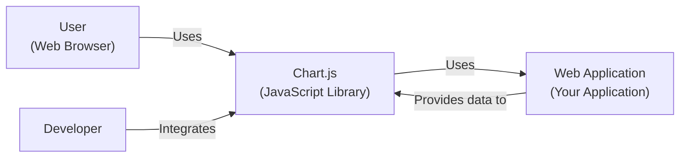
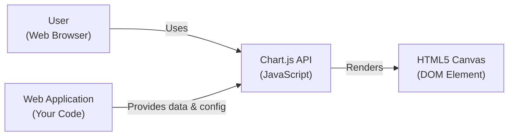
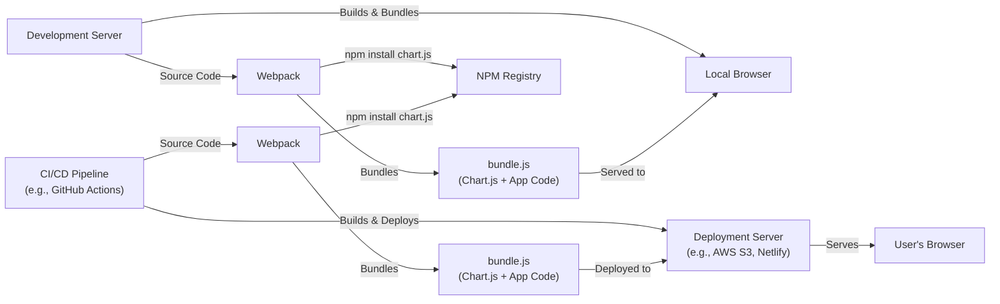
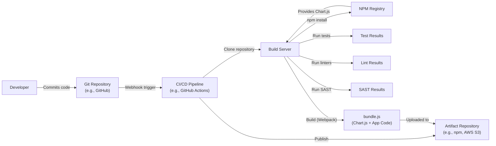

# BUSINESS POSTURE

Business Priorities and Goals:

*   Provide a simple, yet flexible, JavaScript charting library for designers and developers.
*   Maintain an open-source project that is free to use and encourages community contributions.
*   Offer a wide range of chart types to meet diverse data visualization needs.
*   Ensure the library is easy to integrate and customize within various web applications.
*   Maintain high performance and responsiveness, even with large datasets.
*   Provide good documentation and examples to facilitate adoption and usage.

Most Important Business Risks:

*   Malicious code injection through user-supplied data or configurations, leading to website defacement, data breaches, or cross-site scripting (XSS) attacks.
*   Vulnerabilities in the library that could be exploited by attackers to compromise applications using it.
*   Dependency on third-party libraries that may introduce their own security risks (supply chain attacks).
*   Lack of proper input validation, leading to unexpected behavior or crashes.
*   Inadequate documentation or support, hindering adoption and user satisfaction.
*   Performance bottlenecks or scalability issues, impacting user experience.

# SECURITY POSTURE

Existing Security Controls:

*   security control: The project is open-source, allowing for community review and contributions to identify and fix security vulnerabilities. (GitHub repository)
*   security control: The project uses GitHub's built-in features for code review and pull requests, ensuring that changes are reviewed before being merged. (GitHub repository)
*   security control: The project has a `SECURITY.md` file, providing instructions for reporting security vulnerabilities. (GitHub repository)
*   security control: The project uses automated testing to ensure code quality and prevent regressions. (GitHub repository, test suite)
*   security control: The project has documentation that includes examples and best practices, which can help users avoid common security pitfalls. (GitHub repository, documentation)
*   security control: Dependency management using npm, allowing for version pinning and updates to address known vulnerabilities in dependencies. (package.json)

Accepted Risks:

*   accepted risk: The library relies on user-provided data and configurations, which inherently carries a risk of malicious input. It is the responsibility of the implementer to sanitize and validate user input.
*   accepted risk: The library uses third-party dependencies, which may introduce vulnerabilities. While efforts are made to keep dependencies updated, there is always a risk of zero-day exploits.

Recommended Security Controls:

*   security control: Implement a Content Security Policy (CSP) to mitigate the risk of XSS attacks.
*   security control: Regularly run static application security testing (SAST) tools to identify potential vulnerabilities in the codebase.
*   security control: Perform regular dynamic application security testing (DAST) on applications using the library to identify runtime vulnerabilities.
*   security control: Implement a software composition analysis (SCA) tool to track and manage third-party dependencies and their associated vulnerabilities.
*   security control: Provide clear guidance and examples on how to securely handle user-supplied data and configurations.
*   security control: Consider implementing a mechanism for code signing to ensure the integrity of the library.

Security Requirements:

*   Authentication: Not directly applicable, as the library itself does not handle authentication. Authentication is the responsibility of the application using the library.
*   Authorization: Not directly applicable, as the library itself does not handle authorization. Authorization is the responsibility of the application using the library.
*   Input Validation: The library should provide clear documentation and examples on how to validate user-supplied data and configurations to prevent injection attacks. Implementers *must* sanitize and validate all user inputs before passing them to the Chart.js library.
*   Cryptography: If the library handles sensitive data, it should use appropriate cryptographic techniques to protect it. This is primarily the responsibility of the implementing application, but the library should support secure configurations.

# DESIGN

## C4 CONTEXT

Element Descriptions:

*   Element:
    *   Name: User
    *   Type: Person
    *   Description: A person interacting with a web application that uses Chart.js to display charts.
    *   Responsibilities: Views charts, interacts with chart controls (if any).
    *   Security controls: Relies on browser security mechanisms and web application security.

*   Element:
    *   Name: Chart.js
    *   Type: Software System
    *   Description: The Chart.js JavaScript library, used for creating charts within web applications.
    *   Responsibilities: Renders charts based on provided data and configurations, handles user interactions with charts.
    *   Security controls: Relies on secure coding practices, input validation (by the implementer), and potentially CSP.

*   Element:
    *   Name: Web Application
    *   Type: Software System
    *   Description: The application that integrates Chart.js to display charts to the user.
    *   Responsibilities: Provides data to Chart.js, handles user authentication and authorization, manages overall application logic.
    *   Security controls: Authentication, authorization, input validation, output encoding, session management, error handling, etc.

*   Element:
    *   Name: Developer
    *   Type: Person
    *   Description: A software developer who integrates Chart.js into a web application.
    *   Responsibilities: Integrates Chart.js, configures charts, provides data to the library.
    *   Security controls: Follows secure coding practices, validates user input, understands Chart.js security considerations.

## C4 CONTAINER

Element Descriptions:

*   Element:
    *   Name: User
    *   Type: Person
    *   Description: A person interacting with the web application.
    *   Responsibilities: Views and interacts with charts.
    *   Security controls: Relies on browser security and web application security.

*   Element:
    *   Name: Chart.js API
    *   Type: JavaScript Library
    *   Description: The public API of the Chart.js library.
    *   Responsibilities: Provides methods for creating and configuring charts, handles chart rendering and updates.
    *   Security controls: Relies on secure coding practices and input validation performed by the web application.

*   Element:
    *   Name: Canvas
    *   Type: HTML5 Canvas Element
    *   Description: The HTML5 canvas element used to render the charts.
    *   Responsibilities: Displays the visual representation of the chart.
    *   Security controls: Inherits security context of the web page. Relies on browser's implementation of canvas security.

*   Element:
    *   Name: Web Application
    *   Type: Software System/Code
    *   Description: The application code that uses Chart.js.
    *   Responsibilities: Provides data and configuration to the Chart.js API, handles user interactions, and integrates the chart into the application.
    *   Security controls: Input validation, output encoding, authentication, authorization, and other application-specific security measures.

## DEPLOYMENT

Possible Deployment Solutions:

1.  **CDN (Content Delivery Network):** Include Chart.js directly from a CDN like jsDelivr or cdnjs. This is the simplest approach for many users.
2.  **npm/yarn:** Install Chart.js as a dependency using npm or yarn and bundle it with the application's JavaScript code using a bundler like Webpack or Parcel.
3.  **Self-hosting:** Download the Chart.js library files and host them on the same server as the web application.

Chosen Solution (npm/yarn with Webpack):

Element Descriptions:

*   Element:
    *   Name: Development Server
    *   Type: Server
    *   Description: The developer's local machine used for development and testing.
    *   Responsibilities: Runs the development environment, builds and bundles the application code.
    *   Security controls: Local development environment security best practices.

*   Element:
    *   Name: Local Browser
    *   Type: Web Browser
    *   Description: The developer's web browser used for testing the application.
    *   Responsibilities: Displays the application and interacts with the development server.
    *   Security controls: Browser security settings.

*   Element:
    *   Name: Webpack
    *   Type: Module Bundler
    *   Description: A module bundler used to package the application's JavaScript code, including Chart.js.
    *   Responsibilities: Bundles JavaScript modules, manages dependencies.
    *   Security controls: Configuration to prevent inclusion of sensitive information in the bundle.

*   Element:
    *   Name: bundle.js
    *   Type: JavaScript File
    *   Description: The bundled JavaScript file containing the application code and Chart.js.
    *   Responsibilities: Contains the code executed by the browser.
    *   Security controls: Minification, obfuscation (optional), CSP compliance.

*   Element:
    *   Name: NPM Registry
    *   Type: Package Repository
    *   Description: The npm package registry, where Chart.js is hosted.
    *   Responsibilities: Provides access to the Chart.js package.
    *   Security controls: npm's security measures, package signing (if used).

*   Element:
    *   Name: Deployment Server
    *   Type: Server
    *   Description: The server where the application is deployed (e.g., AWS S3, Netlify).
    *   Responsibilities: Hosts the application files and serves them to users.
    *   Security controls: Server security configuration, access controls, HTTPS.

*   Element:
    *   Name: User's Browser
    *   Type: Web Browser
    *   Description: The user's web browser.
    *   Responsibilities: Displays the application and interacts with the deployment server.
    *   Security controls: Browser security settings, HTTPS.

*   Element:
    *   Name: CI/CD Pipeline
    *   Type: Automation Server
    *   Description: A CI/CD pipeline (e.g., GitHub Actions) that automates the build and deployment process.
    *   Responsibilities: Builds, tests, and deploys the application.
    *   Security controls: Secure configuration of the CI/CD pipeline, access controls, secrets management.

*  Element:
    *   Name: WebpackCI
    *   Type: Module Bundler
    *   Description: Instance of Webpack running in CI environment.
    *   Responsibilities: Bundles JavaScript modules, manages dependencies.
    *   Security controls: Configuration to prevent inclusion of sensitive information in the bundle.

*   Element:
    *   Name: BundleJSCI
    *   Type: JavaScript File
    *   Description: The bundled JavaScript file containing the application code and Chart.js, created in CI environment.
    *   Responsibilities: Contains the code executed by the browser.
    *   Security controls: Minification, obfuscation (optional), CSP compliance.

## BUILD

Build Process Description:

1.  **Code Commit:** A developer commits code changes to the Git repository (e.g., GitHub).
2.  **Webhook Trigger:** A webhook triggers the CI/CD pipeline (e.g., GitHub Actions) on code push.
3.  **Clone Repository:** The CI/CD pipeline clones the repository onto the build server.
4.  **npm Install:** The build server runs `npm install` to install project dependencies, including Chart.js, from the NPM Registry.
5.  **Run Tests:** The build server runs the project's test suite.
6.  **Run Linters:** The build server runs linters (e.g., ESLint) to check code style and potential errors.
7.  **Run SAST:** The build server runs a Static Application Security Testing (SAST) tool to identify potential security vulnerabilities in the code.
8.  **Build:** The build server uses Webpack to bundle the application code and Chart.js into a single `bundle.js` file.
9.  **Publish:** The CI/CD pipeline publishes the `bundle.js` file and other assets to an artifact repository (e.g., npm for the library itself, or AWS S3 for a web application using the library).

Security Controls:

*   security control: **Dependency Management:** Using `npm install` with a `package-lock.json` file ensures consistent and reproducible builds, and helps manage dependency vulnerabilities.
*   security control: **Automated Testing:** Running tests as part of the build process helps catch bugs and regressions early.
*   security control: **Linting:** Linters enforce code style and help prevent common coding errors.
*   security control: **SAST:** Static Application Security Testing helps identify potential security vulnerabilities before deployment.
*   security control: **CI/CD Pipeline:** Using a CI/CD pipeline automates the build and deployment process, reducing the risk of manual errors and ensuring consistency.
*   security control: **Artifact Repository:** Storing build artifacts in a secure repository provides a controlled and auditable way to manage releases.
*   security control: **Secrets Management:** CI/CD pipeline should use secure mechanisms for managing secrets (e.g., API keys, passwords) and avoid storing them directly in the code repository.

# RISK ASSESSMENT

Critical Business Processes to Protect:

*   **Website availability and functionality:** Ensuring that websites using Chart.js remain operational and function as expected.
*   **User data privacy:** Protecting any user data that may be processed or displayed by Chart.js (indirectly, through the implementing application).
*   **Reputation:** Maintaining the reputation of Chart.js as a reliable and secure charting library.
*   **Intellectual property:** Protecting the Chart.js codebase from unauthorized use or modification.

Data to Protect and Sensitivity:

*   **Chart data:** This data is provided by the implementing application, and its sensitivity depends on the specific application. It could range from publicly available data to highly sensitive personal or financial information. Chart.js itself does not store this data persistently, but it handles it in memory during rendering.
*   **Chart configurations:** These configurations are also provided by the implementing application and may contain sensitive information, such as API keys or data source URLs, if not handled securely by the implementer.
*   **Source code:** The Chart.js source code is publicly available, but protecting it from unauthorized modification is important to maintain its integrity.

# QUESTIONS & ASSUMPTIONS

Questions:

*   Are there any specific compliance requirements (e.g., GDPR, HIPAA) that apply to applications using Chart.js? This would influence the recommendations for data handling and security controls.
*   What is the expected scale of applications using Chart.js? This would impact performance and scalability considerations.
*   What level of support is provided to users of Chart.js? This would affect the recommendations for documentation and security guidance.
*   What is the process for handling security vulnerabilities reported by external researchers?

Assumptions:

*   BUSINESS POSTURE: The primary business goal is to provide a free, open-source, and widely used charting library.
*   SECURITY POSTURE: The project relies heavily on community contributions and open-source principles for security. Implementers are responsible for securing their own applications and validating user input.
*   DESIGN: The library is primarily used client-side within web browsers. The most common deployment method involves using npm and a module bundler. The build process is automated using a CI/CD pipeline.