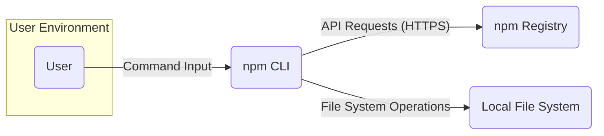
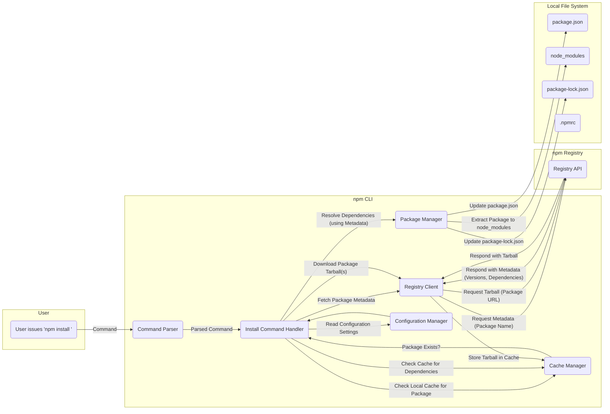
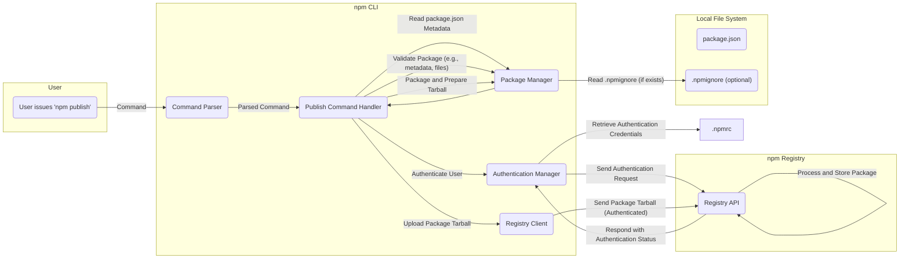

# Project Design Document: npm CLI - Improved

**Version:** 1.1
**Date:** October 26, 2023
**Author:** AI Software Architect

## 1. Introduction

This document provides an enhanced and more detailed design overview of the `npm/cli` project, the command-line interface for the npm package manager. Building upon the previous version, this document further clarifies the system's architecture, components, and data flow, making it even more suitable for subsequent threat modeling activities.

## 2. Goals

*   Provide a comprehensive and refined architectural overview of the `npm/cli`.
*   Elaborate on the responsibilities and interactions of key components.
*   Present more detailed data flow diagrams, highlighting key data elements.
*   Expand on security considerations with more specific examples.
*   Serve as a robust and detailed basis for future threat modeling exercises.

## 3. Scope

This document focuses on the design of the `npm/cli` application itself, encompassing its core functionalities such as package installation, publishing, and dependency management. Interactions with the npm registry and the local file system remain within scope. The internal design and implementation details of the npm registry are considered out of scope.

## 4. High-Level Architecture

The `npm/cli` acts as a crucial intermediary, facilitating communication and actions between the user and the broader npm ecosystem. It interprets user commands, interacts with the remote npm registry service, and manages package installations and configurations within the local environment.

## 5. Detailed Design

### 5.1. Components

*   **Command Parser:**
    *   **Responsibility:**  Receives raw command input from the user.
    *   **Responsibility:**  Tokenizes and parses the input string to identify the command and its arguments.
    *   **Responsibility:**  Validates the command syntax against defined command structures.
    *   **Interaction:**  Passes the parsed command and arguments to the appropriate Command Handler.

*   **Command Handlers:**
    *   **Responsibility:**  Each handler is dedicated to executing a specific npm command (e.g., `install`, `publish`, `uninstall`, `login`).
    *   **Responsibility:**  Orchestrates the sequence of actions required for the command, including data retrieval, processing, and updates.
    *   **Responsibility:**  Handles command-specific logic and error conditions.
    *   **Interaction:**  Utilizes the Registry Client for registry interactions, the Package Manager for package operations, and the Configuration Manager for settings.

*   **Registry Client:**
    *   **Responsibility:**  Manages all communication with the npm registry's API endpoints.
    *   **Responsibility:**  Constructs and sends various types of HTTP requests (GET, POST, PUT, DELETE) to the registry.
    *   **Responsibility:**  Handles request headers, authentication tokens, and data serialization/deserialization (JSON).
    *   **Responsibility:**  Parses HTTP responses and handles potential errors (e.g., network issues, API errors).
    *   **Interaction:**  Used by Command Handlers to fetch package metadata, download tarballs, publish packages, and manage user authentication.

*   **Package Manager:**
    *   **Responsibility:**  Core component for managing the lifecycle of packages within the local environment.
    *   **Responsibility:**  Resolves complex dependency trees, considering semantic versioning and constraints.
    *   **Responsibility:**  Downloads package tarballs from the registry (via the Registry Client).
    *   **Responsibility:**  Extracts package contents to the `node_modules` directory.
    *   **Responsibility:**  Updates `package.json` and `package-lock.json` to reflect changes in dependencies.
    *   **Responsibility:**  Handles package uninstallation and updates.
    *   **Interaction:**  Receives instructions from Command Handlers and interacts with the Cache Manager and Local File System.

*   **Cache Manager:**
    *   **Responsibility:**  Optimizes performance by storing downloaded packages and registry metadata locally.
    *   **Responsibility:**  Implements a caching strategy (e.g., time-based expiry, content-based hashing).
    *   **Responsibility:**  Provides an interface for retrieving cached data and storing new data.
    *   **Responsibility:**  Manages cache invalidation and cleanup.
    *   **Interaction:**  Used by the Package Manager and Registry Client to avoid redundant downloads and API requests.

*   **Configuration Manager:**
    *   **Responsibility:**  Loads and manages npm's extensive configuration settings.
    *   **Responsibility:**  Reads configuration values from multiple sources in a specific order of precedence: command-line flags, environment variables, project-level `.npmrc`, user-level `.npmrc`, and global `.npmrc`.
    *   **Responsibility:**  Provides a consistent interface for accessing configuration values throughout the application.
    *   **Interaction:**  Used by virtually all other components to customize behavior and access settings.

*   **Authentication Manager:**
    *   **Responsibility:**  Handles user authentication with the npm registry.
    *   **Responsibility:**  Manages the login and logout processes, including storing and retrieving authentication tokens (typically in `.npmrc`).
    *   **Responsibility:**  Securely handles sensitive authentication data.
    *   **Responsibility:**  Provides authentication credentials to the Registry Client for API requests requiring authorization.
    *   **Interaction:**  Interacts with the Registry Client for authentication-related API calls and with the Local File System to manage token storage.

*   **Logging System:**
    *   **Responsibility:**  Records events, errors, and informational messages during the execution of commands.
    *   **Responsibility:**  Supports different logging levels (e.g., verbose, debug, info, warn, error).
    *   **Responsibility:**  Provides mechanisms for outputting logs to the console or files.
    *   **Interaction:**  Used by all components to report their activities and any issues encountered.

*   **Update Notifier:**
    *   **Responsibility:**  Periodically checks for new versions of the `npm/cli` on the npm registry.
    *   **Responsibility:**  Notifies the user if a newer version is available, encouraging them to update.
    *   **Responsibility:**  May provide information about the changes in the new version.
    *   **Interaction:**  Uses the Registry Client to fetch the latest version information.

### 5.2. Data Flow

#### 5.2.1. Package Installation (Detailed)

**Description:**

1. The user initiates the installation process with the `npm install` command.
2. The **Command Parser** interprets the command and extracts the target package.
3. The **Install Command Handler** orchestrates the installation workflow.
4. The **Cache Manager** is queried to check if the package is already available locally.
5. If not cached, the **Registry Client** retrieves package metadata from the **Registry API**.
6. The **Package Manager** analyzes the metadata to resolve dependencies.
7. The **Cache Manager** is checked for the resolved dependencies.
8. The **Registry Client** downloads the necessary package tarballs.
9. Downloaded tarballs are stored in the **Cache Manager**.
10. The **Package Manager** extracts the package contents to the `node_modules` directory.
11. The **Package Manager** updates the `package.json` and `package-lock.json` files to reflect the installed packages and their versions.
12. The **Configuration Manager** provides necessary configuration settings throughout the process.

#### 5.2.2. Package Publishing (Detailed)

**Description:**

1. The user initiates the publishing process with the `npm publish` command.
2. The **Command Parser** interprets the command.
3. The **Publish Command Handler** takes control of the publishing workflow.
4. The **Package Manager** reads essential metadata from the local `package.json` file.
5. The **Authentication Manager** handles user authentication by retrieving credentials and interacting with the **Registry API**.
6. The **Package Manager** performs validation checks on the package metadata and contents.
7. The **Package Manager** reads the `.npmignore` file (if present) to exclude files from the published package.
8. The **Package Manager** packages the project files into a tarball.
9. The **Registry Client** uploads the prepared package tarball to the **Registry API**, including authentication credentials.
10. The **Registry API** processes the uploaded package, performs its own validation, and stores the package in the registry.

## 6. Security Considerations

*   **Authentication and Authorization:**
    *   Secure storage and handling of user authentication tokens (e.g., using appropriate file permissions for `.npmrc`).
    *   Ensuring that API requests to the registry are properly authenticated to prevent unauthorized package publishing or access.
    *   Protecting against credential theft or leakage.
*   **Input Validation:**
    *   Strict validation of user-provided input (package names, versions, command arguments) to prevent command injection vulnerabilities.
    *   Sanitizing input before using it in file system operations or when constructing API requests.
*   **Secure Communication:**
    *   Enforcing the use of HTTPS for all communication with the npm registry to protect data in transit from eavesdropping and manipulation.
    *   Verifying the SSL/TLS certificates of the registry.
*   **Dependency Security:**
    *   Providing tools like `npm audit` to identify and mitigate known vulnerabilities in project dependencies.
    *   Educating users about the risks associated with vulnerable dependencies.
*   **Local File System Security:**
    *   Protecting sensitive information stored locally, such as authentication tokens and cached packages, through appropriate file system permissions.
    *   Mitigating risks associated with malicious packages writing to arbitrary locations on the file system.
*   **Code Injection:**
    *   Preventing the execution of arbitrary code during package installation or through malicious package scripts.
    *   Implementing security checks and sandboxing where feasible.
*   **Denial of Service (DoS):**
    *   Implementing rate limiting and other mechanisms to protect against attacks that could overwhelm the CLI or the registry.
    *   Handling large or malformed responses from the registry gracefully.
*   **Cache Poisoning:**
    *   Ensuring the integrity of the local package cache to prevent the installation of compromised packages.
    *   Using content hashes to verify the integrity of cached data.
*   **Supply Chain Security:**
    *   Encouraging the use of package signing and verification mechanisms to ensure the authenticity and integrity of downloaded packages.
    *   Providing mechanisms for users to report and address potentially malicious packages.

## 7. Technology Stack

*   **Language:** JavaScript
*   **Runtime Environment:** Node.js
*   **HTTP Client:**  `node-fetch` or built-in `https` module.
*   **File System Access:** Built-in Node.js `fs` module.
*   **Command-Line Argument Parsing:** `yargs` or a similar library.
*   **Configuration Management:**  Likely a custom implementation leveraging Node.js file system APIs and potentially libraries for parsing `.ini`-like files.
*   **Cryptographic Functions:** Built-in Node.js `crypto` module for tasks like hashing and potentially signature verification.
*   **Promise Library:** Native Promises or a polyfill.

## 8. Deployment Model

The `npm/cli` is distributed as an npm package (`npm`). Users typically install it globally using Node.js package managers (including itself) or through Node.js installers. It is executed directly from the command line.

## 9. Non-Functional Requirements

*   **Performance:**
    *   Package installation should be efficient, minimizing download times and processing overhead.
    *   Dependency resolution should be fast, even for complex dependency trees.
    *   Command execution should be responsive and provide timely feedback to the user.
*   **Security:**
    *   The CLI must protect user credentials and prevent malicious activities.
    *   It should adhere to security best practices in its design and implementation.
    *   Regular security audits and vulnerability assessments should be conducted.
*   **Reliability:**
    *   The CLI should operate consistently and predictably across different platforms and environments.
    *   Error handling should be robust, providing informative messages to the user.
*   **Usability:**
    *   The command-line interface should be clear, intuitive, and easy to use.
    *   Help documentation and error messages should be helpful and informative.
*   **Maintainability:**
    *   The codebase should be well-structured, modular, and easy to understand and modify.
    *   Clear coding standards and documentation should be maintained.

## 10. Future Considerations

*   **Enhanced Security Features:**
    *   Integration with software bill of materials (SBOM) generation tools.
    *   Improved vulnerability scanning and reporting capabilities.
    *   Support for package signing and verification by default.
*   **Plugin Architecture:**
    *   Developing a robust plugin system to allow for extending the CLI's functionality.
    *   Enabling community contributions and customization.
*   **Performance Optimizations:**
    *   Further optimizing package download and extraction processes.
    *   Improving the efficiency of dependency resolution algorithms.
*   **Improved User Experience:**
    *   More interactive and informative command output.
    *   Better error reporting and guidance.
    *   Potentially exploring alternative user interfaces.

This improved document provides a more detailed and refined understanding of the `npm/cli` project's design. It offers a stronger foundation for identifying potential threats and vulnerabilities during subsequent threat modeling activities.