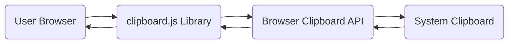
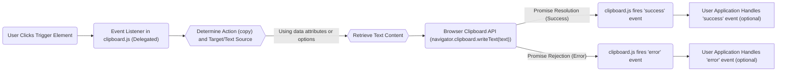
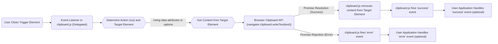

## Project Design Document: clipboard.js (Improved)

**1. Introduction**

This document provides an enhanced design overview of the `clipboard.js` library (available at [https://github.com/zenorocha/clipboard.js](https://github.com/zenorocha/clipboard.js)). Building upon the initial design, this version offers more detailed explanations of the library's architecture, functionalities, and key components, with a stronger emphasis on security considerations relevant for threat modeling. The aim is to provide a comprehensive understanding of the library's inner workings and potential vulnerabilities.

**2. Goals and Scope**

The primary goal of `clipboard.js` remains to offer a simple, efficient, and Flash-free method for copying text to the clipboard in modern browsers. The scope of this document is strictly limited to the client-side JavaScript library and its direct interactions with the browser's clipboard API. Server-side interactions, the hosting environment of the library, or any third-party integrations are explicitly excluded from this design document.

**3. System Overview**

`clipboard.js` is a lightweight, dependency-free JavaScript library designed to facilitate copy and cut operations by leveraging the browser's native clipboard API. It operates by attaching event listeners to designated trigger elements (such as buttons or links) and programmatically interacting with the browser's clipboard interface.

**3.1. High-Level Architecture**

*   **"User Browser"**: The client-side environment where the `clipboard.js` library is executed. This encompasses the user's web browser application and the specific web page embedding the library.
*   **"clipboard.js Library"**: The core JavaScript codebase responsible for managing user interactions, determining the content to be copied or cut, and interfacing with the browser's clipboard API.
*   **"Browser Clipboard API"**: The standardized interface provided by web browsers that allows JavaScript code to programmatically access the operating system's clipboard. This API enforces browser security policies.
*   **"System Clipboard"**: The operating system's temporary storage area where copied or cut data is held. This is accessible by other applications running on the system.

**3.2. Key Functionalities**

*   **Copying Text to Clipboard**: Enables users to copy textual content to the system clipboard when a designated trigger element is activated.
*   **Cutting Text to Clipboard**: Allows users to cut textual content (copy to the clipboard and subsequently remove from the source element) upon activation of a trigger element.
*   **Target Element Selection**: Provides flexible mechanisms to specify the source HTML element whose content should be copied or cut. This can be achieved through:
    *   CSS Selectors: Targeting elements based on their CSS classes, IDs, or other attributes.
    *   Function Callback: Providing a JavaScript function that dynamically returns the target element at the time of the event.
*   **Trigger Element Definition**:  Specifies the HTML element (e.g., `<button>`, `<a>`) that, when interacted with (typically a click), initiates the copy or cut operation.
*   **Event Listener Management**:  The library internally manages event listeners attached to the trigger elements to detect user interactions.
*   **Support for Dynamic Content**:  Capable of copying content that is generated or modified dynamically on the client-side.
*   **Asynchronous Clipboard Operations**: Utilizes the asynchronous nature of the `navigator.clipboard` API, returning Promises for better handling of clipboard interactions.
*   **Custom Event Dispatching**:  Dispatches custom events (e.g., `success`, `error`) to allow the embedding application to react to the outcome of clipboard operations.

**4. Detailed Design**

**4.1. Components**

*   **`ClipboardJS` Class**: The primary class that encapsulates the core logic and functionality of the library.
    *   **Constructor (`constructor(selector, options)`):**
        *   Initializes the `ClipboardJS` instance.
        *   Accepts a CSS selector string or a DOM element as the target for event delegation.
        *   Accepts an optional `options` object to configure behavior (e.g., `target`, `text`, `action`).
        *   Attaches event listeners to the specified element using event delegation for efficiency.
    *   **`destroy()` Method:**
        *   Removes all attached event listeners to prevent memory leaks and unexpected behavior when the library is no longer needed.
    *   **`onClick(event)` Method:**
        *   The central event handler triggered when a click event occurs on a designated trigger element.
        *   Determines the intended action (copy or cut) and the target element based on data attributes or provided options.
        *   Calls the appropriate methods to interact with the clipboard API.
    *   **`resolveOptions(element)` Method:**
        *   Evaluates the options for a specific trigger element.
        *   Prioritizes data attributes (`data-clipboard-target`, `data-clipboard-text`, `data-clipboard-action`) over options passed to the constructor.
        *   Executes any provided function callbacks to dynamically determine the target or text.
    *   **`select(target)` Method:**
        *   Selects the content of the target element if it's an input or textarea. This is necessary for the `cut` operation.
    *   **`copyText(text)` Method:**
        *   Asynchronously writes the provided `text` to the system clipboard using `navigator.clipboard.writeText()`.
        *   Returns a Promise that resolves on success and rejects on failure.
    *   **`cutText(target)` Method:**
        *   Selects the content of the `target` element.
        *   Asynchronously writes the selected text to the clipboard using `navigator.clipboard.writeText()`.
        *   If successful, removes the content from the `target` element.
    *   **`fire(eventName, context)` Method:**
        *   Dispatches custom events (e.g., `success`, `error`) on the trigger element.
        *   Provides a `context` object containing information about the operation (e.g., text, trigger element, target element).

*   **Event Delegation Mechanism:**
    *   Instead of attaching individual event listeners to each trigger element, a single event listener is attached to a parent element (specified in the constructor).
    *   This improves performance, especially when dealing with a large number of trigger elements.
    *   The `onClick` method checks if the clicked element matches the selector for trigger elements.

*   **HTML Data Attributes:**
    *   `data-clipboard-text`: Specifies the text to be copied directly from the attribute value.
    *   `data-clipboard-target`: Specifies a CSS selector for the element whose content should be copied or cut.
    *   `data-clipboard-action`: Specifies the action to be performed (`copy` or `cut`).

**4.2. Data Flow (Copy Operation - Enhanced)**

**4.3. Data Flow (Cut Operation - Enhanced)**

**5. Security Considerations (Expanded)**

*   **Cross-Site Scripting (XSS) via Pasted Content:**  A primary security concern is the potential for XSS vulnerabilities when content copied using `clipboard.js` is pasted into a vulnerable application. `clipboard.js` itself does not perform any sanitization or encoding of the copied data. The responsibility for ensuring the safety of pasted content lies entirely with the receiving application.
    *   **Mitigation:** Applications receiving clipboard data must implement robust input validation and output encoding mechanisms to prevent the execution of malicious scripts.
*   **Data Injection and Manipulation:** Malicious actors could potentially manipulate the `data-clipboard-text` attribute or the content of the target element to inject harmful data into the clipboard. This could lead to users unknowingly copying and pasting malicious content into other applications.
    *   **Mitigation:**  Ensure that the content being copied is from a trusted source. Avoid dynamically setting `data-clipboard-text` or target element content based on untrusted user input without proper sanitization.
*   **Browser Security Policies and Permissions:** Modern browsers implement security restrictions regarding clipboard access. The `navigator.clipboard.writeText()` API typically requires user interaction (a direct user gesture like a click) to grant permission for clipboard access. Programmatic access without user interaction is generally blocked for security reasons.
    *   **Mitigation:** Design user interfaces that trigger clipboard operations in response to explicit user actions. Be aware of browser limitations regarding clipboard access in different contexts.
*   **HTTPS Requirement for Asynchronous API:** The asynchronous `navigator.clipboard.writeText()` API generally requires a secure context (HTTPS). Using `clipboard.js` on an insecure (HTTP) page might result in the clipboard operation failing or throwing an error.
    *   **Mitigation:** Deploy applications using `clipboard.js` over HTTPS to ensure the availability and security of the clipboard API.
*   **Potential for Clickjacking:** While less direct, if the trigger elements for `clipboard.js` are styled in a way that misleads users, it could potentially be used in a clickjacking attack.
    *   **Mitigation:** Ensure that trigger elements are clearly visible and their purpose is evident to the user. Follow secure UI/UX design principles.
*   **Information Disclosure (Less Likely):** In scenarios where sensitive information is being copied, there's a theoretical risk of information disclosure if the user's clipboard is compromised by other malicious software. This is not a vulnerability within `clipboard.js` itself but a broader system security concern.
    *   **Mitigation:** Educate users about the risks of malware and encourage them to maintain secure systems.
*   **Dependency Chain Risks (Indirect):** Although `clipboard.js` is dependency-free, the applications that use it will have their own dependencies. Vulnerabilities in those dependencies could indirectly impact the security of the application using `clipboard.js`.
    *   **Mitigation:** Regularly audit and update all dependencies in the application using `clipboard.js`.

**6. Dependencies**

*   None. `clipboard.js` is designed to be a zero-dependency library.

**7. Deployment**

`clipboard.js` is typically deployed as a static JavaScript file that is included within the HTML of a web page. Common deployment methods include:

*   Direct inclusion using a `<script>` tag.
*   Bundling with other JavaScript assets using module bundlers like Webpack, Parcel, or Rollup.
*   Serving via a Content Delivery Network (CDN).

**8. Future Considerations (Potential Enhancements)**

*   **Enhanced Error Handling and Reporting:** Providing more granular error codes and detailed error messages could assist developers in diagnosing and resolving issues related to clipboard operations.
*   **Support for Copying Rich Text/HTML:** Expanding the library's capabilities to handle copying formatted text or HTML content could be a valuable addition. This would likely involve using the `navigator.clipboard.write()` API with appropriate data formats.
*   **Improved Integration with JavaScript Frameworks:** While already widely adopted, providing more specific integration guides or components for popular frameworks like React, Vue, and Angular could further simplify its use.
*   **Accessibility Considerations:**  Further review and potential enhancements to ensure the library is fully accessible to users with disabilities.

**9. Conclusion**

`clipboard.js` remains a valuable and efficient tool for implementing clipboard functionality in web applications. This improved design document provides a more in-depth understanding of its architecture, data flow, and, critically, the security considerations associated with its use. By understanding these aspects, developers can build more secure and robust applications that leverage the capabilities of `clipboard.js` responsibly. Threat modeling efforts should focus on the potential attack vectors outlined in the security considerations section, particularly concerning the handling of pasted content and the potential for data injection.
