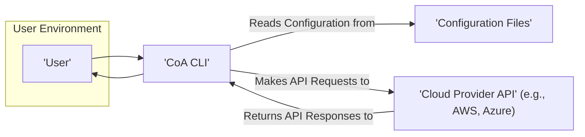

# Project Design Document: Cloud Orchestration Assistant (CoA)

**Version:** 1.1
**Date:** October 26, 2023
**Author:** AI Cloud & Security Architect

## 1. Introduction

This document provides an enhanced design overview of the Cloud Orchestration Assistant (CoA), a command-line interface (CLI) tool designed for streamlined management of cloud resources. The project, located at [https://github.com/veged/coa](https://github.com/veged/coa), aims to simplify interactions with cloud providers by abstracting away the complexities of their native APIs. This document details the system's architecture, key components, and data flow, specifically tailored to facilitate comprehensive threat modeling.

## 2. Goals

*   Provide a user-friendly and intuitive CLI for managing cloud infrastructure.
*   Abstract the intricacies of individual cloud provider APIs, offering a consistent user experience.
*   Enable declarative management of cloud resources through human-readable configuration files.
*   Support essential CRUD (Create, Read, Update, Delete) operations for common cloud resources.
*   Offer a degree of cloud provider independence, allowing users to manage resources across different platforms with similar commands.

## 3. Non-Goals

*   To be a comprehensive Infrastructure-as-Code (IaC) platform with advanced features like state diffing, drift detection, and complex dependency management.
*   Development of a web-based graphical user interface (GUI). The focus remains solely on the CLI.
*   Support for every conceivable cloud resource or configuration parameter offered by each provider. The tool will focus on commonly used resources.
*   Implementation of real-time monitoring, alerting, or performance management capabilities.

## 4. System Architecture

### 4.1. High-Level Architecture

*   **User:** The individual or automated system interacting with the CoA CLI to manage cloud resources.
*   **CoA CLI:** The core executable, written in Python, responsible for command parsing, configuration processing, authentication, and interaction with cloud provider APIs.
*   **Configuration Files:**  Human-readable files (likely YAML or JSON) that define the desired state of cloud resources. These files act as the source of truth for resource definitions.
*   **Cloud Provider API:** The platform-specific Application Programming Interface exposed by the target cloud provider (e.g., AWS, Azure, GCP).

### 4.2. Detailed Component Architecture

The CoA CLI internally comprises several key modules working in concert:

1. **Command Line Interface (CLI) Parser:**  Utilizes a library (e.g., `argparse` or `click` in Python) to interpret commands and options provided by the user. This component validates the syntax of the commands.
2. **Configuration Management Module:**
    *   **Loader:** Reads configuration files from specified locations.
    *   **Validator:**  Ensures the configuration files adhere to the expected schema and contain valid resource definitions.
    *   **Parser:**  Transforms the configuration file content into internal data structures representing cloud resources.
3. **Cloud Provider Abstraction Layer (Provider Interface):**  A crucial component that provides an abstract interface for interacting with different cloud providers. This layer:
    *   Maps CoA's internal resource representations to the specific API calls of each supported cloud provider.
    *   Handles provider-specific authentication and authorization mechanisms.
    *   Manages API request construction and response processing.
4. **Authentication and Authorization Handler:**  Manages the secure retrieval and handling of credentials required to interact with cloud provider APIs. This might involve:
    *   Reading credentials from environment variables.
    *   Utilizing cloud provider SDK credential providers (e.g., AWS credential chain).
    *   Potentially supporting credential storage mechanisms (though this introduces security considerations).
5. **State Management (Implicit/Basic):** While not a fully featured state management system, CoA implicitly tracks the resources it creates or manages. This might involve:
    *   Storing resource IDs or names locally or within the configuration.
    *   Querying the cloud provider for the current state of resources.
6. **Output Formatting Engine:**  Transforms the raw responses received from cloud provider APIs into a user-friendly format (e.g., plain text, JSON, YAML).
7. **Error Handling and Logging:**  Manages errors encountered during command execution, API calls, or configuration processing. This component also handles logging of actions and errors for auditing and debugging.

## 5. Data Flow

The following diagram illustrates the typical flow of data when a user executes a command to create a cloud resource using CoA:

```mermaid
flowchart LR
    A["'User' issues CLI command"] --> B("CoA CLI: 'Command Parser'");
    B -- "Parses command & options" --> C("CoA CLI: 'Configuration Management Module'");
    C -- "Loads & validates configuration" --> D("CoA CLI: 'Cloud Provider Abstraction Layer'");
    D -- "Translates to provider-specific API request" --> E["'Cloud Provider API'"];
    E -- "Executes resource creation" --> F("CoA CLI: 'Cloud Provider Abstraction Layer'");
    F -- "Processes API response" --> G("CoA CLI: 'Output Formatting Engine'");
    G -- "Formats output for user" --> H["'User' receives output"];
```

*   **User issues CLI command:** The user interacts with the CoA CLI by typing a command.
*   **CoA CLI: Command Parser:** The command parser interprets the command and its options.
*   **CoA CLI: Configuration Management Module:** This module loads and validates the relevant configuration file defining the resource to be created.
*   **CoA CLI: Cloud Provider Abstraction Layer:** The abstraction layer translates the generic resource definition into the specific API call required by the target cloud provider. It also handles authentication.
*   **Cloud Provider API:** The cloud provider's API receives the request and attempts to create the resource.
*   **CoA CLI: Cloud Provider Abstraction Layer:** The abstraction layer receives the response from the cloud provider, indicating success or failure.
*   **CoA CLI: Output Formatting Engine:** The output formatter prepares the response for display to the user.
*   **User receives output:** The user sees the result of the command execution.

## 6. Security Considerations (Detailed for Threat Modeling)

This section outlines key security considerations relevant for threat modeling of the CoA project:

*   **Credential Management:**
    *   **Threat:** Storage of sensitive cloud provider credentials (API keys, access tokens) within configuration files or the application itself.
    *   **Consideration:** How are credentials securely stored and accessed? Are environment variables, dedicated credential management tools, or cloud provider SDK credential chains utilized? Is encryption at rest considered for stored credentials?
    *   **Threat:** Exposure of credentials through insecure logging or error messages.
    *   **Consideration:** Are sensitive credentials redacted from logs and error outputs?
*   **Configuration File Security:**
    *   **Threat:** Unauthorized access or modification of configuration files containing sensitive information.
    *   **Consideration:** What are the recommended practices for securing configuration files (e.g., file system permissions, encryption)?
    *   **Threat:** Injection of malicious code or configurations through compromised configuration files.
    *   **Consideration:** Is there input validation and sanitization of data read from configuration files?
*   **API Interaction Security:**
    *   **Threat:** Man-in-the-middle attacks intercepting communication between CoA and cloud provider APIs.
    *   **Consideration:** Is HTTPS enforced for all API communication? Are TLS versions and cipher suites appropriately configured?
    *   **Threat:** Replay attacks exploiting captured API requests.
    *   **Consideration:** Are there mechanisms to prevent replay attacks (though this is often handled by the cloud provider)?
*   **Authentication and Authorization:**
    *   **Threat:**  Insufficiently granular permissions granted to the credentials used by CoA, leading to potential for over-provisioning or unauthorized actions.
    *   **Consideration:** Does CoA follow the principle of least privilege when interacting with cloud provider APIs? Are users guided on setting up appropriate IAM roles or policies?
    *   **Threat:**  Bypass of authentication mechanisms.
    *   **Consideration:**  Is the authentication process robust and secure, leveraging established cloud provider authentication methods?
*   **Input Validation:**
    *   **Threat:**  Command injection vulnerabilities if user input is not properly sanitized before being used in system calls or API requests.
    *   **Consideration:** Is all user input validated and sanitized to prevent injection attacks?
*   **Dependency Management:**
    *   **Threat:**  Vulnerabilities in third-party libraries used by CoA.
    *   **Consideration:** Is there a process for regularly scanning dependencies for known vulnerabilities and updating them? Are dependency lock files used to ensure consistent and secure dependency versions?
*   **Logging and Auditing:**
    *   **Threat:** Insufficient logging making it difficult to track actions and identify security incidents.
    *   **Consideration:** Are all significant actions performed by CoA logged, including user commands, API calls, and errors? Are logs stored securely and accessible for auditing?
*   **Error Handling:**
    *   **Threat:**  Exposure of sensitive information through verbose error messages.
    *   **Consideration:** Are error messages designed to be informative for debugging without revealing sensitive details?

## 7. Assumptions

*   Users possess the necessary understanding of cloud computing concepts and the target cloud provider's services.
*   Configuration files accurately represent the desired state of cloud resources and adhere to the expected syntax.
*   The underlying network infrastructure is secure and reliable.
*   Users are responsible for securely managing the environment where the CoA CLI is executed.

## 8. Future Considerations

*   Implementation of a more robust state management system to track resource deployments and detect drift.
*   Expansion of cloud provider support and the range of manageable resource types.
*   Development of a plugin architecture to allow for extending CoA's functionality.
*   Integration with CI/CD pipelines for automated infrastructure provisioning and management.
*   Enhanced error reporting and debugging capabilities, potentially including more detailed logging and tracing.

This enhanced design document provides a more detailed and security-focused overview of the CoA project, making it a more effective foundation for subsequent threat modeling activities.
