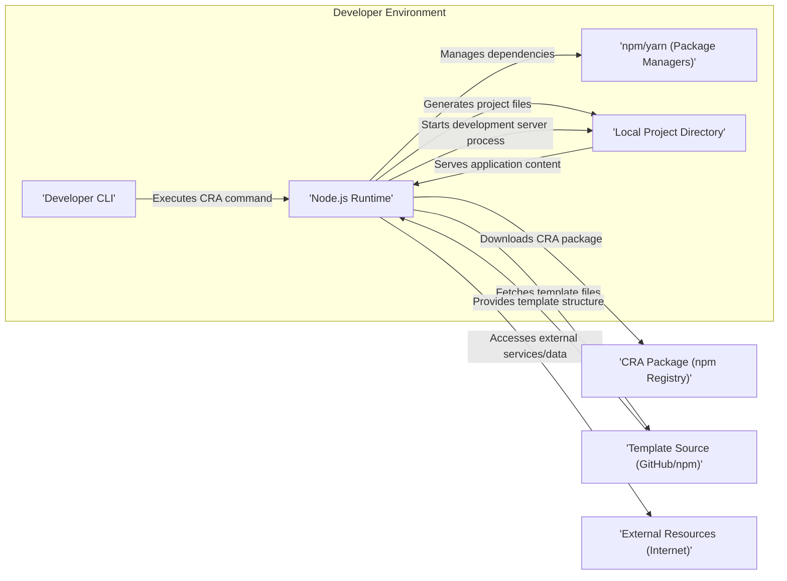

# Project Design Document: Create React App (CRA) - Improved

**Version:** 1.1
**Date:** October 26, 2023
**Author:** AI Software Architect

## 1. Introduction

This document provides an enhanced architectural design of the Create React App (CRA) project, a widely adopted tool by Facebook for streamlining the setup of React applications. This revised document aims for greater clarity and detail regarding CRA's components, data flow, and interactions, specifically tailored for effective threat modeling.

## 2. Goals and Objectives

*   **Primary Goal:** To deliver a refined and more detailed architectural overview of the Create React App project, optimized for threat modeling.
*   **Objectives:**
    *   Clearly delineate the key components and their specific responsibilities.
    *   Provide a more granular description of the data flow and interactions between components.
    *   Explicitly highlight potential attack surfaces and areas of security concern for threat modeling exercises.
    *   Document the project's structure, dependencies, and external interactions with greater precision.

## 3. Target Audience

This document is intended for:

*   Security engineers and architects tasked with performing threat modeling and security assessments on CRA.
*   Developers actively contributing to the development and maintenance of the CRA project.
*   Individuals seeking an in-depth understanding of CRA's internal architecture from a security perspective.

## 4. Scope

This document focuses on the architectural aspects of the `create-react-app` command-line interface (CLI) tool relevant to security considerations. It encompasses the process of initiating a new React application using CRA, including:

*   Project setup and the utilization of templates.
*   Management of project dependencies.
*   Configuration and operation of the development server.
*   The build process for generating production-ready applications.

This document explicitly excludes:

*   The internal workings and architecture of the React applications generated by CRA.
*   Fine-grained details of underlying tools such as Webpack, Babel, or ESLint, unless their interaction with CRA presents a direct security implication.
*   The runtime behavior and security of applications once they are built and deployed.

## 5. System Architecture

The Create React App project functions as a command-line tool that orchestrates various processes to establish and manage React application development environments. The core components and their interactions are depicted in the following diagram:

### 5.1. Component Descriptions

*   **'Developer CLI':** The command-line interface through which developers interact with CRA, issuing commands like `npx create-react-app my-app`. This is the primary entry point for using CRA.
*   **'Node.js Runtime':** The JavaScript runtime environment necessary for executing the CRA CLI tool and its associated scripts. This provides the execution context for CRA.
*   **'npm/yarn (Package Managers)':** Tools utilized by CRA to handle project dependencies, including downloading, installing, and managing required packages from package registries. These are crucial for obtaining necessary code.
*   **'Local Project Directory':** The directory created on the developer's machine by CRA, containing the generated React application files, configuration, and dependencies. This is where the application code resides.
*   **'CRA Package (npm Registry)':** The published and versioned package of the `create-react-app` tool hosted on the npm registry. This is the source from which the CRA tool itself is obtained.
*   **'Template Source (GitHub/npm)':** Repositories, often hosted on platforms like GitHub or within npm packages, that contain the base structure, configuration, and initial files for new React applications. CRA uses these as blueprints.
*   **'External Resources (Internet)':** Represents the broader internet, from which CRA might download packages, fetch templates, or access other external resources during its operation.

### 5.2. Detailed Process Flows

*   **Project Initialization Workflow:**
    *   The developer initiates the process by executing a `create-react-app <app-name>` command via the 'Developer CLI'.
    *   The 'Node.js Runtime' executes the CRA CLI tool.
    *   CRA downloads its latest version or a specified version from the 'CRA Package (npm Registry)'.
    *   CRA utilizes 'npm/yarn (Package Managers)' to install core dependencies defined within its own package.json.
    *   CRA fetches the default template or a user-specified template from a 'Template Source (GitHub/npm)'. This involves downloading files and potentially executing scripts within the template.
    *   CRA generates the initial project structure and files within the 'Local Project Directory' based on the retrieved template.
    *   CRA uses 'npm/yarn (Package Managers)' to install the necessary dependencies for the newly generated project, as defined in the template's package.json.

*   **Development Server Operation:**
    *   The developer starts the development server using commands like `npm start` or `yarn start` within the 'Local Project Directory'.
    *   These commands trigger scripts defined in the project's `package.json`, typically invoking `react-scripts`.
    *   `react-scripts` launches a development server (often leveraging Webpack Dev Server).
    *   The development server monitors file changes within the 'Local Project Directory'.
    *   Upon detecting changes, the server recompiles the application code and facilitates hot-reloading in the browser. This involves reading and processing source code.

*   **Production Build Process:**
    *   The developer initiates the build process with commands such as `npm run build` or `yarn build` within the 'Local Project Directory'.
    *   These commands execute scripts defined in the project's `package.json`, again typically using `react-scripts`.
    *   `react-scripts` employs tools like Webpack and Babel to bundle, optimize, and transpile the application code for production deployment. This involves significant code transformation and processing.
    *   The resulting build artifacts (static HTML, CSS, and JavaScript files) are generated in a designated build directory within the 'Local Project Directory'.

## 6. Data Flow Analysis

This section details the movement and transformation of data within the CRA ecosystem:

*   **Command Input Data:** The commands and arguments provided by the developer to the CRA CLI, which dictate the actions CRA will perform.
*   **Package Data:** The downloaded packages (CRA itself and project dependencies) from the npm registry, containing code and metadata.
*   **Template Data:** The files and scripts retrieved from template repositories, forming the initial structure of the generated application.
*   **Generated File Data:** The source code, configuration files, and other assets created by CRA within the project directory.
*   **Source Code Data:** The React application code written by the developer.
*   **Configuration Data:** Files like `package.json`, Webpack configuration, and other settings that govern the build and development processes.
*   **Build Artifact Data:** The optimized and bundled static files produced by the build process, ready for deployment.

## 7. Security Considerations and Potential Attack Surfaces

This section outlines potential security considerations and identifies potential attack surfaces within the CRA architecture.

*   **Dependency Chain Vulnerabilities:** CRA relies on a deep dependency tree managed by npm/yarn. Vulnerabilities in any of these dependencies could be exploited if not properly managed or updated.
    *   **Impacted Component:** 'npm/yarn (Package Managers)', 'Node.js Runtime', 'Local Project Directory'.
    *   **Threat:** Supply chain attacks, arbitrary code execution.
*   **Template Injection and Malicious Templates:** If using custom templates, a compromised or malicious template source could inject harmful code or configurations into the generated project.
    *   **Impacted Component:** 'Template Source (GitHub/npm)', 'Node.js Runtime', 'Local Project Directory'.
    *   **Threat:** Arbitrary code execution, information disclosure.
*   **Compromised CRA Package:** If the 'CRA Package (npm Registry)' itself is compromised, any developer using it could be affected.
    *   **Impacted Component:** 'CRA Package (npm Registry)', 'Node.js Runtime'.
    *   **Threat:** Widespread supply chain attack, arbitrary code execution on developer machines.
*   **Development Server Exposure Risks:** While intended for local development, if the development server is inadvertently exposed to a wider network, it could present security vulnerabilities.
    *   **Impacted Component:** 'Node.js Runtime', 'Local Project Directory'.
    *   **Threat:** Information disclosure, cross-site scripting (XSS) if not properly configured.
*   **Build Process Manipulation:**  If the build process or its dependencies are compromised, malicious code could be injected into the build artifacts.
    *   **Impacted Component:** 'Node.js Runtime', 'Local Project Directory'.
    *   **Threat:**  Malware distribution, backdoors in the deployed application.
*   **Insecure Configuration:** Misconfigurations within CRA's settings or the underlying tools could introduce vulnerabilities.
    *   **Impacted Component:** 'Local Project Directory', 'Node.js Runtime'.
    *   **Threat:**  Information disclosure, denial of service.
*   **Exposure of Sensitive Information:**  Accidental inclusion of sensitive information (API keys, secrets) within the generated project or build artifacts.
    *   **Impacted Component:** 'Local Project Directory'.
    *   **Threat:**  Credential theft, unauthorized access.

## 8. Assumptions and Constraints

*   It is assumed that the developer's machine has a securely configured and up-to-date 'Node.js Runtime' and 'npm/yarn (Package Managers)'.
*   The security of the 'npm Registry' and the integrity of downloaded packages are generally assumed, but this is a potential risk area.
*   The security of 'Template Source (GitHub/npm)' is variable and depends on the specific source being used.
*   This design focuses on the CRA tool itself and not the security practices of developers using the tool.

## 9. Future Considerations

*   A deeper dive into the security mechanisms and best practices recommended for managing dependencies within CRA projects.
*   Analysis of the security implications of different template engines and customization options within CRA.
*   Examination of the security update mechanisms for CRA and its core dependencies.
*   Consideration of integrating static analysis security testing (SAST) or software composition analysis (SCA) tools into the CRA workflow.

This improved document provides a more detailed and security-focused architectural overview of Create React App, intended to facilitate more effective threat modeling and security assessments.