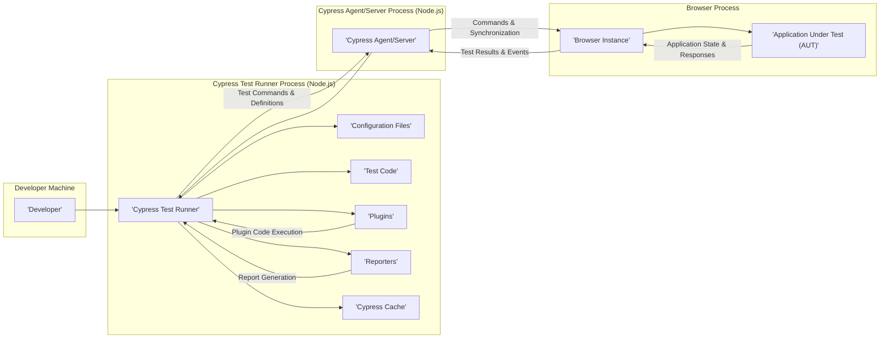

# Project Design Document: Cypress.io

**Version:** 1.1
**Date:** October 26, 2023
**Author:** AI Software Architect

## 1. Introduction

This document provides a detailed architectural overview of the Cypress.io end-to-end testing framework, specifically tailored for threat modeling purposes. It outlines the key components, their interactions, and the data flow within the system, with a focus on security-relevant aspects.

## 2. Goals

*   Provide a clear and comprehensive understanding of the Cypress architecture from a security perspective.
*   Identify key components and their responsibilities, highlighting potential attack surfaces.
*   Describe the data flow within the Cypress ecosystem, emphasizing the movement of sensitive information.
*   Serve as a robust foundation for identifying and analyzing potential security vulnerabilities during threat modeling exercises.

## 3. Scope

This document covers the core architectural components of Cypress as a testing framework and their interactions during test execution. The focus is on aspects relevant to security, including data handling, communication channels, and potential points of compromise. It does not delve into the intricacies of the Cypress API at a code level but focuses on the architectural interactions.

## 4. Target Audience

*   Security engineers responsible for threat modeling and security assessments.
*   Software architects and developers involved in the design, development, and maintenance of systems utilizing Cypress.
*   DevOps engineers managing the deployment and infrastructure for Cypress in various environments.

## 5. High-Level Overview

Cypress is a developer-centric, JavaScript-based end-to-end testing framework that executes tests directly within the web browser alongside the application under test (AUT). This unique architecture allows for real-time interaction and observation of the application's behavior. Key characteristics relevant to security include its direct access to the DOM, its Node.js-based test runner, and its reliance on browser capabilities.

## 6. Architectural Components

The Cypress architecture comprises several interacting components:

*   **Cypress Test Runner (Node.js Process):** The central orchestrator of the test execution. It reads test files, manages the test lifecycle, communicates with the Cypress Agent/Server, and generates reports.
*   **Cypress Agent/Server (Node.js Process):** Acts as a proxy and communication bridge between the Test Runner and the browser. It translates commands and synchronizes actions.
*   **Browser Instance:** A web browser (e.g., Chrome, Firefox, Edge) where the AUT is loaded and where Cypress executes test commands within the same run loop as the application.
*   **Application Under Test (AUT):** The web application being tested, running within the browser instance.
*   **Test Code (JavaScript Files):**  The scripts written by developers defining test scenarios, steps, and assertions. These scripts are executed by the Test Runner and interpreted by the browser.
*   **Cypress Configuration:** Settings defined in files like `cypress.config.js` that control Cypress behavior, including base URLs, environment variables, and integration settings. This configuration can influence security aspects.
*   **Plugins API (Node.js Context):** Allows developers to extend Cypress functionality by writing custom code that runs within the Test Runner's Node.js environment. This introduces potential security risks if plugins are malicious or vulnerable.
*   **Reporters (Node.js Modules):** Responsible for generating test reports in various formats. These reports might contain sensitive information depending on the test scenarios.
*   **Cypress Cache (File System):** Cypress utilizes a cache to store downloaded dependencies, browser profiles, and other data to improve performance. This cache could be a target for attackers.

## 7. System Architecture Diagram

## 8. Data Flow (Security Relevant Aspects)

The data flow within Cypress involves the transmission and processing of various types of information, some of which are security-sensitive:

*   **Test Code:** Developers write test code that may include sensitive data like user credentials (ideally for test accounts only), API keys, or specific data patterns. This code is read by the Test Runner.
*   **Configuration Data:** Configuration files can contain sensitive information such as API endpoints, environment variables with secrets, and authentication details.
*   **Test Commands:** The Test Runner sends commands to the Agent/Server, which are then translated and executed within the browser. These commands can manipulate the AUT and potentially expose vulnerabilities.
*   **Application State and Responses:** The browser interacts with the AUT, and the responses and state changes are observed by Cypress. This data might contain sensitive information from the application.
*   **Test Results and Events:**  Detailed results of test executions, including pass/fail status, error messages, and potentially captured screenshots or videos, are transmitted back to the Test Runner. These results could reveal security flaws or sensitive data.
*   **Plugin Data:** Plugins can interact with the file system, network, and other resources, potentially introducing security risks if they handle data insecurely.
*   **Report Data:** Generated reports can contain sensitive information captured during the tests, requiring secure storage and handling.
*   **Cached Data:** The Cypress cache might store downloaded dependencies (potentially with vulnerabilities), browser profiles (which could contain browsing history or cookies), and other temporary files.

## 9. Security Considerations (Detailed)

This section expands on potential security vulnerabilities and threats associated with the Cypress architecture:

*   **Test Code Injection/Manipulation:**
    *   **Threat:** Malicious actors could inject or modify test code to perform unauthorized actions on the AUT, exfiltrate data, or disrupt testing processes.
    *   **Mitigation:** Implement code review processes, secure code storage, and access controls for test code repositories.
*   **Insecure Configuration:**
    *   **Threat:** Storing sensitive information (e.g., API keys, passwords) directly in configuration files or using insecure configuration practices can lead to exposure.
    *   **Mitigation:** Utilize secure configuration management techniques, environment variables, and secrets management solutions. Avoid committing sensitive data to version control.
*   **Malicious or Vulnerable Plugins:**
    *   **Threat:** Third-party or custom plugins could contain vulnerabilities or malicious code that could compromise the Test Runner environment or the AUT.
    *   **Mitigation:**  Thoroughly vet and audit plugins before use. Implement a process for managing and updating plugin dependencies. Consider using a restricted plugin environment.
*   **Insecure Communication Channels:**
    *   **Threat:**  While communication between the Test Runner and the browser is generally within the local machine, vulnerabilities in the communication protocol or implementation could be exploited.
    *   **Mitigation:** Ensure Cypress and its dependencies are up-to-date with security patches. Monitor for any unusual network activity.
*   **Dependency Vulnerabilities:**
    *   **Threat:** Cypress relies on numerous Node.js packages, which may contain known vulnerabilities.
    *   **Mitigation:** Regularly scan dependencies for vulnerabilities using tools like `npm audit` or `yarn audit`. Implement a process for updating vulnerable dependencies promptly.
*   **Insufficient Access Control:**
    *   **Threat:**  Lack of proper access controls to test environments, test code, and test results could allow unauthorized individuals to modify tests, access sensitive data, or disrupt the testing process.
    *   **Mitigation:** Implement role-based access control (RBAC) for test environments and related resources. Securely manage credentials used for testing.
*   **Exposure of Sensitive Data in Test Artifacts:**
    *   **Threat:** Test reports, screenshots, and videos might inadvertently capture sensitive data from the AUT.
    *   **Mitigation:** Implement data masking or sanitization techniques in test code. Securely store and manage test artifacts, limiting access as needed.
*   **Browser Security Vulnerabilities:**
    *   **Threat:**  Vulnerabilities in the browser used for testing could be exploited during test execution.
    *   **Mitigation:** Keep the browser used for testing up-to-date with the latest security patches. Consider using dedicated browser profiles for testing.
*   **Cache Exploitation:**
    *   **Threat:** Attackers could potentially access or manipulate the Cypress cache to gain access to sensitive information or inject malicious code.
    *   **Mitigation:** Implement appropriate file system permissions for the Cypress cache directory. Consider encrypting the cache if it contains highly sensitive data.

## 10. Dependencies (Security Implications)

Cypress's dependencies introduce potential security considerations:

*   **Node.js:**  Vulnerabilities in the Node.js runtime environment could directly impact the security of the Test Runner and Agent/Server processes. Regular updates are crucial.
*   **npm/yarn:**  The package managers themselves can have vulnerabilities that could be exploited during dependency installation. Using the latest versions and verifying package integrity is important.
*   **Web Browser (Chromium, Firefox, etc.):** Browser vulnerabilities can be exploited during test execution. Keeping the browser updated is essential.
*   **Third-Party Node.js Packages:** Each dependency introduces a potential attack surface. Regularly auditing and updating these dependencies is critical.

## 11. Deployment Considerations (Security Context)

The deployment environment significantly impacts the security posture of Cypress:

*   **Local Development:** While generally lower risk, ensure developer machines are secure to prevent test code or configuration compromise.
*   **Continuous Integration (CI) Pipelines:** CI environments often handle sensitive credentials and access to production systems. Securely managing secrets and access within the CI pipeline is crucial. Isolation of CI build agents is also important.
*   **Cloud-Based Testing Platforms:**  The security of the chosen platform and the configuration of Cypress within that platform are critical. Understand the platform's security responsibilities and implement appropriate security measures.

## 12. Future Considerations (Security Focus)

*   **Enhanced Plugin Security Mechanisms:** Implementing stricter controls and sandboxing for plugins.
*   **Built-in Secret Management Integration:**  Providing native support for integrating with secrets management solutions.
*   **Security Auditing Tools Integration:**  Facilitating integration with static and dynamic analysis security tools.
*   **Improved Reporting of Security-Relevant Events:** Enhancing reporting to highlight potential security issues detected during testing.

This improved document provides a more detailed and security-focused architectural overview of Cypress, intended to be a valuable resource for threat modeling and security assessments. The expanded security considerations and dependency analysis offer a deeper understanding of potential vulnerabilities within the Cypress ecosystem.