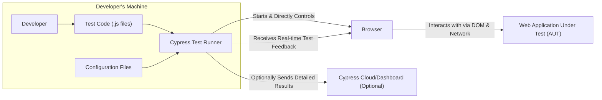

# Project Design Document: Cypress.io Testing Framework

**Version:** 1.1
**Date:** October 26, 2023
**Prepared By:** Gemini (AI Architecture Expert)

## 1. Introduction

This document provides a detailed architectural design of the Cypress.io end-to-end testing framework. It outlines the key components, their interactions, and the overall system architecture. This document serves as a foundation for subsequent threat modeling activities, ensuring a clear understanding of the system's structure and potential vulnerabilities.

### 1.1. Purpose

The primary purpose of this document is to provide a clear and comprehensive description of the Cypress.io architecture. This detailed description will serve as the essential input for conducting thorough threat modeling, enabling the identification of potential security vulnerabilities and the design of effective mitigation strategies.

### 1.2. Scope

This document comprehensively covers the core architectural components of Cypress, including the Test Runner, its direct integration with the browser, and the interaction mechanisms with the application under test (AUT). It also provides an overview of the optional Cypress Cloud/Dashboard service and its role within the ecosystem.

### 1.3. Audience

This document is intended for a diverse audience, including:

* Security engineers and architects responsible for conducting threat modeling and security assessments.
* Development teams currently using or considering the adoption of Cypress for their testing needs.
* Anyone requiring a detailed understanding of Cypress's internal architecture and operational flow.

## 2. Overview

Cypress represents a modern approach to front-end testing, purpose-built for the dynamic nature of the contemporary web. It empowers developers to create faster, more intuitive, and significantly more reliable end-to-end tests. A key differentiator from traditional Selenium-based tools is Cypress's direct execution within the browser, alongside the application being tested. This co-location offers substantial advantages in terms of execution speed, simplified debugging processes, and enhanced control over the testing environment's variables.

## 3. Architectural Design

The architecture of Cypress is structured around several interconnected components that work in concert to facilitate efficient and effective end-to-end testing.

### 3.1. Key Components

* **"Cypress Test Runner":** The central application, built on Node.js, responsible for orchestrating the entire test execution process.
* **"Browser":** A real web browser instance (e.g., Chrome, Firefox, Edge) that Cypress directly manages and uses to execute tests.
* **"Web Application Under Test (AUT)":** The specific web application being subjected to testing, with Cypress interacting with it in a manner that simulates real user behavior.
* **"Cypress API":** A comprehensive set of commands and utilities provided by Cypress, enabling developers to define and write test logic.
* **"Configuration Files (e.g., cypress.config.js)":** Files that store configuration parameters for Cypress, including base URLs, viewport settings, and environment-specific variables.
* **"Cypress Cloud/Dashboard (Optional)":** A cloud-based service offering features for recording, organizing, and analyzing the results of test executions.

### 3.2. Component Interactions

The following diagram illustrates the interactions and relationships between the core components of the Cypress architecture:

### 3.3. Detailed Component Description

* **"Cypress Test Runner":**
    * A core Node.js application responsible for the following key functions:
        * Loading, parsing, and interpreting the JavaScript test files written by developers.
        * Launching and meticulously managing the lifecycle of the designated browser instance.
        * Acting as a proxy to intercept and manage network requests flowing between the browser and the AUT.
        * Executing the Cypress API commands within the controlled browser environment.
        * Aggregating, processing, and reporting the outcomes of the test executions.
    * Serves as the critical intermediary, seamlessly connecting the developer's test specifications with the browser's execution environment.

* **"Browser":**
    * A fully functional web browser (typically based on Chromium) where the Cypress tests are executed in real-time.
    * Cypress exerts direct programmatic control over the browser's Document Object Model (DOM) and network communication layers.
    * The browser hosts both the AUT and the Cypress test code concurrently, enabling a tightly integrated testing process.

* **"Web Application Under Test (AUT)":**
    * The specific web application that is the target of the testing process.
    * Cypress interacts with the AUT by simulating actions that a real user would perform, such as clicks, form entries, and navigation.

* **"Cypress API":**
    * A comprehensive and developer-friendly set of JavaScript commands that form the basis for writing test logic.
    * Provides a wide array of methods for:
        * Precisely selecting and interacting with elements within the DOM structure.
        * Simulating a variety of user interactions, including clicks, typing, and scrolling.
        * Making assertions about the application's current state and behavior.
        * Managing and inspecting network requests and their corresponding responses.
        * Interacting with browser-specific storage mechanisms, such as local storage and cookies.

* **"Configuration Files (e.g., `cypress.config.js`):**
    * JavaScript files that serve as the central repository for configuring the Cypress testing environment.
    * Allow for extensive customization of various aspects, including:
        * Specifying the base URL of the application under test.
        * Defining the dimensions of the browser viewport for consistent testing.
        * Setting environment-specific variables to tailor tests to different deployments.
        * Configuring settings for both integration and component testing methodologies.
        * Integrating and configuring various Cypress plugins to extend functionality.

* **"Cypress Cloud/Dashboard (Optional)":**
    * An optional, cloud-hosted service provided by Cypress to enhance test management and analysis.
    * Offers a range of features, including:
        * Recording detailed test runs, including video captures, screenshots at failure points, and comprehensive logs.
        * Providing tools for organizing and analyzing test results, making it easier to identify trends and patterns.
        * Facilitating seamless integration with Continuous Integration and Continuous Deployment (CI/CD) pipelines.
        * Enabling collaboration among team members through shared access to test results and recordings.

## 4. Data Flow

The typical flow of data during a Cypress test execution involves these key stages:

1. A developer authors test code using the intuitive commands provided by the Cypress API.
2. The Cypress Test Runner is initiated, starting the test execution process.
3. The Test Runner loads and parses the configuration files to establish the parameters of the testing environment.
4. The Test Runner launches a dedicated browser instance for test execution.
5. The Test Runner injects and loads the compiled test code directly into the managed browser.
6. The browser navigates to the specified URL of the application under test (AUT).
7. The Cypress test code begins execution within the browser, interacting directly with the AUT's interface.
8. Cypress commands simulate user interactions and perform assertions to validate application behavior.
9. The Test Runner intercepts and monitors network requests exchanged between the browser and the AUT, providing insights into API interactions.
10. Comprehensive test results, including pass/fail status, detailed logs, screenshots of failures, and video recordings, are collected within the browser environment.
11. The Test Runner presents the consolidated test results to the developer, providing immediate feedback.
12. Optionally, the Test Runner transmits detailed test results, including videos and screenshots, to the Cypress Cloud/Dashboard for centralized management and analysis.

## 5. Security Considerations (Crucial for Threat Modeling)

This section highlights key security considerations that are paramount for the subsequent threat modeling process. A thorough understanding of these areas is essential for identifying potential vulnerabilities and designing robust security measures.

* **"Test Code Security":**  The security of the test code itself is critical. Maliciously crafted or poorly written test code could inadvertently interact with the AUT in unintended and potentially harmful ways, potentially exposing underlying vulnerabilities or causing unintended side effects. Careful code review and secure coding practices for test development are essential.
* **"Data Security in Cypress Cloud":** For teams utilizing the optional Cypress Cloud, the security and privacy of the recorded test data are paramount. This includes videos, screenshots, and detailed logs, which may contain sensitive information. Robust access control mechanisms, data encryption both in transit and at rest, and adherence to relevant data privacy regulations are crucial considerations.
* **"Communication Security":** Secure communication channels are necessary for all interactions. This includes the communication between the Test Runner and the controlled browser instance, as well as the communication between the Test Runner and the Cypress Cloud. Encryption protocols (like TLS/SSL) should be enforced to prevent eavesdropping and tampering of sensitive data during transmission.
* **"Configuration Management Security":** Configuration files may contain sensitive information, such as API keys, credentials, or other secrets. Secure storage and management of these files are vital to prevent unauthorized access. Techniques like environment variables, secure vaults, or encrypted configuration files should be employed.
* **"Browser Security":** The security posture of the browser instance used for testing is also relevant. While Cypress manages the browser, vulnerabilities within the browser itself could potentially be exploited. Keeping the browser version up-to-date and adhering to browser security best practices is important.
* **"Dependency Security":** Cypress, being a Node.js application, relies on a range of third-party dependencies. The security of these dependencies needs to be carefully managed to prevent the introduction of known vulnerabilities. Regular dependency scanning and updates are necessary.
* **"Access Control to Cypress Infrastructure":** In scenarios where Cypress is deployed in a self-hosted environment, implementing strict access control measures to the underlying infrastructure is crucial to prevent unauthorized access and potential misuse.

## 6. Assumptions and Constraints

* It is assumed that developers utilizing Cypress possess a foundational understanding of JavaScript and core web development principles.
* The primary focus of Cypress is on testing web applications; other application types are outside the scope of this document.
* This document provides a generalized architectural overview; specific implementation details may vary slightly across different versions of Cypress.
* The Cypress Cloud/Dashboard is considered an optional service and its usage is not a prerequisite for using the core Cypress framework.

## 7. Future Considerations

* Further investigation into the security implications of utilizing Cypress plugins and extensions, as these can introduce external code and potential vulnerabilities.
* A deeper analysis of the security of the Cypress API itself, identifying potential misuse scenarios or vulnerabilities within the API surface.
* A comprehensive review of the security measures and controls implemented within the Cypress Cloud/Dashboard service to ensure data protection and privacy.
* Ongoing monitoring of browser security policies and their potential impact on Cypress functionality and test execution.

This document provides a detailed and improved understanding of the Cypress architecture, specifically tailored for effective threat modeling. The clearly defined components, their interactions, and the outlined data flow serve as a solid foundation for identifying potential security risks and designing appropriate mitigation strategies. The emphasized security considerations provide a focused lens for the subsequent threat analysis process.