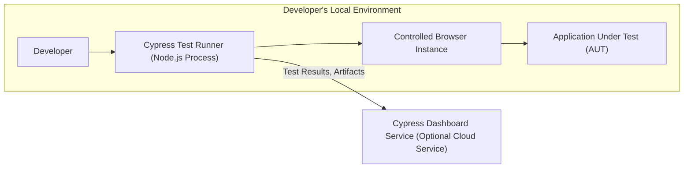
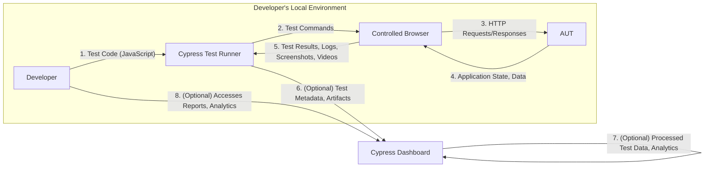

# Project Design Document: Cypress.io End-to-End Testing Framework

**Version:** 1.1
**Date:** October 26, 2023
**Author:** AI Software Architect

## 1. Introduction

This document provides an enhanced and detailed architectural design of the Cypress.io end-to-end testing framework. It elaborates on the key components, their interactions, and the data flow within the system, with a stronger emphasis on security considerations. This document serves as a robust foundation for subsequent threat modeling activities, enabling a comprehensive understanding of potential security vulnerabilities and attack surfaces.

## 2. Goals

*   Provide a clear, comprehensive, and more detailed overview of the Cypress architecture.
*   Elaborate on the key components, their specific functionalities, and interdependencies.
*   Illustrate the data flow within the Cypress ecosystem with greater granularity.
*   Highlight potential areas of security concern with more specific examples and potential attack vectors for future threat modeling.
*   Serve as a definitive and easily understandable reference point for developers, security analysts, and stakeholders.

## 3. High-Level Architecture

Cypress is a JavaScript-based end-to-end testing framework that executes directly within the browser, offering a unique approach to web application testing. It comprises several interconnected components that facilitate test creation, execution, and result analysis.

*   **Developer:**  The user who authors, configures, and initiates Cypress tests.
*   **Cypress Test Runner (Node.js Process):** The central orchestrator, responsible for loading tests, managing the browser, and collecting results.
*   **Controlled Browser Instance:** A real browser (Chromium-based, Firefox, or Edge) launched and directly manipulated by Cypress for test execution.
*   **Application Under Test (AUT):** The web application being subjected to end-to-end testing.
*   **Cypress Dashboard Service (Optional Cloud Service):** A hosted platform for recording, organizing, visualizing, and analyzing test execution data.

## 4. Detailed Architecture and Components

This section provides an in-depth look at the individual components of Cypress, detailing their functionalities and security implications.

### 4.1. Cypress Test Runner (Node.js Process)

*   **Description:** The core engine of Cypress, implemented as a Node.js application. It acts as the intermediary between the developer, the test code, and the browser. It manages the test lifecycle, from loading test files to reporting results.
*   **Key Responsibilities:**
    *   **Test Discovery and Loading:** Locates and parses test files written in JavaScript.
    *   **Browser Management:** Launches and controls the designated browser instance.
    *   **Command Proxy:**  Intercepts and modifies network traffic between the browser and the AUT, enabling powerful control and observation.
    *   **Test Execution Orchestration:** Sends commands to the browser to interact with the AUT.
    *   **Result Aggregation and Reporting:** Collects test outcomes, logs, screenshots, and videos.
    *   **Plugin Management:** Loads and executes user-defined plugins to extend Cypress functionality.
    *   **Communication with Dashboard:**  Transmits test data to the Cypress Dashboard Service (if configured).
    *   **Developer UI (Cypress App):** Provides a graphical interface for running tests, inspecting the application state, and debugging.
*   **Potential Security Considerations:**
    *   **Node.js Vulnerabilities:** Susceptible to vulnerabilities in the Node.js runtime environment and its dependencies.
    *   **Configuration Exposure:** Sensitive information (API keys, credentials) might be present in configuration files.
    *   **Plugin Security:** Malicious or poorly written plugins can introduce security risks, including arbitrary code execution.
    *   **Developer UI XSS:** Potential for cross-site scripting vulnerabilities in the developer interface.
    *   **Command Injection:** If plugin configurations or test code allow unsanitized external input, command injection could be possible.

### 4.2. Controlled Browser Instance

*   **Description:** A real web browser instance (typically Chromium-based, but also supports Firefox and Edge) that Cypress launches and directly controls. This direct control is a key differentiator of Cypress.
*   **Key Responsibilities:**
    *   **Rendering the AUT:**  Loads and displays the web application being tested.
    *   **JavaScript Execution:** Executes JavaScript commands injected by Cypress to interact with the DOM and simulate user actions.
    *   **DOM Manipulation:**  Allows Cypress to directly interact with and inspect the Document Object Model of the AUT.
    *   **Network Activity:**  Sends and receives HTTP requests to the AUT.
    *   **Screenshot and Video Capture:**  Records visual artifacts of the test execution.
*   **Potential Security Considerations:**
    *   **Browser Vulnerabilities:**  The browser instance itself might contain security vulnerabilities that could be exploited during test execution.
    *   **Data Exposure:** Cypress has extensive access to the browser's state and data, which could be a risk if the Test Runner is compromised.
    *   **Interaction with Malicious AUT:** If testing a potentially compromised AUT, the browser instance could be exposed to malicious scripts or content.
    *   **Local Storage/Cookie Manipulation:** Cypress can manipulate local storage and cookies, potentially leading to security issues if not handled carefully.

### 4.3. Application Under Test (AUT)

*   **Description:** The web application that Cypress is designed to test. It can be any web application accessible via a URL.
*   **Key Responsibilities:**
    *   **Serving Application Logic:** Provides the backend functionality and data for the web application.
    *   **Rendering User Interface:**  Delivers the HTML, CSS, and JavaScript that constitute the front-end of the application.
    *   **Handling User Interactions:** Responds to actions initiated by Cypress tests.
*   **Potential Security Considerations:**
    *   **Target for Attacks:** The AUT is the primary target for security vulnerabilities, and Cypress tests can inadvertently uncover or even trigger these vulnerabilities.
    *   **Exposure through Testing:**  Cypress tests might interact with the AUT in ways that expose vulnerabilities not easily found through manual testing.
    *   **Data Injection:**  Malicious test code could attempt to inject harmful data into the AUT.

### 4.4. Cypress Dashboard Service (Optional Cloud Service)

*   **Description:** A cloud-based platform offered by Cypress.io for enhanced test management and analysis. It provides features for recording, organizing, and visualizing test results across different environments and CI/CD pipelines.
*   **Key Responsibilities:**
    *   **Test Result Storage:** Persistently stores test outcomes, logs, screenshots, and videos.
    *   **Test Run Organization:**  Groups and categorizes test runs for better management.
    *   **Analytics and Reporting:** Provides insights into test performance, flakiness, and historical trends.
    *   **User Authentication and Authorization:** Controls access to the dashboard and its features.
    *   **API Access:** Offers an API for integrating with other tools and services.
*   **Potential Security Considerations:**
    *   **Data Breach:** Risk of unauthorized access to stored test data, which might contain sensitive information.
    *   **Authentication and Authorization Flaws:** Vulnerabilities in the authentication and authorization mechanisms could allow unauthorized access.
    *   **API Security:**  Insecure API endpoints or improper authentication could lead to data leaks or manipulation.
    *   **Data Privacy:** Concerns about the privacy of test data stored on a third-party service.
    *   **Supply Chain Security:**  Reliance on a third-party service introduces potential supply chain risks.

## 5. Data Flow

The following diagram provides a more detailed illustration of the data flow during a Cypress test execution, highlighting the types of data exchanged.

1. **Developer Writes Test Code (JavaScript):** Developers create test scripts defining the interactions with the AUT.
2. **Test Commands:** The Cypress Test Runner translates test code into specific commands for the browser.
3. **HTTP Requests/Responses:** The controlled browser interacts with the AUT using standard HTTP protocols.
4. **Application State, Data:** The AUT responds with application data and updates its state.
5. **Test Results, Logs, Screenshots, Videos:** The browser and Test Runner capture detailed information about the test execution.
6. **(Optional) Test Metadata, Artifacts:** The Test Runner uploads structured data and files to the Cypress Dashboard.
7. **(Optional) Processed Test Data, Analytics:** The Cypress Dashboard processes and analyzes the received data.
8. **(Optional) Accesses Reports, Analytics:** Developers can view and analyze test results on the Cypress Dashboard.

## 6. Key Interactions and Communication Channels

*   **Developer to Test Runner:** Primarily through CLI commands, configuration files (e.g., `cypress.config.js`), and test files.
*   **Test Runner to Browser:** Via a sophisticated custom proxy that operates at the network layer, allowing deep inspection and manipulation of traffic. This includes WebSocket communication for real-time control.
*   **Browser to AUT:** Standard HTTP/HTTPS requests and responses.
*   **Test Runner to Dashboard:** Secure HTTPS API calls, often authenticated using API keys or tokens.

## 7. Security Considerations (Detailed for Threat Modeling)

This section provides a more detailed breakdown of potential security concerns, offering specific examples for threat modeling.

*   **Authentication and Authorization:**
    *   **Dashboard Access Control:** How robust are the authentication and authorization mechanisms for accessing the Cypress Dashboard? Are there risks of brute-force attacks, credential stuffing, or privilege escalation?
    *   **API Key Management:** How are API keys for Dashboard communication generated, stored, and rotated? Are there risks of leakage or unauthorized use?
    *   **Single Sign-On (SSO) Integration:** If SSO is used, are there vulnerabilities in the integration that could be exploited?
*   **Data Security and Privacy:**
    *   **Data at Rest:** How is test data (results, logs, screenshots, videos) encrypted on the Cypress Dashboard servers? What physical and logical security measures are in place?
    *   **Data in Transit:** Is all communication between the Test Runner and the Dashboard encrypted using TLS? Are there risks of man-in-the-middle attacks?
    *   **Data Retention Policies:** What are the data retention policies for the Cypress Dashboard? Are there risks of data breaches due to long retention periods?
    *   **Personally Identifiable Information (PII):** Could test data inadvertently contain PII? How is this handled and protected?
*   **Input Validation:**
    *   **Test Code Injection:** Could malicious test code be crafted to exploit vulnerabilities in the Test Runner or the AUT?
    *   **Configuration Injection:** Are there risks of injecting malicious code or commands through configuration settings?
    *   **Plugin Security:** How are plugins validated and sandboxed to prevent malicious actions?
*   **Code Execution:**
    *   **Arbitrary JavaScript Execution:** The ability to execute arbitrary JavaScript in the browser context is powerful but also a potential risk. Could this be exploited to perform malicious actions on the user's machine or the AUT?
    *   **Plugin Code Execution:**  Malicious plugins could execute arbitrary code on the machine running the Test Runner.
*   **Network Security:**
    *   **Proxy Vulnerabilities:** Are there vulnerabilities in the custom proxy used by Cypress that could be exploited?
    *   **Man-in-the-Middle Attacks:** While TLS is used, are there any weaknesses in the implementation that could allow MITM attacks?
*   **Dependency Management:**
    *   **Supply Chain Attacks:** Are the dependencies of the Cypress Test Runner and its plugins regularly scanned for vulnerabilities? Could a compromised dependency introduce security risks?
*   **Secrets Management:**
    *   **Hardcoded Credentials:** Are there risks of developers hardcoding sensitive credentials in test code or configuration files?
    *   **Environment Variable Security:** How are environment variables used for secrets managed and protected?

## 8. Assumptions and Limitations

*   This document describes the general architecture of Cypress. Specific implementations and configurations may vary.
*   The security considerations are intended to be comprehensive but may not cover all potential vulnerabilities. Thorough threat modeling is essential.
*   The focus is primarily on the Cypress framework itself and its interaction with the AUT and the Dashboard. Security considerations for the underlying operating system and hardware are not explicitly addressed.

## 9. Conclusion

This enhanced design document provides a more detailed and security-focused overview of the Cypress.io architecture. By elaborating on the functionalities of each component, clarifying the data flow, and providing specific security considerations, this document serves as a valuable resource for conducting in-depth threat modeling. Understanding these architectural details and potential vulnerabilities is crucial for building secure and reliable end-to-end testing strategies using Cypress.