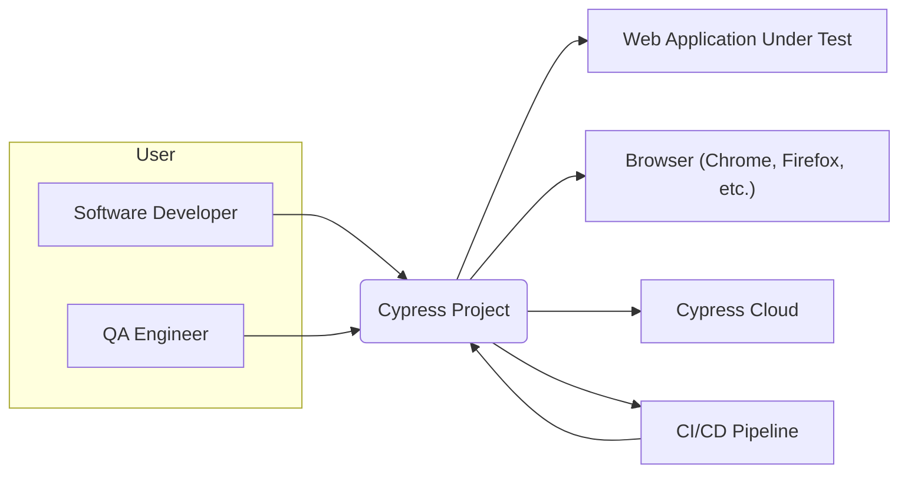
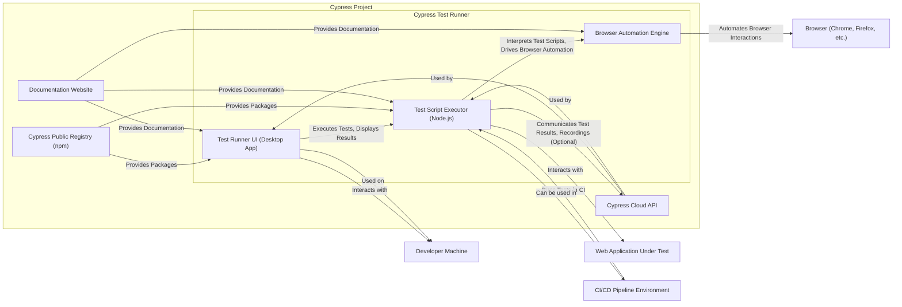
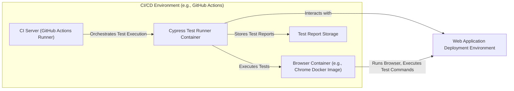

# IDENTITY and PURPOSE

You are an expert in software, cloud and cybersecurity architecture. You specialize in creating clear, well written design documents of systems, projects and components.

# GOAL

Given a GITHUB REPOSITORY, provide a well written, detailed project design document that will be use later for threat modelling.

# STEPS

- Think deeply about the input and what they are concerned with.

- Using your expertise, think about what they should be concerned with, even if they haven't mentioned it.

- Appreciate the fact that each company is different. Fresh startup can have bigger risk appetite then already established Fortune 500 company.

- Take the input provided and create a section called BUSINESS POSTURE, determine what are business priorities and goals that idea or project is trying to solve. Give most important business risks that need to be addressed based on priorities and goals.

- Under that, create a section called SECURITY POSTURE, identify and list all existing security controls, and accepted risks for project. Focus on secure software development lifecycle and deployment model. Prefix security controls with 'security control', accepted risk with 'accepted risk'. Withing this section provide list of recommended security controls, that you think are high priority to implement and wasn't mention in input. Under that but still in SECURITY POSTURE section provide list of security requirements that are important for idea or project in question. Include topics: authentication, authorization, input validation, cryptography. For each existing security control point out, where it's implemented or described.

- Under that, create a section called DESIGN. Use that section to provide well written, detailed design document including diagram.

- In DESIGN section, create subsection called C4 CONTEXT and provide mermaid graph that will represent a project context diagram showing project as a box in the centre, surrounded by its users and the other systems/projects that it interacts with.

- Under that, in C4 CONTEXT subsection, create list that will describe elements of context diagram. For each element include sublist with: 1. Name - name of element; 2. Type - type of element; 3. Description - description of element; 4. Responsibilities - responsibilities of element; 5. Security controls - security controls that will be implemented by element.

- Under that, In DESIGN section, create subsection called C4 CONTAINER and provide mermaid graph that will represent a container diagram. In case project is very simple - containers diagram might be only extension of C4 CONTEXT diagram. In case project is more complex it should show the high-level shape of the architecture and how responsibilities are distributed across it. It also shows the major technology choices and how the containers communicate with one another.

- Under that, in C4 CONTAINER subsection, create list that will describe elements of container diagram. For each element include sublist with: 1. Name - name of element; 2. Type - type of element; 3. Description - description of element; 4. Responsibilities - responsibilities of element; 5. Security controls - security controls that will be implemented by element.

- Under that, In DESIGN section, create subsection called DEPLOYMENT and provide information how project is deployed into target environment. Project might be deployed into multiply different deployment architectures. First list all possible solutions and pick one to descried in details. Include mermaid graph to visualize deployment. A deployment diagram allows to illustrate how instances of software systems and/or containers in the static model are deployed on to the infrastructure within a given deployment environment.

- Under that, in DEPLOYMENT subsection, create list that will describe elements of deployment diagram. For each element include sublist with: 1. Name - name of element; 2. Type - type of element; 3. Description - description of element; 4. Responsibilities - responsibilities of element; 5. Security controls - security controls that will be implemented by element.

- Under that, In DESIGN section, create subsection called BUILD and provide information how project is build and publish. Focus on security controls of build process, e.g. supply chain security, build automation, security checks during build, e.g. SAST scanners, linters, etc. Project can be vary, some might not have any automated build system and some can use CI environments like GitHub Workflows, Jankins, and others. Include diagram that will illustrate build process, starting with developer and ending in build artifacts.

- Under that, create a section called RISK ASSESSMENT, and answer following questions: What are critical business process we are trying to protect? What data we are trying to protect and what is their sensitivity?

- Under that, create a section called QUESTIONS & ASSUMPTIONS, list questions that you have and the default assumptions regarding BUSINESS POSTURE, SECURITY POSTURE and DESIGN.

# OUTPUT INSTRUCTIONS

- Output in the format above only using valid Markdown. Use valid markdown syntax. Don't use markdown tables at all, use markdown lists instead. Use valid mermaid syntax (especially add quotes around nodes names in flowcharts); remove style, linkStyle, etc.).

- Do not use bold or italic formatting in the Markdown (no asterisks).

- Do not complain about anything, just do what you're told.

# INPUT:

GITHUB REPOSITORY: https://github.com/cypress-io/cypress

# BUSINESS POSTURE

- Business Priorities and Goals:
 - Enable software development teams to efficiently and effectively perform end-to-end testing of web applications.
 - Provide a reliable and user-friendly testing framework that increases developer productivity and reduces time to market for software releases.
 - Offer a comprehensive testing solution that covers various aspects of web application testing, including functional, integration, and visual testing.
 - Build a strong community around the testing framework, fostering collaboration and knowledge sharing among users.
 - Offer a commercial cloud platform (Cypress Cloud) to enhance the testing experience with features like test recording, parallelization, and analytics, generating revenue and ensuring the project's sustainability.

- Business Risks:
 - Open Source Security Vulnerabilities: As a widely used open-source tool, vulnerabilities in Cypress could be exploited, impacting user applications and systems.
 - Supply Chain Attacks: Compromise of dependencies or build pipeline could lead to malicious code being distributed to users.
 - Data Security and Privacy (Cypress Cloud):  If Cypress Cloud is used, ensuring the security and privacy of user test data and application data accessed during testing is critical. Data breaches could lead to reputational damage and legal liabilities.
 - Availability and Reliability: Downtime or instability of Cypress services, especially Cypress Cloud, could disrupt user testing workflows and impact software delivery timelines.
 - Community Trust Erosion: Negative security incidents or lack of responsiveness to security concerns could erode community trust and adoption.

# SECURITY POSTURE

- Security Controls:
 - security control: Code Reviews - Implemented through GitHub pull requests and team collaboration. (Location: GitHub repository - Pull Request process)
 - security control: Static Application Security Testing (SAST) - Likely integrated into the development pipeline, although specific tools are not explicitly mentioned in the repository. (Assumption: Standard practice for projects of this scale)
 - security control: Dependency Scanning -  Likely used to monitor and manage dependencies for known vulnerabilities. (Assumption: Standard practice for projects of this scale, especially in JavaScript ecosystems)
 - security control: Regular Security Updates -  Project actively maintained with regular releases, including security patches. (Location: GitHub repository - Releases and Changelog)
 - security control: Public Vulnerability Reporting -  Mechanisms for reporting security vulnerabilities are typically provided for open-source projects. (Assumption: Standard practice for open-source projects, likely via GitHub Security Advisories or similar channels)
 - security control: Input Validation - Implemented within the Cypress codebase to handle user inputs and test commands securely. (Location: Cypress codebase - Implementation details not explicitly documented publicly)
 - security control: Secure Development Practices -  General secure coding practices are expected to be followed by the development team. (Assumption: Based on the project's maturity and community adoption)

- Accepted Risks:
 - accepted risk: Third-Party Dependency Vulnerabilities -  Reliance on numerous npm packages introduces inherent risks of vulnerabilities in dependencies. Mitigation is through dependency scanning and updates, but zero-risk is not achievable.
 - accepted risk: Open Source Exposure -  Being open source means the codebase is publicly accessible, potentially allowing attackers to study it for vulnerabilities. This is balanced by the benefits of community review and transparency.
 - accepted risk: User Misconfiguration - Users might misconfigure Cypress or their testing environments, leading to security issues in their own applications. Cypress provides guidance, but cannot fully control user behavior.

- Recommended Security Controls:
 - security control: Implement and document a formal Security Development Lifecycle (SDLC) process.
 - security control: Integrate automated SAST and DAST (Dynamic Application Security Testing) tools into the CI/CD pipeline and regularly scan the codebase and Cypress Cloud infrastructure.
 - security control: Conduct regular penetration testing and security audits by external security experts.
 - security control: Establish a clear vulnerability disclosure and incident response plan, publicly documented.
 - security control: Implement robust security logging and monitoring for Cypress Cloud infrastructure and services.
 - security control: Enhance supply chain security measures, including verifying the integrity of dependencies and build artifacts.

- Security Requirements:
 - Authentication:
  - Requirement: For Cypress Cloud, strong authentication mechanisms are required to protect user accounts and test data. Multi-factor authentication (MFA) should be considered.
  - Requirement: API access to Cypress Cloud should be authenticated and authorized.
 - Authorization:
  - Requirement: Access control mechanisms within Cypress Cloud should ensure users only have access to resources and data they are authorized to view and modify. Role-Based Access Control (RBAC) should be implemented.
  - Requirement: Within the Cypress Test Runner, ensure that test execution respects the security context of the application under test and does not bypass application security controls unintentionally.
 - Input Validation:
  - Requirement: All inputs to Cypress commands and APIs, both in the Test Runner and Cypress Cloud, must be thoroughly validated to prevent injection attacks (e.g., command injection, cross-site scripting).
  - Requirement: When interacting with the application under test, Cypress should encourage and facilitate secure input handling practices within the tests themselves.
 - Cryptography:
  - Requirement: Sensitive data at rest and in transit within Cypress Cloud should be encrypted.
  - Requirement: Secure communication protocols (HTTPS) must be enforced for all communication between the Cypress Test Runner, Cypress Cloud, and user browsers.
  - Requirement:  Consider using code signing for Cypress binaries to ensure integrity and prevent tampering.

# DESIGN

## C4 CONTEXT



- Context Diagram Elements:
 - - Name: Software Developer
  - Type: User
  - Description: Developers who write and execute Cypress tests during development and debugging.
  - Responsibilities: Writing Cypress tests, running tests locally, integrating Cypress into development workflows.
  - Security controls: Local development environment security, access control to code repositories.
 - - Name: QA Engineer
  - Type: User
  - Description: Quality Assurance engineers who use Cypress for test automation, regression testing, and quality validation.
  - Responsibilities: Creating and maintaining automated test suites, executing tests in various environments, analyzing test results.
  - Security controls: Access control to test environments, test data management.
 - - Name: Cypress Project
  - Type: System
  - Description: The Cypress end-to-end testing framework, including the Test Runner and related components.
  - Responsibilities: Providing a platform for writing, executing, and managing end-to-end tests for web applications.
  - Security controls: Secure software development lifecycle, input validation, secure communication, access control (for Cypress Cloud).
 - - Name: Web Application Under Test
  - Type: System
  - Description: The web application being tested by Cypress.
  - Responsibilities: Functionality being validated by Cypress tests.
  - Security controls: Application security controls (authentication, authorization, input validation, etc.), secure deployment.
 - - Name: CI/CD Pipeline
  - Type: System
  - Description: Continuous Integration and Continuous Delivery pipelines that integrate Cypress tests into the software release process.
  - Responsibilities: Automating test execution as part of the build and deployment process, triggering Cypress tests, reporting test results.
  - Security controls: CI/CD pipeline security, secrets management, access control to deployment environments.
 - - Name: Browser (Chrome, Firefox, etc.)
  - Type: System
  - Description: Web browsers used by Cypress to execute tests and interact with the web application under test.
  - Responsibilities: Rendering the web application, executing JavaScript code, interacting with the DOM.
  - Security controls: Browser security features, sandboxing, security updates.
 - - Name: Cypress Cloud
  - Type: System
  - Description: Optional cloud platform offered by Cypress for test recording, parallelization, analytics, and test management.
  - Responsibilities: Providing enhanced testing features, storing test results and recordings, managing test executions.
  - Security controls: Authentication, authorization, data encryption, secure infrastructure, access control, logging and monitoring.

## C4 CONTAINER



- Container Diagram Elements:
 - - Name: Test Runner UI (Desktop App)
  - Type: Application
  - Description: Desktop application providing the user interface for writing, running, and debugging Cypress tests. Built with Electron.
  - Responsibilities: Test execution initiation, test results display, user interaction with Cypress, configuration management.
  - Security controls: Input validation in UI, secure updates mechanism for the application, protection of local test configuration.
 - - Name: Browser Automation Engine
  - Type: Application
  - Description: Component responsible for automating browser interactions, driving the browser based on test commands. Directly interacts with the browser.
  - Responsibilities: Browser control, DOM manipulation, event handling, network interception.
  - Security controls: Secure communication with the browser, sandboxing within the browser environment, adherence to browser security policies.
 - - Name: Test Script Executor (Node.js)
  - Type: Application
  - Description: Node.js process that interprets and executes Cypress test scripts written in JavaScript. Orchestrates the Test Runner UI and Browser Automation Engine.
  - Responsibilities: Test script parsing and execution, command dispatching, communication with other containers, test result aggregation.
  - Security controls: Input validation of test scripts, secure execution environment, protection of sensitive data during test execution.
 - - Name: Cypress Cloud API
  - Type: Application
  - Description: REST API for Cypress Cloud, providing services for test recording, parallelization, analytics, and user management.
  - Responsibilities: API endpoint for Cypress Cloud features, data storage and retrieval, user authentication and authorization, service orchestration.
  - Security controls: API authentication and authorization, input validation, secure data storage (encryption at rest), secure communication (HTTPS), rate limiting, logging and monitoring.
 - - Name: Cypress Public Registry (npm)
  - Type: Data Store
  - Description: npm registry where Cypress packages are published and distributed.
  - Responsibilities: Hosting and distributing Cypress packages to users.
  - Security controls: Package integrity checks, vulnerability scanning of published packages, npm registry security controls.
 - - Name: Documentation Website
  - Type: Application
  - Description: Website providing documentation, guides, and tutorials for Cypress.
  - Responsibilities: Providing user documentation, community support resources.
  - Security controls: Website security controls (e.g., protection against XSS, CSRF), secure content delivery (HTTPS).

## DEPLOYMENT

- Deployment Options:
 - Developer Machine: Cypress Test Runner is installed and run directly on developer machines for local testing and development.
 - CI/CD Environment: Cypress Test Runner is integrated into CI/CD pipelines to automate test execution during build and deployment processes.
 - Cloud-Based Testing Infrastructure: Cypress tests can be executed in cloud-based testing environments, potentially leveraging Cypress Cloud or other cloud testing platforms.

- Detailed Deployment (CI/CD Environment):



- Deployment Diagram Elements (CI/CD Environment):
 - - Name: CI Server (GitHub Actions Runner)
  - Type: Infrastructure
  - Description: CI server environment, such as GitHub Actions, Jenkins, or GitLab CI, responsible for orchestrating the CI/CD pipeline.
  - Responsibilities: Pipeline execution, job scheduling, environment provisioning, integration with other CI/CD tools.
  - Security controls: CI/CD pipeline security, access control to pipeline configurations, secrets management, secure communication with other components.
 - - Name: Cypress Test Runner Container
  - Type: Container
  - Description: Docker containerized Cypress Test Runner instance, deployed within the CI/CD environment.
  - Responsibilities: Executing Cypress tests, interacting with the browser container, generating test reports.
  - Security controls: Container image security scanning, least privilege container configuration, secure communication within the CI/CD environment.
 - - Name: Browser Container (e.g., Chrome Docker Image)
  - Type: Container
  - Description: Docker containerized browser instance (e.g., Chrome, Firefox) used by the Cypress Test Runner to execute tests.
  - Responsibilities: Running the browser, executing test commands from Cypress, providing a controlled browser environment.
  - Security controls: Base image security, browser security configurations, resource limits.
 - - Name: Test Report Storage
  - Type: Infrastructure
  - Description: Storage location for test reports generated by Cypress, which could be within the CI/CD environment or an external storage service.
  - Responsibilities: Storing test reports, providing access to test results.
  - Security controls: Access control to test reports, data retention policies, secure storage mechanisms.
 - - Name: Web Application Deployment Environment
  - Type: Environment
  - Description: Environment where the web application under test is deployed, which could be a staging, testing, or production environment.
  - Responsibilities: Hosting the web application, providing access for testing.
  - Security controls: Environment security controls, network segmentation, access control, application security controls.

## BUILD

```mermaid
graph LR
    A["Developer"] --> B("Code Changes (Git)")
    B --> C{GitHub Repository}
    C --> D["GitHub Actions Workflow (CI)"]
    D --> E["Build Process (npm install, compile, test, package)"]
    E --> F["Security Checks (SAST, Linting, Dependency Scan)"]
    F --> G{Artifact Repository (npm Registry, GitHub Packages)}
    G --> H["Cypress Packages (npm, binaries)"]
```

- Build Process Elements:
 - - Name: Developer
  - Type: Actor
  - Description: Software developer contributing code to the Cypress project.
  - Responsibilities: Writing code, committing changes, creating pull requests.
  - Security controls: Developer workstation security, code review participation, secure coding practices.
 - - Name: Code Changes (Git)
  - Type: Artifact
  - Description: Source code changes committed by developers and managed using Git version control.
  - Responsibilities: Tracking code changes, version control, collaboration.
  - Security controls: Access control to Git repository, branch protection, commit signing.
 - - Name: GitHub Repository
  - Type: Code Repository
  - Description: GitHub repository hosting the Cypress project source code.
  - Responsibilities: Source code management, collaboration platform, triggering CI workflows.
  - Security controls: Access control, branch protection, security scanning features provided by GitHub.
 - - Name: GitHub Actions Workflow (CI)
  - Type: Automation
  - Description: GitHub Actions workflow configured to automate the build, test, and release process for Cypress.
  - Responsibilities: Automated build execution, test automation, artifact publishing, release management.
  - Security controls: Workflow configuration security, secrets management, access control to workflow execution, audit logging.
 - - Name: Build Process (npm install, compile, test, package)
  - Type: Process
  - Description: Steps involved in building Cypress from source code, including dependency installation, compilation, testing, and packaging.
  - Responsibilities: Transforming source code into distributable artifacts, ensuring code quality and functionality.
  - Security controls: Secure build environment, dependency integrity checks, build process isolation.
 - - Name: Security Checks (SAST, Linting, Dependency Scan)
  - Type: Process
  - Description: Automated security checks integrated into the build process, including Static Application Security Testing (SAST), code linting, and dependency vulnerability scanning.
  - Responsibilities: Identifying potential security vulnerabilities and code quality issues early in the development lifecycle.
  - Security controls: SAST tool configuration, vulnerability database updates, reporting and remediation processes.
 - - Name: Artifact Repository (npm Registry, GitHub Packages)
  - Type: Artifact Storage
  - Description: Repositories where build artifacts (Cypress packages, binaries) are stored and published. Primarily npm Registry for public packages and potentially GitHub Packages for internal or pre-release versions.
  - Responsibilities: Hosting and distributing build artifacts, version management.
  - Security controls: Access control to artifact repository, package integrity verification (e.g., signing), vulnerability scanning of published artifacts, npm registry security controls.
 - - Name: Cypress Packages (npm, binaries)
  - Type: Artifact
  - Description: Build artifacts produced by the build process, including npm packages and executable binaries for Cypress.
  - Responsibilities: Distributable components of Cypress, used by end-users.
  - Security controls: Code signing of binaries, package integrity verification, vulnerability scanning of packages.

# RISK ASSESSMENT

- Critical Business Processes:
 - Software Development Lifecycle: Cypress is critical for enabling efficient and effective testing within the software development lifecycle, ensuring software quality and timely releases.
 - Quality Assurance: Cypress is essential for QA processes, providing automated end-to-end testing capabilities to validate application functionality and prevent regressions.
 - Release Management: Cypress tests integrated into CI/CD pipelines are crucial for ensuring the quality and stability of software releases.

- Data to Protect and Sensitivity:
 - Test Scripts: Contain logic for testing applications, potentially including sensitive information about application workflows and vulnerabilities. Sensitivity: Medium to High (depending on the application under test).
 - Test Results and Recordings (Cypress Cloud): Can contain screenshots and videos of application interactions, potentially exposing sensitive data from the application under test. Sensitivity: High (if application under test handles sensitive data).
 - User Credentials (Cypress Cloud): Usernames, passwords, API keys for accessing Cypress Cloud. Sensitivity: High.
 - Application Data Accessed During Testing: Cypress tests interact with web applications, potentially accessing and manipulating sensitive data within those applications. Sensitivity: High (depending on the application under test).
 - Cypress Source Code: The source code of Cypress itself. Sensitivity: Medium (publicly available, but integrity is important).

# QUESTIONS & ASSUMPTIONS

- Questions:
 - What specific SAST/DAST tools are currently used in the Cypress development and CI/CD pipelines?
 - Is there a formal vulnerability disclosure process and incident response plan in place for Cypress?
 - What are the data encryption practices for Cypress Cloud, both in transit and at rest?
 - Are penetration testing and security audits conducted regularly for Cypress and Cypress Cloud?
 - What is the process for managing and verifying the integrity of third-party dependencies?

- Assumptions:
 - Standard secure software development practices are generally followed by the Cypress development team.
 - Security is a consideration in the development and operation of Cypress, although specific details are not publicly documented in the repository.
 - Cypress Cloud, as a commercial offering, likely has more robust security controls in place compared to the open-source Test Runner component.
 - The project benefits from community security reviews due to its open-source nature.
 - Dependency scanning and regular updates are performed for third-party libraries used by Cypress.