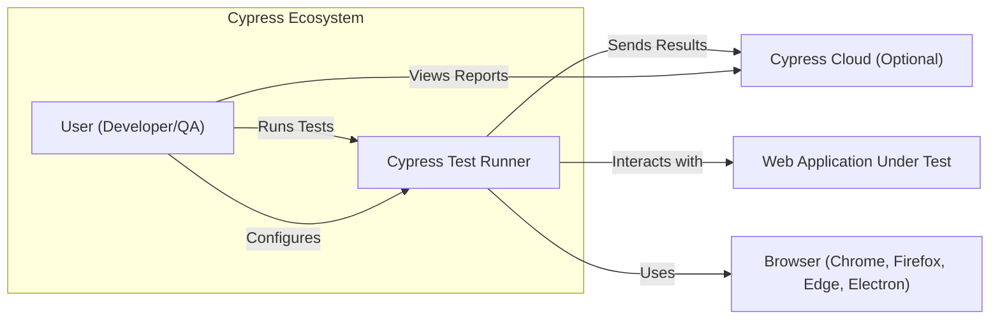
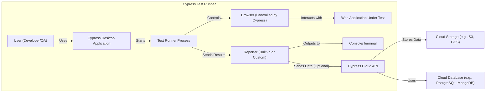
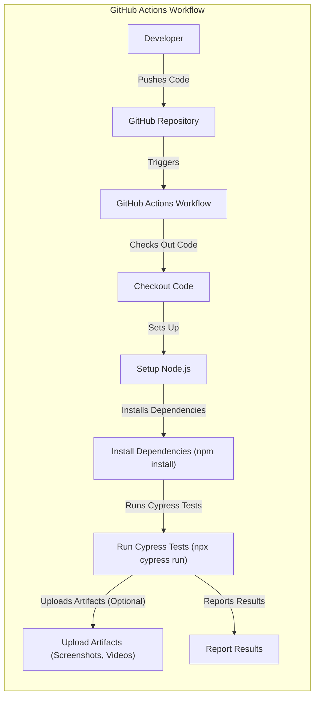

Okay, let's create a design document for the Cypress project, focusing on aspects relevant for threat modeling.

# BUSINESS POSTURE

Cypress is a front-end testing tool built for the modern web. It aims to provide a fast, reliable, and easy-to-use testing experience for developers and QA engineers.  The project is open-source, but also has a commercial aspect (Cypress Cloud) that provides additional features like test recording, analytics, and integrations.

Business Priorities:

*   Maintain a positive reputation for reliability and ease of use.  This is crucial for both the open-source project and the commercial offering.
*   Grow the user base (both open-source and paid).
*   Ensure the security of the Cypress Cloud platform, as it handles sensitive user data (test results, recordings, potentially API keys, etc.).
*   Protect the integrity of the Cypress test runner itself, preventing malicious actors from compromising tests or the systems running them.
*   Maintain a fast development pace and ability to quickly address bugs and security vulnerabilities.

Business Goals:

*   Become the leading end-to-end testing solution for web applications.
*   Increase revenue from Cypress Cloud.
*   Maintain a vibrant and active open-source community.

Most Important Business Risks:

*   A major security vulnerability in the Cypress test runner that could allow attackers to execute arbitrary code on user machines or access sensitive data.
*   A data breach in Cypress Cloud that exposes user data.
*   A significant degradation in the performance or reliability of Cypress, leading to user frustration and churn.
*   Reputational damage due to any of the above.
*   Supply chain attacks that compromise the Cypress installation process or dependencies.

# SECURITY POSTURE

Existing Security Controls:

*   security control: Code Reviews: The GitHub repository shows evidence of a code review process, with pull requests being reviewed by other developers before merging. (Visible in the GitHub PR process).
*   security control: Dependency Management: Cypress uses package managers (like npm or yarn) to manage dependencies. (Visible in `package.json` and lock files).
*   security control: Testing: Cypress, being a testing tool itself, has extensive internal tests. (Visible in the test suite within the repository).
*   security control: Static Analysis: Likely use of linters (e.g., ESLint) to enforce code style and identify potential issues. (Visible in configuration files like `.eslintrc.js`).
*   security control: Issue Tracking: Use of GitHub Issues for tracking bugs and security vulnerabilities. (Visible in the GitHub Issues tab).

Accepted Risks:

*   accepted risk: The inherent risk of running JavaScript code from potentially untrusted sources (the tests themselves) within the Cypress environment.  Mitigation strategies are likely in place, but the risk cannot be entirely eliminated.
*   accepted risk: Reliance on third-party dependencies, which could introduce vulnerabilities.  This is mitigated by dependency management and monitoring, but the risk remains.
*   accepted risk: The possibility of zero-day vulnerabilities in the underlying Electron framework or Node.js runtime.

Recommended Security Controls:

*   Implement a robust Software Bill of Materials (SBOM) management process to track all dependencies and their versions, enabling rapid response to newly discovered vulnerabilities.
*   Integrate Static Application Security Testing (SAST) tools into the CI/CD pipeline to automatically scan for vulnerabilities in the Cypress codebase.
*   Integrate Dynamic Application Security Testing (DAST) to test the running application for vulnerabilities.
*   Implement a vulnerability disclosure program (bug bounty) to incentivize external security researchers to report vulnerabilities.
*   Conduct regular penetration testing of both the Cypress test runner and Cypress Cloud.
*   Implement Content Security Policy (CSP) and other browser security mechanisms where applicable to mitigate the impact of XSS vulnerabilities.
*   Implement robust input validation and sanitization to prevent injection attacks.

Security Requirements:

*   Authentication:
    *   Cypress Cloud: Secure authentication mechanisms (e.g., multi-factor authentication, strong password policies) are required for Cypress Cloud users.
    *   Cypress Runner: No direct user authentication within the runner itself, but it may interact with authenticated systems during tests.
*   Authorization:
    *   Cypress Cloud: Role-based access control (RBAC) to manage user permissions within Cypress Cloud.
    *   Cypress Runner: No direct authorization within the runner, but it may interact with systems that enforce authorization.
*   Input Validation:
    *   Cypress Runner: Input validation is crucial to prevent injection attacks, especially when dealing with user-provided data or external resources within tests.
    *   Cypress Cloud: Input validation on all API endpoints and user input fields.
*   Cryptography:
    *   Cypress Cloud: Use of TLS/SSL for all communication between the client and the cloud service. Secure storage of sensitive data (e.g., API keys, credentials) using appropriate encryption techniques.
    *   Cypress Runner: Secure handling of any sensitive data used within tests (e.g., avoiding hardcoding credentials, using environment variables securely).
*   Session Management:
    *   Cypress Cloud: Secure session management for user logins, including proper session expiration and protection against session hijacking.

# DESIGN

## C4 CONTEXT

Element Descriptions:

*   Element:
    *   Name: User (Developer/QA)
    *   Type: Person
    *   Description: A developer or QA engineer who writes and runs tests using Cypress.
    *   Responsibilities: Writing tests, configuring Cypress, running tests, analyzing results.
    *   Security controls: N/A (External to the system)

*   Element:
    *   Name: Cypress Test Runner
    *   Type: Software System
    *   Description: The core Cypress application that runs tests within a browser.
    *   Responsibilities: Executing test code, interacting with the web application, managing the browser, reporting results.
    *   Security controls: Input validation, sandboxing (to the extent possible), dependency management, regular security updates.

*   Element:
    *   Name: Cypress Cloud (Optional)
    *   Type: Software System
    *   Description: A cloud-based service that provides additional features for Cypress, such as test recording, analytics, and integrations.
    *   Responsibilities: Storing test results, providing dashboards and analytics, managing user accounts and organizations.
    *   Security controls: Authentication, authorization, encryption in transit and at rest, regular security audits, vulnerability scanning.

*   Element:
    *   Name: Web Application Under Test
    *   Type: Software System
    *   Description: The web application that is being tested by Cypress.
    *   Responsibilities: Serving web content, handling user interactions, processing data.
    *   Security controls: Dependent on the specific application (external to Cypress).

*   Element:
    *   Name: Browser (Chrome, Firefox, Edge, Electron)
    *   Type: Software System
    *   Description: The web browser in which Cypress runs the tests.
    *   Responsibilities: Rendering web content, executing JavaScript, handling network requests.
    *   Security controls: Browser's built-in security mechanisms (e.g., sandboxing, CSP).

## C4 CONTAINER

Element Descriptions:

*   Element:
    *   Name: Cypress Desktop Application
    *   Type: Application
    *   Description: The main Cypress application that users interact with. It's typically an Electron application.
    *   Responsibilities: Providing a GUI for configuring and running tests, managing projects, launching the test runner.
    *   Security controls: Code signing, regular security updates.

*   Element:
    *   Name: Test Runner Process
    *   Type: Process
    *   Description: The process that executes the test code and interacts with the browser.
    *   Responsibilities: Running test scripts, managing the browser automation, handling events, reporting results.
    *   Security controls: Input validation, sandboxing (to the extent possible), secure communication with the browser.

*   Element:
    *   Name: Browser (Controlled by Cypress)
    *   Type: Application
    *   Description: An instance of a web browser (Chrome, Firefox, etc.) controlled by Cypress via a browser automation protocol (e.g., DevTools Protocol).
    *   Responsibilities: Rendering the web application, executing JavaScript within the application's context.
    *   Security controls: Relies on the browser's built-in security mechanisms.

*   Element:
    *   Name: Reporter (Built-in or Custom)
    *   Type: Component
    *   Description: A module that formats and outputs test results.
    *   Responsibilities: Collecting test results, generating reports (e.g., Mochawesome, JUnit), sending data to Cypress Cloud (optional).
    *   Security controls: Secure handling of any sensitive data included in test results.

*   Element:
    *   Name: Console/Terminal
    *   Type: Output
    *   Description: The standard output stream where test results are typically displayed.
    *   Responsibilities: Displaying text output.
    *   Security controls: N/A

*   Element:
    *   Name: Cypress Cloud API
    *   Type: API
    *   Description: The API endpoint for Cypress Cloud.
    *   Responsibilities: Receiving test results and other data from the Cypress test runner, authenticating requests.
    *   Security controls: Authentication (API keys, tokens), authorization, input validation, rate limiting, TLS encryption.

*   Element:
    *   Name: Cloud Storage (e.g., S3, GCS)
    *   Type: Data Store
    *   Description: Cloud storage for storing test artifacts (screenshots, videos, etc.).
    *   Responsibilities: Storing and retrieving large binary data.
    *   Security controls: Access control lists (ACLs), encryption at rest, server-side encryption.

*   Element:
    *   Name: Cloud Database (e.g., PostgreSQL, MongoDB)
    *   Type: Data Store
    *   Description: Database for storing user data, test metadata, and other information.
    *   Responsibilities: Storing and retrieving structured data.
    *   Security controls: Authentication, authorization, encryption at rest, regular backups, database security best practices.

## DEPLOYMENT

Possible Deployment Solutions:

1.  Local Development Environment: Developers install Cypress locally via npm/yarn.
2.  CI/CD Pipeline (e.g., GitHub Actions, Jenkins, CircleCI): Cypress is installed and run as part of an automated build and test process.
3.  Docker Container: Cypress can be run within a Docker container, providing a consistent and isolated environment.
4.  Cloud-Based Testing Grids (e.g., BrowserStack, Sauce Labs): Cypress can be integrated with cloud-based testing grids to run tests on a variety of browsers and operating systems.

Chosen Solution (for detailed description): CI/CD Pipeline (GitHub Actions)

Element Descriptions:

*   Element:
    *   Name: Developer
    *   Type: Person
    *   Description: A developer working on the project.
    *   Responsibilities: Writing code, committing changes, pushing to the repository.
    *   Security controls: N/A (External to the deployment process)

*   Element:
    *   Name: GitHub Repository
    *   Type: Code Repository
    *   Description: The source code repository hosted on GitHub.
    *   Responsibilities: Storing code, managing versions, triggering workflows.
    *   Security controls: Access controls, branch protection rules, code review policies.

*   Element:
    *   Name: GitHub Actions Workflow
    *   Type: Automated Process
    *   Description: A workflow defined in the repository that automates the build, test, and deployment process.
    *   Responsibilities: Executing a series of steps defined in the workflow configuration.
    *   Security controls: Secure handling of secrets (e.g., API keys), use of trusted actions.

*   Element:
    *   Name: Checkout Code
    *   Type: Workflow Step
    *   Description: Checks out the source code from the repository.
    *   Responsibilities: Retrieving the code to be built and tested.
    *   Security controls: N/A

*   Element:
    *   Name: Setup Node.js
    *   Type: Workflow Step
    *   Description: Sets up the Node.js environment required for running Cypress.
    *   Responsibilities: Installing the correct version of Node.js and npm.
    *   Security controls: N/A

*   Element:
    *   Name: Install Dependencies (npm install)
    *   Type: Workflow Step
    *   Description: Installs the project's dependencies using npm.
    *   Responsibilities: Downloading and installing all required packages.
    *   Security controls: Use of a package-lock.json or yarn.lock file to ensure consistent and reproducible builds, vulnerability scanning of dependencies.

*   Element:
    *   Name: Run Cypress Tests (npx cypress run)
    *   Type: Workflow Step
    *   Description: Executes the Cypress tests.
    *   Responsibilities: Running the tests and generating reports.
    *   Security controls: Secure handling of any sensitive data used in tests.

*   Element:
    *   Name: Upload Artifacts (Optional)
    *   Type: Workflow Step
    *   Description: Uploads test artifacts (screenshots, videos) to a storage location.
    *   Responsibilities: Storing artifacts for later review.
    *   Security controls: Secure storage of artifacts (e.g., using access control lists).

*   Element:
    *   Name: Report Results
    *   Type: Workflow Step
    *   Description: Reports the test results (e.g., to GitHub Actions, Cypress Cloud).
    *   Responsibilities: Providing feedback on the test execution.
    *   Security controls: N/A

## BUILD

```mermaid
graph LR
    Developer["Developer"] -- Commits Code --> LocalMachine["Local Machine"]
    LocalMachine -- Runs Tests --> LocalTests["Local Tests (Unit, Integration)"]
    LocalMachine -- Builds Project --> Build["Build Process (npm scripts, webpack, etc.)"]
    Build -- Produces --> Artifacts["Build Artifacts (JS bundles, executables)"]
    Developer -- Pushes Code --> GitRepo["Git Repository (GitHub)"]
    GitRepo -- Triggers --> CI["CI System (GitHub Actions)"]
    CI -- Checks Out Code --> CICheckout["Checkout Code"]
    CICheckout -- Sets Up Environment --> CISetup["Setup Build Environment"]
    CISetup -- Installs Dependencies --> CIInstall["Install Dependencies"]
    CIInstall -- Runs Linters --> CILint["Run Linters (ESLint)"]
    CILint -- Runs SAST --> CISAST["Run SAST (Optional)"]
    CISAST -- Runs Tests --> CITests["Run Tests (Unit, Integration, E2E)"]
    CITests -- Builds Project --> CIBuild["Build Project"]
    CIBuild -- Produces --> CIArtifacts["Build Artifacts"]
    CIArtifacts -- Published To --> ArtifactRepo["Artifact Repository (npm, Cypress Downloads)"]

```

Build Process Description:

1.  **Local Development:** Developers write code and run local tests (unit and integration tests) on their machines. They use npm scripts and build tools (like webpack) to build the project locally.
2.  **Commit and Push:** Developers commit their code changes and push them to a Git repository (GitHub).
3.  **CI Trigger:** The push to the repository triggers a CI build on a CI system (e.g., GitHub Actions).
4.  **Checkout and Setup:** The CI system checks out the code and sets up the build environment (e.g., installing Node.js, configuring environment variables).
5.  **Dependency Installation:** The CI system installs the project's dependencies using npm (or yarn).
6.  **Security Checks:**
    *   **Linters:** Linters (like ESLint) are run to enforce code style and identify potential code quality issues.
    *   **SAST (Optional):** Static Application Security Testing (SAST) tools can be integrated to scan the codebase for vulnerabilities.
7.  **Testing:** The CI system runs various tests, including unit tests, integration tests, and end-to-end tests (using Cypress itself).
8.  **Build:** The project is built, producing build artifacts (JavaScript bundles, executables, etc.).
9.  **Publish:** The build artifacts are published to an artifact repository (e.g., npm for packages, Cypress downloads page for the desktop application).

Security Controls in Build Process:

*   security control: Code Reviews: All code changes are reviewed before being merged into the main branch.
*   security control: Linters: Linters enforce code style and identify potential code quality issues.
*   security control: SAST (Optional): SAST tools scan for vulnerabilities in the codebase.
*   security control: Dependency Management: Use of package managers and lock files to manage dependencies and ensure consistent builds.
*   security control: Vulnerability Scanning: Regular scanning of dependencies for known vulnerabilities.
*   security control: Secure CI Configuration: Secure handling of secrets (e.g., API keys) in the CI environment.
*   security control: Code Signing: The Cypress desktop application should be code-signed to ensure its authenticity and integrity.

# RISK ASSESSMENT

Critical Business Processes to Protect:

*   Software Development Lifecycle: Ensuring the integrity and security of the code from development to deployment.
*   Cypress Cloud Service Operation: Maintaining the availability, confidentiality, and integrity of the Cypress Cloud service.
*   User Data Management: Protecting user data stored in Cypress Cloud.
*   Test Execution: Ensuring the reliability and security of the test execution environment.

Data to Protect and Sensitivity:

*   Source Code: Confidential (Contains proprietary logic and potentially security vulnerabilities).
*   Test Results (Cypress Cloud): Potentially sensitive (May contain information about the application being tested, including vulnerabilities).
*   User Data (Cypress Cloud): Sensitive (Includes user accounts, billing information, API keys, etc.).
*   Test Scripts: Potentially sensitive (May contain credentials or other sensitive information).
*   API Keys/Credentials: Highly sensitive (Should be protected with strong encryption and access controls).

# QUESTIONS & ASSUMPTIONS

Questions:

*   What specific threat actors are considered most relevant to Cypress (e.g., script kiddies, organized crime, nation-states)?
*   What is the acceptable level of risk for different types of vulnerabilities (e.g., low, medium, high, critical)?
*   What are the specific compliance requirements for Cypress Cloud (e.g., GDPR, CCPA, SOC 2)?
*   What is the current process for handling security incidents?
*   Are there any existing security audits or penetration test reports available?
*   What is the process for managing and rotating secrets (e.g., API keys)?
*   How are browser extensions handled within the Cypress environment, and what security considerations are in place?

Assumptions:

*   BUSINESS POSTURE: The primary business goal is to grow the user base and increase revenue from Cypress Cloud while maintaining a strong reputation for reliability and security.
*   SECURITY POSTURE: There is a basic level of security awareness and some existing security controls, but there is room for improvement.
*   DESIGN: The design is based on the publicly available information about Cypress and common architectural patterns for similar applications. The CI/CD pipeline uses GitHub Actions. The Cypress Cloud uses a typical cloud architecture with an API, database, and storage.
*   The Cypress team is responsive to security concerns and will address reported vulnerabilities promptly.
*   Users of Cypress are responsible for the security of their own test code and the applications they are testing.
*   Cypress Cloud users are responsible for securely managing their API keys and other credentials.