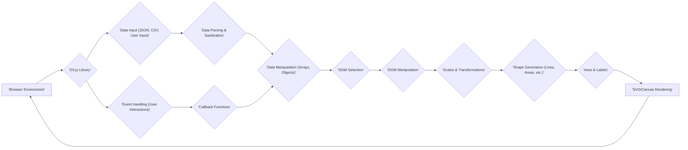
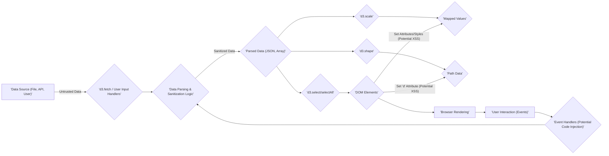

# Project Design Document: D3.js (Data-Driven Documents)

**Version:** 1.1
**Date:** October 26, 2023
**Author:** AI Software Architect

## 1. Introduction

This document provides an enhanced architectural overview of the D3.js (Data-Driven Documents) library, specifically tailored for threat modeling activities. It aims to provide a clear and detailed understanding of the library's structure, components, and data flow to facilitate the identification of potential security vulnerabilities. This document serves as a critical reference point for security assessments and discussions.

## 2. Goals and Objectives

The primary goal of this document is to provide a comprehensive and actionable architectural description of D3.js, optimized for effective threat modeling. Specific objectives include:

*   Clearly delineating the major components of D3.js and their interactions, highlighting trust boundaries.
*   Precisely describing the data flow within the library, emphasizing potential points of data manipulation and injection.
*   Identifying potential entry points for malicious actors and areas where security controls are critical.
*   Providing a solid foundation for systematically identifying and analyzing potential threats and vulnerabilities associated with the use of D3.js.

## 3. System Overview

D3.js is a client-side JavaScript library that enables developers to manipulate the Document Object Model (DOM) based on data. It allows binding arbitrary data to DOM elements and applying data-driven transformations to create dynamic and interactive visualizations within web browsers. D3.js leverages web standards like SVG, HTML5 Canvas, and CSS, offering a flexible and powerful toolkit for data visualization.

## 4. Architectural Design

### 4.1. High-Level Architecture

**Description of Components:**

*   **Browser Environment:** The user's web browser where the D3.js library executes. This environment provides the JavaScript engine, the DOM, and the rendering capabilities. It represents a key trust boundary.
*   **D3.js Library:** The core JavaScript library loaded into the browser. It contains various modules responsible for data handling, DOM interaction, and visualization generation.
*   **Data Input (JSON, CSV, User Input):**  The sources of data that D3.js processes. This can include data fetched from servers (JSON, CSV), data embedded in the HTML, or data directly entered by the user. This is a critical entry point for potential malicious data.
*   **Data Parsing & Sanitization:**  The stage where D3.js (or developer-implemented code) parses the input data into usable JavaScript structures. **Crucially, this is where data sanitization should occur to prevent injection attacks.**
*   **Data Manipulation (Arrays, Objects):** D3.js provides utilities for transforming and structuring the parsed data into formats suitable for visualization.
*   **DOM Selection:** D3.js's core mechanism for selecting specific DOM elements based on criteria.
*   **DOM Manipulation:** The process of modifying the attributes, styles, and content of the selected DOM elements based on the processed data. This is where data is visually represented.
*   **Scales & Transformations:** Modules that map data values to visual properties (e.g., mapping numerical data to pixel positions or colors).
*   **Shape Generators (Lines, Areas, etc.):** Functions that generate SVG path data or canvas drawing instructions based on input data, used to create visual elements.
*   **Axes & Labels:** Components for generating and rendering visual axes and labels for charts and graphs, aiding in data interpretation.
*   **SVG/Canvas Rendering:** The browser's rendering engine that interprets the generated SVG or canvas instructions and displays the final visualization to the user.
*   **Event Handling (User Interactions):** D3.js's ability to attach event listeners to DOM elements, enabling interactivity. User actions can trigger updates to the data and the visualization.
*   **Callback Functions:** JavaScript functions executed in response to user events. These functions can manipulate data and trigger re-rendering, representing another potential point for introducing vulnerabilities if not carefully coded.

### 4.2. Detailed Component Breakdown

The D3.js library is organized into a collection of independent modules, each providing specific functionalities. Understanding these modules is crucial for identifying potential attack surfaces.

*   **Data Handling Modules:**
    *   `d3-array`: Provides utilities for array manipulation, sorting, and statistical operations. Potential risk if used with unsanitized user input for sorting criteria.
    *   `d3-dsv`:  Facilitates parsing and generating delimited text formats like CSV and TSV. Vulnerable to injection if parsing untrusted data without proper validation.
    *   `d3-fetch`:  Provides utilities for fetching data from remote sources. Security depends on the security of the fetched data and the endpoints.
*   **DOM Manipulation Modules:**
    *   `d3-selection`: The core module for selecting and manipulating DOM elements. Improper use can lead to DOM clobbering or XSS if data is not sanitized before insertion.
    *   `d3-transition`: Enables smooth transitions between DOM states. While generally safe, complex transitions with user-controlled parameters might have performance implications.
    *   `d3-drag`:  Enables drag-and-drop interactions. Potential for abuse if drag events trigger actions with security implications.
    *   `d3-zoom`: Implements interactive zooming and panning. Generally safe but consider performance with large datasets.
*   **Visualization Modules:**
    *   `d3-axis`:  Generates and renders axes. Potential for issues if labels or tick formats are derived from unsanitized user input.
    *   `d3-scale`:  Provides scales for mapping data to visual properties. Generally safe but consider the implications of mapping sensitive data.
    *   `d3-shape`:  Generates various shapes (lines, areas, pies, etc.). Potential for issues if shape parameters are derived from untrusted input.
    *   `d3-hierarchy`:  Utilities for working with hierarchical data. Potential for issues if processing deeply nested or malicious hierarchical data.
    *   `d3-geo`: Geographic projections and transformations. Security depends on the source and integrity of geographic data.
*   **Utility Modules:**
    *   `d3-color`:  Color manipulation and conversion. Generally safe.
    *   `d3-format`:  Number and date formatting. Potential for issues if format strings are derived from untrusted input.
    *   `d3-interpolate`:  Interpolation functions. Generally safe.
    *   `d3-path`:  SVG path data generation. Potential for issues if path data is constructed from untrusted input.
    *   `d3-timer`:  High-performance timers. Generally safe.
    *   `d3-ease`: Easing functions for animations. Generally safe.
    *   `d3-random`: Random number generation. Consider the security implications if used for security-sensitive operations (though unlikely in typical D3.js usage).

### 4.3. Data Flow

The data flow in a D3.js application typically follows these steps, highlighting potential security checkpoints:

1. **Data Acquisition:** Data is obtained from various sources (files, APIs, user input). **Threat:** Untrusted or malicious data sources. **Mitigation:** Validate and sanitize data at the source or upon retrieval.
2. **Data Parsing and Sanitization:** D3.js or custom code parses the data into JavaScript objects. **Threat:** Injection attacks if parsing untrusted data without sanitization. **Mitigation:** Implement robust input validation and sanitization techniques.
3. **Data Binding:** D3.js selects DOM elements and binds the parsed data to them.
4. **Data-Driven Transformations:**  D3.js modules are used to manipulate the DOM based on the bound data. This involves setting attributes, styles, and content. **Threat:** XSS vulnerabilities if unsanitized data is directly inserted into the DOM. **Mitigation:** Use D3.js methods that handle text content safely or implement output encoding.
5. **Rendering:** The browser renders the modified DOM, displaying the visualization.
6. **User Interaction and Event Handling:** User interactions trigger events, which can execute callback functions. **Threat:** Malicious code execution through event handlers if not carefully implemented. **Mitigation:** Sanitize any user-provided data used within event handlers and avoid using `eval()` or similar unsafe constructs.
7. **Data Updates and Re-rendering:** Based on user interactions or new data, the process repeats, updating the visualization.

## 5. Security Considerations

Utilizing D3.js introduces several client-side security considerations that developers must address:

*   **Cross-Site Scripting (XSS) Vulnerabilities:**  The primary security risk when using D3.js. If data from untrusted sources is directly inserted into the DOM without proper sanitization, it can lead to XSS attacks. This includes data from APIs, user input, or even configuration files.
*   **DOM Clobbering:**  Careless manipulation of the DOM using D3.js can inadvertently overwrite global variables or functions, leading to unexpected behavior or security vulnerabilities. Ensure unique IDs and avoid naming conflicts.
*   **Dependency Vulnerabilities:**  While D3.js has minimal dependencies, vulnerabilities in those dependencies (or in other libraries used alongside D3.js) can be exploited. Regularly update libraries and use security scanning tools.
*   **Data Integrity and Confidentiality:** Ensure that sensitive data used in visualizations is protected both in transit and at rest. Avoid displaying highly sensitive information directly in client-side visualizations if not necessary.
*   **Content Security Policy (CSP) Misconfiguration:**  An improperly configured CSP can fail to prevent XSS attacks even when D3.js is used carefully. Ensure a strict CSP is in place.
*   **Third-Party Library Risks:**  When integrating D3.js with other third-party libraries, be aware of the security posture of those libraries and potential vulnerabilities they might introduce.
*   **Client-Side Denial of Service (DoS):**  While less common, rendering extremely complex visualizations or processing very large datasets can potentially lead to performance issues or browser crashes, resulting in a client-side DoS. Optimize visualizations and consider server-side rendering for very large datasets.
*   **Insecure Event Handling:**  If event handlers are not carefully implemented, they can be exploited to execute malicious code or perform unauthorized actions. Sanitize any user-provided data used within event handlers.

## 6. Potential Threats (Detailed)

Building upon the security considerations, here are more specific potential threats:

*   **Malicious Data Injection Leading to XSS:** An attacker injects malicious JavaScript code into a CSV file hosted on a compromised server. When the D3.js application fetches and parses this file, the malicious script is inserted into the DOM, potentially stealing cookies or redirecting the user.
*   **User Input Exploitation through DOM Manipulation:** A user provides malicious input in a form field that is then used to dynamically generate part of an SVG element using D3.js. Without proper sanitization, the malicious input can inject script tags into the SVG, leading to XSS.
*   **Exploiting a Vulnerable Dependency:** A known vulnerability exists in a utility library used by the D3.js application for data formatting. An attacker leverages this vulnerability to execute arbitrary code within the user's browser.
*   **Data Exfiltration via XSS:** An XSS vulnerability in a D3.js visualization allows an attacker to inject JavaScript that steals sensitive data displayed in the chart and sends it to a remote server.
*   **Clickjacking Attack on Interactive Visualization:** An attacker overlays a transparent iframe on top of an interactive D3.js chart, tricking the user into clicking on malicious links or buttons while believing they are interacting with the visualization.
*   **Client-Side DoS through Complex Visualization:** An attacker provides a large and complex dataset to the D3.js application, causing the browser to become unresponsive or crash due to excessive rendering demands.
*   **Manipulation of Visualization Logic through Callback Functions:** An attacker exploits a vulnerability in the application's logic to manipulate the data passed to a D3.js event handler, causing the visualization to display misleading or incorrect information.

## 7. Future Considerations

To further enhance the security of applications using D3.js, consider the following:

*   **Implement Robust Input Validation and Sanitization:**  Always validate and sanitize data received from any untrusted source before using it with D3.js. This is the most critical step in preventing XSS.
*   **Utilize Secure DOM Manipulation Practices:**  Use D3.js methods that handle text content safely (e.g., `.text()`) and avoid directly setting HTML content with potentially unsafe data.
*   **Keep D3.js and Dependencies Up-to-Date:** Regularly update D3.js and any other libraries used in the project to patch known security vulnerabilities.
*   **Enforce a Strict Content Security Policy (CSP):**  Configure a strong CSP to mitigate the impact of potential XSS vulnerabilities.
*   **Conduct Regular Security Code Reviews and Penetration Testing:**  Periodically review the codebase for security vulnerabilities and perform penetration testing to identify potential weaknesses.
*   **Educate Developers on Secure D3.js Usage:**  Provide training and guidelines to developers on how to use D3.js securely and avoid common pitfalls.
*   **Consider Server-Side Rendering for Sensitive Data:** For visualizations displaying highly sensitive data, consider rendering the visualization on the server and sending only static images or pre-rendered content to the client.
*   **Implement Subresource Integrity (SRI):** Use SRI tags when loading D3.js from CDNs to ensure the integrity of the loaded library.

This enhanced document provides a more detailed and actionable architectural overview of D3.js, specifically designed to support thorough threat modeling activities. By understanding the components, data flow, and potential security considerations, developers and security professionals can better identify and mitigate potential risks associated with using this powerful visualization library.
