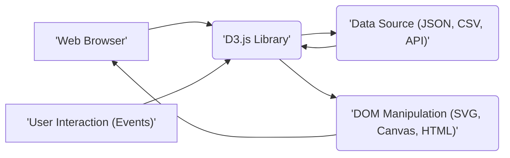

## Project Design Document: D3.js Visualization Library (Improved)

**1. Introduction**

This document provides an enhanced design overview of the D3.js (Data-Driven Documents) library, intended for security analysis and threat modeling. D3.js is a client-side JavaScript library that enables developers to manipulate the Document Object Model (DOM) based on data. This document details the library's architecture, key modules, data processing workflows, and security considerations. The focus remains on the core functionalities and interactions *within* the D3.js library itself, rather than the specific web applications that integrate it. This improved version aims for greater clarity and depth, particularly in the security domain.

**2. Goals and Objectives**

*   **Primary Goal:** To furnish a refined and more detailed architectural understanding of D3.js specifically for security assessment and threat modeling purposes.
*   **Objectives:**
    *   Articulate the core modules and their interactions with greater precision.
    *   Illustrate the data flow and transformation pipelines with more specific examples.
    *   Identify potential attack surfaces and security vulnerabilities within the library's operational scope with enhanced granularity.
    *   Serve as a more robust and actionable foundation for subsequent threat modeling exercises.

**3. Architectural Overview**

D3.js operates exclusively within the client-side environment of a web browser. It does not possess any inherent server-side components. The architecture is fundamentally centered on the manipulation of the browser's DOM, driven by input data.

*   **Web Browser:** The execution environment for D3.js, providing the DOM and the JavaScript runtime. This is where the D3.js code is interpreted and executed.
*   **D3.js Library:** The core JavaScript library encompassing modules for data acquisition, processing, DOM element selection, and visualization rendering.
*   **Data Source (JSON, CSV, API):** External origins of data that D3.js can load and process. These can include local files, data fetched from remote APIs, or data embedded within the HTML.
*   **DOM Manipulation (SVG, Canvas, HTML):** The process by which D3.js modifies the structure, attributes, and styles of DOM elements to create and update visual representations of data. This commonly involves generating and altering SVG elements, drawing on HTML5 Canvas, or directly manipulating HTML elements.
*   **User Interaction (Events):** User-initiated events (e.g., mouse clicks, key presses, touch events) that D3.js can listen for and respond to, triggering data updates or visualization changes.

**4. Data Flow**

The typical data flow within a D3.js application follows these stages:

*   **Data Acquisition:** D3.js provides modules to load data from various formats asynchronously. Examples include:
    *   `d3.json()`: Fetches data from JSON endpoints.
    *   `d3.csv()`: Parses data from CSV files or strings.
    *   `d3.tsv()`: Parses data from TSV files or strings.
    *   `d3.xml()`: Parses data from XML documents.
    *   `d3.text()`: Loads plain text data.
    This data can originate from local files or remote servers via HTTP(S) requests.
*   **Data Binding:** The fetched data is linked to selected DOM elements. D3.js utilizes a powerful selection mechanism:
    *   `d3.select()`: Selects the first element matching a specified selector.
    *   `d3.selectAll()`: Selects all elements matching a specified selector.
    The `.data()` method then binds the data array to the selected elements.
*   **Data Manipulation and Transformation:** D3.js offers a comprehensive suite of functions for transforming and preparing data for visualization:
    *   **Filtering:** Using methods like `.filter()` to select data points based on specific criteria (e.g., showing only data above a certain value).
    *   **Mapping:** Applying functions to each data element to create new arrays or modify existing ones (e.g., extracting a specific property from each data object).
    *   **Reducing:** Aggregating data into summary values using methods like `.reduce()` (e.g., calculating the total sum of a data field).
    *   **Sorting:** Ordering data based on specific properties using `.sort()` (e.g., arranging data points from smallest to largest).
    *   **Grouping:** Organizing data into logical groups based on shared attributes using `d3.group()` or `d3.rollup()` (e.g., grouping sales data by region).
*   **DOM Manipulation (Rendering):** Based on the bound and transformed data, D3.js updates the attributes, styles, and content of the selected DOM elements to create visualizations:
    *   Setting attributes: `.attr("attributeName", value)` (e.g., setting the `x` and `y` coordinates of a circle).
    *   Setting styles: `.style("propertyName", value)` (e.g., setting the fill color of a rectangle).
    *   Setting text content: `.text(value)` (e.g., displaying data values as labels).
    *   Appending and removing elements: `.append("elementName")`, `.remove()` (e.g., creating new circles for each data point).
*   **Event Handling and Interaction:** D3.js allows attaching event listeners to DOM elements, enabling interactive visualizations:
    *   `.on("eventName", function)`: Attaches a listener to an element for a specific event (e.g., `click`, `mouseover`).
    *   Event handlers can access the bound data, the current DOM element, and the event object to trigger further updates or interactions.

**5. Key Components (Modules)**

D3.js is modular, consisting of independent components that can be used individually. Key modules relevant to this design are:

*   **d3-selection:**
    *   Purpose: Selecting DOM elements and applying operations to them.
    *   Functionality: Provides methods for selecting elements using CSS selectors, creating new elements, and manipulating their attributes, properties, and styles.
*   **d3-array:**
    *   Purpose: Utilities for manipulating and processing arrays of data.
    *   Functionality: Includes functions for sorting, searching, transforming, and summarizing arrays, essential for data preparation.
*   **d3-scale:**
    *   Purpose: Mapping data values from a domain to a visual range.
    *   Functionality: Offers various scale types (linear, logarithmic, ordinal, time) to translate data into visual encodings like position, color, and size.
*   **d3-axis:**
    *   Purpose: Generating visual axes for charts.
    *   Functionality: Creates SVG elements representing axes with ticks, labels, and lines based on a specified scale.
*   **d3-shape:**
    *   Purpose: Generating path data for common geometric shapes.
    *   Functionality: Provides functions to create SVG path strings for lines, areas, circles, arcs, and other shapes used in visualizations.
*   **d3-path:**
    *   Purpose: Efficiently generating SVG path data.
    *   Functionality: Offers a low-level API for constructing SVG path strings, used internally by `d3-shape`.
*   **d3-interpolate:**
    *   Purpose: Interpolating values between two endpoints.
    *   Functionality: Provides functions for smoothly transitioning between numerical values, colors, and other data types, used for animations and transitions.
*   **d3-transition:**
    *   Purpose: Animating changes in DOM attributes and styles over time.
    *   Functionality: Enables smooth visual transitions when data or visual properties are updated.
*   **d3-fetch:**
    *   Purpose: Making HTTP requests to load data from external sources.
    *   Functionality: Provides asynchronous functions (`d3.json`, `d3.csv`, etc.) for fetching data.
*   **d3-format:**
    *   Purpose: Formatting numbers and dates for display.
    *   Functionality: Offers functions to format numerical values with appropriate precision, separators, and prefixes/suffixes, and to format dates and times.
*   **d3-time:**
    *   Purpose: Working with time and date values.
    *   Functionality: Provides utilities for manipulating and formatting dates and times, often used with time scales.
*   **d3-hierarchy:**
    *   Purpose: Visualizing hierarchical data.
    *   Functionality: Offers data structures and algorithms for working with hierarchical data, used for tree diagrams, treemaps, and other hierarchical visualizations.
*   **d3-geo:**
    *   Purpose: Visualizing geographic data.
    *   Functionality: Provides tools for working with geographic coordinates, projections, and shapes, used for creating maps and geographic visualizations.

**6. Security Considerations (Expanded)**

While D3.js is a client-side library and doesn't inherently introduce server-side vulnerabilities, its use within a web application necessitates careful security considerations:

*   **Cross-Site Scripting (XSS):**
    *   **Risk:** If data loaded by D3.js from untrusted sources contains malicious scripts, and D3.js renders this data directly into the DOM without proper sanitization, it can lead to XSS vulnerabilities. Attackers can inject scripts that execute in the user's browser, potentially stealing cookies, session tokens, or performing actions on behalf of the user.
    *   **Mitigation:**
        *   **Input Sanitization:** Sanitize all data received from external sources before using it to manipulate the DOM. Libraries like DOMPurify can be used for this purpose.
        *   **Contextual Output Encoding:** Ensure that data is encoded appropriately for the context in which it is being used (e.g., HTML escaping for text content, attribute encoding for attributes).
        *   **Content Security Policy (CSP):** Implement a strict CSP to control the sources from which the browser is allowed to load resources, reducing the risk of injecting malicious scripts.
*   **Data Integrity and Source Trust:**
    *   **Risk:** If the data loaded by D3.js is tampered with during transit or at the source, the visualizations will be based on incorrect or malicious data. This can lead to misleading information, flawed decision-making, or even the execution of unintended actions if the visualization is part of an interactive system.
    *   **Mitigation:**
        *   **HTTPS:** Always use HTTPS to encrypt data in transit, preventing man-in-the-middle attacks that could alter the data.
        *   **Data Integrity Checks:** Implement mechanisms to verify the integrity of the data, such as using checksums or digital signatures, especially when dealing with untrusted data sources.
        *   **Trusted Sources:** Preferentially load data from trusted and verified sources.
*   **Dependency Vulnerabilities:**
    *   **Risk:** D3.js, like any JavaScript project, has dependencies (though it aims for minimal dependencies). Vulnerabilities in these dependencies could be exploited if not properly managed.
    *   **Mitigation:**
        *   **Regular Updates:** Keep D3.js and its dependencies updated to the latest versions to patch known security vulnerabilities.
        *   **Dependency Scanning:** Utilize tools like npm audit or Yarn audit to identify and address known vulnerabilities in project dependencies.
        *   **Subresource Integrity (SRI):** When loading D3.js from a CDN, use SRI tags to ensure that the browser only executes the expected, untampered-with file.
*   **Client-Side Logic Manipulation and Information Disclosure:**
    *   **Risk:** Since D3.js operates on the client-side, its code and the data it processes are visible to users. Malicious users could potentially inspect the code, manipulate client-side logic, or access sensitive data if it's inadvertently exposed in the client-side application.
    *   **Mitigation:**
        *   **Avoid Storing Sensitive Data:** Refrain from storing sensitive information directly within the client-side code or data used by D3.js.
        *   **Server-Side Authorization:** Implement robust authorization and access control mechanisms on the server-side to protect sensitive data. The client-side visualization should only display data that the user is authorized to see.
        *   **Code Obfuscation (Limited Effectiveness):** While not a strong security measure, code obfuscation can make it slightly more difficult for attackers to understand and manipulate the client-side code.
*   **Denial of Service (Client-Side):**
    *   **Risk:** While not a direct vulnerability in D3.js itself, rendering extremely large or complex datasets can strain the user's browser, leading to performance issues or even crashes (client-side DoS).
    *   **Mitigation:**
        *   **Data Optimization:** Optimize data structures and reduce the amount of data being processed and rendered on the client-side.
        *   **Data Sampling and Aggregation:** For very large datasets, consider techniques like data sampling or server-side aggregation to reduce the load on the client.
        *   **Virtualization and Pagination:** Implement techniques like virtualization or pagination to render only the visible portion of a large dataset.
        *   **Performance Monitoring:** Monitor client-side performance and identify potential bottlenecks in the visualization rendering process.

**7. Technologies Used**

*   **JavaScript (ECMAScript):** The core programming language of D3.js.
*   **DOM (Document Object Model):** The browser's representation of the web page structure that D3.js manipulates.
*   **SVG (Scalable Vector Graphics):** A primary format for creating vector-based graphics in web browsers, extensively utilized by D3.js for visualizations.
*   **HTML (HyperText Markup Language):** The markup language used to structure web pages where D3.js visualizations are embedded.
*   **CSS (Cascading Style Sheets):** Used for styling the visual elements generated by D3.js.
*   **Canvas API:** An HTML5 API that D3.js can leverage for drawing graphics programmatically.
*   **JSON (JavaScript Object Notation):** A common data format for exchanging data, frequently used with D3.js.
*   **CSV (Comma-Separated Values):** A simple text-based format for storing tabular data, supported by D3.js.
*   **TSV (Tab-Separated Values):** Similar to CSV but uses tabs as delimiters.
*   **XML (Extensible Markup Language):** Another data format that D3.js can parse.

**8. Deployment**

D3.js is typically deployed as a static JavaScript file that is included within the HTML of a web page. Common deployment methods include:

*   **Direct Download:** Downloading the D3.js library file and including it locally using a `<script>` tag.
*   **Content Delivery Network (CDN):** Linking to D3.js hosted on a CDN (e.g., cdnjs, unpkg), which can improve loading times due to caching.
*   **Package Managers (npm, Yarn):** Installing D3.js as a dependency in a JavaScript project using package managers and bundling it with the application code.

The core D3.js library does not require any server-side deployment.

**9. Assumptions and Constraints**

*   This design document specifically addresses the core D3.js library and its behavior within a client-side web browser environment. It does not encompass the architecture of specific web applications built using D3.js.
*   The security considerations outlined are general guidelines and may need to be adapted based on the specific context, data sensitivity, and risk tolerance of the application.
*   It is assumed that developers utilizing D3.js possess a foundational understanding of web development principles, including HTML, CSS, and JavaScript, as well as basic security best practices.

This enhanced document provides a more comprehensive and detailed understanding of the D3.js library's architecture, data flow, and security considerations, serving as a more robust foundation for effective threat modeling and the development of secure data visualizations.