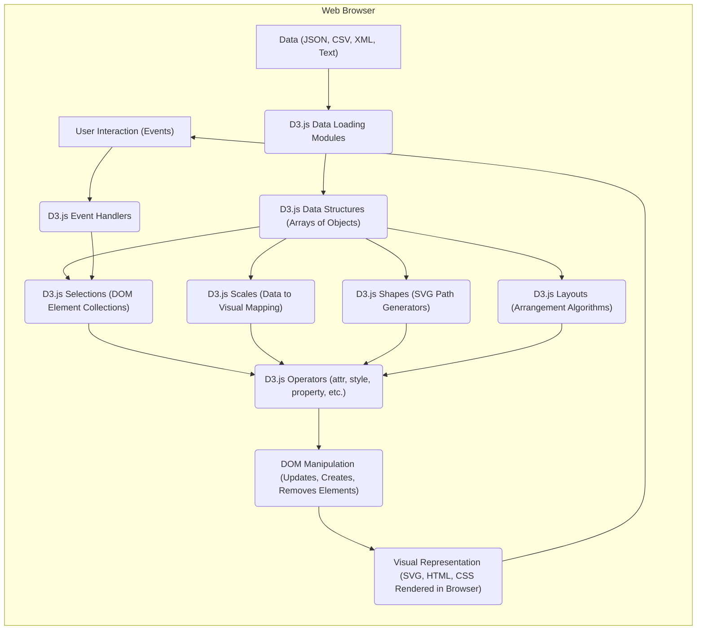

# Project Design Document: D3.js (Data-Driven Documents)

**Version:** 1.1
**Date:** October 26, 2023
**Author:** AI Software Architect

## 1. Introduction

This document provides an enhanced and detailed design overview of the D3.js (Data-Driven Documents) library. It aims to comprehensively capture the key architectural components, data flows, and functionalities of D3.js to facilitate thorough threat modeling activities. This document focuses on the core library itself and its primary mechanisms for manipulating the Document Object Model (DOM) based on data.

## 2. Goals

The primary goals of D3.js are:

*   To enable the creation of dynamic and interactive data visualizations directly within web browsers using HTML, SVG, and CSS.
*   To adhere strictly to web standards, leveraging the full capabilities of modern browsers without requiring proprietary plugins or frameworks.
*   To provide high performance in manipulating the DOM, ensuring smooth and responsive visualizations even with large datasets.
*   To grant developers fine-grained control over the visual encoding of data, allowing for highly customized and expressive visualizations.
*   To be modular and extensible, allowing developers to use only the necessary components and to build upon the core functionality.

## 3. Architecture Overview

D3.js operates exclusively within the client-side web browser environment. It is a JavaScript library that manipulates the DOM based on provided data. The core architecture is centered around the concept of *selections*, which are collections of DOM elements that can be manipulated in a data-driven manner using a declarative approach.

Key architectural aspects include:

*   **Data Binding:**  The mechanism for associating data with DOM elements, forming the basis for data-driven manipulation.
*   **Selections:**  A powerful abstraction for selecting and filtering DOM elements based on CSS selectors or other criteria.
*   **Operators:**  A rich set of functions that operate on selections to modify attributes, styles, properties, text content, and more, often based on the bound data.
*   **Scales:**  Functions that map values from a data domain (the range of values in the data) to a visual range (e.g., pixel positions, colors).
*   **Shapes:**  Generators that produce SVG path data for common graphical elements like lines, circles, and areas.
*   **Transitions:**  A system for smoothly animating changes to DOM elements over time, enhancing the visual experience.
*   **Interactions:**  Capabilities for handling user events (e.g., clicks, mouseovers) and dynamically updating the visualization in response.
*   **Layouts:**  Algorithms that calculate positions and arrangements of elements based on underlying data structures (e.g., hierarchical data, network graphs).

## 4. Detailed Design

This section provides a more in-depth look at the core components and their interactions within D3.js.

### 4.1. Data Loading and Handling

*   D3.js offers specialized modules for efficiently loading data from various formats:
    *   CSV (Comma Separated Values) using `d3.csv`. Supports parsing and type inference.
    *   TSV (Tab Separated Values) using `d3.tsv`. Similar to CSV but uses tabs as delimiters.
    *   JSON (JavaScript Object Notation) using `d3.json`. Handles parsing JSON data into JavaScript objects.
    *   XML (Extensible Markup Language) using `d3.xml`. Parses XML documents into a DOM-like structure.
    *   Plain Text files using `d3.text`. Loads the content of a text file as a string.
    *   Promises are used for asynchronous data loading, allowing for non-blocking operations.
*   Loaded data is typically structured as arrays of JavaScript objects, where each object represents a data point.
*   D3.js imposes minimal constraints on the data structure, providing developers with significant flexibility in how they organize their data.

### 4.2. Selections

*   Selections are the cornerstone of DOM manipulation in D3.js. They represent a set of zero or more DOM elements.
*   `d3.select(selector)`: Selects the *first* element within the document that matches the specified CSS selector.
*   `d3.selectAll(selector)`: Selects *all* elements within the document that match the specified CSS selector.
*   Selections are immutable; operations on a selection return a new selection.
*   Selection methods allow for traversing the DOM:
    *   `.select(selector)`: Selects descendant elements within the current selection.
    *   `.selectAll(selector)`: Selects descendant elements within the current selection.
    *   `.filter(function)`: Filters the current selection based on a provided function.
    *   `.parent()`: Selects the parent element of each element in the current selection.
    *   `.datum([value])`: Gets or sets the bound data for each element in the selection (single value per element).
    *   `.data([array, key])`: Binds an array of data to the selected elements, determining enter, update, and exit selections. The optional `key` function specifies how data should be joined to elements.

### 4.3. Data Binding (Enhanced Explanation)

*   The `.data()` operator is crucial for establishing the link between data and the DOM. When called on a selection, it compares the number of data points in the provided array with the number of elements in the selection.
*   The result of the `.data()` operation yields three sub-selections:
    *   **Enter Selection (`.enter()`):** Contains placeholder nodes for data points that do not have corresponding DOM elements. Typically, you append new elements to this selection.
    *   **Update Selection (the original selection after `.data()`):** Contains the existing DOM elements for which there are corresponding data points. You typically update the attributes, styles, etc., of these elements.
    *   **Exit Selection (`.exit()`):** Contains the DOM elements for which there are no corresponding data points. You typically remove these elements.
*   The optional `key` function in `.data(array, key)` is essential for handling dynamic data updates where the order of data might change. The key function specifies a unique identifier for each data point, allowing D3.js to correctly associate data with existing elements.

### 4.4. Operators (More Detail)

Operators provide the means to manipulate the properties of the selected DOM elements based on the bound data.

*   `.attr(name, value)`: Sets or gets the value of an attribute. The `value` can be a constant, a function that receives the bound data (`d`, the data point), the index (`i`), and the group (`nodes`), or `null` to remove the attribute.
*   `.style(name, value[, priority])`: Sets or gets a CSS style property. The `priority` argument can be used to set "!important". The `value` can be a constant or a function similar to `.attr()`.
*   `.property(name, value)`: Sets or gets a DOM property of the selected elements. This is used for properties that are not attributes (e.g., `textContent`, `value` of form elements).
*   `.text([value])`: Sets or gets the text content of the selected elements. The `value` can be a constant or a function.
*   `.html([value])`: Sets or gets the inner HTML content of the selected elements. **Caution:** Using this with untrusted data can introduce XSS vulnerabilities.
*   `.append(tag)`: Appends a new element with the specified tag name as the last child of each element in the selection.
*   `.insert(tag, beforeSelector)`: Inserts a new element with the specified tag name before the element matching the `beforeSelector` for each element in the selection.
*   `.remove()`: Removes the selected elements from the DOM.
*   `.classed(name, [boolean])`: Adds or removes one or more CSS classes. If `boolean` is omitted, it returns whether the element has the specified class.
*   `.on(type, listener[, options])`: Attaches an event listener of the specified `type` to the selected elements. The `listener` function receives the current data, the index, and the event object. The `options` argument allows for specifying listener behavior (e.g., capturing, passive).

### 4.5. Scales (More Specifics)

*   Scales are functions that transform values from a data domain to a visual range. They are essential for mapping data to visual properties like position, size, and color.
*   **Linear Scales (`d3.scaleLinear()`):**  Create a linear mapping between the domain and range.
*   **Log Scales (`d3.scaleLog()`):**  Use a logarithmic scale, useful for data with a wide range of values.
*   **Power Scales (`d3.scalePow()`):**  Apply an exponential function to the input domain.
*   **Time Scales (`d3.scaleTime()`):**  Specifically designed for mapping Date objects to visual values.
*   **Ordinal Scales (`d3.scaleOrdinal()`):**  Map discrete values from the domain to discrete values in the range.
*   **Quantize Scales (`d3.scaleQuantize()`):**  Divide the domain into discrete bins and map each bin to a value in the range.
*   **Threshold Scales (`d3.scaleThreshold()`):**  Map ranges of the domain to discrete values in the range based on specified thresholds.
*   **Sequential Scales (`d3.scaleSequential()`):**  Map a continuous domain to a continuous color gradient.
*   **Diverging Scales (`d3.scaleDiverging()`):**  Map a continuous domain with a neutral midpoint to two diverging color gradients.

### 4.6. Shapes (More Examples)

*   D3.js provides generators for creating SVG path data for various shapes. These generators simplify the process of drawing complex shapes.
    *   Lines (`d3.line()`): Generates a path string connecting a series of points. Can be curved using interpolation methods.
    *   Areas (`d3.area()`): Generates a path string representing the area between a baseline and a line.
    *   Arcs (`d3.arc()`): Generates a path string for drawing circular arcs, useful for pie charts and other circular visualizations.
    *   Pies (`d3.pie()`): Transforms an array of data into an array of arc data, suitable for creating pie charts.
    *   Symbols (`d3.symbol()`): Generates path data for various geometric symbols (e.g., circle, square, triangle).
    *   Custom shapes can be created by defining custom path data or using other SVG elements.

### 4.7. Transitions (More Details)

*   Transitions enable smooth animations of changes to DOM elements over a specified duration.
*   Applied to selections using `.transition()`. Subsequent operators within the transition block are animated.
*   Transition properties:
    *   `.duration(milliseconds)`: Sets the duration of the transition.
    *   `.delay(milliseconds)`: Sets a delay before the transition starts.
    *   `.ease(easingFunction)`: Specifies the easing function to control the animation's pace (e.g., `d3.easeLinear`, `d3.easeCubic`).
*   Transitions can be chained and interrupted.

### 4.8. Interactions and Events (More Examples)

*   D3.js provides a powerful mechanism for handling user interactions and making visualizations interactive.
*   Event listeners are attached to selections using `.on(type, listener)`.
*   Common event types: `click`, `mouseover`, `mouseout`, `mousemove`, `mousedown`, `mouseup`, `touchstart`, `touchmove`, `touchend`, `keydown`, `keyup`, `change`, `input`, `zoom`, `brush`.
*   Event listeners receive:
    *   `d`: The bound data for the element that triggered the event.
    *   `i`: The index of the element in the selection.
    *   `nodes`: The group of elements.
    *   `event`: The native DOM event object, providing details about the interaction (e.g., mouse coordinates, key pressed).
*   Interactions can trigger updates to data, which in turn drive changes in the visualization through D3's data binding mechanism.

### 4.9. Layouts (More Examples)

*   Layouts are algorithms that calculate the positions of elements based on the underlying data structure.
    *   Tree layouts (`d3.tree()`): Arrange hierarchical data in a tree-like structure.
    *   Force layouts (`d3.forceSimulation()`): Simulate physical forces between nodes and edges to create network graphs.
    *   Pie layouts (`d3.pie()`): Calculate the angles and radii for drawing pie charts.
    *   Stack layouts (`d3.stack()`): Arrange data series on top of each other, useful for stacked bar charts and area charts.
    *   Hierarchy layouts (`d3.hierarchy()`): Represents hierarchical data and provides methods for traversing and manipulating the hierarchy.
    *   Cluster layouts (`d3.cluster()`): Similar to tree layouts but produce a dendrogram where leaf nodes are placed in a line.
    *   Partition layouts (`d3.partition()`): Divides a rectangular area into nested rectangles representing a hierarchy.
    *   Pack layouts (`d3.pack()`): Arranges circles within a containing circle to represent hierarchical data.

### 4.10. Modules (More Comprehensive List)

*   `d3-array`: Utilities for array manipulation, statistics, and searching.
*   `d3-axis`: Functions for generating graphical axes for charts.
*   `d3-brush`: Implements interactive brushes for selecting data ranges.
*   `d3-chord`: For creating chord diagrams to visualize relationships between entities.
*   `d3-color`: Color manipulation and color space conversion.
*   `d3-contour`: Generates isolines (contours) from 2D data.
*   `d3-delaunay`: Computes Delaunay triangulations and Voronoi diagrams.
*   `d3-dispatch`: Provides custom event dispatching.
*   `d3-drag`: Implements drag-and-drop interactions.
*   `d3-ease`: Easing functions for transitions.
*   `d3-fetch`: Provides a convenient wrapper around the Fetch API.
*   `d3-force`: Implements force-directed graph layouts.
*   `d3-format`: Number formatting and parsing.
*   `d3-geo`: Geographic projections, shapes, and calculations.
*   `d3-hierarchy`: Represents and manipulates hierarchical data.
*   `d3-interpolate`: Interpolation functions for smooth transitions and color gradients.
*   `d3-path`: Generating SVG path strings.
*   `d3-polygon`: Computes geometric properties of polygons.
*   `d3-quadtree`: Implements quadtrees for spatial indexing.
*   `d3-random`: Random number generators.
*   `d3-scale`: Scales for mapping data to visual values.
*   `d3-selection`: Selecting and manipulating DOM elements.
*   `d3-shape`: Generators for SVG shapes.
*   `d3-time`: Time intervals and formatting.
*   `d3-time-format`: Formatting and parsing of dates and times.
*   `d3-timer`: High-performance timers for animations.
*   `d3-transition`: Animating changes to DOM elements.
*   `d3-zoom`: Implementing zoom and pan behavior.

## 5. Data Flow Diagram

## 6. Key Technologies

*   JavaScript (ECMAScript standard)
*   HTML (HyperText Markup Language for structuring content)
*   SVG (Scalable Vector Graphics for vector-based graphics)
*   CSS (Cascading Style Sheets for styling and layout)
*   DOM (Document Object Model, the tree-like representation of the HTML document)
*   Promises (for asynchronous operations)

## 7. Security Considerations (More Specific)

*   **Cross-Site Scripting (XSS):**
    *   Using `.html()` with untrusted user-provided data is a primary XSS risk. Ensure proper sanitization of any user input before rendering it with D3.js.
    *   Be cautious when using dynamically generated SVG attributes or styles based on user input.
    *   Consider using Content Security Policy (CSP) to mitigate XSS attacks by restricting the sources from which resources can be loaded and by disallowing inline scripts and styles.
*   **Data Injection:**
    *   Validate data loaded from external sources (APIs, files) to prevent unexpected behavior or the injection of malicious data that could be interpreted as code or commands.
    *   Be mindful of the data types and formats expected by D3.js functions to avoid errors or vulnerabilities.
*   **Denial of Service (DoS):**
    *   Avoid creating visualizations with extremely large datasets or overly complex structures that could consume excessive client-side resources, leading to browser slowdowns or crashes.
    *   Implement techniques like data aggregation or sampling for large datasets.
    *   Be cautious with computationally intensive layouts or transitions that could strain the browser.
*   **Third-Party Dependencies:**
    *   While D3.js itself is generally dependency-free, projects using D3.js may incorporate other libraries. Regularly audit these dependencies for known vulnerabilities.
    *   Use dependency management tools to track and update dependencies.
*   **Content Security Policy (CSP):**
    *   Implement a strict CSP to control the resources the browser is allowed to load, reducing the risk of XSS and other injection attacks.
    *   Ensure that any inline scripts or styles required by D3.js are handled appropriately within the CSP.
*   **Subresource Integrity (SRI):**
    *   When loading D3.js from a CDN, use SRI tags to ensure that the loaded file has not been tampered with.
*   **Prototype Pollution:** While less directly related to D3.js itself, be aware of potential prototype pollution vulnerabilities in the broader JavaScript environment, especially if you are extending D3.js or using other libraries.

## 8. Deployment Model

D3.js is typically deployed as a static JavaScript file that is included in HTML pages. Common deployment methods include:

*   **Directly Served:** The `d3.js` or `d3.min.js` file is placed within the project's static assets and served directly by the web server.
*   **Content Delivery Network (CDN):**  Referencing D3.js from a CDN like cdnjs or unpkg. This can improve loading times due to browser caching and geographically distributed servers.
*   **Bundled with Application Code:** Using module bundlers like Webpack, Rollup, or Parcel to bundle D3.js with the application's JavaScript code. This allows for more control over the included modules and can enable tree-shaking to reduce bundle size.

## 9. Assumptions and Constraints

*   This design document focuses on the core D3.js library and its client-side behavior within a web browser.
*   It assumes a modern web browser environment with full support for JavaScript (ES6+), HTML5, SVG, and CSS3.
*   It does not cover specific applications or visualizations built using D3.js, which would have their own specific designs and security considerations.
*   Security considerations are intended as a starting point for threat modeling and should be further investigated based on the specific context of the application using D3.js.
*   The document assumes that developers using D3.js have a basic understanding of web development concepts, including HTML, CSS, and JavaScript.