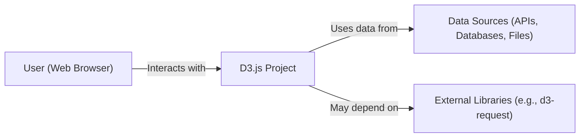
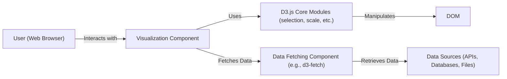
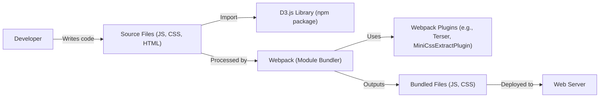

# BUSINESS POSTURE

D3.js is a well-established, widely-used, open-source JavaScript library. Its primary goal is to provide a flexible and powerful way to manipulate the Document Object Model (DOM) based on data. This enables developers to create a vast array of data visualizations, from simple charts to complex, interactive graphics.

Business Priorities and Goals:

*   Maintainability: Ensure the library remains easy to maintain and update, given its open-source nature and large community of contributors.
*   Extensibility: Allow developers to easily extend the library's functionality to meet their specific needs.
*   Performance: Provide efficient DOM manipulation and rendering, especially for large datasets.
*   Accessibility: Ensure visualizations created with D3.js are accessible to users with disabilities.
*   Community Support: Foster a vibrant and supportive community around the library.
*   Backward Compatibility: Minimize breaking changes between releases to avoid disrupting existing projects.

Business Risks:

*   Malicious Code Injection: Given that D3.js manipulates the DOM, there's a risk of malicious code being injected through untrusted data sources, leading to Cross-Site Scripting (XSS) vulnerabilities.
*   Denial of Service (DoS): Complex or poorly optimized visualizations could lead to performance issues or even browser crashes, effectively causing a denial of service.
*   Data Exfiltration: If D3.js is used to visualize sensitive data, improper handling could lead to data leakage.
*   Supply Chain Attacks: Compromised dependencies or build tools could introduce vulnerabilities into the D3.js library itself.
*   Lack of Maintenance: If core maintainers become inactive, the project could stagnate, leading to unaddressed bugs and security vulnerabilities.

# SECURITY POSTURE

Existing Security Controls:

*   security control: Code Reviews: The GitHub repository indicates a collaborative development process, likely involving code reviews to identify and address potential security issues.
*   security control: Community Scrutiny: Being a popular open-source project, D3.js benefits from scrutiny by a large community of developers, increasing the chances of spotting vulnerabilities.
*   security control: Issue Tracking: The GitHub issue tracker allows users to report bugs and security concerns.
*   security control: Static Analysis (Likely): Given the project's maturity, it's probable that static analysis tools are used to identify potential code quality and security issues. This is not explicitly stated but is a common practice.

Accepted Risks:

*   accepted risk: Reliance on Third-Party Libraries: D3.js, like any JavaScript library, may rely on third-party dependencies, which could introduce vulnerabilities.
*   accepted risk: User-Controlled Data: D3.js operates on user-provided data, which inherently carries a risk if not properly sanitized.
*   accepted risk: Complexity of DOM Manipulation: The core functionality of D3.js involves complex DOM manipulation, which can be a source of subtle security vulnerabilities if not handled carefully.

Recommended Security Controls:

*   security control: Content Security Policy (CSP): Provide guidance and examples for implementing CSP in applications using D3.js to mitigate XSS risks.
*   security control: Input Sanitization: Emphasize the importance of input sanitization and provide clear recommendations and examples for developers using D3.js.
*   security control: Regular Dependency Audits: Implement automated dependency checking to identify and address vulnerabilities in third-party libraries.
*   security control: Security-Focused Documentation: Create a dedicated section in the documentation addressing security considerations and best practices.
*   security control: Software Composition Analysis (SCA): Integrate SCA tools into the build process to identify known vulnerabilities in dependencies.

Security Requirements:

*   Authentication: Not directly applicable to D3.js itself, as it's a client-side library. However, applications using D3.js may need to implement authentication mechanisms to protect sensitive data.
*   Authorization: Similar to authentication, authorization is not a core concern of D3.js but may be relevant for applications using it.
*   Input Validation: Crucial for preventing XSS and other injection attacks. D3.js should provide guidance or utilities for sanitizing user-provided data before manipulating the DOM.
*   Cryptography: Not directly applicable to D3.js in most cases. However, if D3.js is used to handle sensitive data that needs to be encrypted, appropriate cryptographic libraries should be used.

# DESIGN

## C4 CONTEXT

Element Descriptions:

*   Element:
    *   Name: User (Web Browser)
    *   Type: Person
    *   Description: A person interacting with a web application that utilizes D3.js for data visualization.
    *   Responsibilities: Views and interacts with visualizations, provides input data (potentially).
    *   Security controls: Browser security features (e.g., same-origin policy, CSP), user-provided input validation.

*   Element:
    *   Name: D3.js Project
    *   Type: Software System
    *   Description: A web application or component that uses the D3.js library to create and display data visualizations.
    *   Responsibilities: Renders data visualizations, handles user interactions, manages data updates.
    *   Security controls: Input sanitization, output encoding, secure coding practices, adherence to D3.js security guidelines.

*   Element:
    *   Name: Data Sources (APIs, Databases, Files)
    *   Type: Software System
    *   Description: External sources from which the D3.js project retrieves data.
    *   Responsibilities: Provides data to the D3.js project.
    *   Security controls: Authentication, authorization, data validation, encryption in transit and at rest (depending on the data source).

*   Element:
    *   Name: External Libraries (e.g., d3-request)
    *   Type: Software System
    *   Description: Third-party libraries that D3.js may depend on for specific functionalities.
    *   Responsibilities: Provides specific functionalities (e.g., making HTTP requests).
    *   Security controls: Regular dependency updates, vulnerability scanning, security audits.

## C4 CONTAINER

Since D3.js is a library, the container diagram is essentially an elaboration of the context diagram. The "containers" are conceptual components within the D3.js library itself.

Element Descriptions:

*   Element:
    *   Name: User (Web Browser)
    *   Type: Person
    *   Description: Same as in the Context Diagram.
    *   Responsibilities: Same as in the Context Diagram.
    *   Security controls: Same as in the Context Diagram.

*   Element:
    *   Name: Visualization Component
    *   Type: Container (Conceptual)
    *   Description: The specific part of the web application code that uses D3.js to create a particular visualization.
    *   Responsibilities: Defines the visualization's structure, appearance, and behavior.
    *   Security controls: Input sanitization specific to the visualization, output encoding.

*   Element:
    *   Name: D3.js Core Modules (selection, scale, etc.)
    *   Type: Container (Conceptual)
    *   Description: The core modules of the D3.js library (e.g., d3-selection, d3-scale, d3-axis).
    *   Responsibilities: Provides the fundamental building blocks for creating visualizations.
    *   Security controls: Secure coding practices within the D3.js library itself.

*   Element:
    *   Name: DOM
    *   Type: Container (Browser-provided)
    *   Description: The Document Object Model, the browser's representation of the web page.
    *   Responsibilities: Represents the structure and content of the web page.
    *   Security controls: Browser security features (e.g., same-origin policy).

*   Element:
    *   Name: Data Fetching Component (e.g., d3-fetch)
    *   Type: Container (Conceptual)
    *   Description: The part of the application or a D3.js module responsible for fetching data.
    *   Responsibilities: Retrieves data from external sources.
    *   Security controls: Secure handling of URLs, proper use of HTTP headers, validation of fetched data.

*   Element:
    *   Name: Data Sources (APIs, Databases, Files)
    *   Type: Software System
    *   Description: Same as in the Context Diagram.
    *   Responsibilities: Same as in the Context Diagram.
    *   Security controls: Same as in the Context Diagram.

## DEPLOYMENT

D3.js, being a JavaScript library, is typically deployed as part of a web application. There are several deployment scenarios:

1.  **Static Website:** The D3.js library and the application code are deployed as static files to a web server (e.g., Apache, Nginx) or a cloud storage service (e.g., AWS S3, Google Cloud Storage, Azure Blob Storage).
2.  **Content Delivery Network (CDN):** The D3.js library can be loaded from a CDN (e.g., jsDelivr, cdnjs) to improve performance and reduce server load. The application code can be deployed as in scenario 1.
3.  **Server-Side Rendering (SSR):** In some cases, D3.js visualizations might be rendered on the server-side (e.g., using Node.js) and sent to the client as HTML. This can improve initial load time and SEO.
4.  **Single-Page Application (SPA):** D3.js is often used within SPAs built with frameworks like React, Angular, or Vue.js. The deployment process depends on the specific framework and build tools used.

We'll describe the Static Website deployment scenario in detail:

```mermaid
graph LR
    Developer["Developer"] -- "Commits code to" --> SourceCodeRepository["Source Code Repository (e.g., GitHub)"]
    SourceCodeRepository -- "Triggers" --> BuildServer["Build Server (Optional)"]
    BuildServer -- "Builds and deploys to" --> WebServer["Web Server (e.g., Apache, Nginx)"]
    WebServer -- "Serves files to" --> UserBrowser["User's Web Browser"]
    UserBrowser -- "Loads D3.js from" --> CDN["CDN (Optional)"]

```

Element Descriptions:

*   Element:
    *   Name: Developer
    *   Type: Person
    *   Description: The developer writing the code for the web application using D3.js.
    *   Responsibilities: Writes code, commits changes to the source code repository.
    *   Security controls: Secure coding practices, access control to the source code repository.

*   Element:
    *   Name: Source Code Repository (e.g., GitHub)
    *   Type: Software System
    *   Description: A repository hosting the source code of the web application.
    *   Responsibilities: Stores the code, manages versions, facilitates collaboration.
    *   Security controls: Access control, branch protection rules, code review policies.

*   Element:
    *   Name: Build Server (Optional)
    *   Type: Software System
    *   Description: A server that automates the build process (e.g., minification, bundling).
    *   Responsibilities: Builds the application from the source code.
    *   Security controls: Secure configuration, access control, dependency management.

*   Element:
    *   Name: Web Server (e.g., Apache, Nginx)
    *   Type: Software System
    *   Description: A server that hosts the static files of the web application.
    *   Responsibilities: Serves the files to users' browsers.
    *   Security controls: Secure configuration, access control, regular security updates.

*   Element:
    *   Name: User's Web Browser
    *   Type: Software System
    *   Description: The user's web browser, which renders the web application.
    *   Responsibilities: Renders the web page, executes JavaScript code, interacts with the user.
    *   Security controls: Browser security features (e.g., same-origin policy, CSP).

*   Element:
    *   Name: CDN (Optional)
    *   Type: Software System
    *   Description: A content delivery network that can host the D3.js library.
    *   Responsibilities: Delivers the D3.js library to users' browsers quickly and efficiently.
    *   Security controls: Secure configuration, HTTPS, regular security updates.

## BUILD

The build process for a D3.js project can vary greatly depending on the complexity of the application and the developer's preferences. Here are some common scenarios:

1.  **No Build Process:** For simple projects, developers might directly include the D3.js library (either from a local file or a CDN) in their HTML file and write their visualization code in a separate JavaScript file. No build tools are used.
2.  **Basic Build Process:** Developers might use a task runner like Gulp or Grunt to automate tasks like minifying JavaScript and CSS files.
3.  **Modern Build Process:** For more complex projects, developers often use module bundlers like Webpack, Parcel, or Rollup. These tools allow developers to use modern JavaScript features (e.g., ES modules), manage dependencies, and optimize the code for production.

We'll describe a Modern Build Process using Webpack:

Security Controls in the Build Process:

*   security control: Dependency Management: Using a package manager like npm or yarn allows developers to manage dependencies and track versions. This helps in identifying and updating vulnerable dependencies.
*   security control: Software Composition Analysis (SCA): Tools like npm audit or yarn audit can be integrated into the build process to automatically scan for known vulnerabilities in dependencies.
*   security control: Static Application Security Testing (SAST): SAST tools can be integrated into the build pipeline to analyze the application code for potential security vulnerabilities.
*   security control: Code Minification and Obfuscation: Minifying and obfuscating the code makes it harder for attackers to reverse engineer the application.
*   security control: Linting: Linters (e.g., ESLint) can be used to enforce coding standards and identify potential code quality and security issues.
*   security control: Secure Build Environment: The build server should be configured securely, with appropriate access controls and security updates.

# RISK ASSESSMENT

Critical Business Processes:

*   Data Visualization: The core business process is the creation and display of data visualizations. The integrity and accuracy of these visualizations are critical.
*   User Interaction: Users interact with the visualizations, and these interactions must be handled securely to prevent attacks.
*   Data Retrieval: The process of retrieving data from external sources must be secure to prevent data breaches and ensure data integrity.

Data Sensitivity:

*   The sensitivity of the data handled by D3.js projects varies greatly. It can range from publicly available data to highly sensitive personal or financial information.
*   The design document should emphasize the importance of understanding the sensitivity of the data being visualized and implementing appropriate security controls.

# QUESTIONS & ASSUMPTIONS

Questions:

*   Are there any specific regulatory requirements (e.g., GDPR, HIPAA) that apply to the data being visualized?
*   What are the specific data sources used by the D3.js projects?
*   What is the expected level of user interaction with the visualizations?
*   Are there any existing security policies or guidelines that need to be followed?
*   What is the deployment environment for the D3.js projects (e.g., cloud provider, on-premises)?

Assumptions:

*   BUSINESS POSTURE: The D3.js project is used in a context where data visualization is important, but the specific business context may vary.
*   SECURITY POSTURE: Developers using D3.js have a basic understanding of web security principles.
*   DESIGN: The D3.js library is used as intended, following its official documentation and best practices. The deployment environment is reasonably secure.