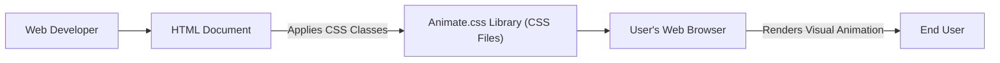
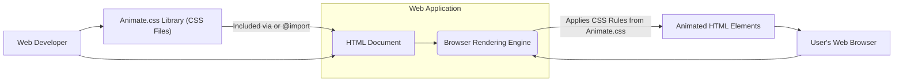
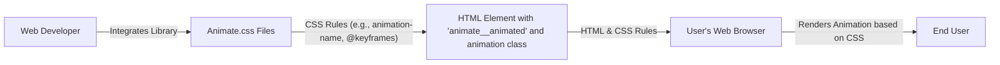

# Project Design Document: Animate.css

**Version:** 1.1
**Date:** October 26, 2023
**Author:** AI Software Architect

## 1. Introduction

This document provides a detailed design of the Animate.css project, a library of ready-to-use, cross-browser CSS animations. This document serves as a foundation for future threat modeling activities by outlining the project's architecture, components, data flow, and key technologies. This version includes refinements for clarity and expands on security considerations.

## 2. Goals and Objectives

The primary goals of Animate.css are:

*   Provide a simple and easy-to-use library of CSS animations for web developers.
*   Offer a diverse range of commonly used animation effects categorized for easy selection.
*   Ensure broad cross-browser compatibility for the animations, targeting modern browsers.
*   Maintain a lightweight and performant library to minimize impact on page load and rendering.
*   Be easily integrable into existing web projects with minimal configuration.

## 3. High-Level Design

Animate.css operates as a client-side library. Developers integrate it into their web projects, and the browser interprets the provided CSS rules to animate HTML elements when specific classes are applied. The core interaction lies between the developer's HTML, the included Animate.css library, and the user's web browser.

## 4. Detailed Design

### 4.1. Components

*   **CSS Files:** The fundamental building blocks of the project, containing the definitions for various animations. These are organized as:
    *   **Core `animate.css`:**  The main file that imports all individual animation files, providing a single point of inclusion.
    *   **Individual Animation Files:**  Separate CSS files for each animation effect (e.g., `animate__fadeIn.css`, `animate__bounce.css`). These are typically categorized by animation type (e.g., entrance animations, exit animations, attention seekers).
    *   **Base Utility Class (`animate__animated`):** A mandatory class that sets up the basic animation context for an element.
    *   **Animation-Specific Classes:**  Classes prefixed with `animate__` followed by the animation name (e.g., `animate__fadeIn`, `animate__shakeX`). These classes define the `animation-name` property, referencing the corresponding `@keyframes` rule.
    *   **Keyframe Definitions (`@keyframes`):**  Blocks of CSS that specify the animation steps and styles at different points in the animation sequence. These define the actual visual changes over time.
    *   **Animation Properties:**  CSS properties used to control the animation's behavior, such as `animation-duration`, `animation-timing-function`, `animation-delay`, `animation-iteration-count`, and `animation-fill-mode`.
*   **Documentation (`README.md`):**  The primary source of information for users, covering:
    *   **Installation Instructions:** Methods for including Animate.css in a project (CDN, npm, yarn, direct download).
    *   **Basic Usage Guide:** Demonstrates how to apply the necessary CSS classes to HTML elements.
    *   **Animation Class Reference:** A comprehensive list of all available animation classes with descriptions.
    *   **Customization Options:**  Guidance on modifying animation properties or creating custom animations.
    *   **Browser Compatibility Information:** Details on supported browsers and any known limitations.
*   **Example HTML Files (within the repository):** Demonstrations showcasing various animations and their usage. These serve as practical examples for developers.
*   **Build System (Likely using npm scripts):**  Automates tasks such as:
    *   **CSS Concatenation:** Combining individual animation files into the main `animate.css` file.
    *   **CSS Minification:** Reducing the file size of the CSS for production deployments.
    *   **Potential Linting/Testing:** Ensuring code quality and consistency.

### 4.2. Data Flow

The "data" primarily consists of CSS rules and their application to HTML elements, leading to visual changes in the browser. The flow is as follows:

1. **Developer Includes Animate.css:** The developer integrates the library into their project by:
    *   Adding a `<link>` tag in the HTML `<head>` referencing the `animate.css` file (either local or via CDN).
    *   Importing `animate.css` into their existing stylesheets using `@import`.
    *   Installing it as a dependency via a package manager and importing it in their application's entry point.
2. **Developer Applies CSS Classes:** The developer adds the `animate__animated` class and a specific animation class (e.g., `animate__fadeIn`) to the desired HTML element.
3. **Browser Parses HTML and CSS:** The web browser loads and parses the HTML document and the linked/imported CSS files, including Animate.css.
4. **CSS Rule Matching:** The browser's rendering engine identifies the HTML element with the applied Animate.css classes. It then matches these classes to the corresponding CSS rules defined in the `animate.css` file. This includes the base `animate__animated` class and the specific animation's `@keyframes` definition.
5. **Animation Execution:** The browser's rendering engine executes the animation based on the defined `@keyframes` and animation properties (e.g., `animation-duration: 1s;`). This involves transitioning the element's styles according to the keyframes over the specified duration.
6. **Visual Update:** The browser repaints or reflows the affected element, resulting in the visual animation being displayed to the user.

### 4.3. Deployment Model

Animate.css is designed for client-side deployment and is typically delivered to the user's browser through these methods:

*   **Content Delivery Network (CDN):**  A popular method where developers link to a publicly hosted version of `animate.css`. This offers benefits like caching and reduced server load.
*   **Package Managers (npm, yarn):** Developers install Animate.css as a project dependency. This allows for integration into build processes and version management.
*   **Direct Download:** Developers download the `animate.css` file and include it directly within their project's static assets.

### 4.4. Key Technologies

*   **CSS (Cascading Style Sheets):** The core technology upon which Animate.css is built. It defines the styling and animation rules.
*   **HTML (HyperText Markup Language):**  Provides the structure of the web page elements that are animated using Animate.css classes.
*   **Web Browsers:** The target environment where the CSS animations are interpreted and rendered. Cross-browser compatibility is a crucial aspect.
*   **Potentially:**
    *   **npm (Node Package Manager) or yarn:** For dependency management and running build scripts.
    *   **Git:** For version control and collaboration, as evidenced by the GitHub repository.
    *   **Build Tools (e.g., npm scripts):**  For automating tasks like CSS concatenation and minification.

## 5. Security Considerations (For Threat Modeling)

While Animate.css is a client-side CSS library and doesn't directly handle sensitive data, its integration into web applications necessitates considering potential security implications:

*   **Cross-Site Scripting (XSS) Vulnerabilities:**
    *   **Threat:** If an attacker can inject arbitrary HTML and CSS into a web page, they can use Animate.css classes to create misleading or malicious visual effects. For example, animating a fake login prompt or obscuring legitimate content.
    *   **Mitigation:**  Proper input sanitization and output encoding are crucial to prevent XSS attacks. Ensure user-provided content is never directly rendered into the DOM without careful processing.
*   **Client-Side Denial of Service (DoS):**
    *   **Threat:**  While less likely, applying a large number of complex animations to a single page or triggering animations repeatedly could potentially consume excessive client-side resources, leading to performance degradation or browser crashes.
    *   **Mitigation:**  Avoid excessive or overly complex animations. Implement logic to prevent users or malicious actors from triggering animations indefinitely.
*   **Dependency Chain Vulnerabilities:**
    *   **Threat:** If Animate.css relies on vulnerable build-time dependencies (e.g., for CSS minification), these vulnerabilities could potentially be exploited.
    *   **Mitigation:** Regularly update dependencies to their latest secure versions. Employ tools that scan dependencies for known vulnerabilities.
*   **CDN Compromise (If Using CDN):**
    *   **Threat:** If using a third-party CDN to host Animate.css, there's a theoretical risk of the CDN being compromised, and malicious code being injected into the Animate.css files.
    *   **Mitigation:** Utilize Subresource Integrity (SRI) hashes to ensure the integrity of the fetched Animate.css file. This allows the browser to verify that the file hasn't been tampered with. Consider using reputable CDN providers.
*   **Misleading User Interface (UI) / User Experience (UX):**
    *   **Threat:** Attackers could leverage animations to create misleading UI elements, potentially tricking users into performing unintended actions (e.g., clicking on a fake button, entering information into a disguised form).
    *   **Mitigation:**  Design UI elements carefully, ensuring animations enhance usability and don't obscure or misrepresent functionality. Implement server-side validation for any critical actions.
*   **CSS Injection Attacks:**
    *   **Threat:** Although Animate.css itself is CSS, vulnerabilities in the web application that allow the injection of arbitrary CSS could be used to manipulate the styling and potentially create visual disruptions or phishing attempts in conjunction with Animate.css classes.
    *   **Mitigation:**  Implement proper input sanitization and content security policies (CSP) to restrict the sources from which stylesheets can be loaded.

## 6. Diagrams

### 6.1. High-Level Architecture Diagram

### 6.2. Data Flow Diagram

## 7. Assumptions and Out-of-Scope Items

*   **Assumptions:**
    *   The primary use case for Animate.css is to enhance the visual appeal of web applications through CSS-based animations.
    *   Developers integrating Animate.css have a basic understanding of HTML and CSS.
    *   The library is intended for client-side use and does not involve server-side processing.
*   **Out-of-Scope:**
    *   Detailed design of the web applications that integrate Animate.css.
    *   Specific server-side security measures of the integrating applications.
    *   JavaScript-based animation libraries or techniques.

## 8. Future Considerations

*   **Accessibility Enhancements:**  Provide more guidance and potentially built-in features to ensure animations are accessible to users with disabilities (e.g., options to reduce motion).
*   **Performance Monitoring and Optimization:** Continuously monitor the performance impact of animations and explore further optimization techniques.
*   **Theming and Customization Improvements:**  Investigate ways to make it easier for developers to customize the look and feel of the animations.
*   **Modularity:** Explore options for more granular inclusion of specific animation types to further reduce file size.

This improved design document provides a more detailed and refined overview of the Animate.css project, with a stronger focus on security considerations relevant for threat modeling. The enhanced descriptions and diagrams aim to provide a clearer understanding of the project's architecture and potential attack vectors.