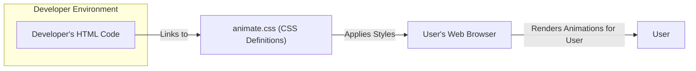
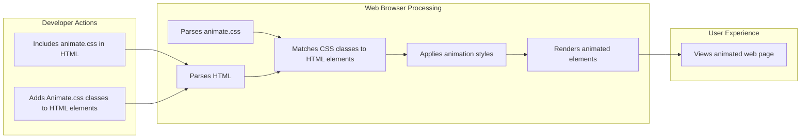
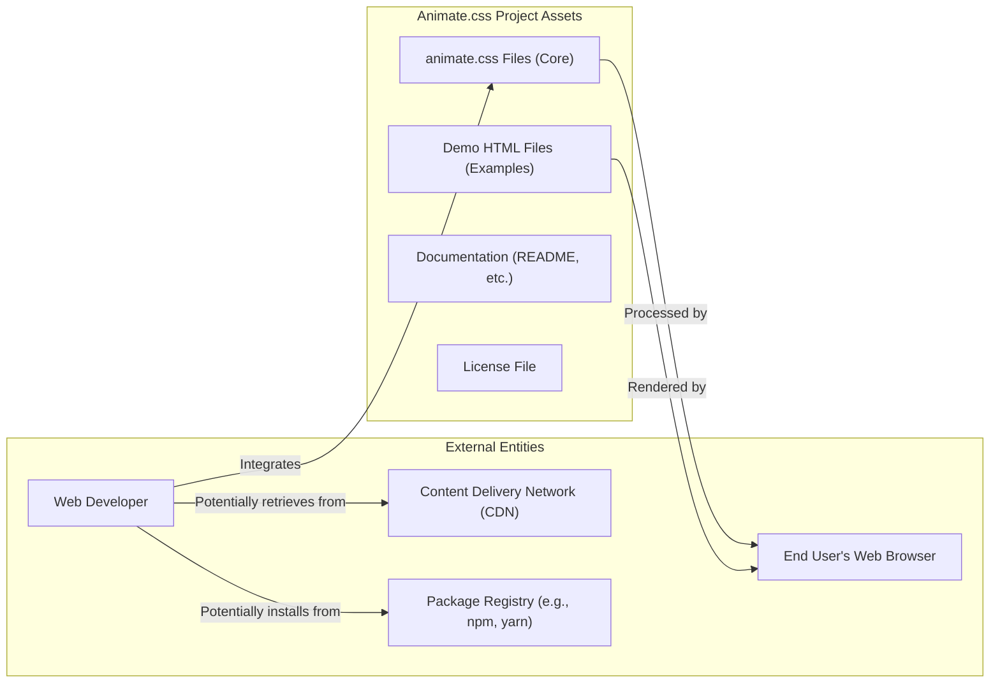

# Project Design Document: Animate.css

**Version:** 1.1
**Date:** October 26, 2023
**Author:** AI Software Architect

## 1. Introduction

This document provides an enhanced design overview of the Animate.css project, a library of ready-to-use, cross-browser CSS animations. This revised document aims to provide a more detailed and structured foundation for subsequent activities, with a particular focus on threat modeling. It elaborates on the system's components, data flow, and potential security considerations to facilitate a comprehensive risk assessment.

## 2. Project Overview

Animate.css is a curated collection of CSS classes. When these classes are applied to HTML elements, they trigger predefined animation effects. The library is designed for ease of integration into existing web projects, focusing exclusively on enhancing the visual presentation layer without requiring server-side processing or complex client-side scripting beyond basic CSS class application.

## 3. Goals and Objectives

*   Provide a straightforward and efficient method for incorporating animations into web projects.
*   Offer a diverse set of commonly used and visually appealing animation effects.
*   Ensure broad compatibility across different web browsers.
*   Maintain a lightweight footprint to minimize performance impact.
*   Promote ease of understanding and customization for developers.

## 4. Target Audience

*   Web developers seeking pre-built, reusable animation solutions.
*   Front-end designers aiming to enrich user interfaces with dynamic visual elements.
*   Individuals with foundational knowledge of HTML and CSS.

## 5. System Architecture

Animate.css operates primarily on the client-side. Its architecture is fundamentally composed of static CSS files that define animation rules.

### 5.1. Components

*   **`animate.css` (or `animate.min.css`):** This is the core CSS file. It contains the definitions for all the animation effects provided by the library. This file is the central artifact of the project.
*   **Demo HTML files (e.g., `index.html`, specific animation demos):** These HTML files serve as practical examples, demonstrating how to apply the various animation classes. While not part of the core library's functional deployment, they are integral to understanding and showcasing its capabilities.
*   **Documentation (README.md, potentially online documentation):** This documentation explains the usage of the library, provides a catalog of available animations, and offers code examples. It's crucial for developers to understand how to integrate and utilize Animate.css.
*   **License file (e.g., `LICENSE`):** This file specifies the terms and conditions under which the library can be used, distributed, and modified.

### 5.2. Deployment Model

Animate.css is typically integrated into web projects through several common deployment methods:

*   **Direct Inclusion (Self-Hosting):** Downloading the `animate.css` file and placing it within the project's directory structure. The file is then linked in the HTML `<head>` section using a `<link>` tag.
*   **Content Delivery Network (CDN):** Referencing the `animate.css` file hosted on a public CDN. This method leverages the CDN's infrastructure for potentially faster loading times and reduced server load.
*   **Package Managers (e.g., npm, yarn):** Installing Animate.css as a project dependency using a package manager. This allows for version management and integration within a build process.

### 5.3. High-Level Flowchart

## 6. Data Flow

The data flow in Animate.css is primarily about the application of styling rules defined in the CSS file to HTML elements within a web browser.

*   **Developer Integration:** A web developer includes the `animate.css` file in their web project, typically by linking it in the HTML.
*   **Class Assignment:** The developer then adds specific CSS classes provided by Animate.css to HTML elements within their markup. These classes correspond to specific animation effects.
*   **Browser Processing:** When the web browser loads the HTML page, it parses both the HTML structure and the linked CSS file (`animate.css`).
*   **Style Application:** The browser identifies HTML elements with Animate.css classes and applies the corresponding animation styles defined in `animate.css`.
*   **Animation Rendering:** The browser's rendering engine executes the animation instructions, visually transforming the HTML elements on the user's screen.

### 6.1. Detailed Flow

## 7. Security Considerations (For Threat Modeling)

Given Animate.css's nature as a client-side CSS library, security considerations primarily focus on the integrity and source of the CSS file and the potential for misuse.

*   **Supply Chain Vulnerabilities:**
    *   **Compromised CDN:** If a CDN hosting `animate.css` is compromised, malicious code could be injected into the CSS file. This could lead to:
        *   **Visual Defacement:**  Unintended and potentially harmful alterations to the website's appearance.
        *   **Clickjacking:**  Overlaying invisible malicious elements to trick users into unintended actions.
        *   **Redirection:**  Using CSS to subtly redirect users to malicious websites.
    *   **Compromised Package Repository:** If installed via a package manager, a compromised version of the package could be distributed, containing malicious CSS.
*   **Integrity Issues:**
    *   **Man-in-the-Middle (MITM) Attacks:** If `animate.css` is loaded over an insecure HTTP connection, an attacker could intercept and modify the file.
    *   **Compromised Development Environment:** If a developer's environment is compromised, a malicious version of `animate.css` could be introduced into the project.
*   **Misuse and Abuse:**
    *   **Resource Exhaustion (Client-Side DoS):** While less likely with Animate.css's typical animations, excessively complex or numerous animations could potentially strain the user's browser, leading to a denial-of-service experience.
    *   **Abuse of Animation for Phishing:**  Clever use of animations could be employed to create deceptive UI elements for phishing attacks.
*   **Vulnerabilities in Demo Files:**
    *   **Cross-Site Scripting (XSS):** If the demo HTML files accept user input without proper sanitization, they could be vulnerable to XSS attacks. While not directly part of the core library, these files are part of the project and could be targeted.
*   **Asset Security:**
    *   **Unsecured Storage:** If the `animate.css` file is stored on a publicly accessible but unsecured server, it could be tampered with.

## 8. Technologies Used

*   **CSS (Cascading Style Sheets):** The fundamental technology used to define the animation effects.

## 9. Deployment Environment

The deployment environment is the end-user's web browser where the HTML, CSS, and JavaScript (if any, though Animate.css is primarily CSS-based) are interpreted and rendered.

## 10. Future Considerations (Potentially Relevant for Future Threat Landscape)

*   **Introduction of JavaScript-based Animation Control:** While currently CSS-based, future versions might incorporate JavaScript for more complex animation control, introducing new potential attack vectors.
*   **More Complex Animation Effects:**  The introduction of more intricate animations could potentially increase the risk of client-side resource exhaustion.
*   **Community Contributions:**  As a popular open-source project, security considerations around community contributions and code review processes become important.

## 11. Diagrams

### 11.1. System Context Diagram

This enhanced design document provides a more detailed understanding of the Animate.css project, specifically tailored for threat modeling. By outlining the components, data flow, and potential security considerations in greater detail, it aims to facilitate a more comprehensive and effective risk assessment of the project and its integration into web applications.