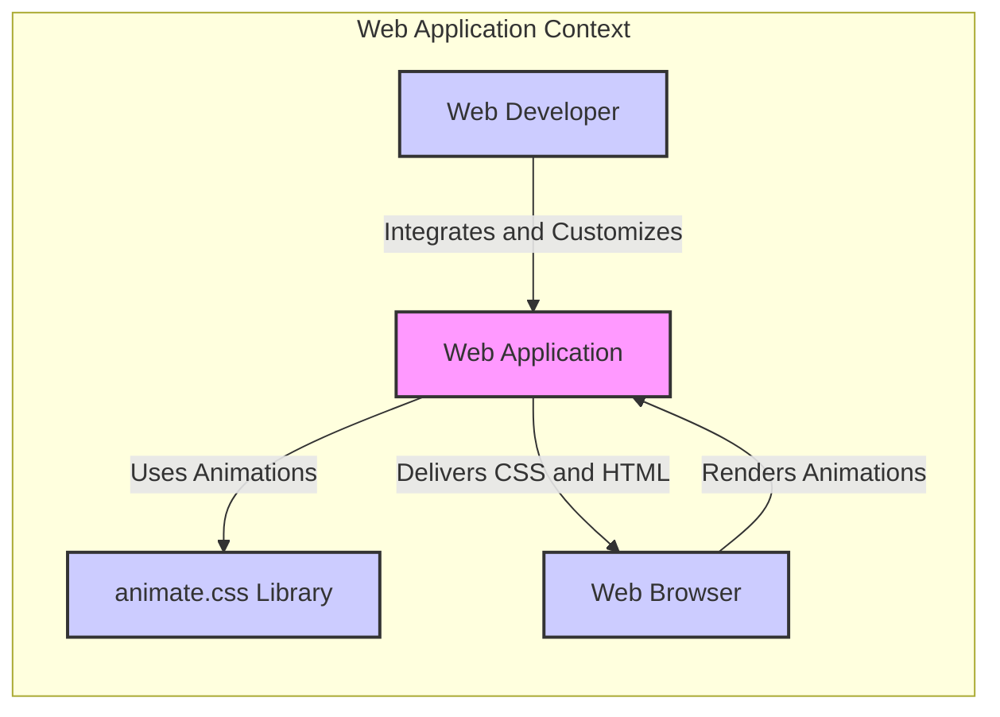
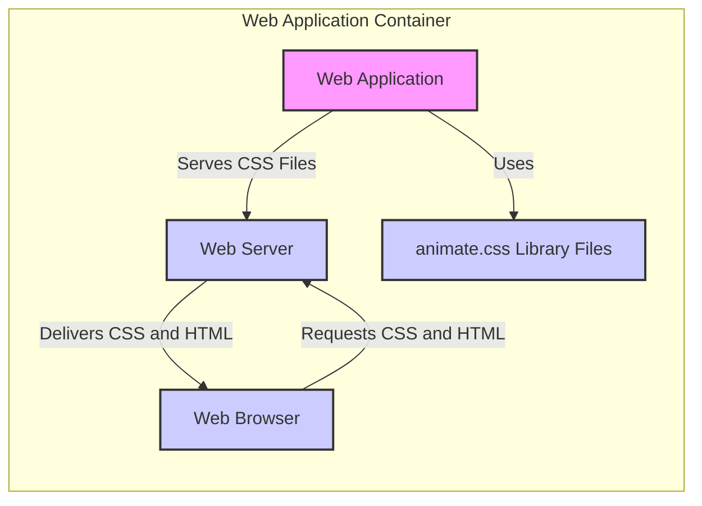
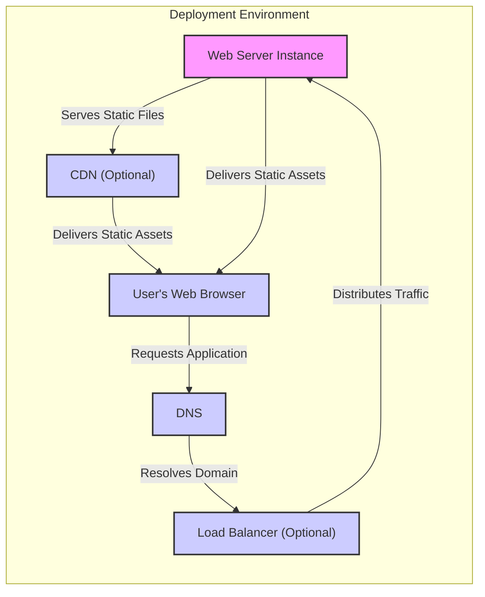

# BUSINESS POSTURE

This project, using the animate.css library, aims to enhance user interface and user experience of web applications by providing a collection of pre-built CSS animations.

## Business Priorities and Goals

- Enhance User Engagement: Improve website or application interactivity and visual appeal to capture and maintain user attention.
- Modernize User Interface: Adopt contemporary design trends by incorporating smooth and subtle animations.
- Improve User Experience: Make the application feel more dynamic and responsive, leading to a more positive user perception.
- Increase Brand Perception: Create a more polished and professional image for the brand through visual enhancements.

## Business Risks

- Performance Impact: Overuse or improper implementation of animations can negatively impact website loading times and performance, leading to a poor user experience and potentially higher bounce rates.
- Accessibility Concerns: Animations, if not implemented thoughtfully, can cause distractions or discomfort for users with vestibular disorders or cognitive impairments.
- Maintenance Overhead: Integrating and maintaining a third-party library introduces a dependency that needs to be managed and updated.
- Compatibility Issues: Animations might not render consistently across all browsers and devices, leading to inconsistent user experience.

# SECURITY POSTURE

This project utilizes a publicly available CSS animation library. The security posture is primarily focused on the secure integration and usage of this third-party component within a larger web application context.

## Existing Security Controls

- security control: Publicly available source code on GitHub. This allows for community review and transparency of the library's code. Implemented by: GitHub Repository.
- security control: Version control using Git. Provides history of changes and allows for tracking modifications. Implemented by: GitHub Repository.
- security control: MIT License. Defines terms of use and distribution, which is relevant from a legal and supply chain perspective. Described in: LICENSE file in the repository.

## Accepted Risks

- accepted risk: Dependency on a third-party library. The project accepts the risk that vulnerabilities might be discovered in the animate.css library in the future.
- accepted risk: Maintenance and updates are dependent on the library maintainers. The project accepts the risk that updates and security patches might not be released promptly or at all.
- accepted risk: Potential for CSS injection if user-controlled data is directly used to manipulate animation class names without proper sanitization in the consuming application.

## Recommended Security Controls

- security control: Subresource Integrity (SRI) for CDN usage. If animate.css is served from a Content Delivery Network (CDN), implement SRI to ensure the integrity and authenticity of the file.
- security control: Dependency scanning. Regularly check for known vulnerabilities in animate.css using automated tools or vulnerability databases.
- security control: Regular updates. Monitor for updates to animate.css and apply them promptly to benefit from bug fixes and potential security improvements.
- security control: CSS Linting. Integrate CSS linting tools into the development process to enforce CSS best practices and potentially identify security-related issues in custom CSS that interacts with animate.css.

## Security Requirements

- Authentication: Not directly applicable to animate.css itself, as it is a client-side CSS library. Authentication is relevant for the web application that utilizes animate.css to protect its own resources and functionalities.
- Authorization: Not directly applicable to animate.css itself. Authorization is relevant for the web application to control access to features and data, and animations should not bypass or undermine these controls.
- Input Validation: While animate.css itself doesn't handle user input, the web application using it must perform input validation. If user input is used to dynamically construct CSS class names for animations, proper sanitization is crucial to prevent CSS injection vulnerabilities.
- Cryptography: Not directly applicable to animate.css. Cryptography is relevant for securing communication (HTTPS) and protecting sensitive data within the web application that uses animate.css.

# DESIGN

The animate.css project itself is a CSS library. Its design is centered around providing a set of CSS classes that, when applied to HTML elements, trigger predefined animations. From a design document perspective, we are considering how this library is used within a web application project.

## C4 CONTEXT

### Context Diagram Elements

- ## 1. Name
    Web Application
  - ## 2. Type
    Software System
  - ## 3. Description
    The web application that is being developed. It utilizes the animate.css library to enhance its user interface with animations. This could be any type of web application, such as an e-commerce site, a blog, a dashboard, etc.
  - ## 4. Responsibilities
    - Deliver content and functionality to users through web browsers.
    - Integrate and utilize the animate.css library to provide animations.
    - Handle user interactions and data.
    - Implement security controls for the application itself.
  - ## 5. Security controls
    - Security control: Authentication and Authorization mechanisms to protect application resources.
    - security control: Input validation to prevent various injection attacks.
    - security control: Secure communication over HTTPS.

- ## 1. Name
    animate.css Library
  - ## 2. Type
    External System / Software Library
  - ## 3. Description
    A third-party CSS library providing a collection of pre-built CSS animations. It is used by the Web Application to easily add animations to HTML elements.
  - ## 4. Responsibilities
    - Provide a set of CSS classes that define various animations.
    - Be compatible with modern web browsers.
    - Be publicly available and accessible for integration.
  - ## 5. Security controls
    - security control: Publicly available source code for review.
    - security control: Version control for tracking changes.

- ## 1. Name
    Web Browser
  - ## 2. Type
    External System
  - ## 3. Description
    The user's web browser (e.g., Chrome, Firefox, Safari). It is responsible for rendering the web application's HTML, CSS, and JavaScript, including the animations defined by animate.css.
  - ## 4. Responsibilities
    - Request and receive web application resources (HTML, CSS, JavaScript).
    - Render web pages and execute client-side code.
    - Apply CSS styles and animations.
  - ## 5. Security controls
    - security control: Browser security features (e.g., Content Security Policy, Same-Origin Policy).
    - security control: Regular browser updates to patch vulnerabilities.

- ## 1. Name
    Web Developer
  - ## 2. Type
    Person / Actor
  - ## 3. Description
    The developer responsible for building and maintaining the Web Application. They integrate the animate.css library into the application, customize animations, and ensure proper implementation.
  - ## 4. Responsibilities
    - Develop and maintain the Web Application's codebase.
    - Integrate and configure the animate.css library.
    - Ensure proper usage of animations and address any performance or accessibility issues.
    - Implement security best practices in the application development.
  - ## 5. Security controls
    - security control: Secure coding practices.
    - security control: Code review processes.
    - security control: Access control to development environments and code repositories.

## C4 CONTAINER

For this project, the "container" level is quite simple as animate.css is a client-side CSS library. The Web Application itself is the primary container in this context.

### Container Diagram Elements

- ## 1. Name
    Web Application
  - ## 2. Type
    Software System / Container
  - ## 3. Description
    Represents the entire web application as a single deployable unit. It encompasses all the client-side code (HTML, CSS, JavaScript) and potentially server-side components if applicable (though for animate.css usage, server-side is less directly relevant).
  - ## 4. Responsibilities
    - Structure and organize the application's codebase.
    - Integrate and manage dependencies, including animate.css.
    - Define the application's architecture and components.
    - Package and prepare the application for deployment.
  - ## 5. Security controls
    - security control: Secure coding practices within the application codebase.
    - security control: Dependency management and vulnerability scanning for all libraries used.

- ## 1. Name
    Web Server
  - ## 2. Type
    Infrastructure / Container
  - ## 3. Description
    The web server (e.g., Nginx, Apache) responsible for hosting and serving the web application's static files (HTML, CSS, JavaScript, including animate.css files) to the web browsers.
  - ## 4. Responsibilities
    - Host and serve static files of the web application.
    - Handle HTTP requests from web browsers.
    - Potentially handle routing and reverse proxying.
  - ## 5. Security controls
    - security control: Web server hardening and security configuration.
    - security control: Access control to server resources.
    - security control: HTTPS configuration for secure communication.

- ## 1. Name
    animate.css Library Files
  - ## 2. Type
    Software Library / Container
  - ## 3. Description
    The collection of CSS files that constitute the animate.css library. These files are included within the Web Application's static assets and served by the Web Server.
  - ## 4. Responsibilities
    - Contain the CSS definitions for all animations provided by the library.
    - Be accessible to the Web Application for inclusion in web pages.
  - ## 5. Security controls
    - security control: Integrity checks (e.g., SRI if served from CDN).
    - security control: Regular updates to the library files.

- ## 1. Name
    Web Browser
  - ## 2. Type
    External System / Container
  - ## 3. Description
    The user's web browser, acting as the client container that requests and renders the web application, including processing the animate.css library to display animations.
  - ## 4. Responsibilities
    - Request web application resources from the Web Server.
    - Render HTML, CSS, and JavaScript.
    - Execute animations defined by animate.css.
  - ## 5. Security controls
    - security control: Browser security features.
    - security control: User control over browser settings and extensions.

## DEPLOYMENT

For a web application using animate.css, a typical deployment scenario involves deploying the application's static assets, including the animate.css files, to a web server.

### Deployment Diagram Elements

- ## 1. Name
    Web Server Instance
  - ## 2. Type
    Infrastructure Component
  - ## 3. Description
    A single instance of a web server (e.g., Nginx, Apache) running on a server (physical or virtual). It hosts the web application's static files, including HTML, CSS, JavaScript, and animate.css. Multiple instances might exist behind a load balancer for scalability and redundancy.
  - ## 4. Responsibilities
    - Host and serve static files.
    - Handle HTTP requests.
    - Potentially manage SSL/TLS certificates for HTTPS.
  - ## 5. Security controls
    - security control: Operating system and web server hardening.
    - security control: Firewall rules to restrict network access.
    - security control: Regular security patching.

- ## 1. Name
    CDN (Optional)
  - ## 2. Type
    Infrastructure Component
  - ## 3. Description
    Content Delivery Network. An optional component used to cache and serve static assets (like animate.css and other CSS/JS files) from geographically distributed servers, improving performance and reducing load on the origin web server.
  - ## 4. Responsibilities
    - Cache and serve static assets to users based on their location.
    - Reduce latency and improve loading times.
    - Potentially provide DDoS protection.
  - ## 5. Security controls
    - security control: CDN provider's security measures.
    - security control: Subresource Integrity (SRI) to ensure asset integrity.
    - security control: HTTPS for secure delivery.

- ## 1. Name
    Load Balancer (Optional)
  - ## 2. Type
    Infrastructure Component
  - ## 3. Description
    An optional component used to distribute incoming traffic across multiple Web Server Instances. It improves application availability and scalability.
  - ## 4. Responsibilities
    - Distribute traffic to backend web servers.
    - Perform health checks on web server instances.
    - Improve application availability and resilience.
  - ## 5. Security controls
    - security control: Load balancer security configuration.
    - security control: DDoS protection capabilities.

- ## 1. Name
    DNS
  - ## 2. Type
    Infrastructure Component
  - ## 3. Description
    Domain Name System. Translates domain names (e.g., www.example.com) to IP addresses of the Load Balancer or Web Server, allowing users to access the web application using a human-readable domain name.
  - ## 4. Responsibilities
    - Domain name resolution.
    - Pointing domain names to the correct infrastructure.
  - ## 5. Security controls
    - security control: DNSSEC to protect against DNS spoofing and cache poisoning.
    - security control: Secure DNS configuration.

- ## 1. Name
    User's Web Browser
  - ## 2. Type
    Client Application
  - ## 3. Description
    The end-user's web browser that accesses the web application. It requests resources, renders the UI, and executes animations.
  - ## 4. Responsibilities
    - Request web application resources.
    - Render web pages and execute client-side code.
    - Display animations.
  - ## 5. Security controls
    - security control: Browser security features.
    - security control: User awareness of phishing and malicious websites.

## BUILD

The build process for a project using animate.css typically involves integrating the library into the web application's build pipeline. This might be as simple as copying the CSS files into the project's static assets directory. For more complex setups, it might involve using package managers and build tools.

```mermaid
flowchart LR
    A["Developer"] -- "Code Changes" --> B["Version Control (Git)"]
    B -- "Push Code" --> C["Build System (e.g., CI/CD)"]
    C -- "Fetch Code & Dependencies" --> B
    C -- "Run Build Tasks (e.g., CSS processing, minification)" --> D["Build Artifacts (CSS, JS, HTML)"]
    D -- "Deploy" --> E["Deployment Environment (Web Server, CDN)"]
    style A fill:#ccf,stroke:#333,stroke-width:2px
    style B fill:#ccf,stroke:#333,stroke-width:2px
    style C fill:#f9f,stroke:#333,stroke-width:2px
    style D fill:#ccf,stroke:#333,stroke-width:2px
    style E fill:#ccf,stroke:#333,stroke-width:2px
```

### Build Diagram Elements

- ## 1. Name
    Developer
  - ## 2. Type
    Actor
  - ## 3. Description
    The software developer who writes code, including integrating and using the animate.css library within the web application.
  - ## 4. Responsibilities
    - Write and modify application code.
    - Integrate and configure animate.css.
    - Commit code changes to version control.
  - ## 5. Security controls
    - security control: Secure coding practices.
    - security control: Local development environment security.
    - security control: Authentication to version control systems.

- ## 1. Name
    Version Control (Git)
  - ## 2. Type
    Tool / System
  - ## 3. Description
    A version control system (like Git, e.g., GitHub, GitLab, Bitbucket) used to track changes to the codebase, collaborate with other developers, and manage different versions of the project.
  - ## 4. Responsibilities
    - Store and manage source code.
    - Track changes and revisions.
    - Facilitate collaboration among developers.
  - ## 5. Security controls
    - security control: Access control to the repository.
    - security control: Branching and merging strategies for code integrity.
    - security control: Audit logs of code changes.

- ## 1. Name
    Build System (e.g., CI/CD)
  - ## 2. Type
    Tool / System
  - ## 3. Description
    An automated build system (like Jenkins, GitHub Actions, GitLab CI) that automates the process of building, testing, and deploying the web application. It fetches code from version control, runs build tasks, and creates deployable artifacts.
  - ## 4. Responsibilities
    - Automate the build process.
    - Run tests and security checks (e.g., linters, SAST).
    - Package build artifacts.
    - Potentially automate deployment.
  - ## 5. Security controls
    - security control: Secure configuration of CI/CD pipelines.
    - security control: Access control to CI/CD system.
    - security control: Security scanning during the build process (e.g., dependency scanning, SAST).

- ## 1. Name
    Build Artifacts (CSS, JS, HTML)
  - ## 2. Type
    Data / Output
  - ## 3. Description
    The output of the build process, which includes the compiled and processed static files of the web application, ready for deployment. This includes HTML, JavaScript, CSS files (including animate.css if processed or bundled).
  - ## 4. Responsibilities
    - Contain the deployable application code and assets.
    - Be consistent and reproducible from the source code.
  - ## 5. Security controls
    - security control: Integrity checks of build artifacts.
    - security control: Secure storage of build artifacts before deployment.

- ## 1. Name
    Deployment Environment (Web Server, CDN)
  - ## 2. Type
    Infrastructure / Environment
  - ## 3. Description
    The target environment where the web application is deployed and runs, typically consisting of web servers and potentially CDNs.
  - ## 4. Responsibilities
    - Host and serve the web application to users.
    - Execute the application code.
    - Provide runtime environment.
  - ## 5. Security controls
    - security control: Deployment environment security hardening.
    - security control: Access control to the deployment environment.
    - security control: Monitoring and logging of deployed application.

# RISK ASSESSMENT

## Critical Business Processes

The critical business process being supported by using animate.css is enhancing the user experience of the web application. This indirectly supports business goals like user engagement, brand perception, and potentially conversions or sales, depending on the application's purpose.

## Data Sensitivity

animate.css itself does not directly handle or process any data. However, the web application that uses animate.css might handle sensitive user data. The sensitivity of data depends entirely on the nature of the web application. For example, an e-commerce site might handle personal and financial data, while a simple blog might handle less sensitive data. The animations themselves should not compromise the security or confidentiality of any data handled by the application.

# QUESTIONS & ASSUMPTIONS

## Questions

- What type of web application will be using animate.css? (e.g., e-commerce, blog, dashboard, marketing website)
- What are the specific user experience goals for incorporating animations?
- How will animate.css be integrated into the project? (e.g., directly included CSS files, package manager, CDN)
- What is the expected traffic volume and performance requirements for the web application?
- Are there any specific accessibility requirements that need to be considered when using animations?

## Assumptions

- The project is a web application that aims to improve user engagement and modernize its user interface.
- The animate.css library will be used to add visual animations to enhance user experience.
- The web application will be deployed to a standard web server infrastructure, potentially with a CDN.
- Security is a consideration for the web application, and the integration of animate.css should not introduce new security vulnerabilities.
- The development team has basic web development and deployment knowledge.