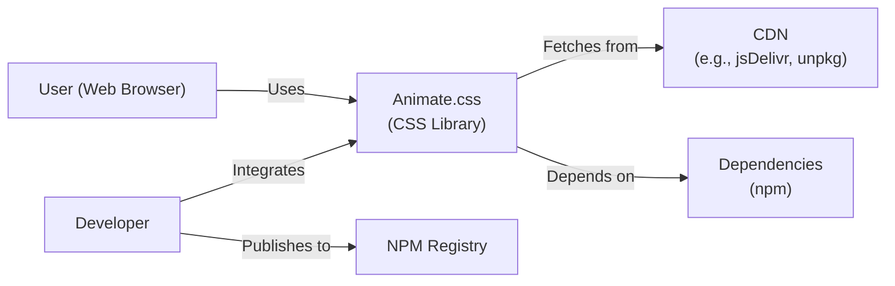
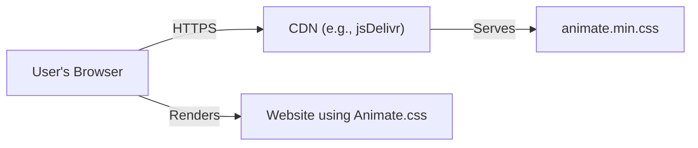
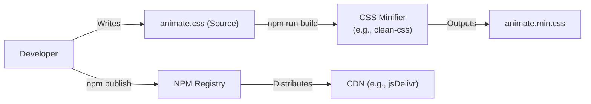

# BUSINESS POSTURE

Business Priorities and Goals:

*   Provide an easy-to-use library of CSS animations for web developers.
*   Maintain a small, efficient, and performant library.
*   Ensure broad browser compatibility.
*   Foster a community around the project for contributions and support.
*   Provide clear and comprehensive documentation.

Business Risks:

*   Malicious code injection: If the library were compromised, attackers could inject malicious CSS or JavaScript, potentially leading to XSS attacks on websites using the library.
*   Denial of Service (DoS): While unlikely, specially crafted animations could potentially be used to cause excessive CPU or memory consumption in browsers, leading to a denial-of-service condition.
*   Supply Chain Attacks: Compromise of the build process or distribution channels (like npm) could lead to the distribution of a malicious version of the library.
*   Reputational Damage: Security vulnerabilities or performance issues could damage the reputation of the library and its maintainer.
*   Lack of Maintenance: If the project is abandoned, it may become incompatible with newer browsers or web standards, leading to usability issues.

# SECURITY POSTURE

Existing Security Controls:

*   security control: Code Review: The GitHub repository shows evidence of community contributions and pull requests, suggesting some level of code review.
*   security control: Dependency Management: The project uses npm for dependency management, which allows for tracking and updating dependencies.
*   security control: MIT License: The project uses the MIT license, which is permissive and allows for wide use and modification.

Accepted Risks:

*   accepted risk: Limited Input Validation: As a CSS library, the primary input is through CSS classes. While CSS itself has limited attack surface, misuse of custom properties (CSS variables) could potentially be a concern if not handled carefully by users of the library.
*   accepted risk: No Formal Security Audits: There's no indication of formal security audits or penetration testing.
*   accepted risk: Reliance on Community Contributions: While beneficial, relying on community contributions means the security posture depends partly on the diligence of contributors.

Recommended Security Controls:

*   security control: Content Security Policy (CSP) Guidance: Provide clear guidance in the documentation on how to use the library safely within a Content Security Policy. This is crucial for mitigating XSS risks.
*   security control: Subresource Integrity (SRI) Hashes: Provide SRI hashes for the distributed CSS files (e.g., on CDNs). This allows browsers to verify the integrity of the fetched files.
*   security control: Automated Dependency Updates: Implement a system (like Dependabot or Renovate) to automatically update dependencies and address known vulnerabilities.
*   security control: Security.md File: Add a SECURITY.md file to the repository to provide a clear process for reporting security vulnerabilities.

Security Requirements:

*   Authentication: Not applicable, as this is a CSS library, not an application with user accounts.
*   Authorization: Not applicable, as there are no authorization requirements.
*   Input Validation:
    *   The library itself doesn't directly handle user input. However, documentation should advise users on safe usage, particularly regarding CSS variables and any potential interaction with JavaScript.
    *   If user-provided data is used to generate animation names or parameters dynamically, proper escaping and sanitization must be performed *by the user of the library*. The library should clearly document this responsibility.
*   Cryptography: Not directly applicable. However, if the library is distributed via HTTPS (which it should be), TLS will provide transport-layer security. SRI hashes (recommended above) provide cryptographic verification of file integrity.

# DESIGN

## C4 CONTEXT

Element Descriptions:

*   User (Web Browser):
    *   Name: User (Web Browser)
    *   Type: Person
    *   Description: A user accessing a website that utilizes the animate.css library.
    *   Responsibilities: Renders the website and executes the CSS animations.
    *   Security controls: Browser's built-in security mechanisms (Same-Origin Policy, CSP, etc.).
*   Developer:
    *   Name: Developer
    *   Type: Person
    *   Description: A web developer who integrates animate.css into their website.
    *   Responsibilities: Includes the library in their project, applies animation classes to HTML elements.
    *   Security controls: Secure coding practices, adherence to web security best practices.
*   Animate.css (CSS Library):
    *   Name: Animate.css
    *   Type: Software System
    *   Description: The core animate.css library, providing pre-defined CSS animations.
    *   Responsibilities: Provides CSS classes that define animations.
    *   Security controls:  Code review, dependency management.
*   CDN (e.g., jsDelivr, unpkg):
    *   Name: CDN
    *   Type: External System
    *   Description: A Content Delivery Network that hosts the animate.css files for faster delivery.
    *   Responsibilities: Serves the library files to users' browsers.
    *   Security controls: HTTPS, CDN's security measures.
*   Dependencies (npm):
    *   Name: Dependencies
    *   Type: External System
    *   Description: External libraries that animate.css might depend on (although in this case, it's minimal).
    *   Responsibilities: Provide functionality required by animate.css.
    *   Security controls: Dependency management, vulnerability scanning.
*   NPM Registry:
    *   Name: NPM Registry
    *   Type: External System
    *   Description: The public registry for Node.js packages, where animate.css is published.
    *   Responsibilities: Hosts the published package of animate.css.
    *   Security controls: NPM's security measures, two-factor authentication (recommended for the publisher).

## C4 CONTAINER

Since animate.css is a very simple library consisting primarily of a single CSS file, the container diagram is essentially the same as the context diagram.  It doesn't have multiple containers in the traditional sense.

Element Descriptions:

The element descriptions are identical to the C4 Context diagram, as the "container" in this case is the single animate.css library itself.

## DEPLOYMENT

Possible Deployment Solutions:

1.  **CDN (Recommended):**  Users include a `<link>` tag in their HTML pointing to a CDN-hosted version of animate.css (e.g., jsDelivr, unpkg). This is the most common and recommended approach.
2.  **npm/Yarn:** Developers install the package via npm or Yarn and then include it in their build process (e.g., using a bundler like Webpack or Parcel).
3.  **Direct Download:** Users download the CSS file directly from the GitHub repository and include it in their project.  This is less common and not recommended due to the lack of automatic updates.

Detailed Deployment (CDN - Recommended):

Element Descriptions:

*   User's Browser:
    *   Name: User's Browser
    *   Type: Software System
    *   Description: The web browser used by the end-user.
    *   Responsibilities: Fetches and renders the website, including the animate.css file.
    *   Security controls: Browser's built-in security features, HTTPS.
*   CDN (e.g., jsDelivr):
    *   Name: CDN (e.g., jsDelivr)
    *   Type: External System
    *   Description: A Content Delivery Network that hosts the animate.css file.
    *   Responsibilities: Serves the animate.css file to the user's browser.
    *   Security controls: HTTPS, CDN's security infrastructure.
*   animate.min.css:
    *   Name: animate.min.css
    *   Type: File
    *   Description: The minified version of the animate.css file.
    *   Responsibilities: Contains the CSS animation definitions.
    *   Security controls: SRI (if used).
*   Website using Animate.css
    *   Name: Website using Animate.css
    *   Type: Software System
    *   Description: Website that integrated Animate.css library.
    *   Responsibilities: Use Animate.css to provide animations.
    *   Security controls: Implemented security controls by website developers.

## BUILD

The build process for animate.css is relatively simple, primarily involving minification of the CSS file.  The project uses npm scripts for this.

Build Process Description:

1.  **Development:** The developer writes and modifies the `animate.css` source file.
2.  **Minification:** An npm script (likely using a tool like `clean-css`) is used to minify the source CSS, creating `animate.min.css`. This reduces the file size for faster downloads.
3.  **Publishing:** The developer uses `npm publish` to publish the package (including both the source and minified CSS) to the npm registry.
4.  **CDN Distribution:** CDNs like jsDelivr and unpkg automatically pick up the latest version from the npm registry and make it available for users.

Security Controls in Build Process:

*   security control: Dependency Management: npm is used to manage dependencies (even if minimal in this case). This allows for tracking and updating dependencies, mitigating potential vulnerabilities in build tools.
*   security control: Minification: While primarily for performance, minification can also slightly obfuscate the code, making it marginally harder for casual attackers to understand.
*   security control: Version Control (Git): The use of Git and GitHub provides a history of changes, allowing for auditing and rollbacks if necessary.
*   security control: (Recommended) Two-Factor Authentication (2FA) on npm: The project maintainer should enable 2FA on their npm account to prevent unauthorized publishing of malicious code.

# RISK ASSESSMENT

Critical Business Processes:

*   Providing a reliable and performant CSS animation library.
*   Maintaining the reputation and trust of the library and its maintainer.

Data to Protect:

*   **Source Code (animate.css):** Sensitivity: Low (Publicly available).  Integrity is crucial to prevent malicious code injection.
*   **Published Package (npm):** Sensitivity: Low (Publicly available). Integrity is paramount to prevent distribution of compromised versions.
*   **User Data:**  The library itself *does not* handle any user data. However, websites *using* the library might, and those websites are responsible for protecting that data.  This is an important distinction.

# QUESTIONS & ASSUMPTIONS

Questions:

*   Are there any specific performance targets or browser compatibility requirements beyond what's already stated in the README?
*   Are there any plans to introduce more complex features or interactions with JavaScript in the future? This could significantly impact the security considerations.
*   What is the process for handling community contributions and ensuring their quality and security?
*   Is there a specific budget or resource allocation for security-related activities (e.g., audits, tooling)?

Assumptions:

*   BUSINESS POSTURE: The primary goal is to provide a free, open-source, and easy-to-use CSS animation library.  Profit is not a primary driver.
*   SECURITY POSTURE: The project maintainer has a basic understanding of web security principles but may not have extensive security expertise.  The project relies heavily on community contributions and the security practices of the npm ecosystem.
*   DESIGN: The library will remain primarily CSS-based, with minimal or no JavaScript interaction.  The deployment model will continue to prioritize ease of use via CDNs. The build process will remain simple and rely on existing npm scripts.