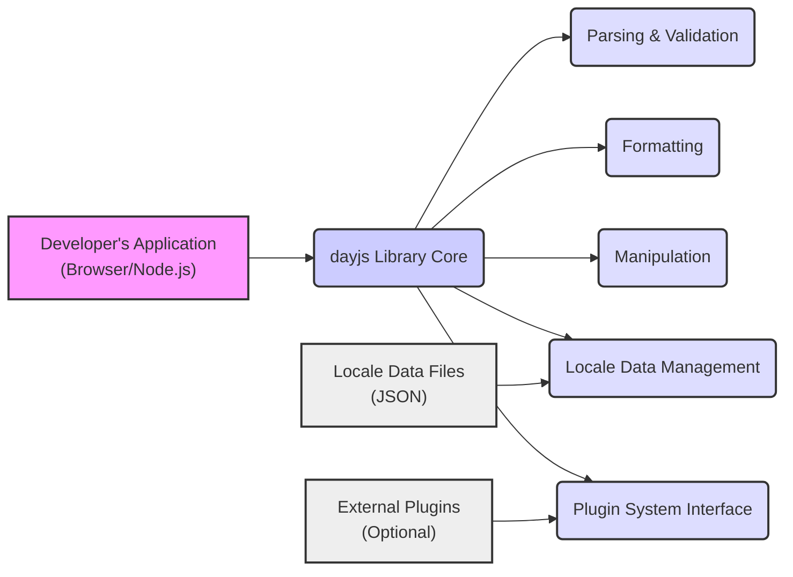
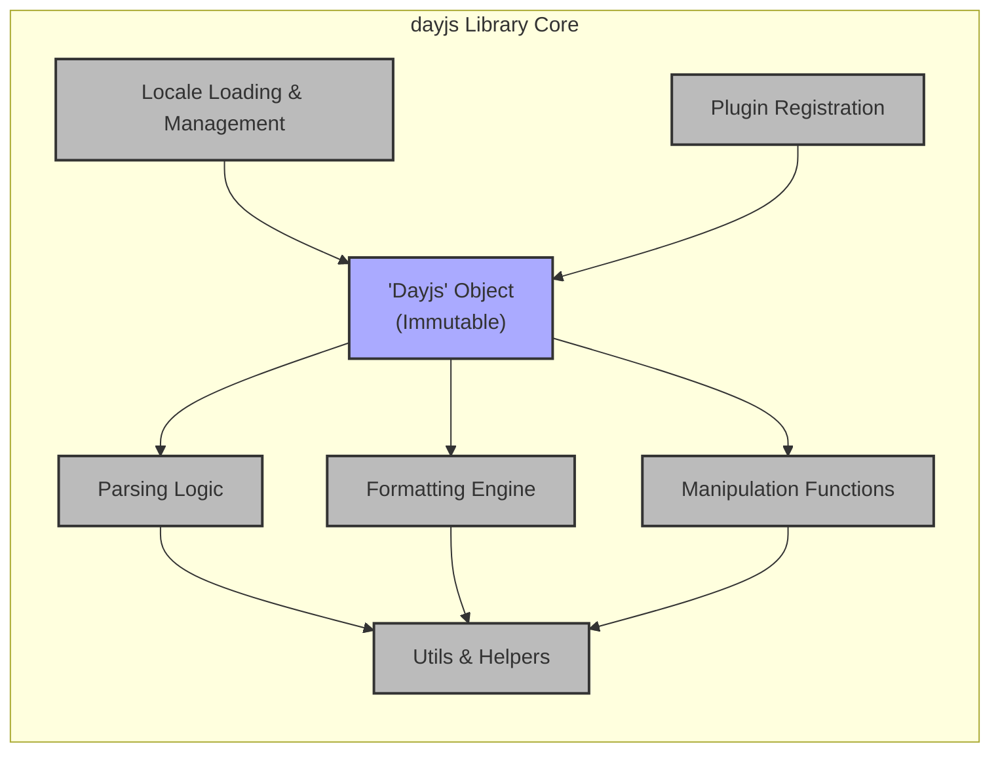
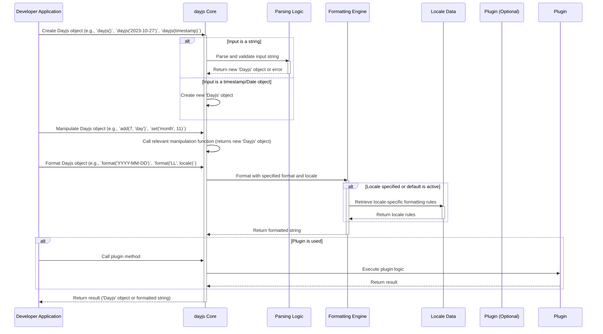

## Project Design Document: dayjs (Improved)

**1. Introduction**

This document provides an enhanced design overview of the `dayjs` JavaScript library, a lightweight and immutable alternative to Moment.js for parsing, validating, manipulating, and formatting dates and times. This document is specifically tailored to facilitate subsequent threat modeling activities by providing a detailed understanding of the library's architecture, data flow, and potential interaction points.

**2. Goals**

* Provide a highly performant and lightweight date and time manipulation library for JavaScript environments (browsers and Node.js).
* Offer a largely compatible API with Moment.js to ease migration for existing projects.
* Support internationalization through a modular locale system.
* Enable extensibility via a well-defined plugin architecture.
* Maintain a minimal bundle size to reduce application footprint and improve loading times.
* Ensure immutability of `Dayjs` objects to prevent unintended side effects.

**3. Non-Goals**

* Implementing comprehensive and complex time zone handling beyond basic offset management. Dedicated libraries specializing in time zone management are recommended for such use cases.
* Providing direct integration with external services, databases, or UI frameworks. `dayjs` focuses solely on date and time manipulation logic.
* Replicating every single feature of Moment.js, especially those considered less frequently used or contributing significantly to bundle size.

**4. System Architecture**

The `dayjs` library is primarily a client-side JavaScript library, but it is also designed to function seamlessly within Node.js environments. The core of the library revolves around the `Dayjs` object, which represents an immutable instance of a specific point in time.

**4.1. High-Level Architecture**

* **Developer's Application (Browser/Node.js):** The environment where the `dayjs` library is integrated and utilized. This could be a web browser executing JavaScript or a Node.js server-side application.
* **dayjs Library Core:** The central module of `dayjs`, providing the main API and orchestrating the various functionalities.
* **Parsing & Validation:** Responsible for converting various input formats (strings, timestamps, native `Date` objects) into valid `Dayjs` objects and ensuring the validity of the input.
* **Formatting:** Handles the conversion of a `Dayjs` object into a string representation based on specified format patterns and the active locale.
* **Manipulation:** Provides functions for creating new `Dayjs` objects by modifying existing ones (e.g., adding or subtracting time units). Due to immutability, these operations always return a new `Dayjs` instance.
* **Locale Data Management:** Manages the loading, caching, and application of locale-specific date and time formatting rules.
* **Plugin System Interface:** Defines the mechanism for registering and utilizing external plugins to extend the core functionality of `dayjs`.
* **Locale Data Files (JSON):** External JSON files containing language-specific formatting rules, month names, day names, etc.
* **External Plugins (Optional):**  Optional JavaScript modules that add extra features and functionalities to `dayjs`.

**4.2. Component-Level Architecture**

* **'Dayjs' Object (Immutable):** The core data structure representing a specific date and time. It holds the internal timestamp and provides methods for accessing and manipulating date components. Immutability ensures that operations return new `Dayjs` instances, preventing unintended side effects.
* **Parsing Logic:**  The set of functions responsible for interpreting various input formats (strings, numbers, Date objects) and converting them into the internal representation of a `Dayjs` object. This includes validation to ensure the input represents a valid date and time.
* **Formatting Engine:** The module that takes a `Dayjs` object and a format string as input and produces a formatted string representation of the date and time, respecting the currently active locale.
* **Manipulation Functions:** A collection of functions that perform date and time arithmetic and adjustments (e.g., adding days, setting months). These functions always return a new `Dayjs` object.
* **Locale Loading & Management:**  Handles the process of loading locale data from JSON files and making it available to the formatting engine. This includes setting the global locale and handling locale-specific formatting rules.
* **Plugin Registration:** The mechanism through which external plugins can register their functionalities and extend the `Dayjs` API. This involves adding new methods or modifying existing behavior.
* **Utils & Helpers:** A collection of internal utility functions used by various components of the library for common tasks.

**5. Data Flow**

The primary data flow within `dayjs` involves the creation, manipulation, and formatting of date and time information. Understanding this flow is crucial for identifying potential points of vulnerability.

* **Creation:** The developer initiates the creation of a `Dayjs` object. If a string is provided, the Parsing Logic is invoked to interpret and validate the input.
* **Manipulation:** Manipulation methods are called on a `Dayjs` object, resulting in the creation of a *new* `Dayjs` object with the modified date and time.
* **Formatting:** The `format()` method triggers the Formatting Engine, which utilizes Locale Data to produce a string representation according to the specified format and locale.
* **Plugin Usage:** If a plugin is involved, the call is delegated to the plugin's registered functionality.

**6. Security Considerations (Pre-Threat Model)**

Given the nature of date and time manipulation, several security considerations are relevant for `dayjs`:

* **Input Validation Vulnerabilities (Parsing):**
    * **Malformed Input Strings:**  The Parsing Logic must be resilient against maliciously crafted or unexpected date strings that could lead to incorrect parsing, exceptions, or even denial-of-service if parsing is computationally expensive. Regular expressions used in parsing are a potential area for ReDoS attacks.
    * **Integer Overflow/Underflow:** When parsing from timestamps (especially large or small numbers), care must be taken to prevent integer overflow or underflow issues that could lead to unexpected date representations or errors.
* **Locale Data Tampering:** If locale data is loaded dynamically from external sources (less common, but possible through custom implementations), there's a risk of malicious modification of locale files, leading to incorrect or misleading date formatting.
* **Plugin Security Risks:**
    * **Malicious Plugins:**  If developers load untrusted or compromised plugins, these plugins could introduce arbitrary code execution vulnerabilities, access sensitive data, or modify the behavior of `dayjs` in unintended ways.
    * **Plugin Conflicts:**  Poorly designed plugins might conflict with core `dayjs` functionality or other plugins, potentially leading to unexpected behavior or security vulnerabilities.
* **Denial of Service (DoS):**
    * **Complex Formatting Patterns:**  Extremely complex or deeply nested formatting patterns could potentially consume excessive resources during the formatting process, leading to performance degradation or even browser/application freezes.
    * **Resource Exhaustion through Manipulation:** While less likely due to immutability, poorly implemented or excessively chained manipulation operations could theoretically lead to performance issues.
* **Prototype Pollution:**  Care must be taken to avoid prototype pollution vulnerabilities, especially when extending the `Dayjs` prototype through plugins. Malicious actors could exploit such vulnerabilities to inject properties into all `Dayjs` objects, potentially leading to security issues in the application using `dayjs`.
* **Regular Expression Denial of Service (ReDoS):**  As mentioned earlier, the parsing logic often relies on regular expressions. Carefully crafted input strings could exploit vulnerabilities in these regexes, causing them to take an excessively long time to process, leading to DoS.

**7. Deployment Considerations**

* **Web Browsers:** `dayjs` is typically included as a `<script>` tag or bundled using tools like Webpack, Parcel, or Rollup. Locale files and plugins are often included separately or on demand.
* **Node.js:**  Installed via npm or yarn (`npm install dayjs`) and imported using `require()` or `import`. Locale files and plugins are also installed and imported as needed.
* **Content Delivery Networks (CDNs):** `dayjs` is available on popular CDNs, offering a convenient way to include it in web pages. However, using CDNs introduces a dependency on a third-party service.

**8. Dependencies**

* **Core `dayjs`:**  Designed to have minimal to no core dependencies to maintain its small size.
* **Locale Files:**  Represent a form of dependency, although they are typically bundled or loaded alongside the core library.
* **Plugins:**  Introduce external dependencies, which need to be managed and their security posture considered.

**9. Future Considerations**

* **Enhanced Time Zone Support:** While a non-goal for the core, future plugins or extensions might offer more comprehensive time zone handling.
* **Further Performance Optimizations:** Continuous efforts to improve parsing, formatting, and manipulation performance.
* **Strengthening Plugin Security Mechanisms:**  Potentially introducing mechanisms for plugin verification or sandboxing to mitigate risks associated with untrusted plugins.
* **Formal Security Audits:**  Periodic security audits to identify and address potential vulnerabilities.

This improved design document provides a more detailed and nuanced understanding of the `dayjs` library, specifically focusing on aspects relevant to threat modeling. The enhanced architecture diagrams, elaborated data flow, and expanded security considerations offer a solid foundation for identifying and mitigating potential security risks.
