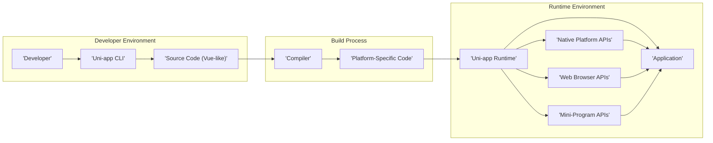

## Project Design Document: Uni-app (Improved for Threat Modeling)

**1. Introduction**

This document provides an enhanced design overview of the Uni-app framework, specifically tailored for threat modeling activities. Building upon the initial design, this version offers more granular details and explicitly highlights potential security considerations within each component and process. This document will serve as the basis for identifying potential threats, vulnerabilities, and attack vectors within the Uni-app ecosystem.

**2. Project Overview**

Uni-app is an open-source framework developed by DCloud, enabling developers to build cross-platform applications from a single codebase. It targets a wide range of platforms, including iOS, Android, Web (H5), and various mini-program environments (WeChat, Alipay, Baidu, etc.). Uni-app utilizes a component-based architecture, employing a Vue.js-inspired syntax and a comprehensive set of platform-agnostic APIs. The primary goal is to streamline development, reduce redundancy, and accelerate the delivery of applications across multiple platforms.

**3. System Architecture**

The following diagram illustrates the key components and their interactions within the Uni-app architecture:

**4. Key Components (Detailed with Security Considerations)**

*   **Developer:**  The individual or team writing the Uni-app application code.
    *   **Security Considerations:**  Developers are the primary point of introducing vulnerabilities through insecure coding practices, reliance on vulnerable dependencies, or mishandling sensitive data.
*   **Uni-app CLI (Command Line Interface):** A tool used by developers for project creation, building, and management.
    *   Key functionalities include:
        *   Project initialization (`uni create`)
        *   Adding platform support (`uni add`)
        *   Building for specific platforms (`uni build -p <platform>`)
        *   Running development servers (`uni run -p <platform>`)
    *   **Security Considerations:**
        *   **Dependency Vulnerabilities:** The CLI itself relies on Node.js packages, which could have known vulnerabilities.
        *   **Malicious Templates:**  If the CLI supports external templates, these could contain malicious code.
        *   **Path Traversal:** Improper handling of file paths during build processes could lead to path traversal vulnerabilities.
*   **Source Code (Vue-like):** The codebase written by developers, including `.vue` files, JavaScript/TypeScript, configuration files (`manifest.json`, `pages.json`), and static assets.
    *   Includes:
        *   `.vue` files for component structure, logic, and styling.
        *   JavaScript/TypeScript files for application logic and data handling.
        *   Configuration files defining application settings, routes, and permissions.
        *   Static assets like images and fonts.
    *   **Security Considerations:**
        *   **Cross-Site Scripting (XSS):** Vulnerabilities in component templates or JavaScript code could allow for injecting malicious scripts.
        *   **Insecure Data Handling:**  Improper storage or transmission of sensitive data.
        *   **Logic Flaws:**  Bugs in the application logic that could be exploited.
        *   **Hardcoded Secrets:**  Storing API keys or other sensitive information directly in the code.
*   **Compiler:** The core component responsible for transforming the developer's source code into platform-specific code.
    *   Responsibilities include:
        *   Parsing source code files.
        *   Generating platform-specific code (JavaScript for web, native bridges for mobile, platform-specific markup for mini-programs).
        *   Optimizing code for performance.
        *   Handling conditional compilation based on the target platform defined in configuration.
    *   **Security Considerations:**
        *   **Compiler Vulnerabilities:**  Bugs in the compiler could lead to the generation of insecure code.
        *   **Code Injection:**  Exploits in the compiler could allow attackers to inject malicious code into the build output.
        *   **Supply Chain Attacks:** If the compiler relies on compromised dependencies, it could lead to compromised output.
*   **Platform-Specific Code:** The output of the compilation process, tailored for each target platform.
    *   Examples:
        *   **Web (H5):** HTML, CSS, JavaScript files.
        *   **Native (iOS/Android):** JavaScript code bundled with a native runtime (e.g., Weex or a custom runtime), along with native wrappers.
        *   **Mini-Programs:** Platform-specific markup languages (WXML, AXML, etc.) and JavaScript.
    *   **Security Considerations:**
        *   **Web:** Susceptible to standard web vulnerabilities like XSS, CSRF if not handled properly in the generated code.
        *   **Native:** Potential vulnerabilities in the native runtime or bridge implementations. Improper handling of native permissions.
        *   **Mini-Programs:**  Security restrictions and potential vulnerabilities within the mini-program platform's execution environment.
*   **Uni-app Runtime:** A layer that provides a consistent set of APIs for accessing platform-specific functionalities, abstracting away platform differences.
    *   Key features:
        *   Unified API for common functionalities (network requests, storage, device information, UI components).
        *   Abstraction of platform-specific implementations.
        *   Management of the application lifecycle.
    *   **Security Considerations:**
        *   **API Vulnerabilities:**  Bugs or design flaws in the runtime APIs could be exploited.
        *   **Bypass of Security Measures:**  Vulnerabilities in the runtime could allow bypassing platform security features.
        *   **Data Leakage:**  Improper handling of sensitive data within the runtime.
*   **Native Platform APIs (iOS/Android):** The APIs provided by the operating system for accessing device features and functionalities.
    *   **Security Considerations:**
        *   **Permission Abuse:**  Applications might request excessive or unnecessary permissions.
        *   **API Misuse:**  Improper usage of native APIs could lead to security vulnerabilities.
        *   **Platform Vulnerabilities:**  Exploiting known vulnerabilities in the underlying operating system.
*   **Web Browser APIs:** Standard web APIs available in browsers.
    *   **Security Considerations:**
        *   **DOM-based XSS:**  Manipulating the Document Object Model in a way that executes malicious scripts.
        *   **Insecure API Usage:**  Misusing browser APIs (e.g., local storage, cookies) leading to security issues.
        *   **Content Security Policy (CSP) Bypasses:**  Weak or missing CSP can expose the application to attacks.
*   **Mini-Program APIs:** APIs provided by specific mini-program platforms.
    *   **Security Considerations:**
        *   **Platform-Specific Restrictions:**  Understanding and adhering to the security policies and limitations of each mini-program platform.
        *   **API Abuse:**  Exploiting vulnerabilities or misusing the platform's APIs.
        *   **Data Sharing Restrictions:**  Understanding the rules and limitations around data sharing within the mini-program environment.
*   **Application:** The final deployed application running on the target platform.
    *   **Security Considerations:**  The overall security posture of the application is a culmination of the security of all its components and the development practices employed.

**5. Data Flow (Detailed with Security Touchpoints)**

The data flow within a Uni-app application, with added security considerations, involves the following stages:

*   **Development:** Developers create code (C) using the Uni-app CLI (B).
    *   **Security Touchpoint:** Code reviews, static analysis tools can be used to identify potential vulnerabilities early in the development process. Secure coding practices should be enforced.
*   **Compilation:** The Uni-app CLI (B) invokes the Compiler (D) to process the Source Code (C).
    *   **Security Touchpoint:** Ensure the integrity of the Compiler (D) and its dependencies. Implement checks to prevent malicious code injection during compilation.
*   **Platform-Specific Code Generation:** The Compiler (D) generates Platform-Specific Code (E).
    *   **Security Touchpoint:**  The code generation process should follow secure coding principles for each target platform. Output should be reviewed for potential vulnerabilities.
*   **Deployment/Execution:**
    *   **Web:** Platform-Specific Code (E) is deployed to a web server. Users access the Application (J) through a browser, interacting with Web Browser APIs (H). The Uni-app Runtime (F) executes within the browser.
        *   **Security Touchpoint:** Secure deployment practices, HTTPS, Content Security Policy (CSP), and regular security audits of the web server.
    *   **Native:** Platform-Specific Code (E) is bundled with the Uni-app Runtime (F) and packaged into a native application (J). Users interact with the Application (J), which utilizes Native Platform APIs (G).
        *   **Security Touchpoint:** Secure packaging and signing of the application. Proper handling of platform permissions. Regular security updates for the native runtime.
    *   **Mini-Programs:** Platform-Specific Code (E) is uploaded to the respective mini-program platform. The Application (J) runs within the platform's environment, interacting with Mini-Program APIs (I).
        *   **Security Touchpoint:** Adherence to the security guidelines and restrictions of the specific mini-program platform. Secure communication with backend services.
*   **User Interaction:** Users interact with the Application (J), triggering events and data changes.
    *   **Security Touchpoint:** Input validation and sanitization to prevent XSS and other injection attacks. Proper handling of user authentication and authorization.
*   **API Interaction:** The Application (J) uses the Uni-app Runtime's (F) unified API to interact with Platform APIs (G, H, I) or external services.
    *   **Security Touchpoint:** Secure communication protocols (HTTPS). Proper authentication and authorization for accessing external services. Protection against API abuse.
*   **Data Persistence:** The Application (J) may store data locally or remotely.
    *   **Security Touchpoint:** Secure storage mechanisms for local data (encryption). Secure transmission and storage for remote data. Protection against data breaches and unauthorized access.

**6. Deployment Model (with Security Implications)**

Uni-app applications can be deployed in several ways, each with its own security considerations:

*   **Web (H5):** Deployed on standard web servers.
    *   **Security Implications:**  Subject to typical web application security risks (XSS, CSRF, SQL Injection if a backend is involved). Requires secure server configuration, HTTPS, and potentially a Web Application Firewall (WAF).
*   **Native (iOS/Android):** Packaged as native apps and distributed through app stores or enterprise channels.
    *   **Security Implications:** Requires secure code signing, adherence to platform security guidelines, and careful management of permissions. Vulnerabilities in the native runtime or third-party libraries can pose risks.
*   **Mini-Programs:** Hosted and managed within the respective mini-program platforms.
    *   **Security Implications:** Security is largely dependent on the platform's security model. Developers must adhere to platform-specific security rules and limitations. Data sharing and access restrictions are crucial.

**7. Security Considerations (Expanded)**

This section expands on the initial security considerations, providing more specific examples of potential threats and vulnerabilities.

*   **Code Injection (XSS, SQL Injection):**  Vulnerabilities in the developer's code or within Uni-app's components could allow attackers to inject malicious scripts or code. Proper input validation and output encoding are crucial.
*   **Data Security (Data in Transit and At Rest):** Sensitive data must be protected using encryption during transmission (HTTPS) and when stored locally or remotely. Secure storage mechanisms and access controls are necessary.
*   **Authentication and Authorization Flaws:** Weak or missing authentication and authorization mechanisms can allow unauthorized access to application functionalities and data. Secure session management and role-based access control are important.
*   **Third-Party Dependency Vulnerabilities:**  Uni-app and developer applications rely on external libraries. Regularly scanning and updating these dependencies is essential to mitigate known vulnerabilities.
*   **Platform-Specific Security Issues:** Each target platform has unique security considerations. Developers must be aware of and address these platform-specific risks (e.g., Android intent vulnerabilities, iOS URL scheme hijacking).
*   **Build Process Compromise:**  If the build process is compromised, attackers could inject malicious code into the application without the developer's knowledge. Secure build environments and dependency management are critical.
*   **Insecure Communication:** Failure to use HTTPS for network requests can expose sensitive data to eavesdropping and man-in-the-middle attacks.
*   **Insufficient Input Validation:**  Improperly validated user inputs can lead to various attacks, including XSS, SQL injection (if a backend is involved), and command injection.
*   **Permissions Management Issues:**  Requesting excessive or unnecessary permissions can raise privacy concerns and potentially be exploited by attackers.
*   **Mini-Program Platform Vulnerabilities:**  While the mini-program platform provides a sandboxed environment, vulnerabilities within the platform itself could potentially be exploited.

**8. Assumptions and Dependencies**

*   Developers possess a foundational understanding of web development principles and potentially Vue.js.
*   The integrity of the Uni-app CLI, Compiler, and Runtime environment is assumed.
*   The underlying platform APIs (native, web, mini-program) are assumed to be functioning as intended and have their own security measures in place.
*   Developers are responsible for securing their backend infrastructure and APIs if the application interacts with them.
*   Developers are expected to adhere to the security guidelines and best practices recommended by Uni-app and the target platforms.

**9. Future Considerations**

*   Conduct a comprehensive threat modeling exercise based on this detailed design document.
*   Implement regular security testing, including static and dynamic analysis, and penetration testing.
*   Establish a process for managing and addressing security vulnerabilities.
*   Provide security training and resources for developers using Uni-app.
*   Continuously monitor for new threats and vulnerabilities related to Uni-app and its dependencies.

This improved design document provides a more in-depth understanding of the Uni-app architecture and explicitly highlights potential security considerations. This detailed information will be invaluable for conducting thorough threat modeling and implementing appropriate security measures to protect Uni-app applications.
