## Project Design Document: Uni-app (Improved)

**1. Introduction**

This document provides an enhanced architectural design of the Uni-app framework, an open-source framework enabling the development of cross-platform applications from a single codebase. This improved version aims to offer a more granular understanding of the system's components, their interactions, and data flows, specifically tailored for effective threat modeling. This detailed design will serve as a robust foundation for identifying potential security vulnerabilities and informing mitigation strategies.

**2. Goals**

*   Provide a clear and detailed architectural description of the Uni-app framework.
*   Identify and elaborate on the responsibilities of each key component within the framework.
*   Describe the data flow within the system with a focus on potential security implications.
*   Outline the interactions between different components, highlighting trust boundaries and potential attack vectors.
*   Serve as a comprehensive and actionable basis for conducting thorough threat modeling activities.

**3. Scope**

This document encompasses the core architecture of the Uni-app framework, with a particular emphasis on aspects relevant to security. This includes:

*   The developer workflow utilizing the Uni-app CLI and associated tools.
*   The intricate compilation and build process for generating platform-specific application packages.
*   The runtime environment in which Uni-app applications execute across various target platforms.
*   Detailed descriptions of key components and their security-relevant functionalities.

This document's scope intentionally excludes:

*   In-depth implementation details of specific plugins or community-contributed components within the Uni-app ecosystem.
*   Low-level implementation specifics of the underlying native platform SDKs (e.g., Android SDK, iOS SDK).
*   The specific business logic and data handling within individual applications built using Uni-app.

**4. Target Audience**

This document is primarily intended for:

*   Security engineers and architects responsible for performing threat modeling and security assessments of Uni-app and applications built with it.
*   Software architects and developers involved in the design, development, and maintenance of the Uni-app framework itself.
*   Individuals seeking a comprehensive and security-focused understanding of the Uni-app framework's architecture.

**5. Architectural Overview**

Uni-app's core principle is to enable developers to "write once, run anywhere." This is achieved by writing code in a unified syntax, primarily using Vue.js components, which is then compiled and adapted for deployment across a diverse range of platforms:

*   Standard web browsers (utilizing HTML5, CSS, and JavaScript).
*   Native mobile applications for iOS and Android operating systems.
*   Various mini-program platforms (e.g., WeChat, Alipay, Baidu Smart Program).
*   Desktop applications built using frameworks like Electron.

The central element of Uni-app is its compiler, which transforms the platform-agnostic codebase into platform-specific instructions and assets. This process involves several distinct components and stages, each with its own security considerations.

**6. Key Components (Detailed)**

*   **Uni-app CLI (Command Line Interface):**
    *   Provides essential tools for project scaffolding, development server management, building, and deployment preparation.
    *   Manages project dependencies defined in `package.json` and potentially other configuration files. This dependency management is a critical area for supply chain security concerns.
    *   Offers commands for running local development servers, often leveraging Node.js, which introduces potential vulnerabilities if not properly secured.
    *   Facilitates the installation and management of plugins, which can introduce external code and potential security risks.
*   **Compiler:**
    *   The central engine responsible for the transformation of Uni-app code into platform-specific outputs. This process involves parsing, abstract syntax tree (AST) manipulation, and code generation.
    *   Parses Vue.js components (`.vue` files), JavaScript code, and other static assets. Vulnerabilities in the parsing logic could lead to code injection or denial-of-service.
    *   Applies platform-specific transformations and optimizations, potentially introducing platform-specific vulnerabilities if not implemented correctly.
    *   Generates code tailored for target platforms, including JavaScript for web, native code wrappers (using frameworks like Weex or React Native under the hood for some platforms), and platform-specific markup.
*   **Runtime Library:**
    *   A collection of JavaScript modules included within the built application package.
    *   Provides platform abstraction layers for common functionalities such as network requests, local storage access, UI component rendering, and device API interactions. This abstraction layer is crucial for cross-platform compatibility but can also be a source of vulnerabilities if not implemented securely.
    *   Handles platform-specific API calls, often acting as a bridge between the JavaScript code and native platform functionalities. Improper handling of native API calls can lead to security issues.
    *   Manages the application lifecycle within the target environment.
*   **Platform SDKs (Software Development Kits):**
    *   Native SDKs provided by the respective target platforms (e.g., Android SDK, iOS SDK, Mini-Program SDKs).
    *   Used by the compiled application (via the runtime library) to access device features, platform-specific APIs, and system resources. Security vulnerabilities within these SDKs can directly impact the security of Uni-app applications.
*   **Plugins and Extensions:**
    *   Optional components that extend the core functionality of Uni-app, providing access to native device capabilities or integrating with third-party services.
    *   Can be developed by the DCloud team or the broader community. The security of community-developed plugins is a significant concern.
    *   May require access to sensitive device permissions or user data, making their security posture critical.
*   **Development Server:**
    *   A local server, typically based on Node.js, used during the development phase for features like hot reloading and rapid testing.
    *   If not properly configured, the development server itself can be a target for attacks, potentially exposing source code or developer credentials.
*   **Template Engine:**
    *   Responsible for processing Vue.js templates and generating the platform-specific UI structures. Vulnerabilities in the template engine could lead to cross-site scripting (XSS) vulnerabilities.

**7. System Architecture Diagram (Improved)**

```mermaid
graph LR
    subgraph "Developer Environment"
        A["Developer"]
        B["Code Editor"]
        C["Uni-app CLI"]
        D["Source Code ('*.vue', JS, CSS, Assets)"]
        E["Dependencies ('package.json')"]
    end

    subgraph "Build Process"
        F["Compiler"]
        G["Platform-Specific Builders"]
        H["Platform SDKs"]
        I["Application Package (APK, IPA, Web Files, etc.)"]
    end

    subgraph "Runtime Environment"
        J["Web Browser"]
        K["Mobile OS (Android/iOS)"]
        L["Mini-Program Host (WeChat, Alipay, etc.)"]
        M["Desktop Environment (Electron)"]
        N["Runtime Library"]
    end

    A -- "Code Editing" --> B
    B -- "Save Changes" --> D
    A -- "CLI Commands" --> C
    C -- "Read Dependencies" --> E
    C -- "Initiate Build" --> F
    D -- "Compile" --> F
    E -- "Install/Manage" --> C
    F -- "Platform Adaptations" --> G
    G -- "Utilize SDKs" --> H
    H -- "Package Generation" --> I
    I -- "Deployment" --> J
    I -- "Deployment" --> K
    I -- "Deployment" --> L
    I -- "Deployment" --> M
    I -- "Execution" --> N
    N -- "Platform API Access" --> K
    N -- "Platform API Access" --> L
    N -- "Platform API Access" --> J
    N -- "Platform API Access" --> M

    style A fill:#f9f,stroke:#333,stroke-width:2px
    style B fill:#ccf,stroke:#333,stroke-width:2px
    style C fill:#ccf,stroke:#333,stroke-width:2px
    style D fill:#ccf,stroke:#333,stroke-width:2px
    style E fill:#ccf,stroke:#333,stroke-width:2px
    style F fill:#aaf,stroke:#333,stroke-width:2px
    style G fill:#aaf,stroke:#333,stroke-width:2px
    style H fill:#aaf,stroke:#333,stroke-width:2px
    style I fill:#dda,stroke:#333,stroke-width:2px
    style J fill:#bbf,stroke:#333,stroke-width:2px
    style K fill:#bbf,stroke:#333,stroke-width:2px
    style L fill:#bbf,stroke:#333,stroke-width:2px
    style M fill:#bbf,stroke:#333,stroke-width:2px
    style N fill:#bbf,stroke:#333,stroke-width:2px
```

**8. Data Flow (Security Focused)**

The data flow within the Uni-app development and deployment process, with a focus on security-relevant aspects, is as follows:

*   **Developer Input and Code Creation:**
    *   Developers create source code (Vue.js components, JavaScript, CSS, assets) within a code editor. This code can potentially contain vulnerabilities introduced by the developer.
    *   Dependencies are declared in `package.json`. These external dependencies represent a significant attack surface if compromised.
*   **Build Process and Compilation:**
    *   The Uni-app CLI reads the source code and dependency information. Malicious dependencies could be injected at this stage.
    *   The Compiler processes the source code. Vulnerabilities in the compiler could lead to the injection of malicious code into the output.
    *   Platform-specific builders utilize the relevant Platform SDKs. Compromised SDKs could introduce vulnerabilities.
    *   The output is an Application Package. The integrity of this package is crucial.
*   **Runtime Execution:**
    *   The Application Package is deployed to the target platform. Secure deployment mechanisms are essential.
    *   The Runtime Library executes within the target environment. Vulnerabilities in the runtime library can be exploited.
    *   User interactions and data input are processed by the application. Input validation and sanitization are critical to prevent injection attacks.
    *   Plugins may interact with the runtime environment and access sensitive data or device features. Plugin security is paramount.
    *   Network communication occurs via the Runtime Library. Secure protocols (HTTPS) and proper certificate validation are necessary.
    *   Local data storage, if used, needs to be handled securely to protect sensitive information.

**9. Component Interactions (Threat Modeling Perspective)**

*   The **Developer** introduces code and dependencies, representing a primary source of potential vulnerabilities (human error, malicious intent).
*   The **Uni-app CLI**, responsible for managing dependencies and initiating the build, is a critical point of control and a potential target for supply chain attacks.
*   The **Compiler**, as the core transformation engine, must be robust against malicious input and prevent the generation of vulnerable code.
*   **Platform-Specific Builders** and **Platform SDKs** introduce dependencies on external codebases, requiring trust in their security.
*   The **Runtime Library** acts as a bridge between the application code and the underlying platform, making its security crucial for preventing platform-specific exploits.
*   **Plugins and Extensions** represent a significant extension of the attack surface, as their security is often outside the direct control of the core Uni-app framework.
*   The **Development Server**, while primarily for development, can expose sensitive information if not properly secured.

**10. Security Considerations (Detailed for Threat Modeling)**

This section expands on potential security considerations, providing more specific examples relevant for threat modeling:

*   **Dependency Management Vulnerabilities:**
    *   Using known vulnerable versions of dependencies.
    *   Typosquatting attacks targeting dependency names.
    *   Compromised dependency repositories.
    *   Lack of Software Bill of Materials (SBOM) for tracking dependencies.
*   **Compiler Vulnerabilities:**
    *   Code injection flaws in the compiler allowing attackers to inject malicious code into the output.
    *   Denial-of-service vulnerabilities in the compiler triggered by crafted input.
    *   Information disclosure through compiler error messages or logs.
*   **Plugin Security Risks:**
    *   Plugins with known vulnerabilities.
    *   Malicious plugins designed to steal data or compromise the device.
    *   Plugins requesting excessive or unnecessary permissions.
    *   Lack of a robust plugin vetting or security review process.
*   **Platform SDK Security Issues:**
    *   Vulnerabilities in the underlying Android, iOS, or Mini-Program SDKs that can be exploited by Uni-app applications.
    *   Improper usage of platform SDK APIs within the Runtime Library, leading to security flaws.
*   **Code Injection Vulnerabilities:**
    *   Cross-site scripting (XSS) vulnerabilities in web deployments due to improper handling of user input in templates or JavaScript code.
    *   SQL injection vulnerabilities if the application interacts with databases without proper sanitization.
    *   Command injection vulnerabilities if the application executes external commands based on user input.
*   **Data Storage Security:**
    *   Storing sensitive data in plaintext locally.
    *   Using insecure local storage mechanisms.
    *   Lack of proper encryption for stored data.
    *   Insufficient protection against unauthorized access to local storage.
*   **Network Communication Security:**
    *   Using insecure protocols (HTTP) for transmitting sensitive data.
    *   Man-in-the-middle attacks if HTTPS is not implemented correctly or certificate validation is bypassed.
    *   Server-side vulnerabilities in APIs that the Uni-app application interacts with.
*   **Build Pipeline Security:**
    *   Compromised build servers injecting malicious code into the application package.
    *   Exposure of signing keys or certificates used to sign application packages.
    *   Lack of integrity checks on build artifacts.
*   **Runtime Environment Vulnerabilities:**
    *   Exploiting vulnerabilities in the web browser, mobile OS, or Mini-Program host environment.
    *   Insecure configurations of the runtime environment.
*   **Authorization and Authentication:**
    *   Weak or missing authentication mechanisms.
    *   Insufficient authorization controls allowing users to access resources they shouldn't.
    *   Storing authentication credentials insecurely.

**11. Deployment Considerations (Security Implications)**

The deployment process introduces additional security considerations:

*   **Web Deployment:** Standard web security best practices apply, including secure server configuration, HTTPS enforcement, and protection against common web attacks.
*   **Mobile (Native) Deployment:** Code signing is crucial to ensure the integrity and authenticity of the application. Secure distribution channels (official app stores) help mitigate the risk of distributing tampered applications.
*   **Mini-Program Deployment:** Security is heavily reliant on the security measures implemented by the respective mini-program platforms. Developers need to adhere to platform-specific security guidelines.
*   **Desktop Deployment:** Secure packaging and distribution mechanisms are necessary to prevent tampering and ensure the application's integrity. Code signing is also important here.

**12. Future Considerations (Security Focus)**

*   Formal security audits of the Uni-app compiler and runtime library.
*   Implementation of a robust plugin security review process.
*   Development of secure coding guidelines specifically for Uni-app developers.
*   Integration of static and dynamic analysis tools into the development workflow.
*   Creation of a security-focused knowledge base and community forum for Uni-app developers.

**13. Conclusion**

This improved design document provides a more detailed and security-focused understanding of the Uni-app framework's architecture. By elaborating on the responsibilities of each component, the data flow, and potential security considerations, this document serves as a valuable resource for conducting thorough threat modeling activities. This enhanced understanding is crucial for building secure applications with Uni-app and mitigating potential risks throughout the development lifecycle.