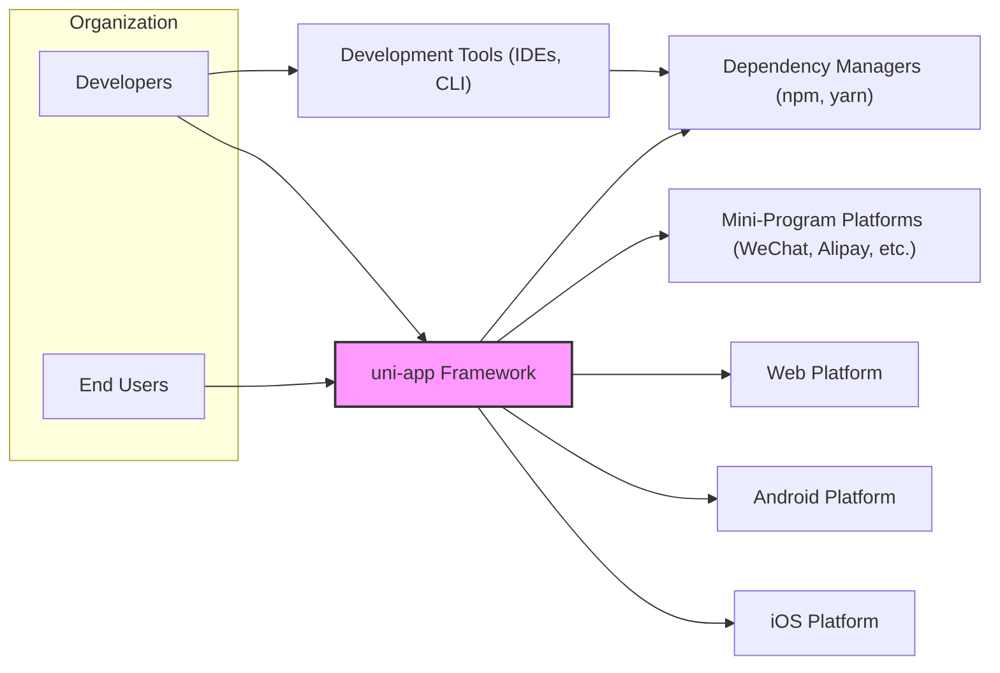

# BUSINESS POSTURE

This project, uni-app, aims to provide a unified development framework for building applications across multiple platforms including iOS, Android, Web, and various mini-program environments using Vue.js.

*   Business Priorities and Goals:
    *   Cross-platform compatibility: Enable developers to write code once and deploy to multiple platforms, reducing development time and cost.
    *   Developer productivity: Offer a familiar and efficient development experience based on Vue.js.
    *   Performance: Ensure applications built with uni-app perform well on target platforms.
    *   Community growth: Foster a strong developer community around uni-app to drive adoption and contribution.
    *   Ease of use: Provide a simple and intuitive framework for developers of varying skill levels.

*   Business Risks:
    *   Security vulnerabilities in the uni-app framework could impact all applications built using it, leading to widespread security incidents.
    *   Lack of timely security updates and patches could leave applications vulnerable to known exploits.
    *   Dependence on third-party libraries and components introduces supply chain risks.
    *   Poorly designed or implemented security features in uni-app could lead to insecure applications.
    *   Reputational damage if applications built with uni-app are frequently compromised.

# SECURITY POSTURE

*   Existing Security Controls:
    *   security control: GitHub repository for source code management and version control. Implemented in: `https://github.com/dcloudio/uni-app`
    *   security control: Issue tracking system on GitHub for reporting and managing bugs and feature requests, including potential security vulnerabilities. Implemented in: `https://github.com/dcloudio/uni-app/issues`
    *   security control: Community contributions and code reviews through pull requests on GitHub. Implemented in: GitHub Pull Request process.
    *   security control: Documentation available online, potentially including some security considerations. Implemented in: `https://uniapp.dcloud.net.cn/` (Documentation website)

*   Accepted Risks:
    *   accepted risk: Open-source nature implies vulnerabilities might be publicly disclosed before a patch is available.
    *   accepted risk: Reliance on community contributions for security improvements and vulnerability identification.
    *   accepted risk: Potential for vulnerabilities in third-party dependencies.

*   Recommended Security Controls:
    *   security control: Implement automated security scanning tools (SAST, DAST, dependency scanning) in the CI/CD pipeline to identify vulnerabilities early in the development process.
    *   security control: Establish a clear vulnerability disclosure policy and process to handle security reports effectively.
    *   security control: Conduct regular security audits and penetration testing to proactively identify and address security weaknesses.
    *   security control: Implement a Security Champions program to promote security awareness and best practices within the development team.
    *   security control: Enhance input validation and output encoding mechanisms within the framework to prevent common web vulnerabilities.
    *   security control: Provide secure coding guidelines and security training for developers using uni-app.

*   Security Requirements:
    *   Authentication:
        *   Requirement: If uni-app framework includes any backend or administrative functionalities, it must implement secure authentication mechanisms to verify user identity.
        *   Requirement: Applications built with uni-app should provide guidance and best practices for implementing secure authentication based on the specific needs of the application.
    *   Authorization:
        *   Requirement: If uni-app framework includes any backend or administrative functionalities, it must implement robust authorization mechanisms to control access to resources and functionalities based on user roles and permissions.
        *   Requirement: Applications built with uni-app should provide guidance and best practices for implementing secure authorization to manage user access within the application.
    *   Input Validation:
        *   Requirement: The uni-app framework must provide mechanisms and guidance to developers for validating user inputs to prevent injection attacks (e.g., XSS, SQL injection).
        *   Requirement: Input validation should be applied on both client-side and server-side (if applicable) to ensure comprehensive protection.
    *   Cryptography:
        *   Requirement: If uni-app framework handles sensitive data, it must provide secure cryptographic functionalities for data encryption in transit and at rest.
        *   Requirement: Applications built with uni-app should provide guidance and best practices for using cryptography to protect sensitive user data.

# DESIGN

## C4 CONTEXT



*   Context Diagram Elements:
    *   Element:
        *   Name: Developers
        *   Type: Person
        *   Description: Software developers who use uni-app framework to build cross-platform applications.
        *   Responsibilities: Develop, build, test, and deploy applications using uni-app. Contribute to the uni-app framework.
        *   Security controls: Code review, secure coding practices, access control to development environments.
    *   Element:
        *   Name: End Users
        *   Type: Person
        *   Description: Users who interact with applications built using uni-app framework on various platforms.
        *   Responsibilities: Use applications built with uni-app for their intended purposes.
        *   Security controls: Application level security controls implemented within uni-app applications (authentication, authorization, data protection).
    *   Element:
        *   Name: uni-app Framework
        *   Type: System
        *   Description: A cross-platform application development framework based on Vue.js.
        *   Responsibilities: Provide a unified development environment, compile code for multiple platforms, offer a set of UI components and APIs, manage application lifecycle.
        *   Security controls: Input validation, output encoding, secure API design, vulnerability management, security testing.
    *   Element:
        *   Name: iOS Platform
        *   Type: System
        *   Description: Apple's mobile operating system, a target platform for uni-app applications.
        *   Responsibilities: Execute and run applications built for iOS. Provide platform-specific APIs and functionalities.
        *   Security controls: iOS security features (sandboxing, code signing, app store review).
    *   Element:
        *   Name: Android Platform
        *   Type: System
        *   Description: Google's mobile operating system, a target platform for uni-app applications.
        *   Responsibilities: Execute and run applications built for Android. Provide platform-specific APIs and functionalities.
        *   Security controls: Android security features (sandboxing, permissions, Google Play Protect).
    *   Element:
        *   Name: Web Platform
        *   Type: System
        *   Description: Web browsers and web servers, a target platform for uni-app applications (Progressive Web Apps, Web Apps).
        *   Responsibilities: Render and execute web applications. Provide web standards and browser functionalities.
        *   Security controls: Web browser security features (CORS, CSP, Same-Origin Policy), web server security configurations (HTTPS, access control).
    *   Element:
        *   Name: Mini-Program Platforms (WeChat, Alipay, etc.)
        *   Type: System
        *   Description: Various mini-program platforms provided by different vendors, target platforms for uni-app applications.
        *   Responsibilities: Execute and run mini-programs within their respective ecosystems. Provide platform-specific APIs and functionalities.
        *   Security controls: Platform-specific security features and review processes for mini-programs.
    *   Element:
        *   Name: Dependency Managers (npm, yarn)
        *   Type: System
        *   Description: Package managers used to manage JavaScript dependencies for uni-app and applications built with it.
        *   Responsibilities: Provide and manage JavaScript packages and libraries.
        *   Security controls: Package registry security, dependency vulnerability scanning, package integrity checks.
    *   Element:
        *   Name: Development Tools (IDEs, CLI)
        *   Type: System
        *   Description: Integrated Development Environments and Command Line Interfaces used by developers to build uni-app applications.
        *   Responsibilities: Provide development environment, code editing, debugging, building, and deployment functionalities.
        *   Security controls: Secure development environment configurations, access control, code integrity checks.

## C4 CONTAINER

```mermaid
graph LR
    subgraph "uni-app Framework"
        CLI["CLI"]
        CoreFramework["Core Framework"]
        PluginEcosystem["Plugin Ecosystem"]
        Documentation["Documentation"]
        ExampleApps["Example Apps"]
    end
    DependencyManagers["Dependency Managers (npm, yarn)"]
    GithubRepo["GitHub Repository"]

    Developers --> CLI
    CLI --> CoreFramework
    CoreFramework --> PluginEcosystem
    CoreFramework --> DependencyManagers
    PluginEcosystem --> DependencyManagers
    Developers --> Documentation
    Developers --> ExampleApps
    GithubRepo --> CoreFramework
    GithubRepo --> PluginEcosystem
    GithubRepo --> Documentation
    GithubRepo --> ExampleApps

    style "uni-app Framework" fill:#f9f,stroke:#333,stroke-width:2px
```

*   Container Diagram Elements:
    *   Element:
        *   Name: CLI
        *   Type: Container - Command Line Interface
        *   Description: Command-line tool for developers to create, build, and manage uni-app projects.
        *   Responsibilities: Project scaffolding, building applications for different platforms, managing plugins, interacting with the Core Framework.
        *   Security controls: Input validation for CLI commands, secure handling of credentials (if any), protection against command injection vulnerabilities.
    *   Element:
        *   Name: Core Framework
        *   Type: Container - Software Library
        *   Description: The core JavaScript/Vue.js library that provides the fundamental functionalities of uni-app, including component rendering, API abstraction, and cross-platform compatibility logic.
        *   Responsibilities: Core logic of uni-app, platform abstraction, component library, API implementations.
        *   Security controls: Input validation, output encoding, secure API design, vulnerability management, security testing, code review.
    *   Element:
        *   Name: Plugin Ecosystem
        *   Type: Container - Software Library
        *   Description: A collection of plugins that extend the functionalities of the Core Framework, providing access to platform-specific features or third-party services.
        *   Responsibilities: Extend core functionalities, provide platform-specific features, integrate with third-party services.
        *   Security controls: Plugin review process, security guidelines for plugin developers, dependency scanning for plugins, isolation of plugins (if possible).
    *   Element:
        *   Name: Documentation
        *   Type: Container - Documentation Website
        *   Description: Online documentation for developers, including guides, API references, and tutorials.
        *   Responsibilities: Provide comprehensive documentation for uni-app framework and its usage.
        *   Security controls: Protection against website vulnerabilities (XSS, CSRF), access control to documentation management, secure content delivery (HTTPS).
    *   Element:
        *   Name: Example Apps
        *   Type: Container - Application
        *   Description: Example applications and templates demonstrating how to use uni-app framework.
        *   Responsibilities: Provide practical examples and starting points for developers.
        *   Security controls: Secure coding practices in example apps, regular updates to example apps to reflect best practices.
    *   Element:
        *   Name: Dependency Managers (npm, yarn)
        *   Type: External System
        *   Description: Package managers used to manage JavaScript dependencies for uni-app and applications built with it.
        *   Responsibilities: Provide and manage JavaScript packages and libraries.
        *   Security controls: Package registry security, dependency vulnerability scanning, package integrity checks.
    *   Element:
        *   Name: GitHub Repository
        *   Type: External System
        *   Description: GitHub repository hosting the source code of uni-app framework.
        *   Responsibilities: Source code management, version control, issue tracking, collaboration platform.
        *   Security controls: Access control to repository, code review process, branch protection, audit logs.

## DEPLOYMENT

For the uni-app framework itself, deployment primarily refers to its distribution to developers. The most relevant deployment architecture is the distribution through package managers and the hosting of the source code repository.

```mermaid
graph LR
    subgraph "Developer Environment"
        DeveloperMachine["Developer Machine"]
    end
    subgraph "Distribution Infrastructure"
        Github["GitHub"]
        PackageRegistry["Package Registry (npm/yarn)"]
    end

    DeveloperMachine -- "Install CLI, Dependencies" --> PackageRegistry
    DeveloperMachine -- "Clone/Fork Repository" --> Github
    Github -- "Download Source Code" --> DeveloperMachine
    PackageRegistry -- "Download Packages" --> DeveloperMachine

    style "Developer Environment" fill:#f9f,stroke:#333,stroke-width:2px
    style "Distribution Infrastructure" fill:#ccf,stroke:#333,stroke-width:2px
```

*   Deployment Diagram Elements:
    *   Element:
        *   Name: Developer Machine
        *   Type: Infrastructure - Computer
        *   Description: The local computer used by developers to develop uni-app applications.
        *   Responsibilities: Running development tools, building applications, storing source code, testing applications.
        *   Security controls: Operating system security, endpoint security software, access control, secure development environment configuration.
    *   Element:
        *   Name: GitHub
        *   Type: Infrastructure - Cloud Service
        *   Description: GitHub platform hosting the uni-app source code repository.
        *   Responsibilities: Source code hosting, version control, issue tracking, collaboration platform.
        *   Security controls: GitHub security features (access control, audit logs, security scanning), HTTPS, DDoS protection.
    *   Element:
        *   Name: Package Registry (npm/yarn)
        *   Type: Infrastructure - Cloud Service
        *   Description: npm or yarn package registry used to distribute uni-app CLI and core framework packages.
        *   Responsibilities: Hosting and distributing JavaScript packages, managing package versions.
        *   Security controls: Package registry security measures, malware scanning, package integrity checks, HTTPS, access control.

## BUILD

```mermaid
graph LR
    subgraph "Developer"
        Dev["Developer"]
    end
    subgraph "Build System (GitHub Actions)"
        VC["Version Control (GitHub)"]
        BuildAutomation["Build Automation (GitHub Actions)"]
        SecurityChecks["Security Checks (SAST, Linters, Dependency Scan)"]
        ArtifactStorage["Artifact Storage"]
    end
    subgraph "Distribution"
        PackageRegistryDist["Package Registry (npm/yarn)"]
    end

    Dev -- "Code Commit" --> VC
    VC -- "Trigger Build" --> BuildAutomation
    BuildAutomation --> SecurityChecks
    SecurityChecks -- "Pass" --> ArtifactStorage
    ArtifactStorage -- "Publish" --> PackageRegistryDist
    BuildAutomation -- "Fail" --> Dev

    style "Developer" fill:#f9f,stroke:#333,stroke-width:2px
    style "Build System (GitHub Actions)" fill:#ccf,stroke:#333,stroke-width:2px
    style "Distribution" fill:#eef,stroke:#333,stroke-width:2px
```

*   Build Process Elements:
    *   Element:
        *   Name: Developer
        *   Type: Person
        *   Description: Software developer contributing code to uni-app project.
        *   Responsibilities: Writing code, committing code changes, fixing build failures.
        *   Security controls: Secure coding practices, code review before commit, local development environment security.
    *   Element:
        *   Name: Version Control (GitHub)
        *   Type: System - Cloud Service
        *   Description: GitHub repository used for version control and collaboration.
        *   Responsibilities: Storing source code, managing branches, tracking changes, triggering build process on code commit.
        *   Security controls: Access control, branch protection, commit signing, audit logs.
    *   Element:
        *   Name: Build Automation (GitHub Actions)
        *   Type: System - Cloud Service
        *   Description: GitHub Actions workflow automating the build, test, and release process.
        *   Responsibilities: Automating build process, running tests, performing security checks, publishing build artifacts.
        *   Security controls: Secure workflow configuration, secret management, access control to workflow execution, build environment security.
    *   Element:
        *   Name: Security Checks (SAST, Linters, Dependency Scan)
        *   Type: System - Software Tools
        *   Description: Automated security scanning tools integrated into the build process to identify potential vulnerabilities.
        *   Responsibilities: Static Application Security Testing (SAST), code linting, dependency vulnerability scanning.
        *   Security controls: Configuration of security scanning tools, vulnerability reporting, integration with build failure process.
    *   Element:
        *   Name: Artifact Storage
        *   Type: System - Cloud Storage
        *   Description: Storage location for build artifacts before publishing, could be part of GitHub Actions or external storage.
        *   Responsibilities: Storing build artifacts securely.
        *   Security controls: Access control to artifact storage, integrity checks for artifacts.
    *   Element:
        *   Name: Package Registry (npm/yarn)
        *   Type: System - Cloud Service
        *   Description: npm or yarn package registry where uni-app packages are published.
        *   Responsibilities: Distributing uni-app packages to developers.
        *   Security controls: Package registry security, package integrity checks, malware scanning.

# RISK ASSESSMENT

*   Critical Business Processes:
    *   Development and maintenance of the uni-app framework.
    *   Distribution of the uni-app framework to developers.
    *   Building and deployment of applications by developers using uni-app.

*   Data to Protect and Sensitivity:
    *   Source code of uni-app framework: Highly sensitive, intellectual property, confidentiality and integrity are critical.
    *   Build artifacts (packages): Sensitive, integrity is critical to prevent supply chain attacks.
    *   Developer credentials (indirectly, access to GitHub, package registry): Highly sensitive, confidentiality and integrity are critical.
    *   User data within applications built using uni-app (indirectly): Sensitivity depends on the application, confidentiality, integrity, and availability are important.

# QUESTIONS & ASSUMPTIONS

*   Questions:
    *   What is the intended audience for this design document (e.g., security team, development team, management)?
    *   Are there any specific compliance requirements or security standards that uni-app needs to adhere to?
    *   What is the process for reporting and handling security vulnerabilities in uni-app?
    *   Is there a dedicated security team or person responsible for uni-app security?
    *   What is the expected lifespan and evolution roadmap for uni-app?

*   Assumptions:
    *   Security is a relevant concern for the uni-app project and its users.
    *   The uni-app project aims to follow secure development practices.
    *   The target deployment environment for uni-app framework distribution is primarily public package registries (npm/yarn) and GitHub.
    *   The primary users of this design document are interested in understanding the security aspects of the uni-app framework for threat modeling purposes.
    *   The organization using uni-app has a moderate risk appetite and is willing to invest in reasonable security controls.