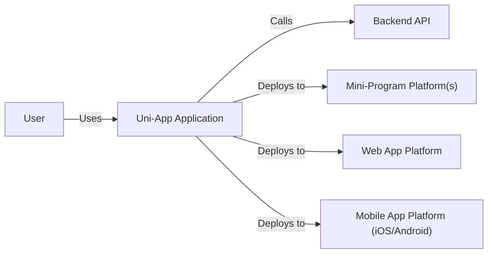
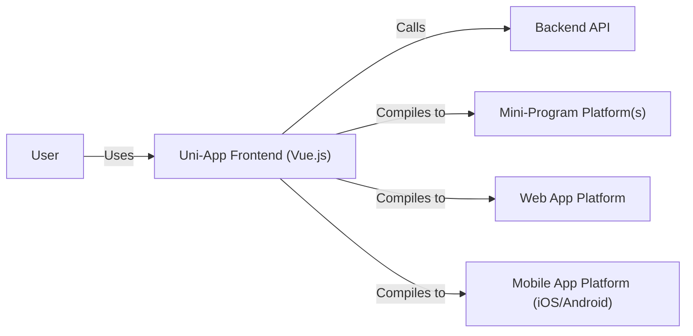
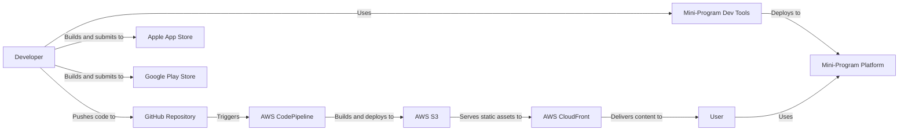
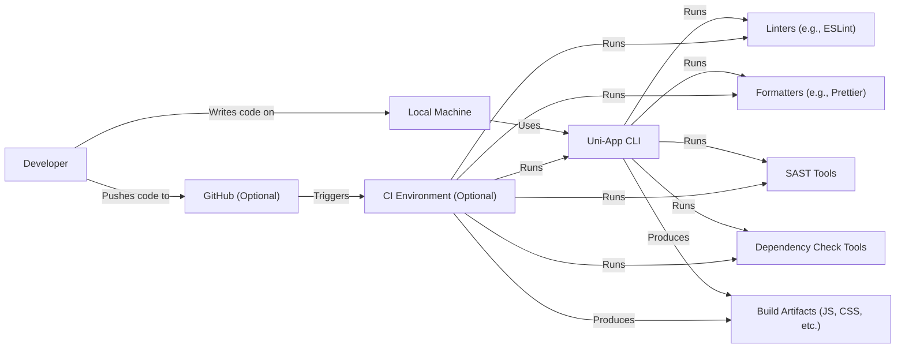

Okay, let's create a design document for the uni-app project.

# BUSINESS POSTURE

Business Priorities and Goals:

*   Enable developers to write code once and deploy it across multiple platforms (iOS, Android, Web, and various mini-program platforms).
*   Reduce development time and cost for cross-platform applications.
*   Provide a large and active community for support and collaboration.
*   Offer a rich set of built-in components and APIs for common app functionalities.
*   Maintain high performance and near-native user experience.
*   Provide good documentation and easy to use.

Most Important Business Risks:

*   Security vulnerabilities in the framework or its dependencies that could be exploited to compromise user data or application functionality.
*   Incompatibility with future platform updates (iOS, Android, etc.) leading to application breakage.
*   Performance issues or instability that negatively impact the user experience.
*   Lack of adoption by developers due to complexity, poor documentation, or competition from other frameworks.
*   Supply chain attacks that introduce malicious code into the framework or its dependencies.

# SECURITY POSTURE

Existing Security Controls:

*   security control: The project is open source, allowing for community review and contributions to security. (Described in the GitHub repository's README and contribution guidelines).
*   security control: The project uses a component-based architecture, which can help isolate potential vulnerabilities. (Described in the documentation and evident in the codebase).
*   security control: The project likely includes some level of input validation, though specifics need to be confirmed. (Assumed based on best practices, but needs verification in the codebase).
*   security control: The project uses HTTPS for communication with backend services. (Assumed based on best practices, but needs verification in the codebase).

Accepted Risks:

*   accepted risk: Reliance on third-party libraries and dependencies, which may introduce their own security vulnerabilities.
*   accepted risk: Potential for developers to introduce security vulnerabilities in their own application code, despite the framework's security features.
*   accepted risk: The framework may not be fully compliant with all relevant security standards and regulations out of the box.

Recommended Security Controls:

*   Implement a robust Software Bill of Materials (SBOM) management system to track all dependencies and their versions.
*   Conduct regular security audits and penetration testing of the framework.
*   Provide clear security guidelines and best practices for developers using the framework.
*   Implement a vulnerability disclosure program to encourage responsible reporting of security issues.
*   Integrate static and dynamic application security testing (SAST and DAST) tools into the CI/CD pipeline.
*   Provide mechanism to sign released packages.

Security Requirements:

*   Authentication:
    *   The framework should support secure authentication mechanisms, such as OAuth 2.0, OpenID Connect, or JWT.
    *   The framework should provide guidance on securely storing and managing user credentials.
*   Authorization:
    *   The framework should support role-based access control (RBAC) or other authorization mechanisms.
    *   The framework should provide mechanisms to restrict access to sensitive data and functionality based on user roles and permissions.
*   Input Validation:
    *   The framework should provide built-in input validation functions to prevent common vulnerabilities like cross-site scripting (XSS) and SQL injection.
    *   All user inputs should be validated on the server-side, even if client-side validation is also performed.
*   Cryptography:
    *   The framework should use strong, industry-standard cryptographic algorithms for data encryption and hashing.
    *   Sensitive data, such as passwords and API keys, should be securely stored and never transmitted in plain text.
    *   The framework should provide guidance on securely managing cryptographic keys.

# DESIGN

## C4 CONTEXT

Element Descriptions:

*   Element:
    *   Name: User
    *   Type: Person
    *   Description: A person who interacts with the Uni-App application.
    *   Responsibilities: Uses the application to perform tasks and access information.
    *   Security controls: None (external to the system).

*   Element:
    *   Name: Uni-App Application
    *   Type: Software System
    *   Description: The application built using the Uni-App framework.
    *   Responsibilities: Provides the core functionality of the application, handles user interactions, and communicates with backend services.
    *   Security controls: Input validation, output encoding, authentication, authorization, session management, error handling.

*   Element:
    *   Name: Backend API
    *   Type: Software System
    *   Description: The backend services that the Uni-App application interacts with.
    *   Responsibilities: Provides data and business logic to the application.
    *   Security controls: Authentication, authorization, input validation, data encryption, logging, monitoring.

*   Element:
    *   Name: Mini-Program Platform(s)
    *   Type: Software System
    *   Description: The various mini-program platforms that the Uni-App application can be deployed to (e.g., WeChat, Alipay, Baidu).
    *   Responsibilities: Provides the runtime environment for the mini-program version of the application.
    *   Security controls: Platform-specific security controls and policies.

*   Element:
    *   Name: Web App Platform
    *   Type: Software System
    *   Description: Web browsers that the Uni-App application can be deployed to.
    *   Responsibilities: Provides the runtime environment for the web version of the application.
    *   Security controls: Browser-based security controls (e.g., same-origin policy, CSP).

*   Element:
    *   Name: Mobile App Platform (iOS/Android)
    *   Type: Software System
    *   Description: The mobile operating systems (iOS and Android) that the Uni-App application can be deployed to.
    *   Responsibilities: Provides the runtime environment for the mobile app version of the application.
    *   Security controls: OS-level security controls and app sandboxing.

## C4 CONTAINER

Element Descriptions:

*   Element:
    *   Name: User
    *   Type: Person
    *   Description: A person who interacts with the Uni-App application.
    *   Responsibilities: Uses the application to perform tasks and access information.
    *   Security controls: None (external to the system).

*   Element:
    *   Name: Uni-App Frontend (Vue.js)
    *   Type: Container: Web Application
    *   Description: The frontend code of the Uni-App application, written using Vue.js and the Uni-App framework.
    *   Responsibilities: Handles user interface rendering, user interactions, and communication with the backend API.  Compiles to different platforms.
    *   Security controls: Input validation, output encoding, authentication (client-side), session management (client-side).

*   Element:
    *   Name: Backend API
    *   Type: Container: API Application
    *   Description: The backend services that the Uni-App application interacts with.
    *   Responsibilities: Provides data and business logic to the application.
    *   Security controls: Authentication, authorization, input validation, data encryption, logging, monitoring.

*   Element:
    *   Name: Mini-Program Platform(s)
    *   Type: Container: Mini-Program Runtime
    *   Description: The runtime environment for the mini-program version of the application.
    *   Responsibilities: Executes the compiled mini-program code.
    *   Security controls: Platform-specific security controls and policies.

*   Element:
    *   Name: Web App Platform
    *   Type: Container: Web Browser
    *   Description: The web browser that runs the web version of the application.
    *   Responsibilities: Executes the compiled web application code.
    *   Security controls: Browser-based security controls (e.g., same-origin policy, CSP).

*   Element:
    *   Name: Mobile App Platform (iOS/Android)
    *   Type: Container: Mobile OS
    *   Description: The mobile operating system that runs the mobile app version of the application.
    *   Responsibilities: Executes the compiled mobile application code.
    *   Security controls: OS-level security controls and app sandboxing.

## DEPLOYMENT

Possible Deployment Solutions:

1.  **Cloud-Based Hosting (e.g., AWS, Azure, Google Cloud):**  Deploy the web application to a cloud provider's hosting service (e.g., AWS S3 + CloudFront, Azure Static Web Apps, Google Cloud Storage + Firebase Hosting).  Mobile apps are distributed through the respective app stores (Apple App Store, Google Play Store). Mini-programs are deployed through their respective platforms' developer tools.
2.  **Traditional Web Server (e.g., Apache, Nginx):** Deploy the web application to a traditional web server. Mobile and mini-program deployments remain the same as above.
3.  **Serverless Functions (e.g., AWS Lambda, Azure Functions, Google Cloud Functions):**  The backend API could be deployed as serverless functions, while the frontend is deployed as in option 1 or 2.

Chosen Solution (for detailed description): Cloud-Based Hosting (AWS Example)

Element Descriptions:

*   Element:
    *   Name: Developer
    *   Type: Person
    *   Description: The developer who writes and deploys the Uni-App application.
    *   Responsibilities: Writes code, configures deployment pipelines, and submits apps to app stores.
    *   Security controls: Strong passwords, multi-factor authentication, secure coding practices.

*   Element:
    *   Name: GitHub Repository
    *   Type: Code Repository
    *   Description: The source code repository for the Uni-App project.
    *   Responsibilities: Stores the application code and version history.
    *   Security controls: Access controls, branch protection rules, code review policies.

*   Element:
    *   Name: AWS CodePipeline
    *   Type: CI/CD Pipeline
    *   Description: The continuous integration and continuous delivery pipeline for the web application.
    *   Responsibilities: Automates the build, test, and deployment process for the web application.
    *   Security controls: IAM roles and permissions, integration with security scanning tools.

*   Element:
    *   Name: AWS S3
    *   Type: Object Storage
    *   Description: Stores the static assets of the web application (HTML, CSS, JavaScript, images).
    *   Responsibilities: Provides scalable and durable storage for the web application's assets.
    *   Security controls: Bucket policies, access controls, encryption at rest.

*   Element:
    *   Name: AWS CloudFront
    *   Type: Content Delivery Network (CDN)
    *   Description: Distributes the web application's content globally for faster access.
    *   Responsibilities: Caches content at edge locations and reduces latency for users.
    *   Security controls: HTTPS, WAF integration, access logs.

*   Element:
    *   Name: Apple App Store
    *   Type: App Store
    *   Description: The distribution platform for iOS applications.
    *   Responsibilities: Hosts and distributes the iOS version of the Uni-App application.
    *   Security controls: Apple's app review process, code signing.

*   Element:
    *   Name: Google Play Store
    *   Type: App Store
    *   Description: The distribution platform for Android applications.
    *   Responsibilities: Hosts and distributes the Android version of the Uni-App application.
    *   Security controls: Google's app review process, code signing.

*   Element:
    *   Name: Mini-Program Dev Tools
    *   Type: Development Tool
    *   Description: The developer tools provided by the mini-program platforms.
    *   Responsibilities: Allows developers to build, test, and deploy mini-programs.
    *   Security controls: Platform-specific security controls.

*   Element:
    *   Name: Mini-Program Platform
    *   Type: Platform
    *   Description: Mini-program platform.
    *   Responsibilities: Run mini-program.
    *   Security controls: Platform-specific security controls.

*   Element:
    *   Name: User
    *   Type: Person
    *   Description: End user.
    *   Responsibilities: Use application.
    *   Security controls: None.

## BUILD

Build Process Description:

1.  **Local Development:** The developer writes code on their local machine using an IDE or text editor.
2.  **Uni-App CLI:** The Uni-App CLI is used to create, build, and run the application.
3.  **Linters and Formatters:** Linters (e.g., ESLint) and formatters (e.g., Prettier) are used to enforce code style and identify potential errors.
4.  **SAST Tools:** Static Application Security Testing (SAST) tools are used to scan the codebase for security vulnerabilities.
5.  **Dependency Check Tools:** Dependency check tools (e.g., npm audit, OWASP Dependency-Check) are used to identify known vulnerabilities in project dependencies.
6.  **Build Artifacts:** The Uni-App CLI compiles the code into platform-specific build artifacts (JavaScript, CSS, HTML, etc.).
7.  **GitHub (Optional):** The developer pushes the code to a GitHub repository.
8.  **CI Environment (Optional):** A CI environment (e.g., GitHub Actions, Jenkins) can be used to automate the build process. The CI environment runs the same steps as the local build process (linting, formatting, SAST, dependency checking) and produces build artifacts.

Security Controls in Build Process:

*   security control: Linters and formatters help enforce code style and prevent common coding errors that could lead to vulnerabilities.
*   security control: SAST tools scan the codebase for security vulnerabilities.
*   security control: Dependency check tools identify known vulnerabilities in project dependencies.
*   security control: CI/CD pipeline automates the build process and ensures that security checks are consistently performed.
*   security control: Code review policies in the GitHub repository help ensure that code is reviewed for security issues before being merged.

# RISK ASSESSMENT

Critical Business Processes to Protect:

*   User data management (registration, login, profile data).
*   Application functionality (core features of the application).
*   Cross-platform deployment and compatibility.
*   Developer experience and adoption.

Data to Protect and Sensitivity:

*   Usernames and passwords (High sensitivity - requires encryption at rest and in transit).
*   User profile data (Medium to high sensitivity, depending on the specific data collected - may include PII).
*   Application data (Variable sensitivity, depending on the application's purpose - may include sensitive business data).
*   API keys and other secrets (High sensitivity - requires secure storage and management).

# QUESTIONS & ASSUMPTIONS

Questions:

*   What specific backend services will the Uni-App applications typically interact with?
*   What are the specific security requirements of those backend services?
*   What level of security certification or compliance is required for the Uni-App framework or applications built with it (e.g., GDPR, CCPA, HIPAA)?
*   What are the specific mini-program platforms that are most important to support?
*   Are there any existing security tools or processes already in place that should be integrated with the Uni-App development workflow?
*   What is the process for handling security vulnerabilities discovered in the framework or its dependencies?

Assumptions:

*   BUSINESS POSTURE: The primary goal is to enable rapid cross-platform development while maintaining a reasonable level of security. The organization has a moderate risk appetite.
*   SECURITY POSTURE: Developers using Uni-App are expected to have some basic security knowledge, but the framework should provide guidance and tools to help them build secure applications.
*   DESIGN: The backend API is a separate system with its own security controls. The Uni-App application primarily handles the frontend and interacts with the backend API securely. The deployment will be to a cloud-based environment.