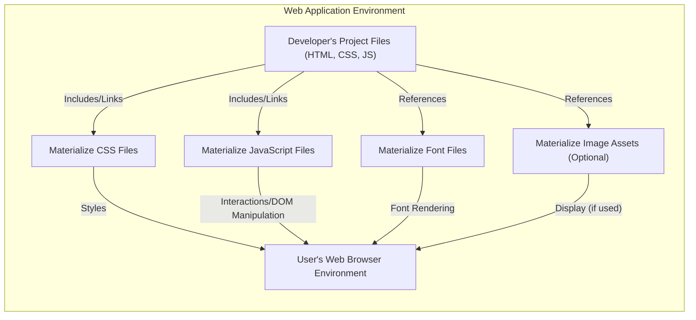

## Project Design Document: Materialize CSS Framework (Improved)

**1. Introduction**

This document provides an enhanced and detailed architectural design of the Materialize CSS framework, an open-source project available at [https://github.com/dogfalo/materialize](https://github.com/dogfalo/materialize). This revised document aims to provide a more robust foundation for subsequent threat modeling activities. It expands upon the key components, clarifies the data flow, and elaborates on security considerations, offering a deeper understanding of the framework's architecture and potential attack surfaces.

**2. Project Overview**

Materialize is a widely adopted, responsive front-end component library adhering to Google's Material Design principles. It offers developers a collection of pre-built CSS styles and JavaScript functionalities to construct modern user interfaces for web applications. The core purpose is to streamline UI development by providing reusable components and consistent styling.

**3. Architectural Design**

Materialize is fundamentally a client-side library, meaning its code executes directly within the user's web browser. It's distributed as a set of static assets that are integrated into web projects.

**Key Architectural Points:**

*   **Client-Side Operation:** All Materialize processing occurs within the user's browser. The framework itself does not involve server-side logic.
*   **Static Asset Nature:** Materialize comprises static files (CSS, JavaScript, fonts, and optional images) typically served by a standard web server or a Content Delivery Network (CDN).
*   **Integration via Inclusion and Linking:** Developers incorporate Materialize into their web pages by including or linking to the CSS and JavaScript files within their HTML documents. Font files are usually referenced via CSS.
*   **Component-Centric Design:** The framework provides a range of pre-designed and styled UI components (e.g., buttons, cards, navigation menus, modals) that developers can readily implement.
*   **Responsiveness Built-in:** Materialize is designed with responsiveness as a core principle, adapting layouts and elements to various screen sizes and devices through its grid system and component styling.

**4. Component Breakdown**

Materialize is structured around the following key component types:

*   **Cascading Style Sheets (CSS) (`materialize.css`, theme files, potentially Sass/SCSS source):**
    *   The foundation of Materialize, containing all the styling rules for the components, grid system, typography, and visual appearance.
    *   Defines how HTML elements are rendered, their layout, colors, spacing, and responsiveness.
    *   Potential security considerations include CSS injection vulnerabilities if user-controlled data is improperly used in style attributes or if the CSS itself contains malicious code (though less likely in a well-established framework).
    *   Theme files allow for customization of the visual style, but improper theming could introduce inconsistencies or accessibility issues.
*   **JavaScript Files (`materialize.js`, potentially individual component JS files, source ES modules):**
    *   Adds interactivity and dynamic behavior to certain Materialize components.
    *   Handles user interactions, manipulates the Document Object Model (DOM), and provides animations or transitions.
    *   Security considerations are paramount here, as vulnerabilities in the JavaScript code could lead to Cross-Site Scripting (XSS) attacks. Improper event handling, DOM manipulation, or reliance on vulnerable dependencies are potential risks.
    *   Historically, Materialize relied on jQuery, which itself has had security vulnerabilities. Modern versions might reduce or eliminate this dependency, but it's still a consideration.
*   **Font Files (typically Roboto and potentially icon fonts):**
    *   Provides the typographic styles used throughout the framework.
    *   Included as web font files (e.g., WOFF, WOFF2, TTF) that are downloaded by the user's browser.
    *   Security considerations are generally lower for font files, but serving them over HTTPS is essential to prevent mixed content warnings. Compromised font files could theoretically be used for subtle visual attacks or to fingerprint users, though these are less common threats.
*   **Image Assets (optional, such as default icons or UI elements):**
    *   May include static image files (e.g., PNG, SVG) used within certain components or as part of the visual design.
    *   Security considerations include ensuring these assets are served securely and are free from malware. Open redirects or XSS vulnerabilities could arise if image paths are dynamically generated based on user input without proper sanitization.

**5. Data Flow (Detailed)**

The data flow within a web application utilizing Materialize can be broken down into these stages:

```mermaid
graph LR
    subgraph "Development & Deployment"
        Dev["Web Developer"]
        Integrate["Integrates Materialize files into project"]
        Deploy["Deploys application to web server/CDN"]
    end

    subgraph "Client-Side Execution (Browser)"
        BrowserReq["User's Browser Requests Web Page"]
        FetchAssets["Browser Fetches HTML, CSS, JS, Fonts, Images"]
        ParseCSS["Browser Parses Materialize CSS"]
        ApplyStyles["Browser Applies Styles to DOM"]
        ExecuteJS["Browser Executes Materialize JavaScript"]
        HandleEvents["JavaScript Sets Up Event Listeners"]
        UserInteract["User Interacts with Web Page"]
        JSUpdateDOM["JavaScript Updates DOM based on Interactions"]
        ReRender["Browser Re-renders the Page"]
    end

    Dev --> Integrate
    Integrate --> Deploy
    Deploy --> BrowserReq
    BrowserReq --> FetchAssets
    FetchAssets -- CSS --> ParseCSS
    ParseCSS --> ApplyStyles
    FetchAssets -- JS --> ExecuteJS
    ExecuteJS --> HandleEvents
    ApplyStyles & HandleEvents --> UserInteract
    UserInteract --> JSUpdateDOM
    JSUpdateDOM --> ReRender
```

**Step-by-Step Data Flow:**

1. **Developer Integration:** A web developer incorporates Materialize into their project by including links to the CSS and JavaScript files within the HTML `<head>` and before the closing `<body>` tag, respectively. Font files are typically referenced within the CSS.
2. **Deployment:** The developer deploys the web application, including the Materialize files, to a web server or a CDN.
3. **Browser Request:** When a user navigates to the web page, their browser sends a request to the web server.
4. **Asset Fetching:** The web server responds by sending the HTML document, which contains links to the Materialize CSS, JavaScript, font, and image files. The browser then fetches these assets.
5. **CSS Parsing:** The browser's rendering engine parses the Materialize CSS file, interpreting the style rules.
6. **Style Application:** The browser applies the styles defined in the Materialize CSS to the HTML elements based on the CSS selectors and classes used in the HTML. This determines the visual appearance of the page.
7. **JavaScript Execution:** The browser executes the Materialize JavaScript file. This script typically:
    *   Attaches event listeners to specific HTML elements to handle user interactions (e.g., clicks, mouseovers).
    *   Initializes interactive components, setting up their initial state and behavior.
8. **Event Handling Setup:** Materialize's JavaScript sets up event listeners to respond to user actions.
9. **User Interaction:** The user interacts with the web page elements, triggering events (e.g., clicking a button styled by Materialize).
10. **JavaScript DOM Updates:**  When an event is triggered, Materialize's JavaScript code executes, potentially manipulating the DOM. This might involve:
    *   Adding or removing CSS classes to change the appearance of elements.
    *   Showing or hiding elements.
    *   Animating elements.
    *   Modifying the structure or content of the DOM.
11. **Re-rendering:** After the DOM is updated by the JavaScript, the browser re-renders the affected parts of the page to reflect the changes.

**6. Security Considerations (Detailed for Threat Modeling)**

Threat modeling for Materialize should consider the following potential vulnerabilities and attack vectors:

*   **Cross-Site Scripting (XSS) Vulnerabilities:**
    *   **Within Materialize's JavaScript:**  Bugs in Materialize's JavaScript code could allow attackers to inject arbitrary JavaScript into the page if the framework improperly handles user input or data. This is a critical concern.
    *   **Through Application Code:**  Even if Materialize itself is secure, developers might misuse its components or integrate it in a way that introduces XSS vulnerabilities in their own application code (e.g., by rendering unsanitized user input within a Materialize component).
*   **Dependency Vulnerabilities:**
    *   **JavaScript Dependencies:** If Materialize relies on other JavaScript libraries (e.g., older versions of jQuery), vulnerabilities in those dependencies could be exploited. Regularly updating Materialize and its dependencies is crucial.
    *   **Build Process Dependencies:** Vulnerabilities in tools used to build or package Materialize could potentially introduce malicious code.
*   **Content Delivery Network (CDN) Compromise:**
    *   If Materialize is loaded from a third-party CDN, a compromise of that CDN could allow attackers to inject malicious code into all websites using that version of Materialize from the compromised CDN.
    *   **Mitigation:** Using Subresource Integrity (SRI) hashes in the `<link>` and `<script>` tags can help prevent this by ensuring the integrity of the fetched files.
*   **CSS Injection Attacks:**
    *   While less common, if user-controlled data is directly used in CSS styles without proper sanitization, attackers might be able to inject malicious CSS to alter the appearance of the page in harmful ways (e.g., overlaying fake login forms).
*   **Denial of Service (DoS) - Client-Side:**
    *   Inefficient or poorly written JavaScript within Materialize could potentially lead to client-side performance issues, causing the user's browser to freeze or become unresponsive. While not a direct security breach, it can impact usability.
*   **Supply Chain Attacks:**
    *   Compromise of the Materialize project's source code repository or build process could allow attackers to inject malicious code directly into the framework.
    *   Verifying the integrity of downloaded files and using reputable sources are important preventative measures.
*   **Insecure Component Usage by Developers:**
    *   Developers might misuse Materialize components in ways that expose sensitive information or create vulnerabilities. For example, displaying sensitive data in a way that is easily scraped or using components with known accessibility issues that could be exploited.
*   **Accessibility Vulnerabilities:**
    *   While not directly a security vulnerability in the traditional sense, accessibility issues can disproportionately affect users with disabilities. Ensuring Materialize components are WCAG compliant is important for inclusivity.

**7. Deployment Considerations (and Security Implications)**

The chosen deployment method for Materialize can have security implications:

*   **Direct Inclusion:**
    *   **Pros:** Full control over the files, potentially easier to audit.
    *   **Cons:** Requires managing updates manually, potentially larger initial download size if not optimized.
    *   **Security:**  The security relies on the developer's practices for obtaining and maintaining the files.
*   **Content Delivery Network (CDN):**
    *   **Pros:** Improved loading times due to caching, reduced bandwidth usage on the origin server.
    *   **Cons:** Reliance on a third-party provider, potential for CDN compromise.
    *   **Security:**  Crucial to use SRI hashes to verify file integrity. Choose reputable CDNs with strong security practices.
*   **Package Managers (npm, Yarn):**
    *   **Pros:** Streamlined updates, integration with build processes.
    *   **Cons:** Potential for vulnerabilities in the package itself or its dependencies.
    *   **Security:** Regularly audit dependencies and use tools to identify known vulnerabilities. Ensure the package is from a trusted source.

**8. Future Considerations (Potential Security Impacts)**

*   **Modularization:** While beneficial for performance, increased modularity could also increase the attack surface if not managed carefully.
*   **Accessibility Enhancements:**  Improvements in accessibility can also enhance security for some users by making interactions more predictable and less prone to errors.
*   **Framework Integrations:**  As Materialize integrates with more frameworks, ensuring secure integration points is crucial to prevent vulnerabilities arising from these interactions.
*   **Regular Security Audits:**  Ongoing security audits and penetration testing are essential to identify and address potential vulnerabilities proactively.

**9. Conclusion**

This enhanced design document provides a more detailed and nuanced understanding of the Materialize CSS framework's architecture, components, and data flow. The expanded security considerations section offers a more comprehensive basis for threat modeling activities. Understanding the client-side nature of Materialize and the potential risks associated with its components and deployment methods is critical for building secure web applications. Developers must be vigilant in keeping Materialize and its dependencies updated, using secure deployment practices, and carefully handling user input to mitigate potential threats.
