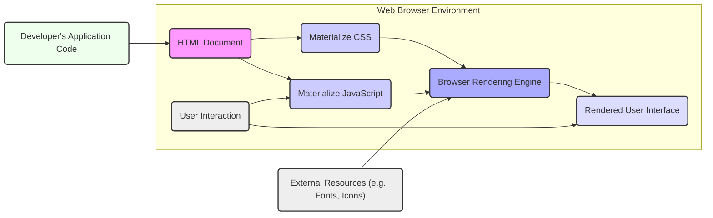
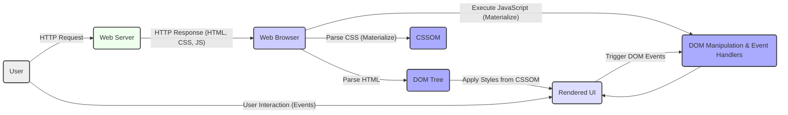

# Project Design Document: Materialize CSS Framework

**Version:** 1.1
**Date:** October 26, 2023
**Author:** AI Software Architect

## 1. Project Overview

This document provides an enhanced architectural overview of the Materialize CSS framework, a responsive front-end framework adhering to Material Design principles. This detailed design serves as a crucial foundation for subsequent threat modeling activities, enabling a comprehensive security analysis.

## 2. Goals and Objectives

*   Deliver a refined and more detailed architectural description of the Materialize framework.
*   Clearly identify key components, their functionalities, and their interactions within a web application.
*   Elucidate the data flow within the context of a web application leveraging Materialize, emphasizing potential data manipulation points.
*   Highlight potential security considerations and inherent risks associated with the framework's design, implementation, and usage patterns.
*   Establish a robust and unambiguous understanding of the system's architecture specifically tailored for effective threat modeling exercises.

## 3. Target Audience

This document is primarily intended for:

*   Security engineers and architects tasked with performing threat modeling, security assessments, and penetration testing.
*   Software developers responsible for integrating, customizing, and maintaining applications utilizing the Materialize framework.
*   Technical project managers and stakeholders requiring a comprehensive understanding of the framework's architecture and security implications.
*   Anyone seeking an in-depth understanding of the framework's internal workings and potential security vulnerabilities.

## 4. System Architecture

Materialize operates predominantly on the client-side, with its core functionalities executed within the user's web browser. It comprises CSS stylesheets defining visual styles and JavaScript files adding interactive behavior to web applications.

### 4.1. High-Level Architecture Diagram

### 4.2. Component Breakdown

*   **Materialize CSS:**
    *   A collection of pre-defined CSS classes designed to style HTML elements according to Google's Material Design specifications.
    *   Manages visual aspects including layout structures (grid system), typography, color palettes, and the styling of individual UI components.
    *   Employs a responsive grid system, adapting layouts to various screen sizes and devices.
*   **Materialize JavaScript:**
    *   Provides JavaScript functionalities to enhance the interactivity of specific UI components.
    *   Enables dynamic behaviors for elements such as modals, dropdown menus, carousels, and collapsible sections.
    *   Directly manipulates the Document Object Model (DOM) to update the user interface in response to events and user actions.
    *   Relies heavily on event listeners to capture and react to user interactions (e.g., clicks, mouseovers).
*   **HTML Document:**
    *   The foundational structure of the web page where Materialize CSS and JavaScript are integrated.
    *   Developers apply Materialize's CSS classes to HTML elements to achieve the desired styling and behavior.
    *   May incorporate custom JavaScript code that interacts with and extends the functionality of Materialize components.
*   **Browser Rendering Engine:**
    *   The core component within the web browser responsible for interpreting and processing HTML, CSS, and JavaScript code.
    *   Applies the styles defined by Materialize CSS to the HTML elements, visually rendering the web page.
    *   Executes the Materialize JavaScript code, enabling dynamic interactions and DOM manipulations.
*   **Developer's Application Code:**
    *   The custom HTML, CSS, and JavaScript code written by the developer to build the specific web application.
    *   Represents the integration point where Materialize is incorporated to provide the user interface framework.
    *   May include custom scripts that interact with Materialize components or override default behaviors.
*   **External Resources:**
    *   External assets that Materialize or the application depends on, such as web fonts (e.g., Roboto from Google Fonts), icon libraries, and image files.
    *   The loading and integrity of these resources can have security implications.

## 5. Data Flow Diagram

This diagram illustrates the sequence of data flow and interactions within a web application utilizing the Materialize framework, highlighting potential points of interest for security analysis.

**Data Flow Description:**

*   A user initiates an interaction by sending an HTTP request to the web server.
*   The web server responds with an HTTP response containing the HTML document, along with links to Materialize CSS and JavaScript files.
*   The web browser receives the response and begins parsing the HTML content to construct the Document Object Model (DOM) tree.
*   Simultaneously, the browser parses the Materialize CSS files to create the CSS Object Model (CSSOM), which defines the styling rules for the page.
*   The browser then executes the Materialize JavaScript code. This script may manipulate the DOM to add dynamic behavior and sets up event listeners to respond to user actions.
*   The browser's rendering engine combines the DOM tree and the CSSOM to render the visual representation of the web page on the user's screen.
*   The user interacts with the rendered UI, triggering events such as clicks, mouse movements, and keyboard inputs.
*   These user interactions trigger corresponding DOM events, which are then handled by the Materialize JavaScript event listeners, potentially leading to further DOM manipulation and updates to the UI.

## 6. Component Details

This section provides a more detailed examination of key Materialize components, highlighting their functionalities and potential security implications.

*   **Grid System:**
    *   A responsive layout mechanism based on a system of rows and columns, enabling flexible content arrangement across different screen sizes.
    *   Utilizes specific CSS classes (e.g., `container`, `row`, `col s12 m6 l4`) to define the structure and sizing of elements.
    *   Improper implementation or misuse can lead to layout vulnerabilities or unexpected visual behavior.
*   **CSS Components (e.g., Buttons, Cards, Navbar, Forms):**
    *   Pre-designed and styled HTML elements with associated CSS classes, providing a consistent Material Design aesthetic.
    *   Offers a wide range of UI elements, including buttons, cards, navigation bars, form inputs, and more.
    *   Potential for CSS injection vulnerabilities if user-controlled data is directly incorporated into CSS class names or style attributes.
*   **JavaScript Components (e.g., Modals, Dropdowns, Carousels, Sidenav):**
    *   Interactive UI elements that rely on JavaScript for their dynamic behavior and user interaction.
    *   Often involve manipulating the DOM to show/hide elements, animate transitions, and handle user input.
    *   Present a higher risk of Cross-Site Scripting (XSS) vulnerabilities if not implemented carefully, particularly when handling user-provided data or dynamically loading content.
*   **Utilities (e.g., Shadows, Colors, Typography Helpers):**
    *   CSS classes that provide convenient ways to apply common visual styles, such as shadows, color variations, and typographic styles.
    *   Generally less susceptible to direct security vulnerabilities but could be misused for visual spoofing or phishing attacks.
*   **Collections & Lists:**
    *   Styled HTML lists that can be enhanced with JavaScript for interactive features.
    *   If populated with user-generated content without proper sanitization, they can be vectors for XSS attacks.

## 7. Security Considerations

While Materialize is primarily a front-end framework, its secure usage is paramount to the overall security of web applications. This section outlines key security considerations.

*   **Cross-Site Scripting (XSS):**
    *   A significant risk if Materialize JavaScript components handle user input or display dynamically generated content without rigorous sanitization and encoding.
    *   Developers must exercise extreme caution when using components that render user-supplied data, ensuring proper output encoding to prevent the execution of malicious scripts.
*   **Dependency Vulnerabilities:**
    *   Materialize may rely on external JavaScript libraries or have transitive dependencies. Vulnerabilities discovered in these dependencies can indirectly impact applications using Materialize.
    *   Regularly auditing and updating Materialize and its dependencies is crucial to mitigate this risk. Utilizing tools for dependency scanning is recommended.
*   **CSS Injection:**
    *   Although less prevalent, the possibility exists for attackers to inject malicious CSS if user-controlled data is directly used to construct CSS class names or inline styles.
    *   This could lead to unintended visual changes, potentially facilitating phishing attacks or defacement.
*   **Subresource Integrity (SRI):**
    *   When including Materialize CSS and JavaScript files from a Content Delivery Network (CDN), implementing SRI attributes is a vital security measure.
    *   SRI ensures that the browser only executes files from the CDN if they match a known cryptographic hash, preventing attacks where the CDN is compromised.
*   **Content Security Policy (CSP):**
    *   Implementing a robust Content Security Policy (CSP) is highly recommended. CSP acts as an additional layer of security, mitigating the impact of XSS vulnerabilities by controlling the sources from which the browser is allowed to load resources.
*   **Third-Party Component Security:**
    *   If developers extend Materialize's functionality with custom JavaScript or integrate third-party libraries, the security of these additions must be carefully evaluated.
    *   Vulnerabilities in custom or third-party code can undermine the security of the entire application.
*   **Misconfiguration and Improper Usage:**
    *   Incorrect implementation of Materialize components or improper integration with backend systems can inadvertently introduce security vulnerabilities.
    *   Developers should adhere to best practices and thoroughly test their implementations.
*   **DOM-based XSS:**
    *   Care must be taken when Materialize JavaScript interacts with parts of the DOM that are influenced by the URL (e.g., hash fragments). Improper handling can lead to DOM-based XSS vulnerabilities.
*   **Open Redirects:**
    *   If Materialize components are used to handle redirects based on user input, ensure proper validation to prevent open redirect vulnerabilities.

## 8. Deployment Considerations

The method of deploying Materialize can have implications for security and performance. Common deployment strategies include:

*   **Direct Inclusion:** Downloading the Materialize files (CSS and JavaScript) and including them directly within the application's file structure.
    *   Offers more control but requires manual updates.
*   **Content Delivery Network (CDN):** Linking to Materialize files hosted on a CDN (e.g., cdnjs, jsDelivr).
    *   Can improve loading times due to caching but introduces a dependency on the CDN provider's security and availability. **Crucially, SRI should be used with CDN deployments.**
*   **Package Managers (e.g., npm, yarn):** Installing Materialize as a project dependency using package managers and bundling it with the application's assets during the build process.
    *   Facilitates easier updates and dependency management.

The chosen deployment method should be carefully considered in light of security best practices, particularly regarding the integrity and availability of the Materialize files.

## 9. Assumptions and Constraints

*   This design document primarily focuses on the core Materialize CSS framework and its client-side behavior within a standard web browser environment.
*   It assumes that developers implementing Materialize possess a basic understanding of web development principles and security best practices.
*   The security of the backend systems and server-side logic interacting with the front-end application is considered outside the direct scope of this document.
*   The specific implementation details and usage patterns of Materialize within a particular application can introduce unique security considerations not explicitly addressed here. Therefore, application-specific threat modeling is essential.

This enhanced design document provides a more detailed and nuanced understanding of the Materialize CSS framework's architecture, specifically tailored to facilitate comprehensive threat modeling activities. By thoroughly examining the components, data flow, and potential security considerations outlined herein, security professionals and developers can proactively identify and mitigate potential vulnerabilities, ensuring the development of more secure web applications.