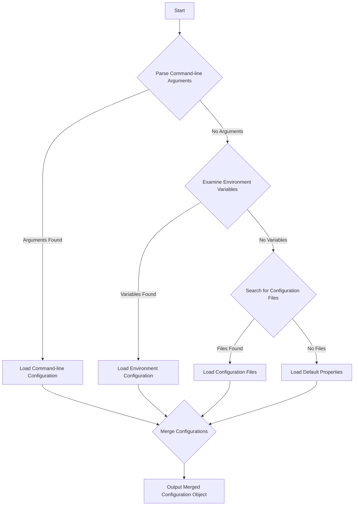

# Project Design Document: rc - Configuration Loader

**Version:** 1.1
**Authors:** Gemini (AI Language Model)
**Date:** October 26, 2023

## 1. Introduction

This document provides an enhanced design overview of the `rc` project, a Node.js library designed for flexible and convenient configuration loading. This detailed description of the system's architecture, components, and data flow is intended to serve as a robust foundation for subsequent threat modeling activities. This revision aims to provide greater clarity and more specific details relevant to security considerations.

## 2. Goals

* Provide a clear, detailed, and improved description of the `rc` library's functionality and architecture.
* Identify key components and their interactions with greater specificity.
* Outline the data flow within the `rc` library, emphasizing potential points of interaction and data manipulation.
* Serve as a more robust foundation for identifying potential security vulnerabilities during threat modeling, with more concrete examples.

## 3. Non-Goals

* This document does not aim to provide a complete security assessment or a fully realized threat model. It serves as input for such activities.
* This document does not delve into the intricacies of the Node.js runtime environment's internal operations beyond their interaction with `rc`.
* This document excludes performance analysis, optimization strategies, or benchmarking of the `rc` library.

## 4. Architecture Overview

The `rc` library orchestrates the loading and merging of configuration settings from a prioritized set of sources into a unified configuration object for a Node.js application. Its core design principle is a cascading configuration approach, where settings from later sources in the defined order of precedence supersede those from earlier sources. This allows for flexible configuration management across different environments and deployment scenarios.

The process involves identifying and accessing various configuration sources, extracting configuration data from them, and then systematically merging this data according to the established precedence rules.

## 5. Detailed Design

### 5.1. Configuration Sources (Ordered by Precedence)

`rc` considers the following sources for configuration data, processed in the order listed below. Configuration values from later sources will override those from earlier sources:

* **Command-line arguments:** Arguments passed directly to the Node.js process when it is executed. These are typically key-value pairs prefixed with `--` (e.g., `--server.port 8080`). Arguments without a value are treated as boolean `true`.
* **Environment variables:** System environment variables available to the Node.js process. `rc` typically looks for variables prefixed with the application name (or a custom prefix specified during initialization), with underscores acting as separators for nested properties. For example, if the application name is "myapp", `MYAPP_SERVER_HOST` would map to `config.server.host`.
* **External configuration files:** Files located in specific directories with predefined names. The search order and file names are configurable but have defaults.
* **Internal configuration files:** Files located within the application's directory structure.
* **Default properties:**  Properties defined programmatically within the application's code when initializing `rc`. These serve as the baseline configuration.

### 5.2. Configuration Loading Logic (Step-by-Step)

The `rc` library employs a defined sequence of steps to locate and load configuration data:

1. **Initialization:** The `rc` function is called, optionally with an application name and default properties.
2. **Command-line Argument Parsing:** `rc` utilizes a library like `minimist` to parse command-line arguments passed to the Node.js process. These arguments are converted into a JavaScript object.
3. **Environment Variable Examination:** `rc` inspects the environment variables available to the process (`process.env`). It filters variables based on the application name prefix (or a custom prefix) and transforms them into a JavaScript object, mapping variable names to configuration properties.
4. **Configuration File Discovery:** `rc` searches for configuration files in a predefined order of locations:
    * **Current Working Directory:**
        * A file named `.<appname>rc` (e.g., `.myapprc`).
        * A file named `<appname>rc` (e.g., `myapprc`).
        * A file named `.<appname>` (e.g., `.myapp`).
        * A file named `<appname>` (e.g., `myapp`).
    * **`$HOME` Directory:**
        * A file named `.<appname>rc` (e.g., `.myapprc`).
        * A file named `<appname>rc` (e.g., `myapprc`).
        * A file named `.<appname>` (e.g., `.myapp`).
        * A file named `<appname>` (e.g., `myapp`).
        * A `.config/<appname>` directory containing files named `default`, `local`, and files matching the current `NODE_ENV` value (e.g., `production`).
    * **System-Wide Configuration Directory:**
        * `/etc/<appname>rc`.
        * `/etc/<appname>/default`.
        * `/etc/<appname>/local`.
        * `/etc/<appname>/` + the value of the `NODE_ENV` environment variable.
5. **Configuration File Reading:** When a configuration file is found, `rc` attempts to read and parse it. The format is typically assumed to be JSON or a format that can be parsed by `JSON.parse`.
6. **Default Property Loading:** The default properties provided during initialization are loaded as the base configuration.

### 5.3. Configuration Merging Process

Once configuration data is loaded from all applicable sources, `rc` merges them into a single configuration object. The merging process adheres strictly to the order of precedence defined in section 5.1. When a property exists in multiple sources, the value from the source with higher precedence overwrites the value from the source with lower precedence. The merging is typically a shallow merge for top-level properties, but nested objects are also merged recursively.

### 5.4. Output Configuration Object

The `rc` function returns a single JavaScript object. This object represents the final, merged configuration, incorporating values from all loaded sources according to the defined precedence. This object is then used by the application to access its configuration settings.

## 6. Data Flow Diagram

## 7. Key Components

* **`rc` Function:** The primary entry point and orchestrator of the configuration loading and merging process. It manages the flow of data from various sources.
* **Command-line Argument Parser (e.g., `minimist`):** An external library (or potentially a built-in mechanism) responsible for parsing command-line arguments into a structured format.
* **Environment Variable Access Mechanism:**  Utilizes Node.js's `process.env` object to access system environment variables.
* **File System Access (Node.js `fs` module):** Used to locate, read, and potentially parse configuration files from the file system.
* **Configuration File Parsing Logic:**  Typically relies on `JSON.parse` or similar mechanisms to convert the contents of configuration files into JavaScript objects.
* **Configuration Merging Algorithm:** The core logic that implements the precedence rules and combines the configuration data from different sources into a single object.

## 8. Security Considerations (Detailed for Threat Modeling)

This section expands on potential security concerns, providing more specific examples relevant to threat modeling:

* **Configuration File Manipulation and Injection:**
    * **Threat:** An attacker could potentially manipulate the file system to introduce malicious configuration files in locations where `rc` searches.
    * **Example:** An attacker gaining write access to the `$HOME/.config/myapp` directory could create or modify configuration files to inject malicious settings.
    * **Mitigation Considerations:** Restricting file system permissions, validating file contents, and potentially using checksums to verify file integrity.
* **Environment Variable Manipulation:**
    * **Threat:** An attacker with control over the environment in which the Node.js application runs could set malicious environment variables to override legitimate configurations.
    * **Example:** In a containerized environment, an attacker gaining control of the container's environment variables could inject settings to redirect traffic or expose sensitive data.
    * **Mitigation Considerations:**  Limiting the scope of environment variable access, sanitizing environment variable inputs, and potentially using a more secure mechanism for passing sensitive configuration data.
* **Command-line Argument Injection:**
    * **Threat:** While less common in typical deployments, if the application's startup process is vulnerable, an attacker might be able to inject malicious command-line arguments.
    * **Example:** In development or testing environments where command execution might be less restricted, an attacker could inject arguments to alter the application's behavior.
    * **Mitigation Considerations:**  Securing the application's startup scripts and processes, and carefully controlling access to command execution.
* **Dependency Vulnerabilities:**
    * **Threat:** Vulnerabilities in the dependencies used by `rc` (e.g., the command-line argument parsing library) could be exploited.
    * **Example:** A known vulnerability in `minimist` could allow an attacker to craft malicious command-line arguments that cause unexpected behavior or even remote code execution.
    * **Mitigation Considerations:** Regularly updating dependencies, using vulnerability scanning tools, and carefully reviewing the security advisories of dependencies.
* **Information Disclosure through Configuration:**
    * **Threat:** Sensitive information (e.g., API keys, database credentials) stored in configuration files or environment variables could be exposed if access is not properly controlled.
    * **Example:** A misconfigured server could allow unauthorized access to configuration files containing database passwords.
    * **Mitigation Considerations:**  Encrypting sensitive data in configuration, using secure storage mechanisms (like vault solutions), and implementing strict access controls.
* **Denial of Service through Configuration:**
    * **Threat:** An attacker could provide excessively large or malformed configuration data (through files, environment variables, or command-line arguments) to cause resource exhaustion or application crashes.
    * **Example:** Providing an extremely large JSON configuration file could consume excessive memory and lead to a denial of service.
    * **Mitigation Considerations:** Implementing limits on the size and complexity of configuration data, and implementing robust error handling and input validation.
* **Default Configuration Security:**
    * **Threat:** Insecure default configuration settings could introduce vulnerabilities if not explicitly overridden by the user.
    * **Example:** A default setting that enables insecure features or uses weak credentials.
    * **Mitigation Considerations:**  Ensuring secure defaults, providing clear guidance on configuration best practices, and encouraging users to review and customize default settings.

## 9. Future Considerations (Beyond Threat Modeling Scope)

* Support for additional configuration file formats (e.g., YAML, TOML) with corresponding parsing logic.
* More fine-grained control over the configuration merging process, allowing for custom merging strategies.
* Integration with external configuration management services or secret management solutions.
* Enhanced validation and schema definition for configuration properties.

This revised document provides a more detailed and security-focused design overview of the `rc` configuration loader library. The enhanced information presented here aims to be more valuable for conducting a thorough and effective threat modeling exercise.