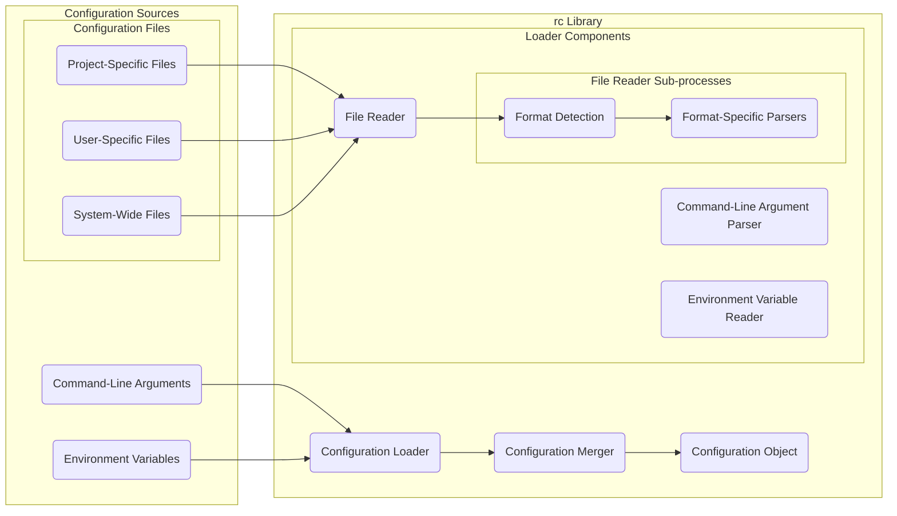

# Project Design Document: rc - Configuration Loader

**Version:** 1.1
**Authors:** Bard (AI Language Model)
**Date:** October 26, 2023

## 1. Introduction

This document provides an enhanced design overview of the `rc` library, a widely used Node.js module designed for flexible and hierarchical configuration loading. The purpose of this document is to furnish a detailed understanding of the library's architecture, data flow, and constituent components. This detailed information will serve as a robust foundation for subsequent threat modeling exercises.

## 2. Goals and Objectives

The primary objective of the `rc` library is to offer a user-friendly and configurable mechanism for loading application settings from diverse sources, prioritizing these sources according to a defined hierarchy. Key objectives include:

*   Loading configuration parameters from "Command-Line Arguments" passed during application execution.
*   Loading configuration settings from "Environment Variables" available in the application's execution environment.
*   Loading configuration data from "Configuration Files" located in various conventional locations.
    *   Supporting common file formats such as JSON, INI, and potentially YAML.
*   Merging configuration data from disparate sources based on a clearly defined order of precedence.
*   Providing a straightforward and intuitive Application Programming Interface (API) for accessing the final, merged configuration.

## 3. System Architecture

The `rc` library adopts a modular architecture, with a primary focus on the sequential processes of identifying, loading, and merging configuration data from various sources.

### 3.1. Components

*   **Configuration Sources:** These represent the distinct locations from which configuration data can be retrieved.
    *   "Command-Line Arguments":  Individual parameters and their values supplied directly to the application upon invocation.
        *   Example: `--port 8080 --logLevel debug`.
    *   "Environment Variables":  System-level variables that can influence the application's runtime behavior.
        *   Typically identified by a prefix related to the application name (e.g., `APPNAME_PORT`, `APPNAME_LOGLEVEL`).
    *   "Configuration Files": Files stored on the file system containing configuration settings.
        *   "Project-Specific Configuration Files": Files located within the application's project directory.
            *   Examples: `.appname`, `.appnamerc`, `config/appname`, `config/default.json`.
        *   "User-Specific Configuration Files": Files located within the user's home directory.
            *   Examples: `.appnamerc`, `.config/appname`, `.config/appname/config`.
        *   "System-Wide Configuration Files": Files located in system-level configuration directories.
            *   Examples: `/etc/appname`, `/etc/appname/config`.
*   **Configuration Loader:** The central component responsible for discovering and reading configuration data from each defined source.
    *   "Command-Line Argument Parser":  Analyzes the command-line arguments, extracting key-value pairs for configuration settings.
        *   Handles different argument formats (e.g., `--key value`, `--key=value`).
    *   "Environment Variable Reader":  Retrieves relevant environment variables, often filtering based on a predefined prefix.
    *   "File Reader":  Reads and parses configuration files.
        *   "Format Detection": Determines the file format (JSON, INI, YAML) based on file extension or content.
        *   "Format-Specific Parsers": Utilizes appropriate libraries or built-in functions to parse the file content into a data structure.
*   **Configuration Merger:** This component orchestrates the combination of configuration data retrieved from various sources, adhering to a strict precedence order.
    *   "Precedence Rules Engine": Defines the order in which configuration sources are prioritized. Typically, command-line arguments have the highest precedence, followed by environment variables, and then configuration files in a specific order (project, user, system).
    *   "Merge Logic": Implements the logic for combining configuration data. If a configuration key exists in multiple sources, the value from the source with the highest precedence is retained.
*   **Configuration Object:** The final output of the `rc` library – a unified data structure (typically a JavaScript object) representing the merged configuration. This object is the primary interface through which the application accesses its settings.

### 3.2. Data Flow

**Detailed Data Flow Description:**

1. Configuration data originates from various "Configuration Sources": "Command-Line Arguments", "Environment Variables", and "Configuration Files" (including "Project-Specific Files", "User-Specific Files", and "System-Wide Files").
2. The "Configuration Loader" initiates the process of retrieving configuration data.
    *   The "Command-Line Argument Parser" processes "Command-Line Arguments" to extract configuration key-value pairs.
    *   The "Environment Variable Reader" retrieves relevant configuration settings from "Environment Variables".
    *   The "File Reader" handles the loading of "Configuration Files".
        *   "Format Detection" identifies the file format (e.g., JSON, INI, YAML).
        *   "Format-Specific Parsers" utilize appropriate parsing mechanisms to convert the file content into a structured data format.
3. The loaded configuration data from each source is passed to the "Configuration Merger".
4. The "Configuration Merger", guided by its internal "Precedence Rules Engine", merges the data. If a configuration key is present in multiple sources, the value from the source with the highest precedence is selected.
5. The final, merged configuration is represented by the "Configuration Object", which is then made available to the application.

## 4. Security Considerations

This section outlines potential security considerations relevant to the `rc` library, which will be further analyzed during dedicated threat modeling activities.

*   **Configuration File Injection:** Malicious actors might attempt to inject harmful code or unintended configurations by manipulating configuration files.
    *   **Scenario:** An attacker gains write access to a configuration file and inserts malicious JavaScript code if the application attempts to `require()` configuration values as files.
    *   **Mitigation:**  Avoid directly executing or requiring values read from configuration files. Implement robust input validation and sanitization.
*   **Environment Variable Injection:** Attackers who can control the environment in which the application runs might inject malicious configurations via environment variables.
    *   **Scenario:** In a shared hosting environment, an attacker might set environment variables that override legitimate application settings, potentially redirecting traffic or altering behavior.
    *   **Mitigation:**  Be mindful of the environment in which the application is deployed. Consider using containerization and secure environment variable management practices.
*   **Command-Line Argument Injection:** Similar to environment variables, if an attacker can influence the command-line arguments passed to the application, they could inject malicious configurations.
    *   **Scenario:** In automated deployment scripts or through compromised management interfaces, an attacker might inject arguments that expose sensitive information or alter the application's state.
    *   **Mitigation:**  Restrict access to deployment processes and management interfaces. Implement input validation on command-line arguments.
*   **Dependency Vulnerabilities:** Security flaws in the dependencies used by `rc`, particularly the parsers for different file formats (e.g., `ini`, `js-yaml`), could be exploited.
    *   **Scenario:** A vulnerability in a YAML parsing library could allow an attacker to trigger arbitrary code execution by crafting a malicious YAML file.
    *   **Mitigation:** Regularly update dependencies and utilize tools for dependency vulnerability scanning.
*   **Information Disclosure:** Sensitive information stored in configuration files might be exposed if these files are not properly protected.
    *   **Scenario:** Configuration files containing database credentials or API keys are inadvertently committed to a public repository or left with insecure permissions on a server.
    *   **Mitigation:** Store sensitive information securely using environment variables or dedicated secret management solutions. Avoid storing secrets directly in configuration files.
*   **Insecure Defaults:** Default configuration values might introduce vulnerabilities if not carefully reviewed and hardened.
    *   **Scenario:** A default port being open to the public without proper authentication.
    *   **Mitigation:**  Thoroughly review default configurations and ensure they adhere to security best practices.
*   **Configuration Overrides:** While a feature, the hierarchical nature of `rc` could be abused if an attacker can influence a higher-precedence configuration source.
    *   **Scenario:** An attacker gains temporary access to a server and sets a malicious environment variable to redirect traffic.
    *   **Mitigation:** Implement strong access controls on systems and environments where the application runs.

## 5. Technologies Used

*   **JavaScript:** The core programming language of the `rc` library.
*   **Node.js:** The runtime environment in which `rc` is designed to operate.
*   **Dependencies:**  `rc` may utilize external libraries for specific functionalities.
    *   `ini`: For parsing INI format configuration files.
    *   `js-yaml` (or similar): For parsing YAML format configuration files.
    *   Potentially others for argument parsing or file system operations.

## 6. Deployment Considerations

The `rc` library is commonly integrated as a dependency within various types of Node.js applications. The specific deployment context significantly impacts the potential threat landscape.

*   **Server-side Web Applications and APIs:** Deployed on servers, potentially exposed to the internet.
    *   **Risks:** Vulnerable to remote attacks, including those targeting configuration manipulation for service disruption or data breaches.
*   **Command-Line Interface (CLI) Tools:** Executed directly by users on their local machines or servers.
    *   **Risks:** Susceptible to attacks if an attacker can influence the execution environment or command-line arguments.
*   **Desktop Applications (using frameworks like Electron):** Distributed and run on end-user machines.
    *   **Risks:** Configuration files might be accessible to malicious software running on the user's machine.
*   **Containerized Environments (e.g., Docker, Kubernetes):** Deployed within containers.
    *   **Risks:** While containers offer isolation, misconfigurations in container setup or orchestration can expose configuration data. Environment variable injection is a common concern in containerized environments.

## 7. Threat Model Scope

The scope of the threat model for the `rc` library will primarily focus on:

*   The process of loading and merging configuration data from various sources.
*   The potential for malicious actors to manipulate configuration data to compromise the application.
*   Vulnerabilities arising from the parsing of different configuration file formats.
*   The security implications of the hierarchical configuration loading mechanism.

The threat model will explicitly exclude:

*   Vulnerabilities within the Node.js runtime itself.
*   Operating system-level security concerns unless directly related to configuration management.
*   Network security aspects beyond the application's immediate configuration.

## 8. Future Considerations

Potential future enhancements or modifications to the `rc` library that could introduce new security considerations include:

*   **Support for additional configuration sources:** Integrating with cloud-based configuration services or databases could introduce new authentication and authorization challenges.
*   **More complex merging strategies:** Implementing more sophisticated merging logic might introduce unexpected behavior or vulnerabilities if not carefully designed.
*   **Built-in configuration validation:** While beneficial, the validation logic itself could be a source of vulnerabilities if not implemented securely.
*   **Direct integration with secret management tools:** While improving security for secrets, the integration itself needs to be secure to prevent unauthorized access to secrets.

This enhanced design document provides a more detailed and nuanced understanding of the `rc` library, better equipping security professionals to perform thorough and effective threat modeling.
