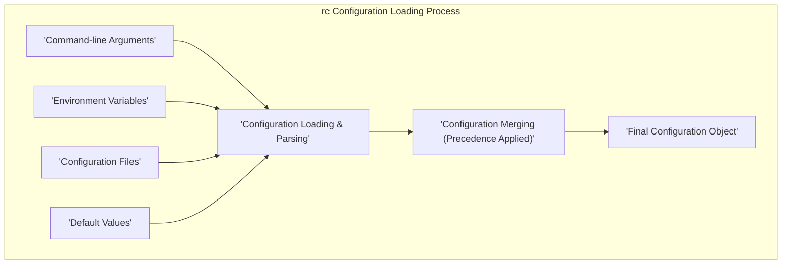

# Project Design Document: rc Configuration Loader

**Version:** 1.1
**Date:** October 26, 2023
**Author:** AI Software Architect

## 1. Introduction

This document provides an enhanced and detailed design overview of the `rc` configuration loader project (available at [https://github.com/dominictarr/rc](https://github.com/dominictarr/rc)). This revised document aims to provide an even clearer articulation of the system's architecture, components, and data flow to facilitate more effective threat modeling activities. It elaborates on how `rc` functions, provides more specific examples of its various input sources, and clarifies the structure of the resulting configuration object.

## 2. Goals

The primary goals of this design document are:

*   To provide a comprehensive and easily understandable explanation of the `rc` configuration loader's architecture and functionality.
*   To clearly identify and describe the key components of the system and their interactions.
*   To precisely illustrate the flow of configuration data from various sources to the final configuration object with concrete examples.
*   To serve as a robust and detailed foundation for conducting thorough threat modeling of the `rc` project.
*   To maintain a clear, concise, and easily maintainable document.

## 3. System Overview

The `rc` library is a Node.js module designed to streamline the process of loading and managing application configuration. It intelligently aggregates configuration settings from a prioritized set of sources, applying a well-defined order of precedence to resolve conflicts. This design empowers applications with flexible configuration options through command-line arguments, environment variables, and configuration files, catering to diverse deployment and customization needs.

## 4. Detailed Design

### 4.1. Core Functionality

At its core, `rc`'s function is to gather configuration settings from multiple predefined sources and meticulously merge them into a unified configuration object. The order in which these sources are considered is paramount, establishing a clear hierarchy:

*   Command-line arguments (possessing the highest precedence).
*   Environment variables.
*   Configuration files (accessed and loaded in a specific order of precedence).
*   Default values (serving as the baseline with the lowest precedence).

### 4.2. Input Sources

`rc` systematically considers the following distinct sources for configuration data:

*   **Command-line Arguments:** These are arguments supplied directly when initiating the Node.js process. `rc` parses these arguments, typically identifying those prefixed with `--`.
    *   Example: Running `node app.js --port=8080 --logLevel=debug` would set the `port` property to `8080` and `logLevel` to `debug`.
*   **Environment Variables:** These are system-level environment variables. `rc` typically filters these based on a prefix derived from the application name (or a user-specified prefix).
    *   Example: For an application named "myapp", setting the environment variable `RC_PORT=8081` would configure the `port` property to `8081`. `RC_LOG_LEVEL=info` would set `logLevel` to `info`.
*   **Configuration Files:** `rc` employs a defined search strategy to locate configuration files in a specific order and set of locations. The default search path and filenames are as follows:
    *   `/etc/<appname>/config`
    *   `/etc/<appname>/config.json`
    *   `/etc/<appname>/config.yaml`
    *   `/etc/<appname>/config.yml`
    *   `/etc/<appname>/config.js`
    *   `$HOME/.<appname>`
    *   `$HOME/.<appnamerc>`
    *   `$HOME/.config/<appname>`
    *   `$HOME/.config/<appname>/config`
    *   `$HOME/.config/<appname>/config.json`
    *   `$HOME/.config/<appname>/config.yaml`
    *   `$HOME/.config/<appname>/config.yml`
    *   `$HOME/.config/<appname>/config.js`
    *   The `config` property within the application's `package.json` file.
    *   A file path explicitly provided via the `--config` command-line argument or the `RC_CONFIG_FILE` environment variable.
*   **Default Values:** These represent the initial configuration settings provided programmatically when the `rc()` function is invoked. They serve as the fallback if no other configuration is found.
    *   Example: `const config = require('rc')('myapp', { port: 3000, logLevel: 'warn' });` sets default values for `port` and `logLevel`.

### 4.3. Configuration Loading Process

The `rc` library orchestrates the loading and merging of configuration through these sequential steps:

1. **Initialization:** The `rc()` function is called, accepting the application name and an optional default configuration object as arguments.
    *   Example: `const config = require('rc')('my-api', { databaseUrl: 'localhost', cacheEnabled: false });`
2. **Command-line Argument Extraction and Parsing:** `rc` analyzes the command-line arguments passed to the Node.js process, extracting key-value pairs. Arguments adhering to the `--key=value` format are typically targeted.
3. **Environment Variable Retrieval and Filtering:** `rc` accesses system environment variables, filtering them based on the application name or a designated prefix (e.g., `RC_`).
4. **Configuration File Discovery:** `rc` systematically searches for configuration files in the predefined locations, adhering to the specified order of precedence.
5. **Configuration File Loading and Parsing:** When a configuration file is located, `rc` loads its contents and parses it based on the file extension. Common formats include JSON, YAML, and JavaScript.
    *   JSON and YAML files are parsed into JavaScript objects.
    *   JavaScript files are executed, and the resulting exported object is used as configuration.
6. **Configuration Merging:** Configuration settings retrieved from all identified sources are merged into a single JavaScript object. The merging process respects the established order of precedence, where settings from higher-precedence sources override those from lower-precedence sources.
7. **Return of Merged Configuration:** The final, merged configuration object is returned by the `rc()` function, making it available for use within the application.

### 4.4. Output

The result of invoking `rc()` is a standard JavaScript object. This object encapsulates the consolidated configuration settings, reflecting the values obtained from all considered sources, with precedence rules applied. The application can then access its configuration parameters by referencing properties within this object.

## 5. Data Flow Diagram

## 6. Security Considerations (Detailed)

This section provides a more detailed examination of potential security considerations arising from the design of `rc`. A comprehensive threat model will build upon this foundation.

*   **Configuration File Injection/Inclusion:** If the application permits users to specify configuration file paths (e.g., via `--config` or `RC_CONFIG_FILE`), a malicious user could point to a file hosted on a remote server or a local file containing malicious code. This could lead to:
    *   **Remote Code Execution (RCE):** If the pointed-to file is a JavaScript file, `rc` will execute it, potentially running arbitrary code on the server.
    *   **Local File Inclusion (LFI):**  An attacker could include sensitive local files, potentially exposing secrets or application source code.
*   **Environment Variable Manipulation:** Attackers who gain control over the environment where the application runs can manipulate environment variables to:
    *   **Alter Application Behavior:** Change critical settings like database credentials, API keys, or logging levels.
    *   **Inject Malicious Settings:** Introduce settings that cause the application to behave unexpectedly or insecurely.
*   **Command-line Argument Injection:** In scenarios where the application's execution environment is compromised, attackers could inject malicious command-line arguments to:
    *   **Override Secure Settings:**  Disable security features or change critical parameters.
    *   **Point to Malicious Configuration Files:** Similar to configuration file injection.
*   **Dependency Vulnerabilities:** Vulnerabilities present in the `rc` library itself or its transitive dependencies could be exploited by attackers. Regularly updating dependencies is crucial.
*   **Information Disclosure through Configuration:**  Accidental inclusion of sensitive information (e.g., API keys, database passwords, private keys) in configuration files or environment variables can lead to unauthorized access and data breaches.
*   **Insecure Configuration File Permissions:** If configuration files are not properly protected with appropriate file system permissions, unauthorized users could modify them, potentially compromising the application's security or functionality.
*   **Arbitrary Code Execution via JavaScript Configuration Files:** Loading and executing JavaScript files as configuration introduces a significant risk. A maliciously crafted JavaScript configuration file could execute arbitrary code on the server when loaded by `rc`. This is a critical vulnerability.
*   **Denial of Service (DoS):**  A malicious configuration file (especially a JavaScript one) could be crafted to consume excessive resources, leading to a denial of service.

## 7. Assumptions

The following assumptions underpin the design and analysis presented in this document:

*   The `rc` library is deployed and utilized within a standard Node.js runtime environment.
*   The application that integrates `rc` bears the responsibility for securely handling and utilizing the loaded configuration data. `rc` itself focuses on the loading and merging process.
*   The underlying operating system and file system provide fundamental security mechanisms for file access control and user permissions.

## 8. Future Considerations

*   **Input Validation and Sanitization:** Implementing robust input validation and sanitization for configuration values, especially those sourced from environment variables and command-line arguments, could mitigate injection risks.
*   **Secure Secret Management Integration:**  Exploring integration with secure secret management solutions (like HashiCorp Vault, AWS Secrets Manager, etc.) would significantly reduce the risk of exposing sensitive credentials directly in configuration files or environment variables.
*   **Sandboxing or Isolation for JavaScript Configuration Files:** Investigating techniques to sandbox or isolate the execution of JavaScript configuration files could mitigate the severe risk of arbitrary code execution. This could involve using a separate process or a secure JavaScript execution environment.
*   **Configuration Schema Validation:** Implementing a mechanism to validate the structure and types of configuration values against a predefined schema could help prevent unexpected application behavior due to misconfiguration.
*   **Centralized Configuration Management System Integration:** For larger and more complex deployments, considering integration with centralized configuration management systems (like Consul or etcd) could provide better control and auditing of configuration changes.
*   **Principle of Least Privilege for File Access:** Emphasize the importance of adhering to the principle of least privilege when setting file system permissions for configuration files.

This enhanced document provides a more detailed and nuanced understanding of the `rc` configuration loader. The expanded explanations, concrete examples, and more comprehensive security considerations will contribute to a more thorough and effective threat modeling process.