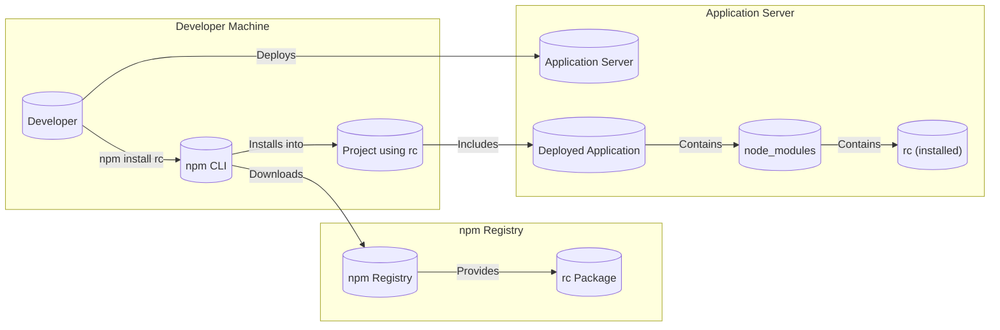
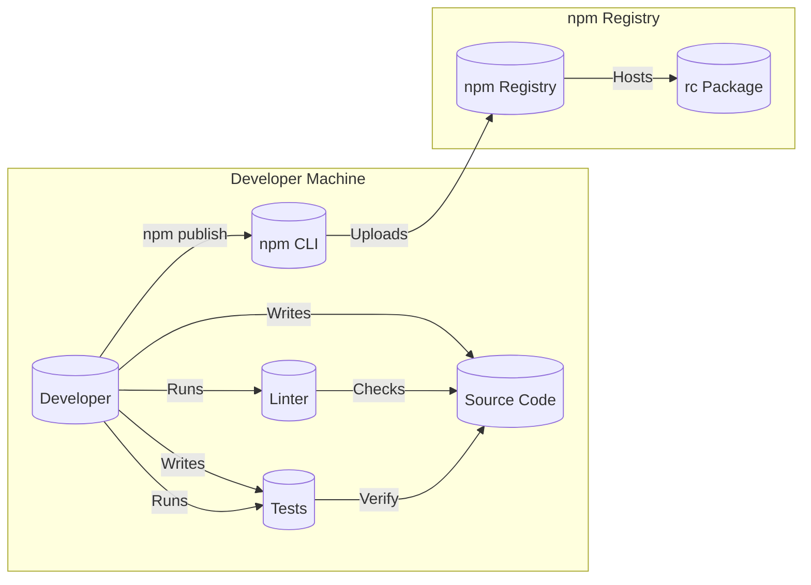

Okay, let's create a design document for the `rc` project, keeping in mind its purpose and potential security implications.

# Project Design Document: `rc`

## BUSINESS POSTURE

The `rc` project (runtime configuration) is a fundamental utility for managing application configurations in Node.js environments.  It simplifies loading configurations from various sources (command-line arguments, environment variables, configuration files) with a defined precedence.  It's widely used, indicating its importance to a large number of applications.

Business Priorities:

*   Reliability:  The `rc` library must be highly reliable.  Incorrect configuration loading can lead to application failures or unexpected behavior.
*   Maintainability:  Given its widespread use, the project needs to be easily maintainable to address bugs and security vulnerabilities promptly.
*   Simplicity:  The library should remain simple and easy to use, avoiding unnecessary complexity that could introduce bugs or security issues.
*   Compatibility:  Maintain backward compatibility where possible to avoid breaking existing applications that rely on `rc`.

Business Goals:

*   Provide a consistent and predictable way to load application configurations.
*   Minimize configuration-related errors in applications using the library.
*   Facilitate easy updates and maintenance of the library itself.

Most Important Business Risks:

*   Configuration Injection:  Malicious actors could inject unexpected configurations, potentially leading to remote code execution, data breaches, or denial of service. This is the most critical risk.
*   Denial of Service:  Specially crafted configuration files or inputs could cause the library to crash or consume excessive resources, leading to application downtime.
*   Dependency Vulnerabilities:  Vulnerabilities in `rc`'s dependencies could be exploited to compromise applications using `rc`.
*   Information Disclosure:  Incorrectly handled configuration loading might expose sensitive information (e.g., API keys, passwords) present in the environment or configuration files.

## SECURITY POSTURE

Existing Security Controls:

*   security control: Code Reviews:  The GitHub repository shows evidence of code reviews, although their rigor and consistency are unknown. (Inferred from GitHub pull requests).
*   security control: Dependency Management: The project uses `package.json` and `package-lock.json` to manage dependencies, which helps ensure consistent builds and reduces the risk of introducing vulnerable dependencies unintentionally. (Visible in the repository).
*   security control: Testing: The project includes a test suite (`test/` directory), which helps identify bugs and regressions. The extent and effectiveness of the tests are crucial for security. (Visible in the repository).
*   security control: Linter: `.eslintrc` file suggest that project is using linter. (Visible in the repository).

Accepted Risks:

*   accepted risk: Limited Input Validation: The library primarily focuses on loading configurations from various sources and doesn't perform extensive validation on the *content* of the configuration values. This is partially by design, as `rc` is meant to be flexible, but it increases the risk of configuration injection.
*   accepted risk: Reliance on User Environment: The library's behavior is influenced by environment variables and files in the user's system, which are outside the direct control of the library.

Recommended Security Controls:

*   security control: Enhanced Input Validation: Implement optional, configurable input validation to allow users to specify schemas or rules for configuration values. This could be integrated as a separate module or plugin to maintain flexibility.
*   security control: Secure Configuration Best Practices Documentation: Provide clear documentation and examples on securely using `rc`, including recommendations for avoiding sensitive data in configuration files, using environment variables securely, and validating configuration values within the application.
*   security control: Regular Security Audits: Conduct periodic security audits, including penetration testing and code reviews focused on security vulnerabilities.
*   security control: Dependency Scanning: Integrate automated dependency scanning tools (e.g., `npm audit`, Snyk, Dependabot) into the build process to identify and address known vulnerabilities in dependencies.
*   security control: Fuzz Testing: Introduce fuzz testing to identify unexpected behavior or crashes when processing malformed or malicious input.

Security Requirements:

*   Authentication: Not directly applicable to `rc` itself, as it's a configuration loading library, not an authentication system. Authentication should be handled by the applications *using* `rc`.
*   Authorization:  Not directly applicable to `rc` itself. Authorization logic should reside within the applications using `rc`.
*   Input Validation:
    *   The library should provide mechanisms (either built-in or through extensions) to allow applications to validate the *structure* and *content* of configuration values.
    *   Validation rules should be configurable by the user.
    *   The library should handle invalid configuration gracefully, providing informative error messages without crashing.
*   Cryptography:
    *   `rc` itself doesn't handle cryptographic operations. However, if configuration values contain sensitive data (e.g., API keys, secrets), applications using `rc` *must* handle these values securely, using appropriate encryption and key management practices.  `rc` should *not* be responsible for decrypting or encrypting sensitive data.
    *   Documentation should emphasize the importance of securely storing and handling sensitive configuration values.

## DESIGN

### C4 CONTEXT

```mermaid
graph LR
    subgraph "External Systems"
        User[("User")]
        EnvironmentVariables[("Environment Variables")]
        CommandLineArguments[("Command-Line Arguments")]
        ConfigurationFiles[("Configuration Files\n(various formats)")]
        ExternalConfigurationService[("External Configuration Service\n(e.g., Consul, etcd)")]
    end

    subgraph "rc"
        rc[("rc Library")]
    end
    
    subgraph "Application"
        Application[("Application using rc")]
    end

    User -- "Provides config via" --> CommandLineArguments
    User -- "Sets config via" --> EnvironmentVariables
    User -- "Creates/Modifies" --> ConfigurationFiles
    ConfigurationFiles -- "Loads config from" --> rc
    CommandLineArguments -- "Loads config from" --> rc
    EnvironmentVariables -- "Loads config from" --> rc
    ExternalConfigurationService -- "Loads config from" --> rc
    rc -- "Provides config to" --> Application
```

Context Diagram Element List:

*   Element:
    *   Name: User
    *   Type: Person
    *   Description: The user interacting with the application, potentially providing configuration via command-line arguments or environment variables.
    *   Responsibilities: Providing configuration inputs.
    *   Security controls: None directly within `rc`. User-level security is the responsibility of the operating system and user practices.

*   Element:
    *   Name: Environment Variables
    *   Type: System
    *   Description: Environment variables set in the user's shell or system.
    *   Responsibilities: Storing configuration values.
    *   Security controls: Access control to environment variables (OS-level).

*   Element:
    *   Name: Command-Line Arguments
    *   Type: System
    *   Description: Arguments passed to the application when it's executed.
    *   Responsibilities: Providing configuration values.
    *   Security controls: None directly within `rc`.

*   Element:
    *   Name: Configuration Files
    *   Type: System
    *   Description: Files in various formats (JSON, INI, YAML, etc.) containing configuration data.
    *   Responsibilities: Storing configuration values.
    *   Security controls: File system permissions (OS-level).

*   Element:
    *   Name: External Configuration Service
    *   Type: System
    *   Description: An external service like Consul or etcd that provides configuration data.
    *   Responsibilities: Storing and managing configuration data.
    *   Security controls: Authentication, authorization, encryption in transit and at rest (within the external service).

*   Element:
    *   Name: rc Library
    *   Type: Software System
    *   Description: The `rc` library itself.
    *   Responsibilities: Loading configuration from various sources with defined precedence.
    *   Security controls: Input validation (limited, but should be enhanced), secure dependency management.

*   Element:
    *   Name: Application using rc
    *   Type: Software System
    *   Description: Application that is using `rc` library.
    *   Responsibilities: Using provided configuration.
    *   Security controls: Input validation, secure handling of sensitive configuration values.

### C4 CONTAINER

Since `rc` is a single library, the container diagram is essentially an expansion of the context diagram.

```mermaid
graph LR
    subgraph "External Systems"
        User[("User")]
        EnvironmentVariables[("Environment Variables")]
        CommandLineArguments[("Command-Line Arguments")]
        ConfigurationFiles[("Configuration Files\n(various formats)")]
        ExternalConfigurationService[("External Configuration Service\n(e.g., Consul, etcd)")]
    end

    subgraph "rc - Node.js Library"
        rc[("rc Module")]
        Parser[("Parser\n(JSON, INI, YAML)")]
        Defaults[("Default Configuration")]
        
    end
    
     subgraph "Application"
        Application[("Application using rc")]
    end

    User -- "Provides config via" --> CommandLineArguments
    User -- "Sets config via" --> EnvironmentVariables
    User -- "Creates/Modifies" --> ConfigurationFiles
    ConfigurationFiles -- "Loads config from" --> rc
    CommandLineArguments -- "Loads config from" --> rc
    EnvironmentVariables -- "Loads config from" --> rc
    ExternalConfigurationService -- "Loads config from" --> rc
    rc -- "Parses with" --> Parser
    rc -- "Uses" --> Defaults
    rc -- "Provides config to" --> Application
```

Container Diagram Element List:

*   Element:
    *   Name: rc Module
    *   Type: Module
    *   Description: The main module of the `rc` library.
    *   Responsibilities: Orchestrates the loading and merging of configuration from different sources.
    *   Security controls: Input validation (limited, but should be enhanced).

*   Element:
    *   Name: Parser
    *   Type: Module
    *   Description: Modules for parsing different configuration file formats (JSON, INI, YAML).  This might be internal to `rc` or use external libraries.
    *   Responsibilities: Parsing configuration files.
    *   Security controls: Secure parsing libraries (avoiding vulnerabilities like YAML deserialization issues).

*   Element:
    *   Name: Default Configuration
    *   Type: Data
    *   Description: Default configuration values.
    *   Responsibilities: Providing fallback values if no configuration is found from other sources.
    *   Security controls: None. Ensure defaults do not contain sensitive information.

*   Element:
    *   Name: User
    *   Type: Person
    *   Description: The user interacting with the application.
    *   Responsibilities: Providing configuration inputs.
    *   Security controls: None directly within `rc`.

*   Element:
    *   Name: Environment Variables
    *   Type: System
    *   Description: Environment variables set in the user's shell or system.
    *   Responsibilities: Storing configuration values.
    *   Security controls: Access control to environment variables (OS-level).

*   Element:
    *   Name: Command-Line Arguments
    *   Type: System
    *   Description: Arguments passed to the application when it's executed.
    *   Responsibilities: Providing configuration values.
    *   Security controls: None directly within `rc`.

*   Element:
    *   Name: Configuration Files
    *   Type: System
    *   Description: Files in various formats (JSON, INI, YAML, etc.) containing configuration data.
    *   Responsibilities: Storing configuration values.
    *   Security controls: File system permissions (OS-level).

*   Element:
    *   Name: External Configuration Service
    *   Type: System
    *   Description: An external service like Consul or etcd that provides configuration data.
    *   Responsibilities: Storing and managing configuration data.
    *   Security controls: Authentication, authorization, encryption in transit and at rest (within the external service).

*   Element:
    *   Name: Application using rc
    *   Type: Software System
    *   Description: Application that is using `rc` library.
    *   Responsibilities: Using provided configuration.
    *   Security controls: Input validation, secure handling of sensitive configuration values.

### DEPLOYMENT

`rc` is a library, not a standalone application. Therefore, deployment is primarily about how it's *included* in other applications. There are several possibilities:

1.  **npm Installation (Most Common):**  Developers use `npm install rc` to add `rc` as a dependency to their project.  This downloads the package from the npm registry and adds it to the project's `node_modules` directory.
2.  **GitHub Cloning (Less Common):** Developers could clone the `rc` repository directly from GitHub, although this is less common for typical usage. This is more relevant for contributing to `rc` itself.
3.  **Bundling (For Browser Use - Unlikely):** While `rc` is primarily designed for Node.js, it *could* theoretically be bundled for browser use using tools like Webpack or Browserify. This is not a typical use case.

We'll focus on the most common scenario: npm installation.



Deployment Diagram Element List:

*   Element:
    *   Name: Developer
    *   Type: Person
    *   Description: The developer building the application that uses `rc`.
    *   Responsibilities: Installing and using `rc`.
    *   Security controls: Using a secure development environment.

*   Element:
    *   Name: Project using rc
    *   Type: Software System
    *   Description: The developer's project that depends on `rc`.
    *   Responsibilities: Using `rc` for configuration loading.
    *   Security controls: Secure coding practices, dependency management.

*   Element:
    *   Name: npm CLI
    *   Type: Tool
    *   Description: The npm command-line interface.
    *   Responsibilities: Managing dependencies, downloading packages.
    *   Security controls: Using a trusted npm registry, verifying package integrity (using `package-lock.json`).

*   Element:
    *   Name: npm Registry
    *   Type: System
    *   Description: The public npm registry (or a private registry).
    *   Responsibilities: Hosting and serving npm packages.
    *   Security controls: Registry-level security measures (e.g., two-factor authentication for publishers, malware scanning).

*   Element:
    *   Name: rc Package
    *   Type: Package
    *   Description: The `rc` package hosted on the npm registry.
    *   Responsibilities: Providing the `rc` library code.
    *   Security controls: Package signing (if used), vulnerability scanning.

*   Element:
    *   Name: Application Server
    *   Type: Server
    *   Description: Server where application is deployed.
    *   Responsibilities: Running application.
    *   Security controls: Server hardening, firewall, intrusion detection.

*   Element:
    *   Name: Deployed Application
    *   Type: Software System
    *   Description: Deployed application.
    *   Responsibilities: Running application logic.
    *   Security controls: Application-level security controls.

*   Element:
    *   Name: node_modules
    *   Type: Directory
    *   Description: Directory with installed npm packages.
    *   Responsibilities: Providing dependencies to application.
    *   Security controls: None.

*   Element:
    *   Name: rc (installed)
    *   Type: Library
    *   Description: Installed `rc` library.
    *   Responsibilities: Loading configuration.
    *   Security controls: Input validation (limited, but should be enhanced).

### BUILD

The build process for `rc` itself (as opposed to applications *using* `rc`) involves:

1.  **Development:** Developers write code and tests.
2.  **Testing:** Running the test suite (`npm test`).
3.  **Linting:** Checking code style and potential errors (`npm run lint`).
4.  **Publishing (to npm):**  Using `npm publish` to upload the package to the npm registry.



Build Process Security Controls:

*   security control: Code Reviews: Before merging changes, code reviews should be conducted to identify potential security issues.
*   security control: Testing: The test suite should include security-focused tests (e.g., testing for injection vulnerabilities).
*   security control: Linting: A linter (like ESLint) helps enforce coding standards and can detect some potential security issues.
*   security control: Dependency Management: Using `package-lock.json` ensures consistent builds and reduces the risk of introducing vulnerable dependencies unintentionally.
*   security control: Secure npm Publishing: The developer publishing to npm should use two-factor authentication to prevent unauthorized package updates.
*   security control: (Recommended) Dependency Scanning: Integrate automated dependency scanning into the build process (e.g., using GitHub Actions or similar).
*   security control: (Recommended) Fuzz Testing: Add fuzz testing to the build pipeline.

## RISK ASSESSMENT

Critical Business Processes:

*   Application Configuration Loading: This is the core function of `rc`. Failure here can lead to application failure or misbehavior.
*   Application Startup: `rc` is often used during application startup, making it critical for the application to function correctly.

Data We Are Trying to Protect:

*   Configuration Data: This includes application settings, potentially including sensitive information like API keys, database credentials, and other secrets.
    *   Sensitivity: Varies widely. Some configuration data may be public, while other parts may be highly sensitive. The *application* using `rc` is responsible for determining the sensitivity of its configuration data and handling it appropriately. `rc` should provide mechanisms to *help* with this, but it's ultimately the application's responsibility.

## QUESTIONS & ASSUMPTIONS

Questions:

*   What is the expected frequency of updates and releases for `rc`?
*   Are there any specific compliance requirements (e.g., PCI DSS, GDPR) that applications using `rc` typically need to meet? This would influence recommendations for secure configuration practices.
*   What is the level of security expertise within the `rc` maintainer team?
*   What is the process for handling reported security vulnerabilities?
*   Are there any plans to add features to `rc` that might introduce new security considerations (e.g., support for encrypted configuration files)?

Assumptions:

*   BUSINESS POSTURE: We assume a moderate risk appetite. While `rc` is a widely used library, it's also a relatively small and focused component. We prioritize reliability and maintainability, but also recognize the need for security.
*   SECURITY POSTURE: We assume that the existing security controls are in place (code reviews, testing, dependency management) but may not be comprehensive or rigorously enforced. We assume a reactive approach to security vulnerabilities rather than a proactive one.
*   DESIGN: We assume that the primary use case is Node.js applications using `npm` for dependency management. We assume that developers using `rc` have some understanding of security best practices, but may not be security experts.