## Project Design Document: Egg.js Framework (Improved)

**1. Project Overview**

This document provides an enhanced architectural design overview of the Egg.js framework, a convention-over-configuration Node.js framework built on Koa, designed for building robust and scalable web applications and APIs. The focus remains on elucidating the framework's structure, key components, and data flow to facilitate comprehensive threat modeling exercises. This revision aims to provide greater clarity and detail for security analysis.

**2. Goals**

* Deliver a refined and more detailed architectural overview of the Egg.js framework.
* Provide enhanced descriptions of key components and their interactions, emphasizing security-relevant aspects.
* Offer a more granular depiction of the typical data flow within an Egg.js application, highlighting potential interception points.
* Expand on the initial security considerations, providing more specific examples relevant to each architectural layer.
* Serve as a robust and improved foundation for subsequent threat modeling activities, enabling more precise identification of vulnerabilities.

**3. Non-Goals**

* Provide a line-by-line code analysis of the Egg.js framework source code.
* Offer definitive security solutions or prescriptive mitigation strategies for identified threats.
* Document every single configuration option, edge case, or less commonly used feature of Egg.js.
* Analyze the security posture of specific applications built using Egg.js; the focus is on the framework itself.

**4. Target Audience**

* Security engineers and architects tasked with performing threat modeling on Egg.js applications and the framework itself.
* Developers seeking a deeper, security-focused understanding of the Egg.js framework architecture and its inherent security considerations.
* DevOps engineers responsible for the secure deployment and management of Egg.js applications in various environments.

**5. Architectural Overview**

Egg.js employs a layered architecture, promoting modularity and maintainability through its plugin system and adherence to established conventions. The core framework orchestrates the handling of incoming requests, leveraging middleware and application-specific logic to generate responses.

```mermaid
graph LR
    subgraph "Client Domain"
        A["'User Browser/Application'"]
    end
    B["'Load Balancer/Reverse Proxy'"] --> C["'Egg.js Application Instance'"];
    C --> D["'Egg Core'"];
    D --> E["'Application Layer'"];
    E --> F["'Middleware Pipeline'"];
    F --> G["'Router'"];
    G --> H["'Controller'"];
    H --> I["'Service Layer'"];
    I --> J["'Model/Data Access Layer'"];
    J --> K["'Database/External Service'"];
    K --> J;
    J --> I;
    I --> H;
    H --> G;
    G --> F;
    F --> E;
    E --> D;
    C --> B;
    style A fill:#f9f,stroke:#333,stroke-width:2px
    style B fill:#ccf,stroke:#333,stroke-width:2px
    style C fill:#ccf,stroke:#333,stroke-width:2px
    style D fill:#aaf,stroke:#333,stroke-width:2px
    style E fill:#bbf,stroke:#333,stroke-width:2px
    style F fill:#ddf,stroke:#333,stroke-width:2px
    style G fill:#eef,stroke:#333,stroke-width:2px
    style H fill:#ffe,stroke:#333,stroke-width:2px
    style I fill:#efe,stroke:#333,stroke-width:2px
    style J fill:#fdd,stroke:#333,stroke-width:2px
    style K fill:#fcc,stroke:#333,stroke-width:2px
```

**6. Component Details**

* **Client ('User Browser/Application'):** The initiator of requests to the Egg.js application. This could be a web browser, a mobile application, another backend service, or an API client. Security considerations here involve understanding the client's capabilities and potential vulnerabilities.
* **Load Balancer/Reverse Proxy:**  A critical component for distributing traffic, handling SSL/TLS termination, and potentially providing security features like WAF (Web Application Firewall). Misconfigurations or vulnerabilities here can directly impact the security of the Egg.js application.
* **Egg.js Application Instance:** A single running instance of the Egg.js application, responsible for processing requests within its allocated resources. Security within this instance relies on the framework's and the application's security measures.
* **Egg Core:** The foundational layer of the framework, providing core functionalities such as request context management (ctx), plugin loading, application lifecycle management, and error handling. Vulnerabilities in the core can have widespread impact.
* **Application Layer:** This encompasses the user-defined application code built upon Egg.js conventions. It includes configurations, custom middleware, routes, controllers, services, and models. Security here is heavily dependent on developer practices.
* **Middleware Pipeline:** A sequence of functions that intercept and process incoming requests before they reach the router and outgoing responses before they are sent back to the client. Middleware is crucial for implementing cross-cutting concerns, including authentication, authorization, logging, request validation, and security headers. Vulnerabilities in middleware are a significant concern.
* **Router:** Responsible for mapping incoming request URLs and HTTP methods to specific controller actions. Improperly secured routes or lack of input validation at this stage can lead to vulnerabilities.
* **Controller:** Handles incoming requests, orchestrates the application's business logic, interacts with services, and prepares responses. Controllers are a primary target for attacks due to their direct interaction with user input and application logic.
* **Service Layer:** Encapsulates the core business logic of the application, often abstracting interactions with data sources or external services. Security here involves protecting sensitive business logic and ensuring secure interactions with dependencies.
* **Model/Data Access Layer:**  Responsible for interacting with data storage mechanisms (databases, external APIs, etc.). This layer often utilizes ORM/ODM libraries. Security vulnerabilities here, such as SQL injection, can have severe consequences.
* **Database/External Service:** The underlying data storage systems or external APIs that the application interacts with. The security of these systems is paramount and needs to be considered in the overall threat model.

**7. Data Flow**

The typical data flow for an incoming request to an Egg.js application, highlighting potential security checkpoints, is as follows:

```mermaid
graph LR
    A["'Client Request'"] --> B["'Load Balancer/Reverse Proxy'"];
    B --> C["'Egg.js Application Instance'"];
    C --> D["'Egg Core (Request Handling)'"];
    D --> E["'Middleware Pipeline (Pre-routing)'"];
    E --> F{"'Router'"};
    F -- "Route Match" --> G["'Controller Action'"];
    G --> H["'Service Layer'"];
    H --> I["'Model/Data Access Layer'"];
    I --> J["'Database/External Service'"];
    J -- "Response Data" --> I;
    I -- "Processed Data" --> H;
    H -- "Response Data" --> G;
    G --> K["'Middleware Pipeline (Post-routing)'"];
    K --> D;
    D --> C;
    C --> B;
    B --> L["'Client Response'"];
    style A fill:#f9f,stroke:#333,stroke-width:2px
    style B fill:#ccf,stroke:#333,stroke-width:2px
    style C fill:#ccf,stroke:#333,stroke-width:2px
    style D fill:#aaf,stroke:#333,stroke-width:2px
    style E fill:#ddf,stroke:#333,stroke-width:2px
    style F fill:#eef,stroke:#333,stroke-width:2px
    style G fill:#ffe,stroke:#333,stroke-width:2px
    style H fill:#efe,stroke:#333,stroke-width:2px
    style I fill:#fdd,stroke:#333,stroke-width:2px
    style J fill:#fcc,stroke:#333,stroke-width:2px
    style K fill:#ddf,stroke:#333,stroke-width:2px
    style L fill:#f9f,stroke:#333,stroke-width:2px
```

* **Client Request:** A user or system initiates a request targeting the application. This is the initial point of entry and potential attack vectors.
* **Load Balancer/Reverse Proxy:** The request is received and potentially processed for load balancing, SSL termination, WAF filtering, and other security measures.
* **Egg.js Application Instance:** An instance of the Egg.js application receives the request.
* **Egg Core (Request Handling):** The core framework initializes the request context and begins processing, setting up the environment for subsequent layers.
* **Middleware Pipeline (Pre-routing):**  The request passes through a series of middleware functions *before* routing occurs. This is where authentication, initial authorization checks, request sanitization, and logging are often performed.
* **Router:** The router analyzes the request URL and method to determine the appropriate controller action to invoke.
* **Controller Action:** The designated controller action is executed to handle the specific request.
* **Service Layer:** The controller often delegates business logic execution to components within the service layer.
* **Model/Data Access Layer:** Services interact with the data access layer to retrieve, persist, or manipulate data.
* **Database/External Service:** The data access layer communicates with the underlying data storage or external APIs.
* **Response Flow:** The response data flows back through the layers (Model, Service, Controller) and then through the:
* **Middleware Pipeline (Post-routing):** The response passes through another set of middleware functions *after* the controller action has executed. This is where response headers are set, final logging occurs, and potential transformations are applied.
* **Egg Core:** The core framework handles the final stages of response processing.
* **Load Balancer/Reverse Proxy:** The response is sent back through the load balancer/reverse proxy.
* **Client Response:** The final response is delivered to the requesting client.

**8. Security Considerations (Expanded for Threat Modeling)**

Building upon the initial considerations, here's a more detailed breakdown of potential security concerns at each architectural layer, relevant for threat modeling:

* **Client Domain:**
    * **Compromised Client:**  Malware on the user's device could manipulate requests.
    * **Browser Vulnerabilities:** Exploits in the user's browser could be leveraged.
    * **Insecure Communication:** Lack of HTTPS can expose data in transit.
* **Load Balancer/Reverse Proxy:**
    * **DDoS Attacks:**  Targeting the entry point to overwhelm the application.
    * **SSL Stripping:**  Downgrading HTTPS to HTTP to intercept traffic.
    * **WAF Bypasses:**  Crafted requests that evade WAF rules.
    * **Misconfigured Security Headers:**  Missing or incorrect headers can leave the application vulnerable.
* **Egg.js Application Instance:**
    * **Resource Exhaustion:**  Attacks that consume excessive CPU, memory, or file system resources.
    * **Uncaught Exceptions:**  Potential for information leakage through error messages.
    * **Insecure Temporary File Handling:**  Risks associated with temporary file creation and management.
* **Egg Core:**
    * **Framework Vulnerabilities:**  Exploits in the Egg.js core itself (though less frequent).
    * **Insecure Defaults:**  Default configurations that are not secure.
    * **Plugin Loading Vulnerabilities:**  Exploiting the plugin system to inject malicious code.
* **Application Layer:**
    * **Business Logic Flaws:**  Vulnerabilities in the application's core logic.
    * **Improper Error Handling:**  Revealing sensitive information in error messages.
    * **Insufficient Logging and Monitoring:**  Hindering detection and response to attacks.
* **Middleware Pipeline:**
    * **Vulnerable Middleware:**  Using third-party middleware with known security flaws.
    * **Incorrect Middleware Ordering:**  Leading to bypasses of security checks.
    * **Authentication/Authorization Bypass:**  Flaws in authentication or authorization middleware.
    * **Input Validation Failures:**  Middleware not properly sanitizing or validating input.
* **Router:**
    * **Insecure Direct Object References (IDOR):**  Exposing internal object IDs.
    * **Mass Assignment Vulnerabilities:**  Allowing users to modify unintended data.
    * **Lack of Rate Limiting:**  Susceptibility to brute-force attacks.
* **Controller:**
    * **Injection Attacks (SQL, NoSQL, Command Injection):**  Improperly handling user input in database queries or system commands.
    * **Cross-Site Scripting (XSS):**  Rendering unsanitized user input in responses.
    * **Insecure Deserialization:**  Exploiting vulnerabilities in deserialization processes.
* **Service Layer:**
    * **Exposure of Sensitive Business Logic:**  Vulnerabilities leading to unauthorized access to core business rules.
    * **Insecure API Integrations:**  Flaws in how services interact with external APIs.
    * **Data Leaks:**  Unintentional exposure of sensitive data.
* **Model/Data Access Layer:**
    * **SQL Injection:**  Manipulating database queries through user input.
    * **NoSQL Injection:**  Similar to SQL injection but targeting NoSQL databases.
    * **ORM/ODM Vulnerabilities:**  Exploits in the chosen ORM/ODM library.
    * **Data Breaches:**  Unauthorized access or exfiltration of data.
* **Database/External Service:**
    * **Unauthorized Access:**  Gaining access to the database or external service without proper credentials.
    * **Data Tampering:**  Modifying data without authorization.
    * **Denial of Service:**  Overwhelming the database or external service.

**9. Technologies Used**

* **Node.js (LTS versions recommended):** The JavaScript runtime environment powering Egg.js. Staying up-to-date with security patches is crucial.
* **Koa (version 2 or later):** The underlying web framework providing the foundation for request handling.
* **JavaScript (ES6+) / TypeScript:** The primary languages for developing Egg.js applications. Secure coding practices are essential.
* **npm/Yarn/pnpm:** Package managers used for managing dependencies. Regularly auditing dependencies for vulnerabilities is important.
* **Various Middleware Libraries (community-driven):**  A wide range of middleware is available, requiring careful selection and auditing.
* **Plugin System (core Egg.js feature):**  Enables extending functionality but introduces potential security risks from third-party code.
* **ORM/ODM Libraries (e.g., Sequelize, Mongoose, TypeORM):**  Used for database interaction; their security posture should be considered.

**10. Deployment Considerations**

The deployment environment significantly impacts the security posture of an Egg.js application. Key considerations include:

* **Cloud Platforms (AWS, Azure, GCP):** Leveraging cloud-specific security features (e.g., security groups, IAM roles).
* **Containerization (Docker, Kubernetes):**  Securing container images and orchestration platforms.
* **Serverless Functions (less common for full Egg.js):**  Understanding the security implications of the serverless environment.
* **Traditional Servers (Physical/Virtual Machines):**  Properly configuring firewalls, access controls, and operating system security.
* **Network Security:**  Implementing appropriate network segmentation and access controls.
* **Secrets Management:**  Securely storing and managing sensitive credentials (API keys, database passwords).
* **Regular Security Audits and Penetration Testing:**  Proactively identifying vulnerabilities in the deployed environment.

This improved design document provides a more detailed and security-focused overview of the Egg.js framework architecture. It serves as a more robust foundation for conducting thorough threat modeling exercises, enabling security professionals and developers to identify and mitigate potential vulnerabilities effectively.
