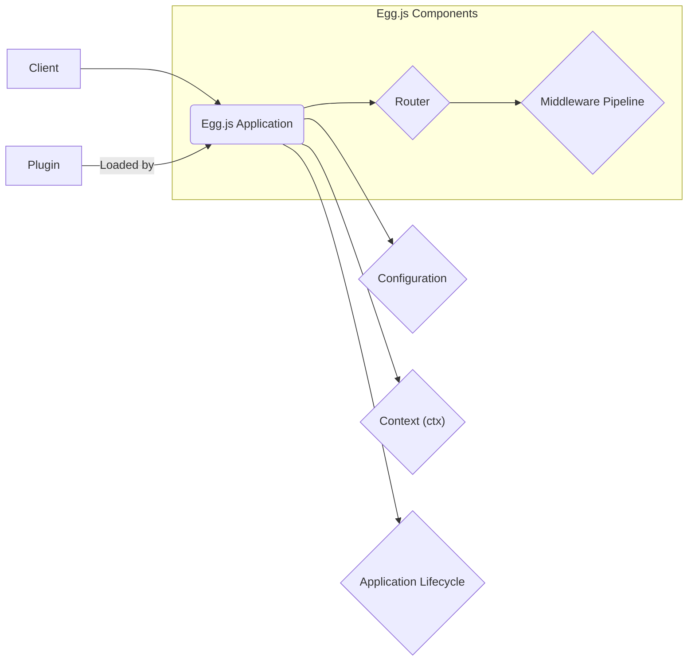

### High and Critical Egg.js Threats

This list details high and critical security threats that directly involve the Egg.js framework.

1. **Threat:** Malicious Plugin Installation
    *   **Description:** An attacker compromises the plugin installation process (e.g., through supply chain attacks, compromised npm accounts) and installs a malicious plugin. This plugin could then execute arbitrary code during application startup or runtime, intercept requests, or exfiltrate data, directly leveraging Egg.js's plugin loading mechanism.
    *   **Impact:** Complete compromise of the application and potentially the underlying server. Data breaches, service disruption, and unauthorized access are possible.
    *   **Affected Component:** `egg-loader` (responsible for loading plugins).
    *   **Risk Severity:** Critical
    *   **Mitigation Strategies:**
        *   Carefully vet all plugins before installation, checking their source code and maintainer reputation.
        *   Use dependency scanning tools to identify vulnerabilities in plugin dependencies.
        *   Implement a strict plugin review process within the development team.
        *   Consider using private npm registries or code repositories for internal plugins.
        *   Employ Software Composition Analysis (SCA) tools to monitor plugin dependencies for known vulnerabilities.

2. **Threat:** Plugin Vulnerability Exploitation
    *   **Description:** An attacker identifies and exploits a known vulnerability within an installed Egg.js plugin. This exploitation directly interacts with the Egg.js application through the plugin interface, potentially leading to remote code execution, data leakage, or denial of service within the Egg.js context.
    *   **Impact:** Depending on the vulnerability, impacts can range from data breaches and service disruption to complete server compromise.
    *   **Affected Component:**  The `Plugin` as integrated within the Egg.js application.
    *   **Risk Severity:** High to Critical (depending on the vulnerability)
    *   **Mitigation Strategies:**
        *   Keep all plugins updated to their latest versions to patch known vulnerabilities.
        *   Subscribe to security advisories for the plugins used in the application.
        *   Implement a process for quickly patching or removing vulnerable plugins.
        *   Consider using a Web Application Firewall (WAF) to detect and block common plugin exploits.

3. **Threat:** Middleware Bypass due to Misconfiguration
    *   **Description:** An attacker exploits misconfigured middleware within the Egg.js middleware pipeline to bypass security checks (e.g., authentication, authorization). This happens due to incorrect ordering of middleware, missing middleware registered with Egg.js, or flawed logic within custom middleware integrated into the Egg.js framework. The attacker gains unauthorized access to protected resources or functionalities.
    *   **Impact:** Unauthorized access to sensitive data or functionalities, potentially leading to data breaches, data manipulation, or privilege escalation.
    *   **Affected Component:** `Middleware Pipeline`, `egg-core` (middleware management).
    *   **Risk Severity:** High
    *   **Mitigation Strategies:**
        *   Carefully review the order and configuration of all middleware within the Egg.js application.
        *   Ensure that essential security middleware (authentication, authorization, input validation) is correctly implemented and registered with Egg.js, and placed in the appropriate order.
        *   Thoroughly test the middleware pipeline to ensure it functions as expected and prevents bypasses.
        *   Use established and well-vetted middleware packages where possible.

4. **Threat:** Exposure of Sensitive Configuration Data
    *   **Description:** An attacker gains access to sensitive configuration data (e.g., database credentials, API keys) managed by Egg.js's configuration system due to insecure storage or access controls. This could be through accessing configuration files directly, exploiting information disclosure vulnerabilities within Egg.js, or gaining access to environment variables used by Egg.js.
    *   **Impact:**  Full compromise of backend systems, unauthorized access to external services, and potential data breaches.
    *   **Affected Component:** `Configuration` module (`app.config`), `egg-core` (configuration loading).
    *   **Risk Severity:** Critical
    *   **Mitigation Strategies:**
        *   Store sensitive configuration data securely using environment variables or dedicated secret management tools (e.g., HashiCorp Vault, AWS Secrets Manager).
        *   Avoid hardcoding sensitive information in configuration files managed by Egg.js.
        *   Implement strict access controls for configuration files and environment variables used by the Egg.js application.
        *   Ensure that configuration files are not accessible through web directories.

5. **Threat:** Routing Vulnerabilities Leading to Unauthorized Access
    *   **Description:** An attacker exploits vulnerabilities in the Egg.js router configuration, such as ambiguous route definitions or missing route protections, to access unintended handlers or functionalities. This involves manipulating URL parameters or crafting specific request paths that are processed by the Egg.js router.
    *   **Impact:** Unauthorized access to sensitive resources or functionalities, potentially leading to data breaches or manipulation.
    *   **Affected Component:** `Router` (`egg-router`).
    *   **Risk Severity:** High
    *   **Mitigation Strategies:**
        *   Define clear and unambiguous route patterns within the Egg.js router configuration.
        *   Use route-level middleware for authentication and authorization within the Egg.js routing system.
        *   Thoroughly test route definitions to ensure they behave as expected and prevent unauthorized access.
        *   Avoid overly permissive route matching (e.g., using wildcards excessively) in Egg.js routes.

6. **Threat:** Exploiting Application Lifecycle Events
    *   **Description:** An attacker identifies and exploits vulnerabilities during the Egg.js application's startup or shutdown lifecycle. This could involve injecting malicious code that executes during initialization hooks provided by Egg.js or exploiting race conditions during shutdown to access sensitive data before it's properly cleaned up by Egg.js lifecycle management.
    *   **Impact:**  Can range from information disclosure and denial of service to potential code execution during startup.
    *   **Affected Component:** `Application Lifecycle` events (`app.beforeStart`, `app.beforeClose`), `egg-core`.
    *   **Risk Severity:** Medium (While the previous assessment was medium, the potential for code execution elevates it in this filtered list focusing on direct Egg.js involvement and higher severities).
    *   **Mitigation Strategies:**
        *   Carefully review and secure any custom logic implemented within Egg.js application lifecycle hooks.
        *   Ensure proper resource cleanup and security measures are in place during shutdown procedures managed by Egg.js.
        *   Avoid performing sensitive operations or accessing sensitive data during the startup phase if possible.