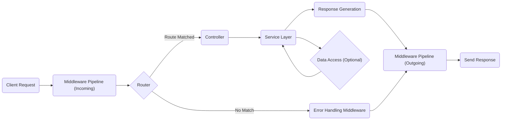
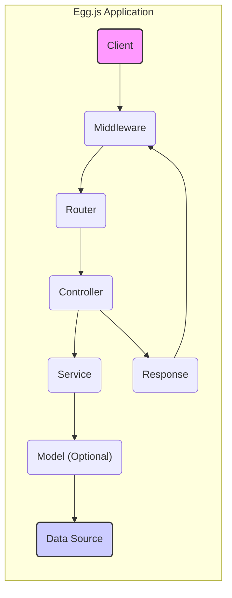
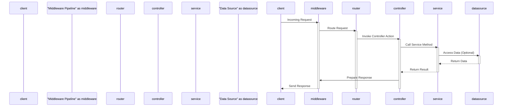

# Project Design Document: Egg.js Framework

**Version:** 1.1
**Date:** October 26, 2023
**Author:** AI Software Architect

## 1. Project Overview

This document details the architectural design of the Egg.js framework, a robust Node.js framework designed for building enterprise-grade web applications and APIs. Built upon the foundation of Koa.js, Egg.js provides a structured and opinionated approach to application development, emphasizing convention over configuration to enhance scalability and maintainability. This document aims to provide a clear understanding of the framework's internal structure, its core components, and the flow of data within an application, serving as a crucial resource for subsequent threat modeling activities.

## 2. Goals

* To provide a comprehensive and detailed explanation of the Egg.js framework's architecture and design principles.
* To clearly identify the key components within the framework and elucidate their interactions and responsibilities.
* To illustrate the typical lifecycle of an incoming request and the corresponding data flow within an Egg.js application.
* To serve as a foundational document for security analysis, specifically to facilitate the identification of potential security vulnerabilities during threat modeling exercises.

## 3. Architectural Overview

Egg.js adopts a layered architecture, promoting a clear separation of concerns and enhancing the modularity of applications built with it. It leverages the powerful middleware capabilities of its underlying Koa.js framework and introduces strong conventions for structuring applications, making them more predictable and easier to manage.

The key layers and components that constitute the Egg.js architecture are:

* **Core Framework:** This layer provides the fundamental infrastructure and manages the lifecycle of Egg.js applications. It handles bootstrapping the application, managing plugins, and providing core services accessible throughout the application.
* **Application Context:** A unique context object is created for each incoming request. This context acts as a container, providing access to request-specific information, application-level services, configurations, and utility functions within the scope of that particular request.
* **Middleware Layer (Koa.js):**  Egg.js extensively utilizes Koa.js middleware to process incoming requests and outgoing responses. Middleware functions form a pipeline, allowing for the implementation of cross-cutting concerns such as authentication, authorization, logging, request body parsing, and error handling.
* **Router:** The routing component is responsible for interpreting incoming request URLs and mapping them to specific controller actions. It defines the application's API endpoints and directs traffic accordingly.
* **Controller Layer:** Controllers are responsible for handling specific incoming requests. They receive the application context, orchestrate the necessary logic (often involving service layer interactions), and prepare the response to be sent back to the client.
* **Service Layer:** This layer encapsulates the application's business logic. Services are designed to be reusable and testable, abstracting the core functionalities of the application away from the request handling mechanisms of the controllers. They often interact with data sources.
* **Model Layer (Optional):** While not strictly enforced by the framework, a model layer is commonly used to represent data structures and manage interactions with data access layers (like Object-Relational Mappers - ORMs). This layer provides an abstraction over the underlying data storage.
* **Configuration:** The configuration system manages application settings, environment-specific variables, and plugin configurations. It provides a centralized way to manage application parameters.
* **Plugin System:**  Egg.js features a robust plugin system that allows developers to extend the framework's core functionality and integrate third-party libraries seamlessly. Plugins can contribute middleware, services, configurations, and more.
* **Agent:**  The Agent is a separate Node.js process that runs alongside the main application. It's designed for executing background tasks, scheduled jobs, and other long-running operations that shouldn't block the main request processing thread.

## 4. Key Components

A more detailed look at the essential components of the Egg.js framework:

* **`Application`:** The central instance of the Egg.js application. It manages the application's lifecycle, including starting and stopping, loading configurations, initializing plugins, and creating the application context.
* **`Context`:** An object instantiated for each incoming request. It inherits from the Koa.js context and provides access to `request` and `response` objects, application services (via `ctx.service`), configuration (`ctx.app.config`), logging (`ctx.logger`), and more.
* **`Request`:**  A Koa.js `Request` object representing the incoming HTTP request, providing access to headers, query parameters, request body, and other request-related information.
* **`Response`:** A Koa.js `Response` object used to construct and send HTTP responses back to the client. It allows setting headers, status codes, and the response body.
* **`Router`:**  Typically an instance of `koa-router`, responsible for defining the application's routes (URL paths) and mapping them to specific controller actions. It handles route parameters and middleware specific to certain routes.
* **`Controller`:**  Classes or asynchronous functions that handle incoming requests associated with specific routes. They receive the `Context` object as an argument and orchestrate the logic to process the request and generate a response, often delegating business logic to services.
* **`Service`:**  Classes designed to encapsulate the application's business logic. They are typically singletons within the application scope and are accessed through the `Context` object (`ctx.service`). Services promote code reusability and improve testability by separating business logic from request handling.
* **`Model`:**  Classes representing data entities within the application. They often utilize ORMs like Sequelize or Mongoose to interact with databases, providing an abstraction layer for data access and manipulation.
* **`Config`:**  An object holding the application's configuration settings. These settings are loaded from configuration files (e.g., `config/config.default.js`, `config/config.local.js`) and environment variables, allowing for different configurations based on the environment.
* **`Plugin`:**  Self-contained packages that extend the functionality of Egg.js. They can contribute new middleware, services, configurations, custom application properties, and more. Plugins are loaded and managed by the core framework.
* **`Middleware`:**  Asynchronous functions that intercept requests and responses as they flow through the application. They operate in a pipeline, allowing for actions to be performed before and after the main request handler (controller). Examples include authentication middleware, logging middleware, and error handling middleware.
* **`Agent`:** A separate Node.js process managed by Egg.js. It's used for tasks that should run independently of the main application's request handling, such as scheduled jobs, metrics collection, or communication with external systems.
* **`Logger`:**  A built-in logging service providing different levels of logging (e.g., `info`, `warn`, `error`). It allows for structured logging and can be configured to output to different destinations.

## 5. Data Flow

The journey of a typical HTTP request within an Egg.js application involves the following sequence of steps:

1. **"Client Request":** A client initiates an HTTP request targeting the Egg.js application.
2. **"Middleware Pipeline (Incoming)":** The request enters the Koa.js middleware pipeline. Registered middleware functions are executed sequentially, allowing for preprocessing of the request (e.g., authentication, request body parsing).
3. **"Routing":** The `Router` component examines the request URL and attempts to match it against the defined routes.
4. **"Controller Invocation":** If a matching route is found, the corresponding controller action associated with that route is invoked. The `Context` object is passed to the controller.
5. **"Service Interaction":** The controller often delegates business logic execution to one or more services.
6. **"Data Access (Optional)":** Services may interact with the model layer or data access libraries to retrieve or persist data in a database or other data store.
7. **"Response Generation":** The controller prepares the response data to be sent back to the client.
8. **"Middleware Pipeline (Outgoing)":** The response passes back through the middleware pipeline in reverse order (for some middleware), allowing for post-processing of the response (e.g., adding headers, logging).
9. **"Send Response":** The Egg.js application sends the constructed HTTP response back to the originating client.
10. **"Error Handling (if applicable)":** If an error occurs at any point in the process, error handling middleware will intercept the error and generate an appropriate error response.

Here's a Mermaid flowchart illustrating this data flow:

## 6. Security Considerations (High-Level)

Security is a paramount concern in web application development. Here are some key security considerations relevant to Egg.js applications:

* **"Input Validation and Sanitization":**  Crucial for preventing injection attacks (like SQL injection, NoSQL injection, and command injection) and cross-site scripting (XSS). All user-provided input should be rigorously validated and sanitized before being used in application logic or database queries.
* **"Authentication and Authorization":** Implementing robust mechanisms to verify the identity of users (authentication) and control their access to resources and functionalities (authorization). This includes secure password storage, multi-factor authentication, and role-based access control.
* **"Session Management":** Securely managing user sessions to prevent session hijacking and fixation attacks. This involves using secure session IDs, HTTP-only and secure flags for session cookies, and appropriate session expiration policies.
* **"Cross-Site Scripting (XSS) Prevention":** Implementing measures to prevent the injection of malicious scripts into web pages viewed by other users. This includes proper output encoding and the use of Content Security Policy (CSP).
* **"Cross-Site Request Forgery (CSRF) Protection":**  Protecting against unauthorized actions being performed on behalf of authenticated users. This is typically achieved using techniques like synchronizer tokens (CSRF tokens).
* **"Dependency Management Security":** Regularly auditing and updating project dependencies to patch known security vulnerabilities in third-party libraries. Tools like `npm audit` or `yarn audit` can help identify vulnerable dependencies.
* **"Secure Configuration Management":**  Storing sensitive configuration data (e.g., database credentials, API keys) securely, avoiding hardcoding them in the application code. Environment variables or dedicated secret management tools should be used.
* **"Error Handling and Logging":**  Implementing secure error handling to prevent the leakage of sensitive information in error messages. Comprehensive logging of security-related events is essential for auditing and incident response.
* **"Rate Limiting and Abuse Prevention":** Implementing rate limiting to protect against denial-of-service (DoS) attacks and other forms of abuse.
* **"Plugin Security Assessment":**  Carefully evaluating the security of any installed Egg.js plugins, as vulnerabilities in plugins can expose the entire application. Regularly update plugins and only use trusted sources.
* **"HTTPS Enforcement":** Ensuring that all communication between the client and the server is encrypted using HTTPS to protect data in transit.

## 7. Deployment Considerations

The security posture of an Egg.js application is also influenced by its deployment environment. Common deployment scenarios and their security implications include:

* **"Bare Metal Servers":** Requires careful manual configuration and maintenance of the operating system, web server (e.g., Nginx, Apache), and firewall. Security updates and patching are the responsibility of the deployment team.
* **"Virtual Machines (VMs)":** Similar to bare metal, but with an added layer of virtualization. Security responsibilities are shared with the cloud provider for the underlying infrastructure.
* **"Containers (e.g., Docker)":** Provides isolation and consistency. Security best practices include using minimal base images, scanning container images for vulnerabilities, and properly configuring container orchestration platforms.
* **"Platform as a Service (PaaS)":**  The PaaS provider handles many infrastructure security concerns. However, developers are still responsible for securing the application code and configurations.
* **"Serverless Functions (with adaptations)":** While Egg.js is primarily designed for long-running applications, certain components or smaller applications might be adapted for serverless environments. Security considerations include managing function permissions and securing API gateways.

Key deployment security practices include:

* **"Network Segmentation and Firewalls":**  Using firewalls to restrict network access to the application and segmenting different parts of the infrastructure.
* **"Regular Security Audits and Penetration Testing":**  Conducting periodic security assessments to identify potential vulnerabilities in the application and its infrastructure.
* **"Intrusion Detection and Prevention Systems (IDPS)":** Implementing systems to detect and prevent malicious activity targeting the application.

## 8. Diagrams

### 8.1. Architectural Diagram

### 8.2. Request Lifecycle Diagram

## 9. Future Considerations

This design document provides a comprehensive overview of the Egg.js framework's architecture, serving as a solid foundation for threat modeling. Future enhancements to this document could include:

* More detailed diagrams illustrating the internal workings of specific modules or subsystems within Egg.js.
* Deeper dives into specific security best practices and implementation guidance within the Egg.js context.
* Expanded discussion of security considerations for different types of Egg.js applications (e.g., REST APIs, server-rendered applications).
* Integration with threat modeling methodologies (e.g., STRIDE, PASTA) to provide a more structured approach to identifying and mitigating potential threats.

This document will be actively used as the primary reference for conducting a thorough threat modeling exercise, aiming to proactively identify potential security vulnerabilities and develop effective mitigation strategies to ensure the security and resilience of applications built with the Egg.js framework.