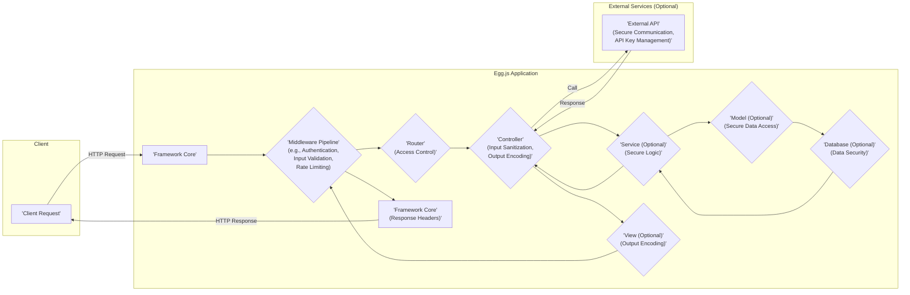

## Project Design Document: Egg.js Framework (Improved)

**1. Introduction**

This document provides an enhanced architectural overview of the Egg.js framework, a Node.js framework built upon Koa, specifically tailored for threat modeling. It details the core components, data flow, and interactions within an Egg.js application to facilitate the identification of potential security vulnerabilities.

**2. Goals and Objectives**

*   Deliver a clear and comprehensive architectural description of Egg.js.
*   Pinpoint key components and their respective responsibilities.
*   Illustrate the typical request lifecycle within an Egg.js application, highlighting potential security touchpoints.
*   Identify external dependencies and interaction points, focusing on associated security risks.
*   Serve as a robust foundation for conducting thorough threat modeling exercises.

**3. Architectural Overview**

Egg.js is engineered as an extensible and convention-driven framework for constructing robust, enterprise-level Node.js applications. It leverages Koa's middleware architecture, providing a structured and modular approach to application development, which inherently impacts security considerations.

**4. Key Components**

*   **Core:** The foundational layer of the framework, providing essential services and functionalities.
*   **Application:** Represents a running instance of an Egg.js application, managing the lifecycle and resources.
*   **Context:**  An object encapsulating request-specific and response-specific information for each incoming request. This is a critical point for security checks and data sanitization.
*   **Request:**  Represents the incoming HTTP request, including headers, body, and parameters – all potential sources of malicious input.
*   **Response:** Represents the outgoing HTTP response, where proper header settings and data encoding are crucial for security.
*   **Router:**  Responsible for mapping incoming request URLs to specific controller actions, a key area for access control and preventing unauthorized access.
*   **Controller:** Handles incoming requests, orchestrates business logic, and interacts with services. Input validation and output encoding within controllers are vital for security.
*   **Service:** Encapsulates business logic, often involving data manipulation and interaction with data sources. Secure coding practices within services are paramount.
*   **Model:** Represents data structures and handles interactions with data storage mechanisms. Secure data access and manipulation are key concerns.
*   **View:** Renders data into a presentable format (e.g., HTML). Proper encoding of data within views is essential to prevent XSS vulnerabilities.
*   **Middleware:** Functions that intercept and process requests *before* they reach the controller and *after* the controller processes the request. Middleware plays a crucial role in implementing security policies (e.g., authentication, authorization, input validation).
*   **Plugin:** Reusable modules that extend Egg.js functionality. The security of plugins is a significant consideration, as vulnerabilities in plugins can impact the entire application.
*   **Configuration:** Settings that govern the application's behavior. Secure configuration management is essential to prevent misconfigurations that could lead to vulnerabilities.
*   **Logger:** Handles application logging. Secure logging practices are important for auditing and incident response.
*   **Agent:** A separate process for background tasks and inter-process communication. Security considerations for the agent process include secure communication and access control.
*   **Schedule:** A mechanism for running scheduled tasks. Secure scheduling ensures that tasks are executed as intended and cannot be maliciously manipulated.

**5. Data Flow with Security Touchpoints**

The following diagram illustrates the typical request lifecycle within an Egg.js application, highlighting key areas for security considerations:

**Detailed Request Lifecycle with Security Focus:**

1. **Client Request:** A client sends an HTTP request. This is the initial point of entry and a potential source of malicious input.
2. **Framework Core:** The request is received. Initial security measures might involve basic request validation.
3. **Middleware Pipeline:** The request passes through a series of middleware functions. This is a critical stage for implementing various security measures:
    *   **Authentication Middleware:** Verifies the identity of the user.
    *   **Authorization Middleware:** Checks if the authenticated user has permission to access the requested resource.
    *   **Input Validation Middleware:** Sanitizes and validates incoming data to prevent injection attacks.
    *   **Rate Limiting Middleware:** Protects against denial-of-service attacks.
    *   **Security Headers Middleware:** Sets HTTP headers to enhance security (e.g., HSTS, CSP).
4. **Router:** The router maps the request to a specific controller. Access control checks can be implemented at this stage to ensure only authorized users can access certain routes.
5. **Controller:** The controller handles the request. Security considerations include:
    *   **Input Sanitization:** Further sanitizing input received from the middleware.
    *   **Output Encoding:** Encoding data before rendering it in the view to prevent XSS.
    *   **Error Handling:** Implementing secure error handling to avoid leaking sensitive information.
6. **Service (Optional):** Services encapsulate business logic. Security best practices within services include:
    *   Secure coding practices to prevent vulnerabilities.
    *   Proper handling of sensitive data.
7. **Model (Optional):** Models interact with data storage. Security considerations include:
    *   Secure data access patterns to prevent unauthorized access.
    *   Protection against injection attacks (e.g., SQL injection).
8. **Database (Optional):** The underlying database. Security measures include:
    *   Access control and authentication.
    *   Data encryption at rest and in transit.
9. **View (Optional):** The view renders the response. Proper output encoding is crucial to prevent XSS vulnerabilities.
10. **Middleware Pipeline (Response):**  Middleware can perform final security checks or modifications to the response (e.g., adding security headers).
11. **Framework Core:** The framework sends the HTTP response back to the client. Ensuring correct response headers is important for security.

**6. External Interactions and Security Implications**

Egg.js applications frequently interact with external systems, each presenting unique security challenges:

*   **Databases (e.g., MySQL, PostgreSQL, MongoDB):**
    *   **Security Risks:** SQL injection, NoSQL injection, unauthorized access, data breaches.
    *   **Mitigation:** Parameterized queries, input validation, strong authentication, network segmentation, encryption.
*   **External APIs (e.g., RESTful services):**
    *   **Security Risks:** Man-in-the-middle attacks, data breaches, API key compromise, insecure API endpoints.
    *   **Mitigation:** HTTPS, secure API key management (e.g., environment variables, secrets management), input validation of API responses, proper authentication and authorization mechanisms (e.g., OAuth 2.0).
*   **Message Queues (e.g., RabbitMQ, Kafka):**
    *   **Security Risks:** Message tampering, unauthorized access to queues, eavesdropping.
    *   **Mitigation:** Secure connection protocols (e.g., TLS), authentication and authorization for queue access, message encryption.
*   **Caching Systems (e.g., Redis, Memcached):**
    *   **Security Risks:** Data breaches if sensitive data is cached without proper security, unauthorized access to the cache.
    *   **Mitigation:** Secure access controls, encryption of cached data, avoiding caching sensitive information if not necessary.
*   **Authentication Providers (e.g., OAuth providers):**
    *   **Security Risks:**  Compromised credentials, insecure redirect URIs, token theft.
    *   **Mitigation:** Following OAuth best practices, secure storage of client secrets, validating redirect URIs, using HTTPS.
*   **Static File Storage (e.g., AWS S3, Azure Blob Storage):**
    *   **Security Risks:** Unauthorized access to static assets, data breaches.
    *   **Mitigation:** Secure access policies, private buckets/containers, signed URLs for temporary access.
*   **Logging and Monitoring Systems:**
    *   **Security Risks:** Exposure of sensitive information in logs, unauthorized access to logs.
    *   **Mitigation:** Secure logging configurations (avoiding logging sensitive data), access controls for log access, secure transmission of logs.

**7. Deployment Considerations and Security**

The deployment environment significantly impacts the security posture of an Egg.js application:

*   **Standalone Node.js Process:** Requires careful configuration of the operating system and network to ensure security. Process isolation and resource limits are important.
*   **Containerized Environments (Docker, Kubernetes):** Provides isolation but requires secure container image management, network policies, and secrets management within the orchestration platform.
*   **Serverless Environments (AWS Lambda, Azure Functions):** Security is largely managed by the cloud provider, but developers need to be mindful of IAM roles, function permissions, and secure storage of secrets.
*   **Behind a Reverse Proxy (Nginx, Apache):**  The reverse proxy can provide an additional layer of security through features like SSL termination, request filtering, and rate limiting. Secure configuration of the reverse proxy is crucial.

**8. Security Considerations (Detailed)**

This section expands on the high-level security considerations, providing more specific context for Egg.js:

*   **Input Validation:** Implement robust input validation using middleware or within controllers to sanitize and validate all user-provided data. Utilize libraries like `validator.js`.
*   **Authentication and Authorization:** Employ secure authentication mechanisms (e.g., JWT, Passport.js) and implement fine-grained authorization controls to restrict access based on user roles and permissions.
*   **Session Management:** Use secure session management techniques, such as HTTP-only and secure cookies, and implement proper session invalidation.
*   **Cross-Site Scripting (XSS):**  Sanitize and encode user-generated content before rendering it in views. Utilize template engines with built-in XSS protection.
*   **Cross-Site Request Forgery (CSRF):** Implement CSRF protection using techniques like synchronizer tokens (e.g., using Egg.js's built-in CSRF protection).
*   **Dependency Management:** Regularly audit and update dependencies using tools like `npm audit` or `yarn audit` to address known vulnerabilities.
*   **Data Protection:** Encrypt sensitive data at rest (e.g., using database encryption) and in transit (using HTTPS).
*   **Error Handling:** Implement secure error handling that logs errors appropriately without exposing sensitive information to the user.
*   **Logging and Monitoring:** Implement comprehensive logging and monitoring to detect suspicious activity and security incidents. Securely store and manage log data.
*   **Middleware Security:** Carefully review and configure middleware to avoid introducing vulnerabilities. Ensure middleware is updated regularly.
*   **Plugin Security:** Thoroughly evaluate the security of third-party plugins before using them. Keep plugins updated.
*   **Configuration Security:** Store sensitive configuration settings (e.g., database credentials, API keys) securely using environment variables or dedicated secrets management solutions. Avoid hardcoding secrets.

**9. Conclusion**

This improved design document provides a more detailed and security-focused architectural overview of the Egg.js framework. By highlighting key components, data flow with security touchpoints, and external interactions with their associated risks, this document serves as a strong foundation for conducting comprehensive threat modeling activities and building more secure Egg.js applications.